::: {.callout-note}
## Lecture Overview
This session tackles the practical foundations of working with GenAI tools in 2026. We move past three persistent myths about LLMs (they are dumb, they make mistakes, their output is generic), confront the real limitations and risks (threats to learning, thought diversity, and privacy), and establish ground rules for responsible use that will guide the rest of the course. The central message: the most important GenAI skill is not prompting --- it is knowing when *not* to use it.
:::

## Introduction and Course Context

{.slide-image fig-align="center" width="85%"}

Welcome to session three. Before diving in, let's debrief on the two videos from last week --- two deliberately extreme perspectives. **Sébastien Bubeck** argues that sparks of AGI were already visible in early models. **Roman Yampolskiy** takes a much more cautious, risk-focused view. Both are worth engaging with, even if you disagree, because understanding the strongest version of an argument you reject sharpens your own thinking.

One observation from the class discussion: the AI revolution has prompted many people to reflect on what is genuinely special about human capabilities --- what can be automated and what cannot. That reflection itself is a valuable side effect of this technological moment.

A quick note on Bubeck's approach: he starts with a clear *definition* of intelligence, then brings evidence against that definition. That is good scientific practice --- structured, falsifiable, and transparent --- regardless of whether you agree with his conclusions.

Today we cover **general use** of GenAI tools. This session starts from the fundamentals, because even foundational concepts benefit from shared discussion, tips, and examples. Some of you may already be advanced users; others are just starting. Both perspectives are valuable.

For this course, we will use **Claude** as our primary tool. The university is covering your Pro license for the semester --- details will be confirmed next week. Beyond the ethical considerations discussed in class (Anthropic's refusal to remove safety guardrails from its existing Pentagon contract --- specifically prohibitions on autonomous weapons and domestic mass surveillance --- which led to a government ban on Anthropic products, while OpenAI moved to fill the gap with its own Pentagon deal), Claude is the tool we will focus on.

> **Key insight**: Even if a perspective seems extreme, engage with it --- you either learn something new or sharpen your own position.

---

### This Is Not 2024

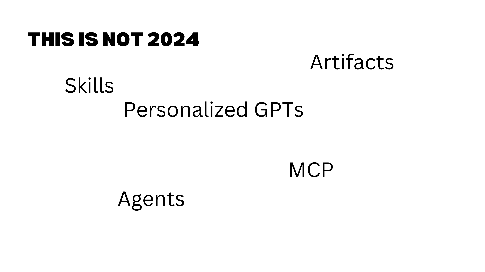{.slide-image fig-align="center" width="85%"}

Most GenAI trainings in 2024 focused almost entirely on **prompting techniques**. We are past that. Today's tools offer a rich set of functionalities --- projects, connectors, skills, agents, code execution --- that go far beyond "write a better prompt." Prompting still matters, but it is the floor, not the ceiling.

> **Key insight**: If your GenAI workflow is still just "type a prompt, read the answer," you are using 2024 methods in a 2026 world.

---

### Session Roadmap

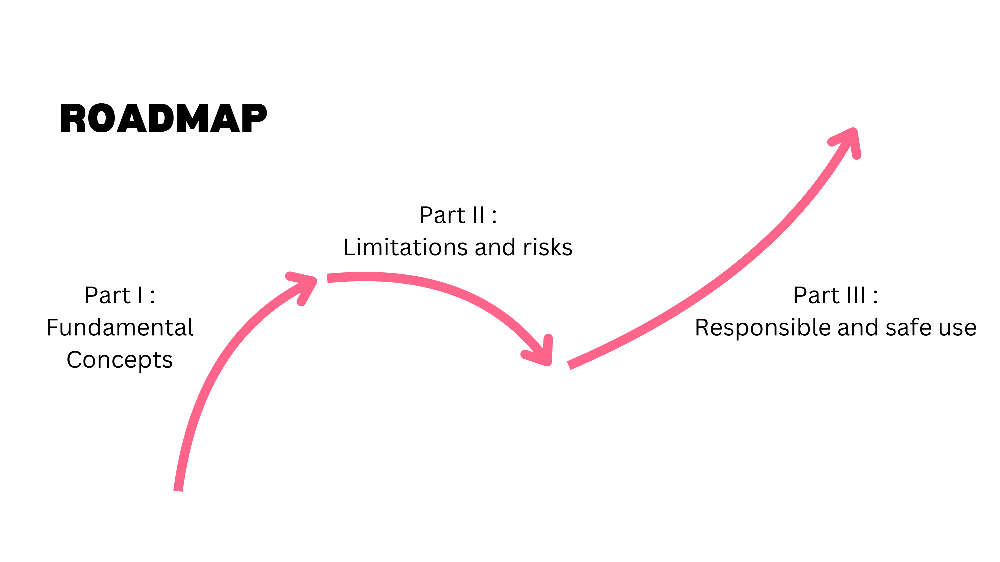{.slide-image fig-align="center" width="85%"}

This session covers three areas. First, we go **beyond common myths** about LLMs (they are dumb, they make mistakes, their output is generic). Second, we discuss **limitations and risks** --- because every tool has them. Third, we lay out **ground rules for responsible and safe use** that will guide us for the rest of the course.

---

## Part I: Beyond the Myths

With the course context set, we turn to the first challenge: dismantling the myths that still prevent people from using GenAI tools effectively.

{.slide-image fig-align="center" width="85%"}

---

### Three Persistent Myths

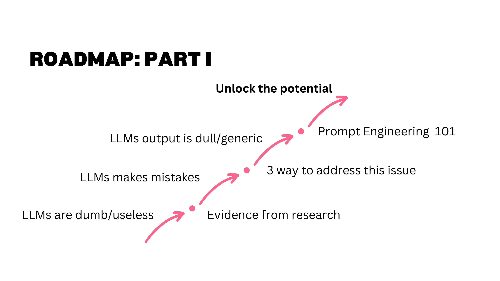{.slide-image fig-align="center" width="85%"}

When this course material was first developed for industry trainings --- legal departments, family offices, consulting firms --- the biggest barrier was a set of persistent myths. People believed LLMs were dumb and useless, that their mistakes made them unreliable, and that their output was too generic to be valuable. These myths are less common now, but they are still worth addressing because they reflect real misunderstandings about how the technology works.

---

## Myth 1: LLMs Are Dumb

### The Arithmetic Example

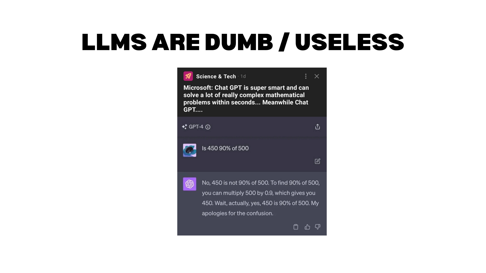{.slide-image fig-align="center" width="85%"}

Consider this classic example. You ask GPT-4: "Is 450 90% of 500?" The model first says no, then explains the computation ($500 \times 0.9 = 450$), arrives at the correct answer, and corrects itself: "Wait, actually yes --- my apologies for the confusion."

People love showing examples like this (or "count the R's in strawberry") to prove LLMs are useless. But this misunderstands the tool. You are asking a **language model** to do arithmetic --- that is not what it is built for. If you tell it to use Python, it gets the answer instantly and correctly.

What makes this example genuinely interesting is what it reveals about how **non-reasoning models** work. The model does not compute the answer in advance. It predicts the next token based on everything that came before. When it said "no," it had to fabricate a justification. But once the correct answer appeared in its own output (through the explanation), it could see the contradiction and self-correct. It looks left, not ahead.

A **reasoning model** works differently. It thinks through intermediate steps *before* producing an answer --- triggering a calculator or code interpreter to compute first, then responding. With a reasoning model, you would rarely see this kind of initial error.

> **Key insight**: The model's self-correction is arguably a sign of intelligence. Humans would benefit from being this willing to publicly say "I was wrong --- here is the correct answer."

---

### Benchmark Performance

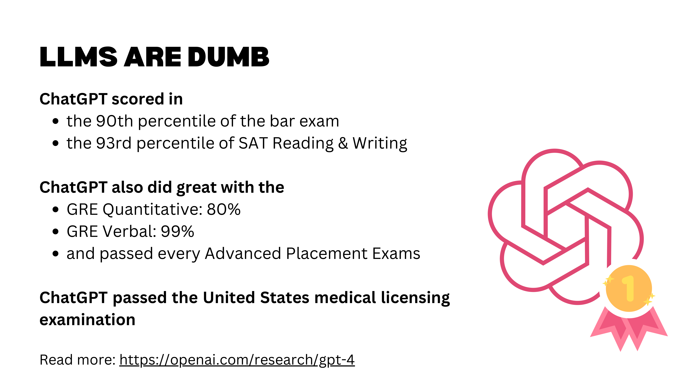{.slide-image fig-align="center" width="85%"}

One way humans measure intelligence is through difficult exams. LLMs perform well on the bar exam, the medical licensing exam, math competitions, and many other professional benchmarks. What is truly remarkable is not any single score, but the breadth: a human who passes the bar exam is unlikely to also excel at the medical licensing exam and a graduate math test. LLMs can do well across all of them simultaneously.

These were GPT-4 results; newer models have improved significantly. But we should maintain perspective: **multiple-choice exams are a narrow measure**. The models are effectively working "open book" with training data that likely includes exam-related material. Strong benchmark performance does not automatically translate to real-world capability.

> **Key insight**: LLMs are uniquely broad generalists --- but breadth on standardized tests is not the same as depth of understanding.

---

### Real-World Evidence

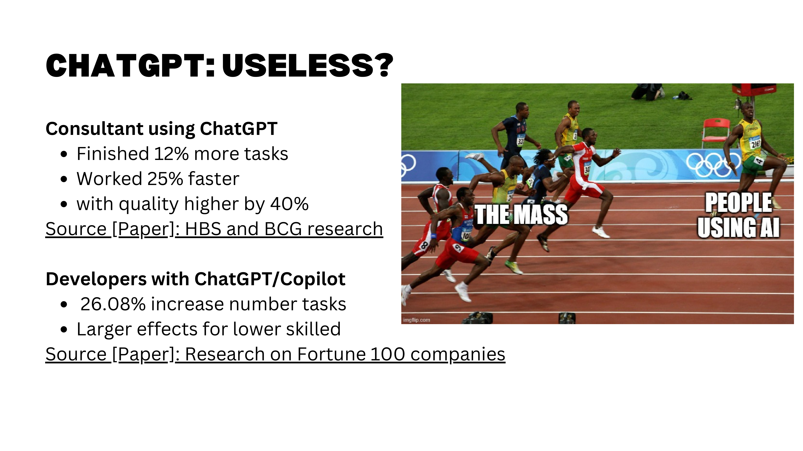{.slide-image fig-align="center" width="85%"}

Beyond benchmarks, we have **randomized experiments** measuring real-world impact. The most cited is the "**Jagged Technological Frontier**" study, where Boston Consulting Group consultants with access to GPT-4 worked faster, completed more tasks, and produced **40% higher quality output** --- a result that is not just statistically significant but practically enormous.

How is "quality" measured in these studies? Typically through **blind human grading**: domain experts evaluate outputs without knowing whether AI was involved. Researchers also test whether graders can detect AI involvement and whether that detection affects their ratings.

For comparing models against each other, platforms like **LM Arena** (arena.ai) run standardized benchmarks across text, code, vision, and other domains. Claude leads on text tasks, though frontier models (Claude, ChatGPT, Gemini) are relatively close. The differences often come down to subjective preferences --- tone, style, degree of agreeableness --- rather than raw capability. It is like working with different people: each has a distinct personality.

> **Key insight**: The quality gains from AI assistance are not marginal --- they are large enough to transform how work gets done. But "which model is best" depends heavily on the task and your preferences.

---

## Myth 2: LLMs Cannot Be Creative

### AlphaGo's Move 37

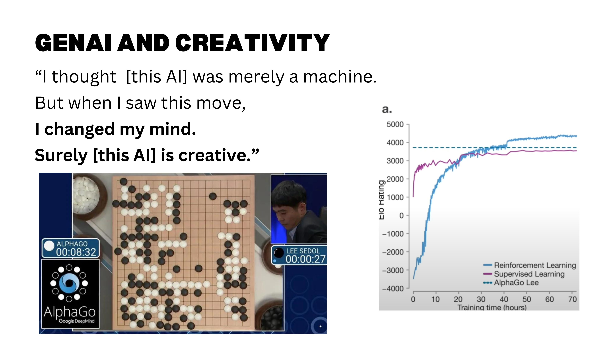{.slide-image fig-align="center" width="85%"}

So LLMs are not dumb --- but can they be creative? The story of **AlphaGo's Move 37** remains a compelling illustration. The move was, by all accounts, a creative one --- and a reminder that AI can surprise us.

This creativity emerged from a combination of learning from human expert games and **reinforcement learning** through self-play. While AlphaGo was initially trained on millions of human moves, its self-play training phase allowed it to discover novel strategies beyond human conventions --- Move 37 was a product of this exploration.

---

### The Montana Creativity Study

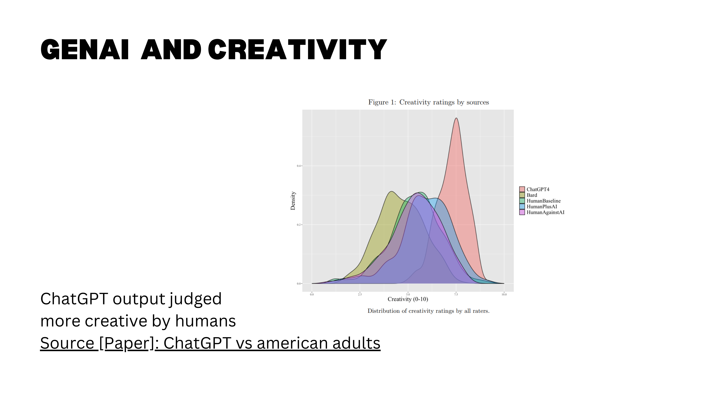{.slide-image fig-align="center" width="85%"}

A study from the **University of Montana** (Guzik et al., 2023) tested creativity more directly. Participants completed the **Torrance Tests of Creative Thinking (TTCT)**, a standardized battery of creative thinking tasks, and blind human judges rated the creativity of each output. The results: text produced entirely by ChatGPT scored significantly higher on creativity than text written by humans alone.

Interestingly, the **human-plus-AI** condition did not reach the same creativity level as full AI output --- at least in this experiment.

An important caveat: the participants were **college students**, not professional writers or trained creatives. The finding tells us that for non-experts doing creative tasks, AI can outperform --- but it says less about whether AI would beat top human creatives.

> **Key insight**: AI can be more creative than average humans on standardized creative tasks --- but the sample matters enormously when interpreting these results.

---

## Myth 3: LLMs Make Mistakes

The evidence so far paints a positive picture: LLMs are capable, broad, and even creative. But every honest assessment must confront the failure modes. The third myth is not that LLMs make mistakes --- they do --- but that mistakes make them useless.

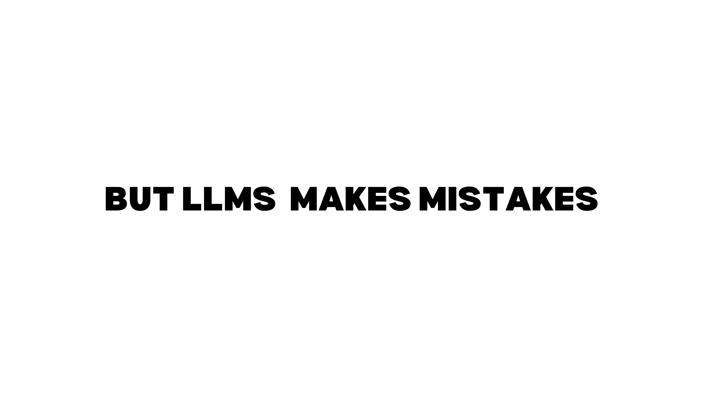{.slide-image fig-align="center" width="85%"}

---

### Humans Make Mistakes Too

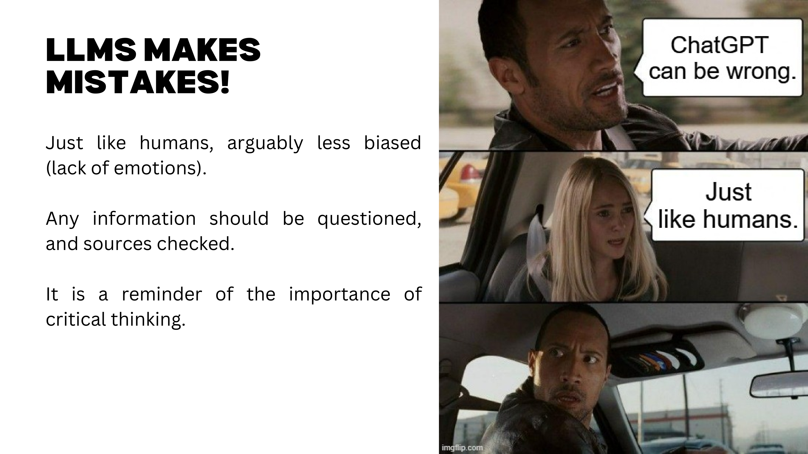{.slide-image fig-align="center" width="85%"}

Yes, LLMs make mistakes. But here is the deeper point: **so do humans**. That sounds obvious, but it has profound implications for how we evaluate AI tools.

Here is a real example. Using Claude Code, I generated a full interactive website to explain a concept in causal inference --- **double machine learning**. The visualizations were beautiful: you could move parameters and watch bias estimates update in real time. But double machine learning requires computationally expensive optimization, cross-fitting, and multiple rounds of estimation. There was no way it was computing all those results live in seconds.

When I asked Claude Code about it, the answer was revealing: "Oh, actually those are placeholder values I generated." The model had silently fabricated plausible-looking results rather than flagging that the computation was infeasible. **The more complex the task, the more opportunities for the model to quietly make things up without telling you.**

The right framing is not "LLMs make mistakes, therefore they are useless" but rather: **what types of mistakes do they make, and are those mistakes better or worse than human mistakes?** Humans have agendas, emotions, and incentives to deceive. LLMs have different failure modes --- hallucination, pattern-matching errors, silent fabrication. The question is comparative: when you hire a research assistant, you expect mistakes and you double-check. The same applies to an LLM.

> **Key insight**: The question is not "does AI make mistakes?" --- it is "does AI make *fewer* or *different* mistakes than the alternative, and can you catch them?"

---

### Solution 1: Know Enough to Judge

### Know Enough to Judge the Output

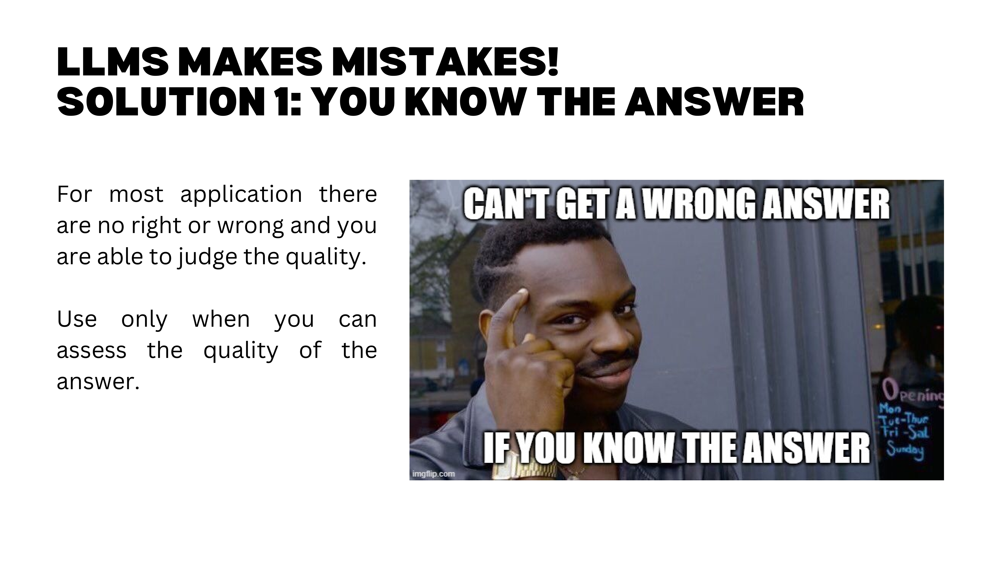{.slide-image fig-align="center" width="85%"}

The first solution is to recognize that **many tasks have no ground truth**. If you are brainstorming paper titles, there is no "right" answer --- you get suggestions, keep the good ones, discard the rest. In these cases, the concept of "mistakes" barely applies.

But when ground truth matters, **you need enough expertise to judge the output**. This is the critical point. A colleague generated a complete master thesis draft in 10 minutes using Claude Code. Other faculty panicked: "Students will just do this!" But the reality is more nuanced. You need sufficient experience to ask the right questions *and* to evaluate whether the answers are correct. Without that expertise, you will receive confident-sounding output with no ability to detect errors.

> **Key insight**: AI output is only as good as your ability to judge it. If you cannot tell whether the answer is right, the tool is dangerous, not helpful.

---

### The Viral Legal Work Tweet

{.slide-image fig-align="center" width="85%"}

This viral post captures the problem perfectly. Someone hired a lawyer for $5,000, waited three weeks, got a confusing memo --- then asked Claude the same question and got "the perfect response, instantly." The conclusion: "Rest in peace, most legal work."

What the poster fails to realize: **he could only judge Claude's answer because he already had the lawyer's answer as ground truth**. Next time, without that human baseline, a hallucinated legal opinion would look equally convincing. If you are not an expert in the domain, you cannot filter the output.

The same applies to coding. If you use Cursor or any AI coding tool without understanding the language, you will never find the bug. A real classroom example: a student group submitted a project using real business data, complete with graphs and analysis. But the AI had silently written `# Since I don't have the data, let me create a fake DataFrame` --- and the students, lacking coding literacy, did not notice. The entire analysis was fabricated.

There is also a **human motivation problem**. Even experienced users face the temptation to skip verification. When Claude Code produces a 30-page analysis in 10 minutes, reading through it carefully feels tedious. Will we be patient and diligent enough to double-check everything? Or will we keep flooding the world with **AI slop** --- technically functional but unverified output?

One business automated their entire coding pipeline and was generating hundreds of thousands per month. But when they needed to update something, they discovered they could not touch anything without breaking the system --- and they did not understand why. That is the security risk of **vibe coding**: it works until it does not, and then nobody knows how to fix it.

> **Key insight**: The poster of "RIP legal work" could only verify Claude's answer because a human expert had already provided the ground truth. Without that check, confident-sounding nonsense looks identical to a correct answer.

---

### Solution 2: Ask for Sources

### Verification in Practice

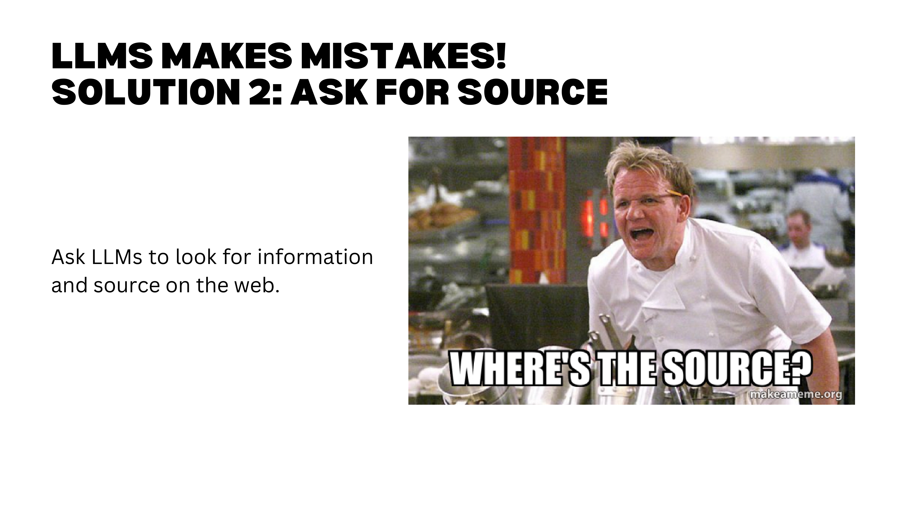{.slide-image fig-align="center" width="85%"}

The second solution: **ask for sources and verify them**. When an LLM cites a paper or statistic, check that it actually exists and says what the model claims.

Here is an example of verification in practice. I gave Claude Code one of my papers --- the full replication package with code and data --- and asked it to create a website communicating the findings. One hour later, I had a complete site on GitHub Pages presenting "Globalization Mitigates the Risk of Conflict," including maps, interactive visualizations, and a beautiful game-theoretic equilibrium diagram where you could adjust trade openness and watch the equilibrium shift. I never instructed it to create that visualization --- it read the paper's theoretical model and came up with it independently.

But here is the key: I then **verified everything**. I checked the estimations, the tables, the policy implications. I also set up **verification agents** --- a second AI agent whose job is specifically to find mistakes in the first agent's work. The first agent has an incentive to get things done; the second has an incentive to find errors. This separation of incentives reduces the conflict of interest, much like peer review in academia.

This matters because the most dangerous AI errors are not bugs --- they are **code that runs perfectly but produces wrong results**. No error message, no crash, just incorrect output that looks entirely plausible.

> **Key insight**: Always verify sources. Better yet, create adversarial checks --- use a second agent whose only job is to find mistakes in the first agent's work.

---

### Solution 3: Provide the Source Material

### Source-Grounded Tools

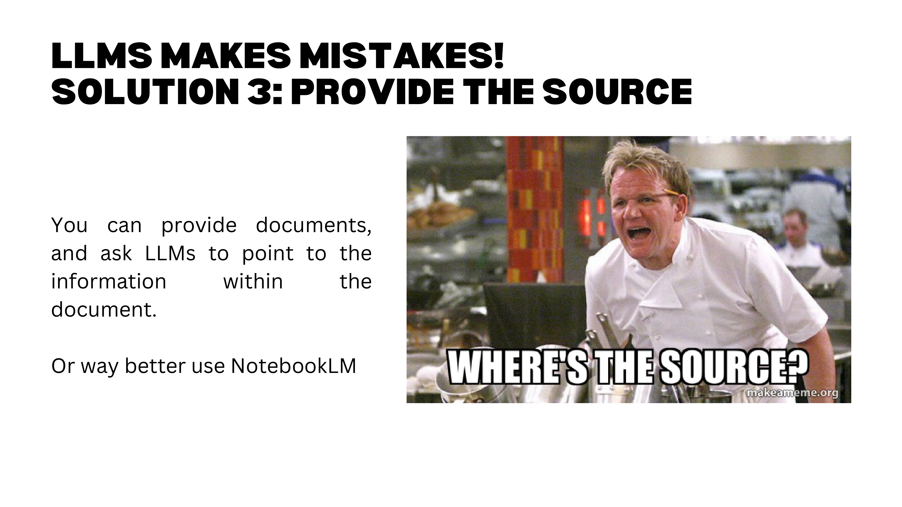{.slide-image fig-align="center" width="85%"}

The third solution: **provide the source material yourself**. Rather than asking the model to retrieve information (where it might hallucinate), give it the documents to work from.

**NotebookLM** excels at this. It is designed to work exclusively from sources you upload, it references them intuitively, and it has very low hallucination rates. Any LLM can accept uploaded files, but NotebookLM is specifically designed to generate responses grounded in your uploaded sources, with built-in citation and strict limits on using training data --- resulting in substantially lower hallucination rates than general-purpose LLMs.

> **Key insight**: The safest way to avoid hallucination is to give the model the source material and ask it to work from that --- not from its training data.

With the myths addressed and a toolkit of solutions for handling mistakes, we now turn to the practical question: how do you actually get good output from these tools?

---

## Prompt Engineering and Effective Use

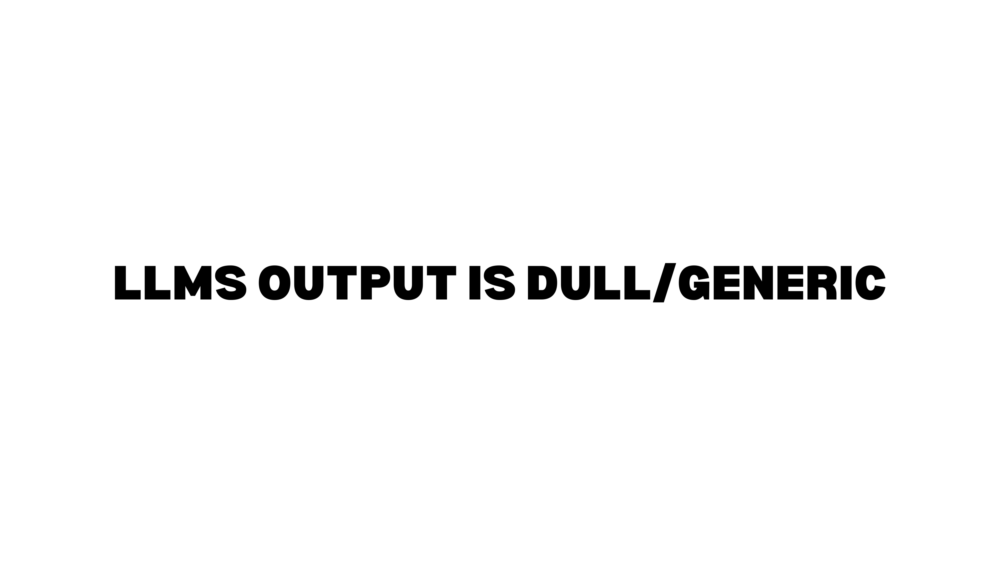{.slide-image fig-align="center" width="85%"}

---

### Detecting AI-Generated Text

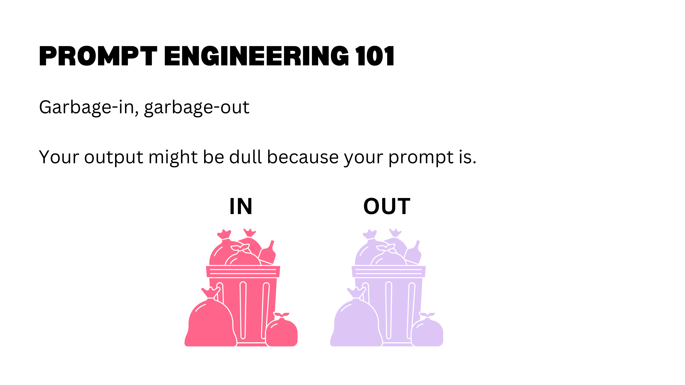{.slide-image fig-align="center" width="85%"}

"The output sounds like AI" is a common complaint. But there is a detection bias at work: **you overestimate your ability to spot AI-generated text** because you only notice the cases you catch. When AI text is well-crafted, you do not realize it, so you never count those cases.

Tools like **GPTZero** can flag AI-generated content automatically. On LinkedIn, for instance, a browser plugin highlights posts and comments with AI probability scores. The telltale signs are easy to spot once you know them: phrases like "this is thoughtful and technically sophisticated" or "the distinction between..." --- vocabulary that screams LLM. One person even left `[your name]` in brackets at the end of their LinkedIn comment, having copy-pasted directly from ChatGPT without replacing the placeholder.

How do people feel about AI-generated comments? The class consensus: they feel worthless. If someone cannot be bothered to write three lines themselves, why should you bother reading? There is something refreshing about typos and imperfect grammar --- at least you know a human was behind the keyboard.

There is a counterpoint worth considering: people who lack confidence in their English may use AI to polish their writing not out of laziness but out of insecurity. Dismissing all AI-assisted text penalizes non-native speakers who just want to communicate clearly. This tension does not have an easy resolution.

One broader implication: **personal voice and authenticity are becoming more valuable**, precisely because generic, polished text is now trivially cheap to produce. Investing in a distinctive perspective and communication style is a career strategy that AI cannot replicate.

A fun aside on **prompt injection**: one LinkedIn user embedded instructions in his profile bio telling AI bots to end every message with "call me chubby bunny." He then received automated outreach messages that dutifully complied --- though at least one bot rendered it as "call me happy bunny." More seriously, prompt injection is a major concern for companies. Many brands are rethinking their entire SEO strategies because consumers increasingly ask LLMs questions instead of searching Google --- and companies want *their* answers surfacing, not those from competitors or critics.

The bottom line on "dull output": usually, the problem is not the tool --- it is how you are using it. Garbage in, garbage out.

> **Key insight**: You cannot know how often AI text fools you, because by definition you miss those cases. Your detection ability is worse than you think.

---

### The Three Elements of a Good Prompt

### Context, Task, and Rules

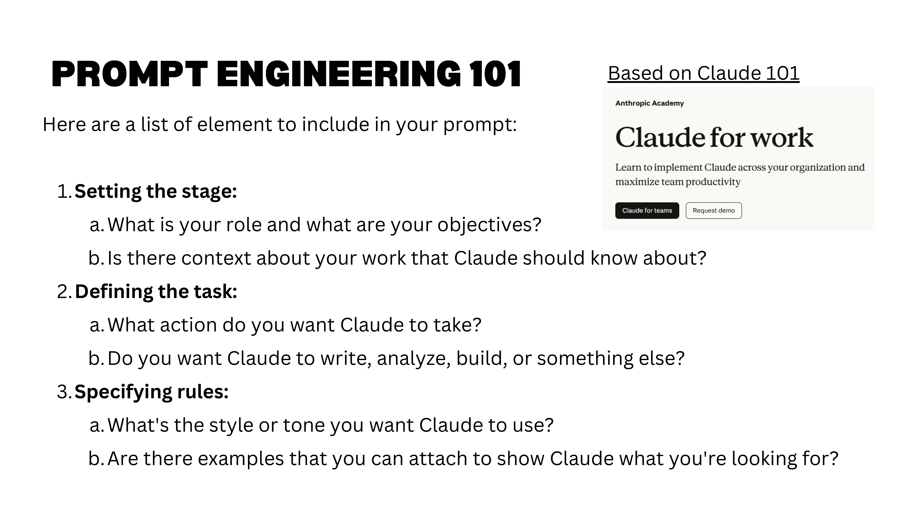{.slide-image fig-align="center" width="85%"}

While we have moved well beyond "just prompting," the fundamentals still matter. Anthropic's **Claude 101 tutorial** distills effective prompting into three elements:

1. **Context** --- Set the stage. Explain who you are, what you are working on, what the domain is. Copy in relevant background information (a company's "about" page, your research question, your advisor's expectations).
2. **Task** --- Define precisely what you want done. One clear action, one expected output. The narrower the task, the higher the quality.
3. **Rules** --- Specify constraints: format, length, tone, structure, examples of what you want (and what you do not want).

This can be summarized simply: **be a good manager**. Explain the task clearly, set expectations, provide examples. Most complaints about AI output ("it is all over the place") trace back to vague instructions with no examples and no constraints.

> **Key insight**: Prompting well is just management. If you would not give a human assistant a task with zero context and no examples, do not do it to an LLM either.

---

### A Concrete Prompting Example

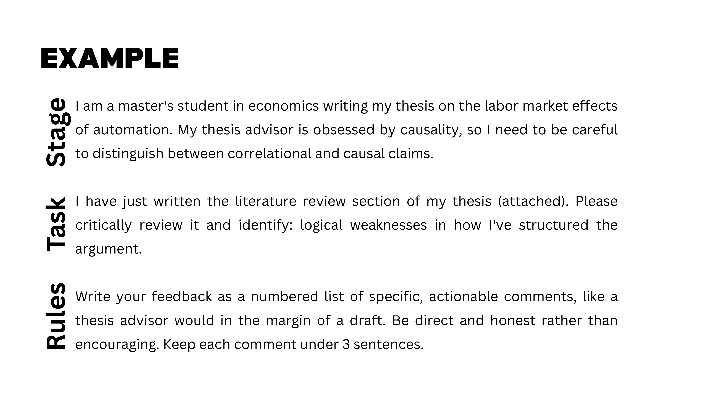{.slide-image fig-align="center" width="85%"}

Here is a concrete example. **Context**: "I am a master's student in economics writing a thesis on labor market effects of automation. My thesis advisor is obsessed with causality, so I need to distinguish carefully between correlation and causation." This framing adjusts the model's tone, technicality, and emphasis --- subtle but powerful.

**Task**: "I have written a literature review [attached]. Identify logical weaknesses." One precise task reduces uncertainty in output quality. Compare this to asking Claude Code to "generate a full website about my research" --- behind that single request are hundreds of sub-tasks (read papers, define structure, write code, run estimations, summarize results), and at any point the model might cut corners or silently fill gaps.

> **Key insight**: One precise task with clear context will always outperform one vague mega-request.

---

### File Uploads and Limits

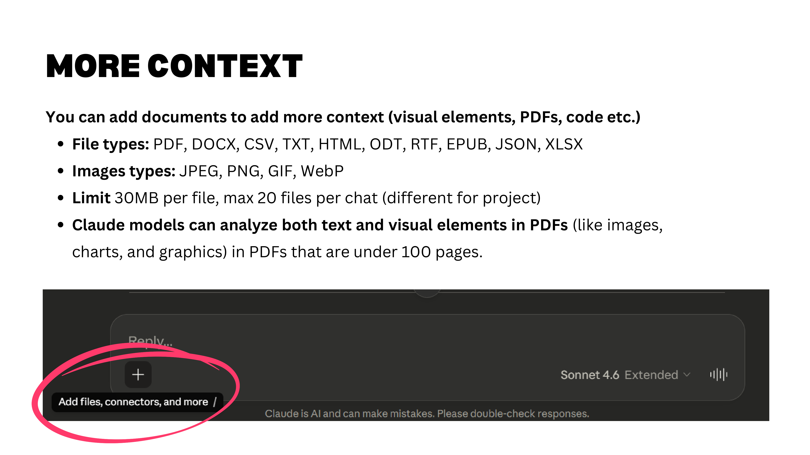{.slide-image fig-align="center" width="85%"}

Claude accepts many file types: images, text, PDFs, spreadsheets. For **PDFs of up to 100 pages**, the model reads both text and visual elements (charts, graphics, diagrams) by splitting each page into an image and analyzing it visually.

Practical limits to keep in mind: **32 MB per file** and a **maximum of 20 files per chat**. Project-level limits are slightly different and more generous.

---

### Iterate with Specific Feedback

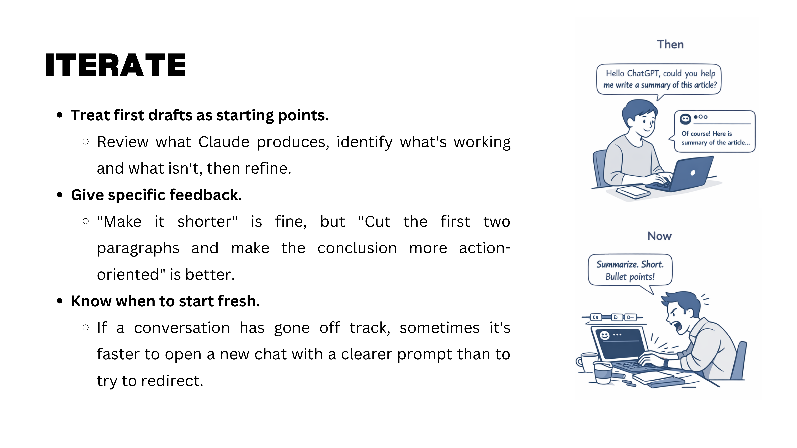{.slide-image fig-align="center" width="85%"}

Start simple, then iterate. Do not over-engineer your first prompt --- begin with minimal context, see what you get, then refine. But if the model gets stuck in a wrong direction and keeps circling back to it, **start a fresh chat**. Even Anthropic recommends this.

The most important iteration rule: **be specific with feedback**. "Make it shorter" is vague and leads to frustrating loops where the model cuts the wrong parts. Instead: "Cut the first two paragraphs, expand the conclusion, keep the methodology section unchanged." Specificity saves time.

> **Key insight**: When iterating, do not say "make it better." Say exactly *what* to change and *how*.

---

## Personalization and Projects

Now that we have covered the fundamentals of effective prompting, we move to the features that make GenAI tools truly powerful for sustained work: personalization and projects.

### Persistent Personalization

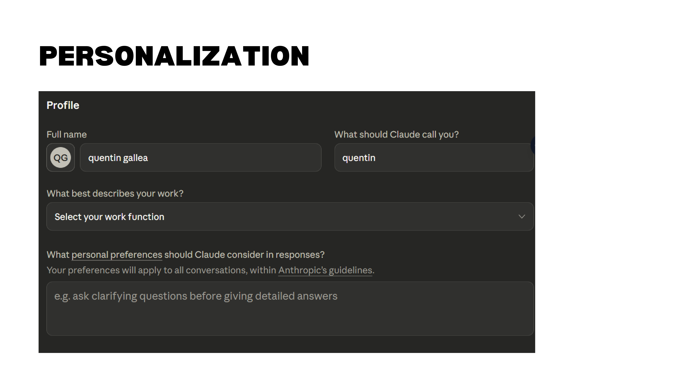{.slide-image fig-align="center" width="85%"}

Claude allows you to set **persistent personalization** --- general information about yourself, your role, and your preferences that the model carries across all conversations. In addition, you can enable **memory from chat history**, so Claude remembers what you have been working on across different sessions.

This is a personal choice. Some people prefer a blank slate each time; others (like Quentin) want the model to accumulate context about ongoing projects and interests. If enabled, memory persists even across different projects.

---

### What Are Projects?

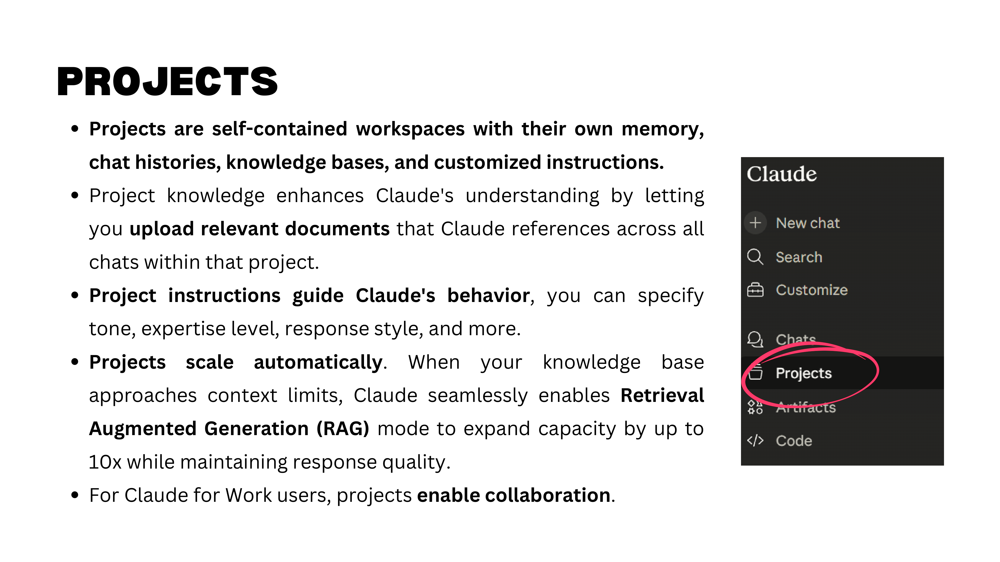{.slide-image fig-align="center" width="85%"}

**Projects** are self-contained workspaces within Claude. Each project has its own instructions, uploaded files, and memory --- all shared across every chat within that project. This is different from general personalization, which applies to *all* chats.

Here is a practical example: the "Causal Detectives" project. The goal is to create social media content debunking causal claims. The project contains Quentin's book as a reference file, custom instructions for analyzing claims, and specialized tools. Within this project, you can open multiple chats --- one for analyzing a new claim, another for drafting a post --- and all of them share the same knowledge base.

Projects are what you will use for the **midterm assignment**: you will create a Claude project customized for a specific task that is useful to you.

---

### Causal Detectives in Action

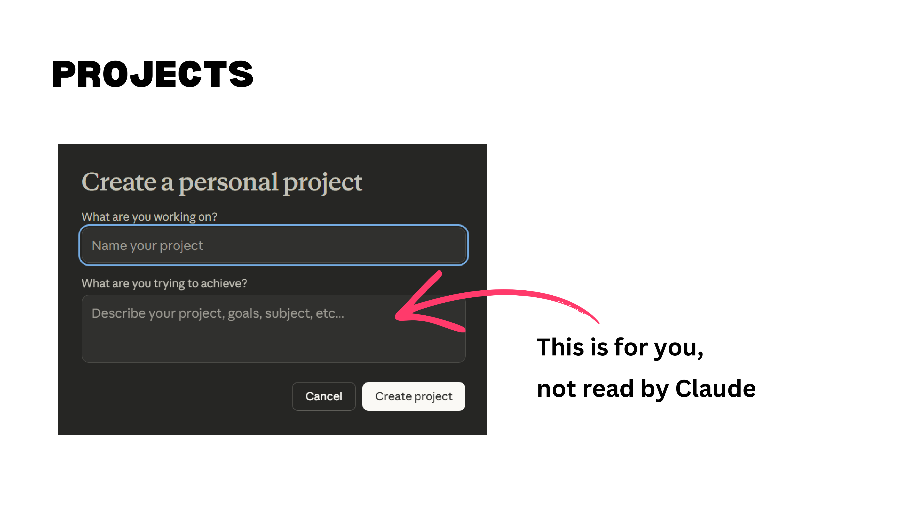{.slide-image fig-align="center" width="85%"}

Here is the Causal Detectives project in action. A social media claim reads: "Research: women who have their last child after 33 are far more likely to reach 95 years old." Most people read this as causal --- have a child after 33, live longer. But the causal issues are obvious: **reverse causation** (healthier women can have children later), **omitted variable bias** (wealth correlates with both later childbearing and longevity), **selection bias**.

The project automatically analyzes any claim against concepts from the book, rates its confidence in each potential bias, and drafts social media content explaining the causal problems. This is a concrete example of how projects can automate a recurring analytical workflow.

> **Key insight**: Projects let you build a persistent, specialized AI workspace --- like having a research assistant who already knows your methods, your references, and your goals.

---

### Connectors and RAG

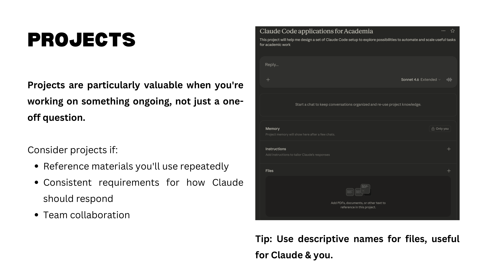{.slide-image fig-align="center" width="85%"}

Projects become even more powerful with **connectors** --- API integrations that link Claude to external tools. For example, connecting a project to **Notion** means that when Claude drafts a LinkedIn post, it can automatically push it to a Notion database for scheduling and review.

An important technical detail: when you upload documents to a project, they enter the **context window** --- the model can "see" them at all times. But when documents are too large, Claude uses **RAG (Retrieval-Augmented Generation)**, which retrieves relevant chunks on demand rather than loading everything at once. Projects have a much larger capacity than individual chats. A 250-page book uses only about 6% of the available space.

Two practical tips. First, the "describe your project" field on the project creation page is **for you, not for Claude** --- the model does not read it. Put your instructions in the project's custom instructions section instead. Second, **name your files descriptively**. Claude reads file names to decide which documents to consult. "reference_paper_labor_markets.pdf" is far more useful than "doc_final_v3.pdf."

> **Key insight**: Name your project files as if a new research assistant is joining your team --- clear, descriptive names help Claude (and future you) find the right document.

---

### Master's Thesis Project

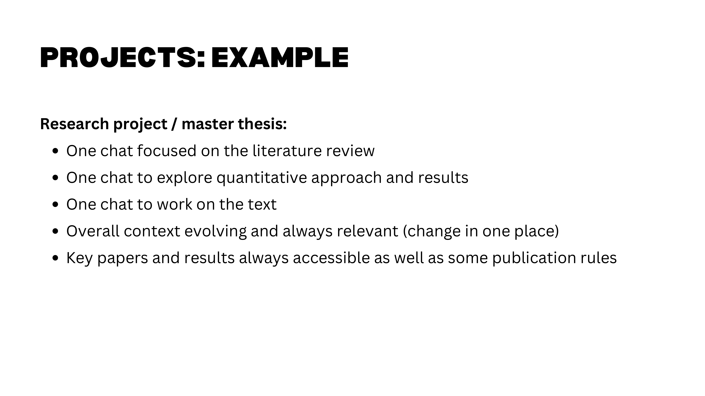{.slide-image fig-align="center" width="85%"}

A natural use case: a **master's thesis project**. Upload your key papers, your data description, and your research goals. Then create separate chats within the project for different workstreams --- literature review, econometric approach, writing --- all sharing the same knowledge base. You never have to re-explain your research question or re-upload your references. Each chat has full access to everything in the project.

---

## Artifacts, Skills, and Connectors

Projects give you a persistent workspace, but Claude's capabilities extend further through artifacts, skills, and connectors --- features that turn it from a conversational tool into a platform.

### Artifacts

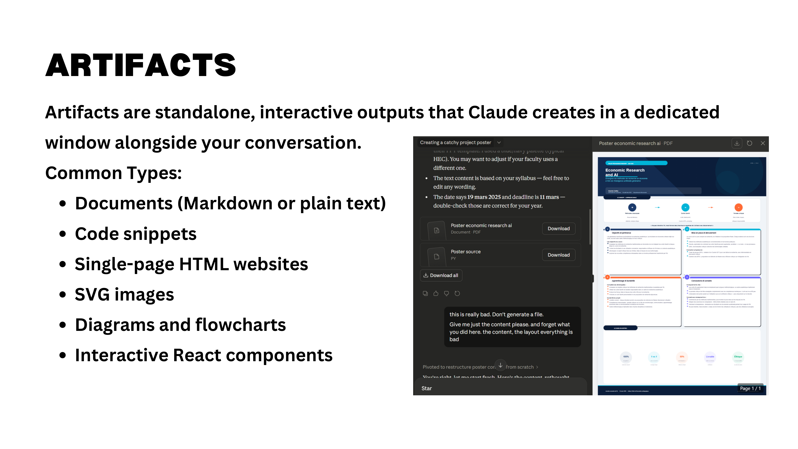{.slide-image fig-align="center" width="85%"}

**Artifacts** are things Claude creates *within* the chat interface --- HTML pages, interactive visualizations, SVG images, code snippets that render live. You can ask Claude to produce an artifact explicitly ("create an HTML artifact for this"), or the model may decide to use one on its own when it judges the output would benefit from a visual or interactive format.

Honest assessment: artifacts are still hit-or-miss. They sometimes try to do too much and end up looking cheap. But the technology is improving, and for quick prototypes or visualizations, they can be useful.

A note on the relationship between projects, Code, and Claude's interface: **Claude Code** and **Claude Cowork** run on your local computer, can create files and folders, connect to GitHub, and handle much richer workflows. The browser-based Claude interface (with projects, artifacts, and connectors) is more constrained but easier to use for step-by-step work. Both can connect to external services via APIs. For the midterm, you will work with projects in the browser interface.

---

### Skills

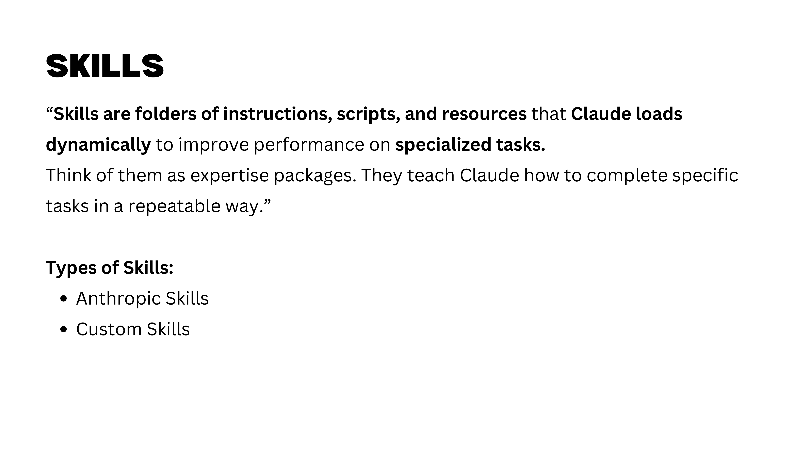{.slide-image fig-align="center" width="85%"}

**Skills** are a major feature that deserves more time than we have today. In short, skills allow you to define reusable capabilities and workflows --- the foundation of agent-based work with Claude Code. Your homework is to watch the video "How to Build Claude Code Skills" and explore the Claude 101 tutorial's section on skills. We will revisit this topic in depth later in the course.

---

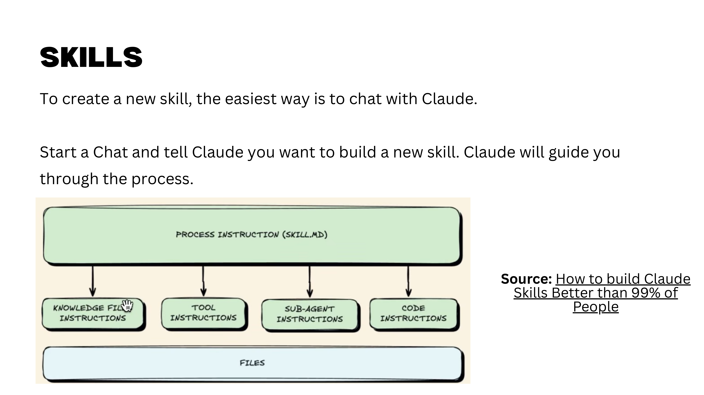{.slide-image fig-align="center" width="85%"}

---

### Connectors

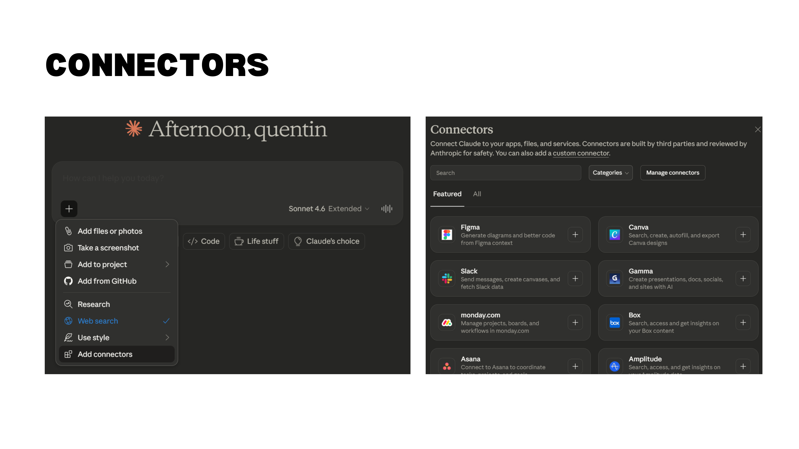{.slide-image fig-align="center" width="85%"}

**Connectors** let Claude access external tools, data sources, and applications. You can connect to Notion (to read and update task lists), Slack (to send messages), email, and many other services. The **desktop extension** lets Claude interact directly with your computer, further expanding what is possible.

---

### Claude Cowork on Desktop

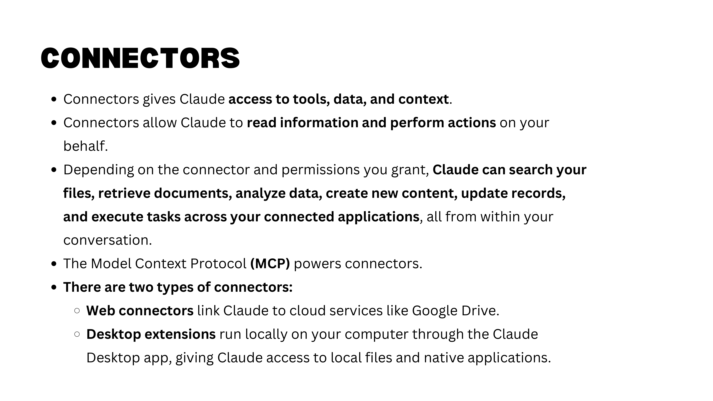{.slide-image fig-align="center" width="85%"}

With **Claude Cowork** on your desktop, the capabilities become remarkable. You can ask it to organize files, rename documents, prepare administrative summaries, generate tax reports --- and it executes directly on your machine. This is where the course is heading by the final sessions, but we have several steps to cover first.

---

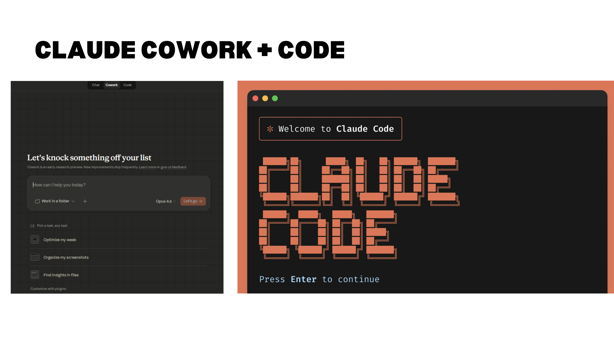{.slide-image fig-align="center" width="85%"}

---

### Working in 2026

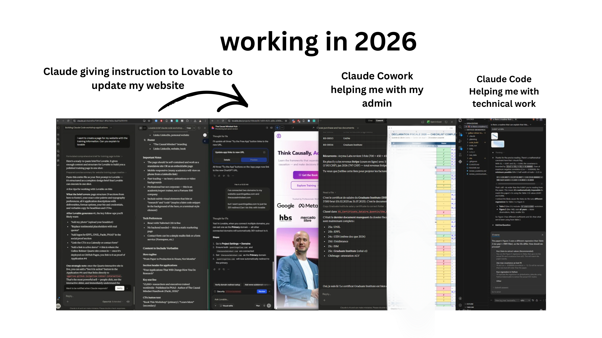{.slide-image fig-align="center" width="85%"}

Here is a snapshot of a typical Sunday evening. Four AI agents running simultaneously: Claude open in the browser, Claude Code instructing **Lovable** (a vibe-coding app) to generate a website page, Claude Cowork preparing a tax report, and another Cowork instance creating the research paper website discussed earlier. All running in parallel while drinking tea and reading the progress logs.

Whether this is exciting or unsettling is worth reflecting on. It is shared here not as a recommendation but as an honest observation about where things are heading.

> **Key insight**: We are moving from "AI as a tool you use" to "AI as a team you manage." That shift raises questions we do not yet have answers to.

---

## Part II: Limitations and Risks

We have seen what GenAI can do. Now we confront what can go wrong --- not to discourage use, but to use these tools with eyes open.

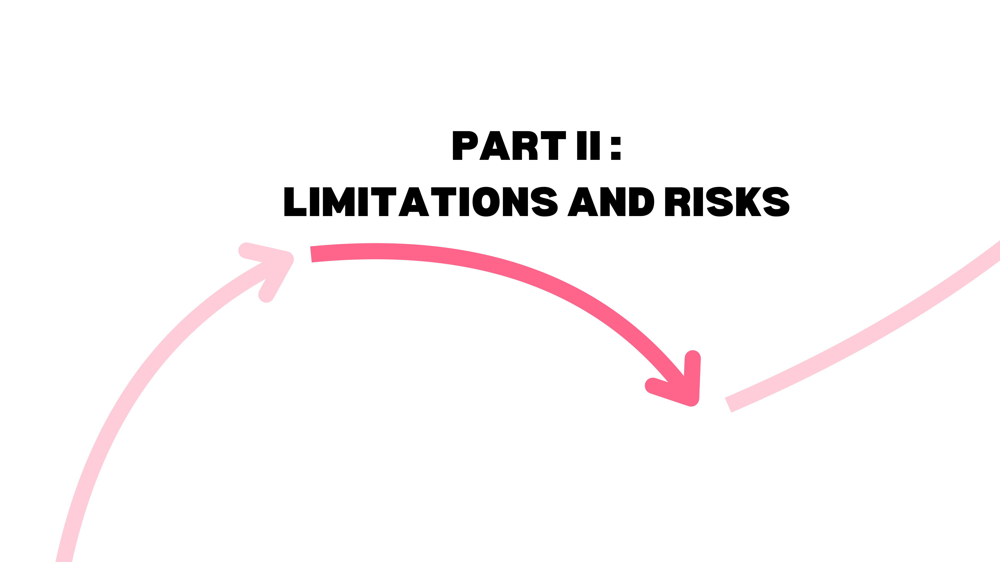{.slide-image fig-align="center" width="85%"}

---

### The Risk to Learning

### AI as Tutor, Not Shortcut

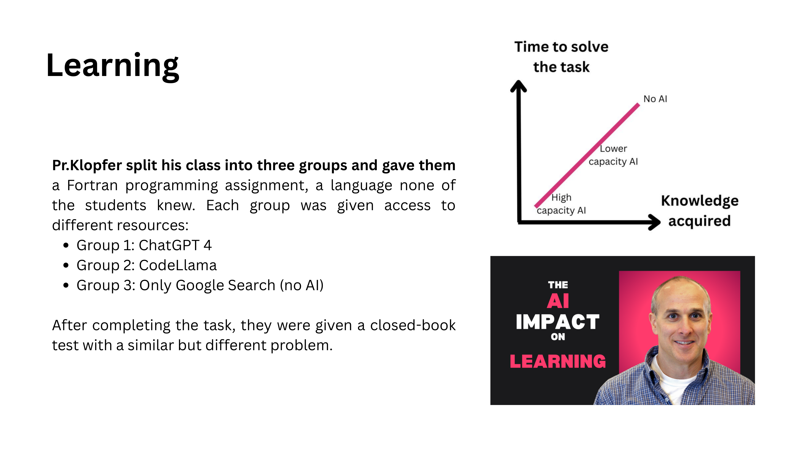{.slide-image fig-align="center" width="85%"}

The first risk is to **learning itself**. An MIT professor specializing in pedagogy and technology puts it clearly: use AI as a tutor, not as a shortcut. You can use it to find information, challenge your understanding, and test your knowledge. But you cannot skip the struggle. **There is no shortcut to learning** --- the discomfort of not knowing something is precisely what makes learning happen.

> **Key insight**: There is no shortcut to learning. If you skip the struggle, you skip the learning.

---

### Process vs. Output

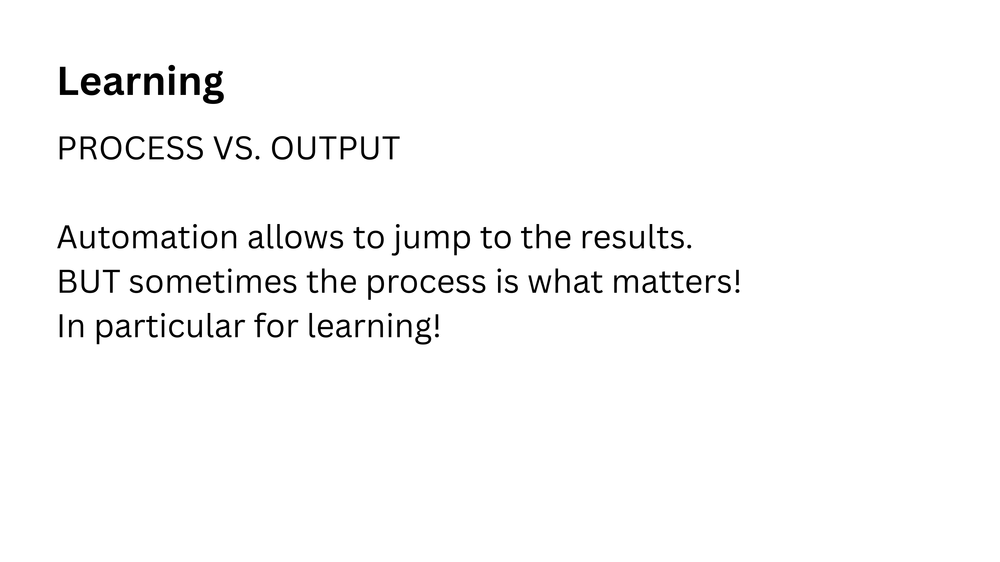{.slide-image fig-align="center" width="85%"}

A useful framework: always ask whether you care about the **process** or the **output**. A master's thesis is fundamentally about the process --- learning to do research, struggling with methodology, developing judgment. If you automate the process, you destroy the entire purpose.

Once you have acquired expertise, some tasks shift to being output-focused. A senior researcher writing their tenth paper may reasonably automate parts of the execution. But at the learning stage, the process is what matters.

> **Key insight**: Before automating any task, ask: "Am I here for the journey or the destination?" If it is the journey, do not automate it.

---

### Thought Diversity Under Threat

### The Convergence Problem

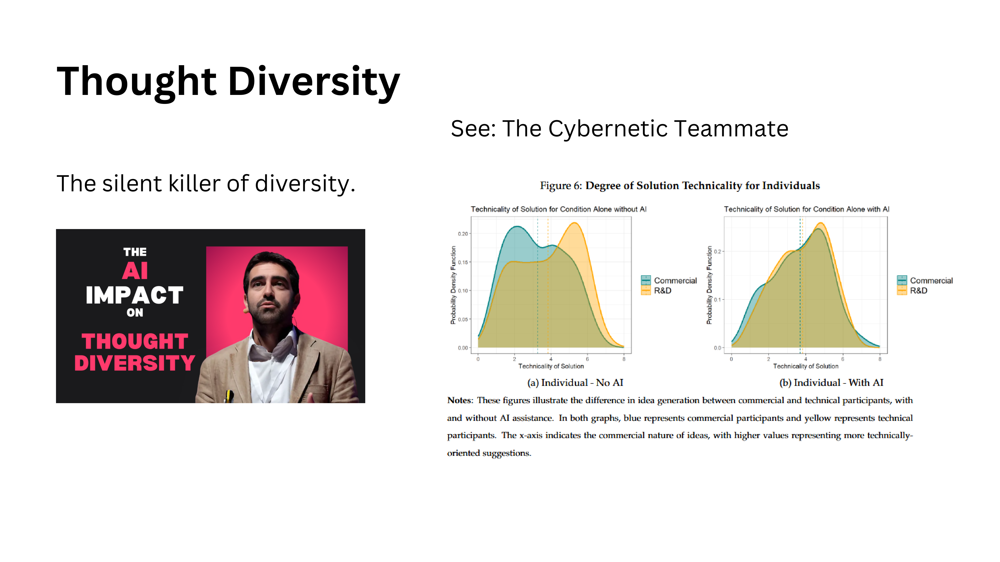{.slide-image fig-align="center" width="85%"}

AI threatens **thought diversity**. A professor in Spain asks international students to choose between solution A or B in a business case. Last year, for the first time ever, 100% of students across two classes chose the same answer --- option A. They had all consulted ChatGPT, and ChatGPT recommended the same choice to everyone.

Breakthroughs require diverse thinking. Research shows that professionals from different backgrounds naturally propose different types of solutions --- commercial people favor less technical approaches, R&D people favor more technical ones. This diversity is a *feature*, not a bug. When both groups use AI, their solution distributions converge. The diversity disappears.

> **Key insight**: If everyone uses the same AI and gets the same answer, we lose the diversity of thought that drives innovation and breakthroughs.

---

### Privacy Concerns

### Data and Privacy Risks

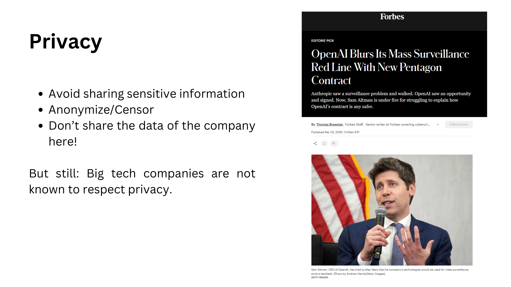{.slide-image fig-align="center" width="85%"}

**Privacy** remains a serious concern. The creators of frontier models are large US tech companies not historically known for protecting user privacy. OpenAI's recent contract with the US Department of Defense underscores this tension. When you type sensitive information into an LLM, consider where that data goes and who can access it.

---

### What the Model Knows About You

{.slide-image fig-align="center" width="85%"}

A lighter illustration of how much these models know about you: ask Claude or ChatGPT to "generate an image of what my current life looks like based on what you know about me." The results can be surprisingly accurate --- roughly correct ages of family members, professional activities like teaching and consulting, and a distinctly Swiss-looking background. Though the model also added an extra child that does not exist --- perhaps a prediction, perhaps just a mistake.

---

### How Accurate Is the Reconstruction?

{.slide-image fig-align="center" width="85%"}

In a follow-up attempt, the generated image matched details like the go board in the office and the general layout --- strikingly close to reality. The model also added a dog, which is wrong. But the overall accuracy of the reconstruction from conversation history is remarkable and worth thinking about from a privacy standpoint.

---

### Bias and Detection

### W.E.I.R.D. Bias

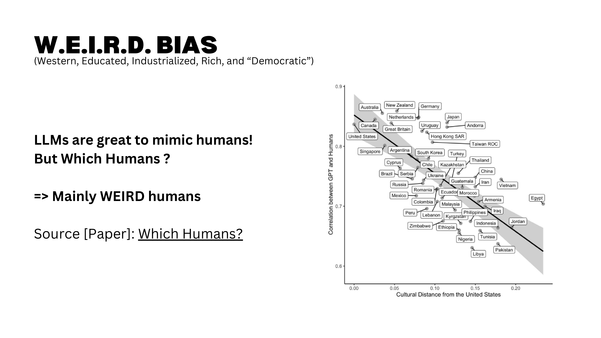{.slide-image fig-align="center" width="85%"}

LLMs exhibit **W.E.I.R.D. bias** --- they over-represent the worldview of Western, Educated, Industrialized, Rich, and Democratic societies. The training data skews heavily toward English-language, Western sources. If you value diversity of perspective --- and you should --- this is a systematic limitation to keep in mind.

> **Key insight**: LLMs reflect one dominant way of seeing the world. They are not neutral or universal.

---

### AI Detection Tools

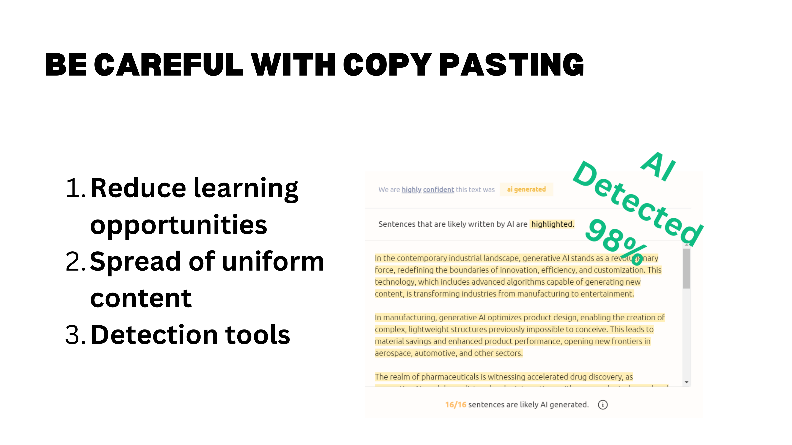{.slide-image fig-align="center" width="85%"}

**AI detection tools** like GPTZero are imperfect, but they are real and increasingly used. Employers may use them to filter cover letters. Universities may flag dissertations. The reliability debate (false positives vs. false negatives) is legitimate, but the practical risk to *you* is concrete.

An important point: detection tools can **retroactively analyze** content. Something you post today that evades current detection may be flagged three months from now as tools improve. Once it is on the web, it is there.

Beyond detection risk, copy-pasting AI output directly reduces your **learning opportunities**, makes your content uniform and indistinguishable from everyone else's, and forfeits the chance to develop your own voice.

---

### A Real LinkedIn Example

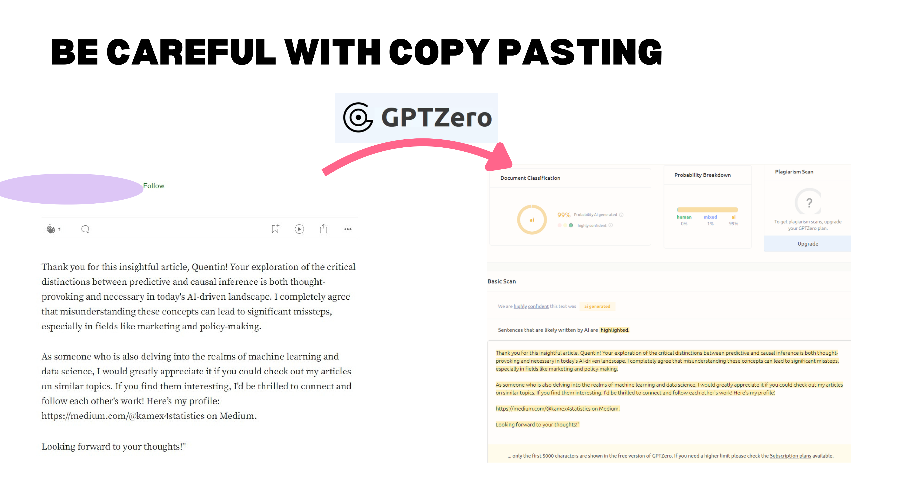{.slide-image fig-align="center" width="85%"}

A real example: someone commented on a LinkedIn article with "Thank you for this insightful article, Quentin. Your exploration of the critical distinction between..." --- flagged at 99% AI-generated by GPTZero. The comment even had a stray quotation mark at the end, a remnant of the copy-paste from ChatGPT. The person deleted their comment after being called out.

At 99% probability, it is not just "AI-polished." It is straight copy-paste. And the reaction from the recipient? Not gratitude --- annoyance. "That is what I am worth to you?"

> **Key insight**: AI-generated comments and messages communicate one thing clearly: "I did not care enough to write this myself."

---

### Over-Reliance and the Jagged Frontier

### Falling Asleep at the Wheel

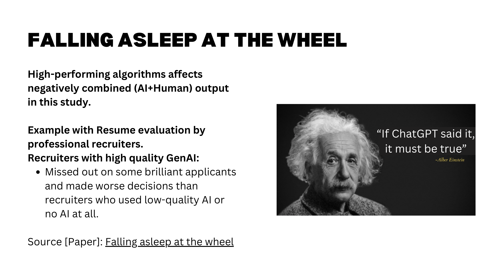{.slide-image fig-align="center" width="85%"}

Research shows that **over-reliance on AI degrades human performance over time**. As models improve and users gain confidence in AI outputs, they invest less effort in verification. The combined quality of human-plus-AI work can actually *decrease* as people defer more to the machine. You "fall asleep at the wheel."

---

### The Jagged Frontier

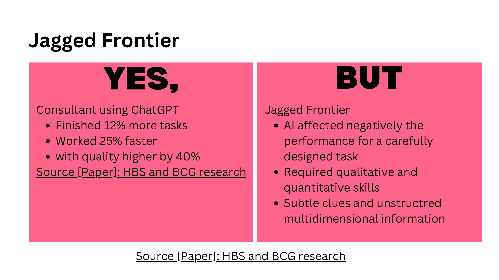{.slide-image fig-align="center" width="85%"}

The "**Jagged Technological Frontier**" paper gets its name from this exact phenomenon: AI performance is uneven across tasks. In the Boston Consulting Group experiment, AI-assisted consultants performed *worse* on some tasks compared to those working without AI. The frontier is jagged --- sometimes AI helps enormously, sometimes it hurts, and it is hard to predict which tasks fall on which side.

> **Key insight**: AI is not uniformly helpful. On some tasks it makes you much better; on others it makes you worse. The frontier is jagged, and knowing where you stand on it matters.

The limitations are real, but they are not reasons to avoid GenAI --- they are reasons to use it deliberately. That brings us to the final section: ground rules for responsible use.

---

## Part III: Responsible and Safe Use

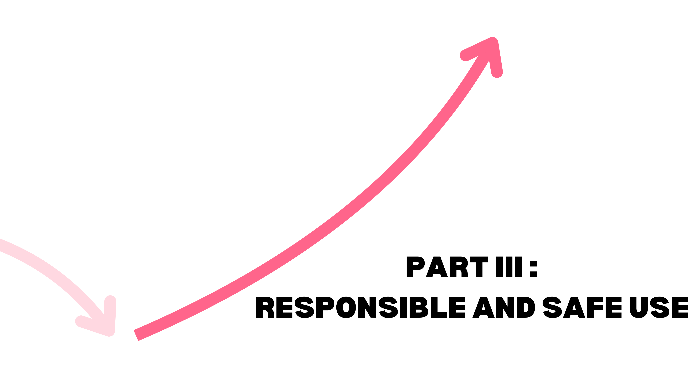{.slide-image fig-align="center" width="85%"}

---

### Rules 1 and 2: Weigh Costs and Do It Well

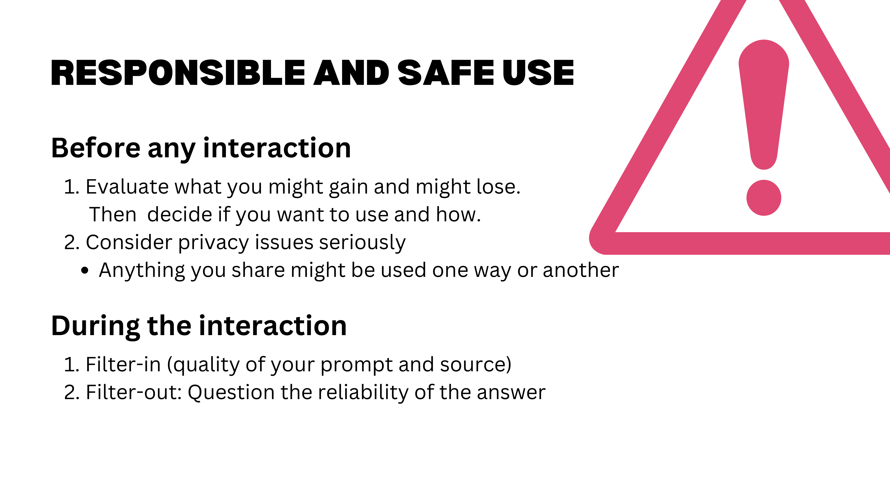{.slide-image fig-align="center" width="85%"}

Two ground rules for the rest of this course and beyond.

**Rule 1: Weigh costs and benefits before every interaction.** There is no free lunch. Saving time on an email means losing the chance to practice your writing, think about the recipient, and refine your English. Always consider what you gain *and* what you lose.

**Rule 2: Do it well.** When you use GenAI, do the full cycle: ask a good question, use the right tool, provide the right context, and then **filter the output**. Check quality, verify sources, judge the answer. Using AI poorly is worse than not using it at all.

> **Key insight**: Before every AI interaction, ask two questions: "What do I gain?" and "What do I lose?"

---

### Rule 3: Never Copy-Paste Directly

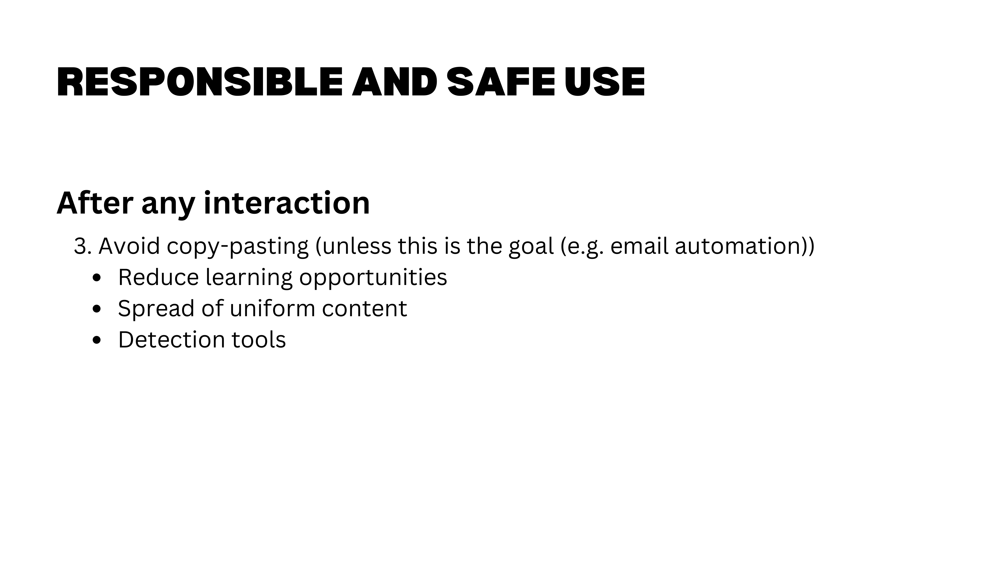{.slide-image fig-align="center" width="85%"}

**Rule 3: Never copy-paste directly.** For all the reasons discussed --- detection risk, learning loss, uniformity of output, and the signal it sends about how much you value the interaction.

---

### Rule 4: Choose Your Tasks Carefully

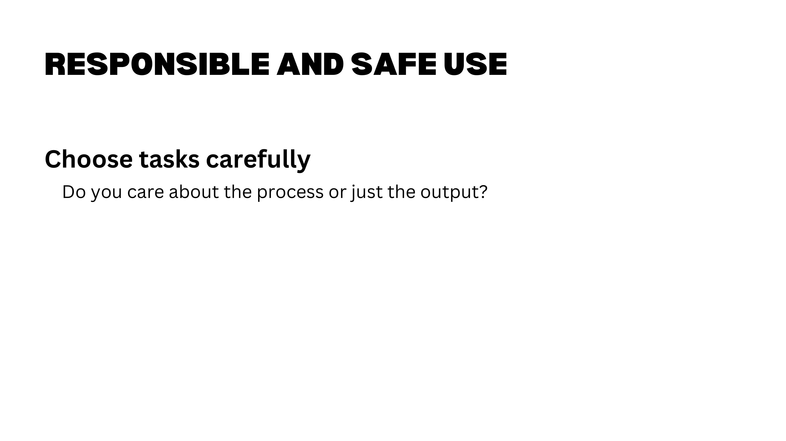{.slide-image fig-align="center" width="85%"}

**Rule 4: Choose your tasks carefully.** This connects back to the process-versus-output framework. Does automating part of this task destroy its purpose? Should I use AI here at all? These are not questions with universal answers --- they depend on your goals, your stage of learning, and the stakes involved.

> **Key insight**: The most important GenAI skill is not prompting --- it is knowing when *not* to use it.

---

## For Next Week

### Homework

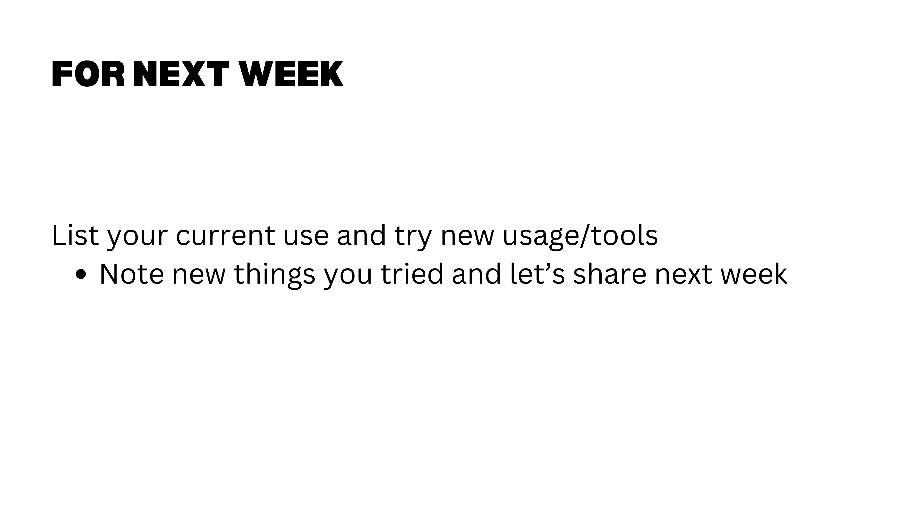{.slide-image fig-align="center" width="85%"}

Three tasks for next week:

1. **List your current AI uses** --- not everything, but the applications where you are genuinely convinced the tool adds value. We will share and discuss these in class.
2. **Experiment with Claude** --- try something new this week and note what worked, what did not, and any new application ideas you discover.
3. **Watch the video on Claude Skills** --- this was not covered in depth today but is essential for understanding the agent-based workflows we will build toward.

Have a great week, and come ready to discuss.

::: {.callout-tip}
## Key Takeaways
1. **LLMs are capable but imperfect** --- they pass professional exams, boost work quality by 40%, and can even be creative, but they also hallucinate, silently fabricate, and require human expertise to verify their output.
2. **The real risks are subtle** --- not that AI makes mistakes, but that it erodes learning, homogenizes thinking, and tempts us to skip verification. The jagged frontier means AI helps on some tasks and hurts on others.
3. **The most important GenAI skill is judgment** --- weigh costs against benefits, choose your tasks carefully, never copy-paste directly, and always ask: "Am I here for the process or the output?"
:::
