::: {.callout-note}
## Lecture Overview
This session covers the art of the academic literature review — first through traditional methods (scoping, reading, synthesis, and narrative writing), then through GenAI augmentation (using tools like Elicit, Consensus, and NotebookLM). A detailed walkthrough of the "Jagged Technological Frontier" paper illustrates what an excellent literature review looks like. The session closes with a critical assessment of AI's role and an in-class exercise.
:::

## Debrief: NotebookLM Homework

{.slide-image fig-align="center" width="85%"}

---

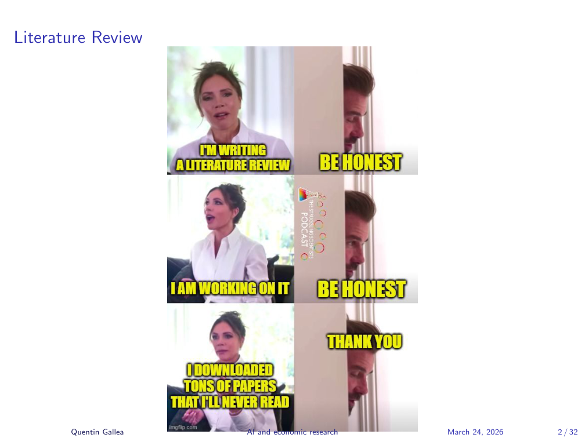{.slide-image fig-align="center" width="85%"}

Students were asked to pick a paper, read it, and then work with **NotebookLM** to analyze it. Here are the key insights from the class discussion:

**On confirmation and comprehension:** One student found that NotebookLM accurately confirmed their understanding of a paper they were already working with for an internship report. The tool validated what they had read, though it didn't surface new information beyond what they already knew.

**On technical jargon:** Another student used NotebookLM to decode difficult vocabulary and clarify hypotheses in a paper with highly specific terminology. The tool helped them understand complex sentences and pin down the meaning of technical terms. Crucially, this student checked the inline source references NotebookLM provides, verifying its interpretations against the original text — a great example of responsible use.

**On oversimplification:** A third student warned that NotebookLM tends to oversimplify, especially on first pass. If you haven't read the paper yourself, you might think you understand it when you're actually missing key nuances. This is particularly true for methodology sections and econometric models, where the tool's explanations can lack depth. The student also noticed that NotebookLM occasionally adds small extrapolations — phrases like "making developing countries more reliable" — that don't come directly from the source. These **overclaims** are subtle and easy to miss.

**On abstracts vs. AI summaries:** An interesting discussion emerged about why some students prefer reading an AI-generated summary over the paper's own abstract. The hypothesis: abstracts are written with perverse incentives — authors optimize for editors, reviewers, and peers who might cite them, not for general comprehension. AI summaries, by contrast, lower the **cognitive cost of entry** into a paper by using more accessible language. This doesn't replace reading the paper, but it can make the first encounter less intimidating.

---

## Today's Agenda

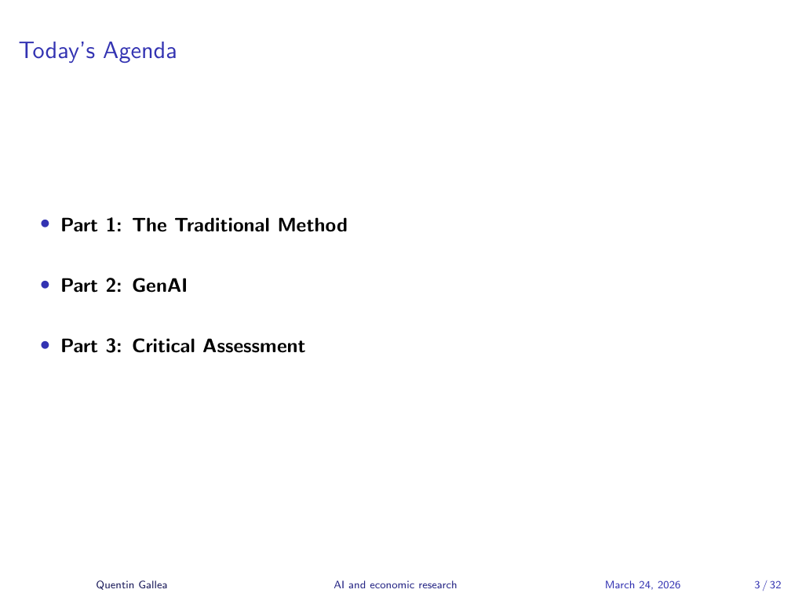{.slide-image fig-align="center" width="85%"}

Today's session covers **literature review** — one of the most important and most dreaded parts of research. The challenge is familiar: you have a pile of papers you'd love to read, but never manage to get through properly.

A common objection to using AI in this context is: "If you teach people to use AI, nobody will actually read papers." But that misses the point. You're constrained by time. AI can help you **filter** more efficiently, so you spend less time on low-value scanning and more time deeply reading the papers that truly matter.

This connects to the **outcome vs. process** framework from earlier sessions. When you just need to know a paper's research question or dataset — tasks where only the outcome matters — AI can extract that quickly. But when the process matters — understanding an argument, evaluating a method — you need to do the reading yourself. AI helps you reallocate time toward what requires your skills.

As usual: traditional method first, then how GenAI can play a role, then critical assessment.

---

## What a Literature Review Is — and Is Not

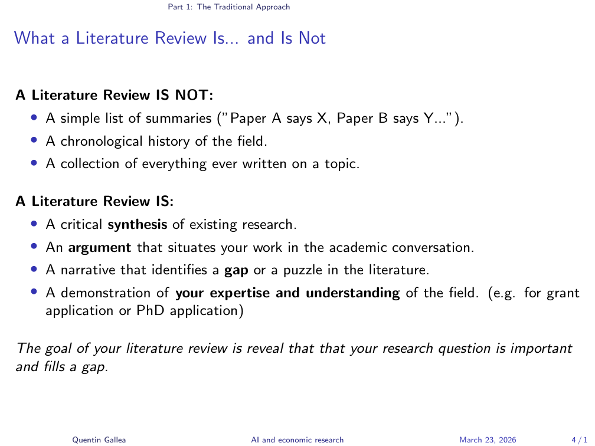{.slide-image fig-align="center" width="85%"}

A literature review is subtle and difficult — and, frankly, not everyone's passion. It is definitely **not** a simple list of papers with similar titles, not a history of the entire field, and not a collection of everything vaguely related to your topic.

A good literature review focuses on **seminal work**, the key articulations within the literature, and where the field is heading. Sometimes a paper has almost the same title as yours but you won't cite it — because the research quality doesn't meet the threshold discussed in the previous session.

The literature review serves several purposes: it **places your research** within the existing body of work, showing that your contribution fills an important gap. It supports the many claims you make along the way (most of your paper builds on others' findings). And it demonstrates your expertise — whether for a PhD application or a master's thesis, showing that you understand the important authors, the key papers, and the direction the field is moving.

The main goal: use previous findings to build toward and justify your own research, showing it fills a meaningful gap.

---

## A Systematic Strategy

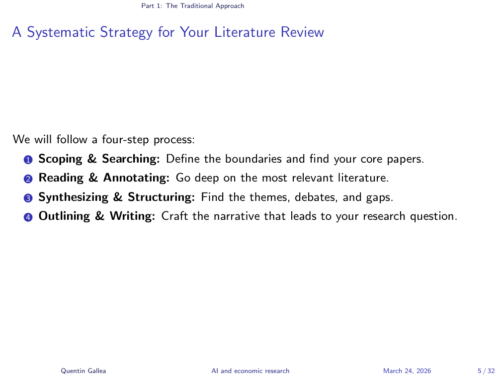{.slide-image fig-align="center" width="85%"}

A standard approach to literature review follows four steps: (1) **define the scope**, (2) **read and annotate** papers (covered in the previous session), (3) **synthesize** — organize and structure your findings, and (4) **write** the narrative. The synthesis step is where a literature review transforms from something boring into something insightful. It requires real planning: how will you articulate and group the papers you've collected?

Let's walk through each step.

---

## Scoping and Searching

### Defining Your Scope

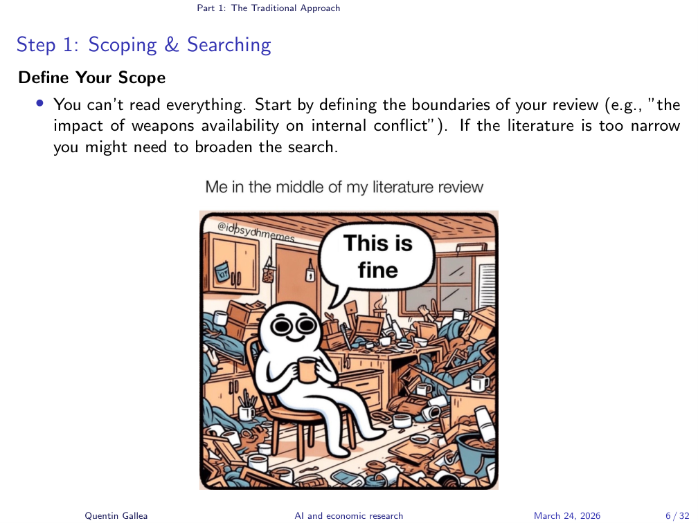{.slide-image fig-align="center" width="85%"}

Scoping means deciding how narrow or broad your review will be. If you're researching "AI and work," are you covering every impact of technological shocks on employment? Just AI including machine learning and deep learning? Or specifically automation technologies?

The answer depends on the literature available. For example, if you're studying LLMs' effect on work, you don't have decades of research to draw on — the shock effectively started in 2023. You might have two or three reliable, relevant studies. In that case, you'd broaden your review: cover the historical findings on automation and work, then narrow to the recent LLM-specific evidence, and position your contribution as extending this emerging line of research.

---

### Systematic Searching Techniques

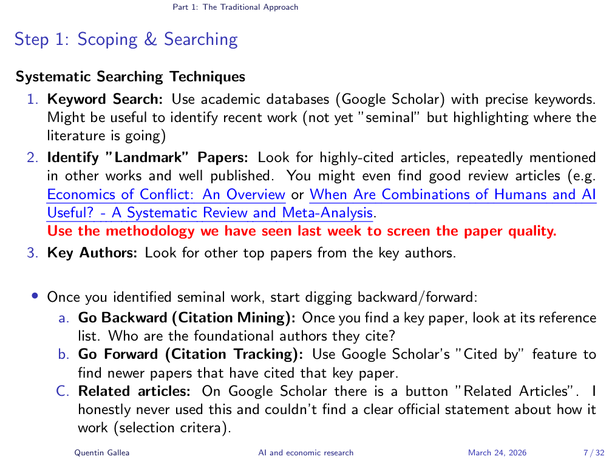{.slide-image fig-align="center" width="85%"}

Once the scope is defined, the next task is finding the key papers. Keyword search (e.g., on Google Scholar) can be useful for a vague initial scan, but it's rarely the best approach. The results tend to be noisy and unsatisfying.

A better strategy is **citation mining**: start by identifying key authors and **landmark papers**. These researchers have been working in the field for 20-30 years — they know the literature. Their papers cite the other important works and authors. From these anchor points, you can branch out.

Look for recent papers by these authors to see where the field is heading. Look for **review articles** (e.g., "Economics of Conflict: An Overview") or **meta-analyses** that survey the landscape and cite many relevant papers.

Once you've identified **seminal work**, use **backward and forward citation tracking**. Backward: read their literature review and check who they cite. Forward: on Google Scholar, click the "Cited by" count to see who has built on their work since publication. For example, "The Jagged Technological Frontier" already has over 1,500 citations — clicking through reveals more recent work like NAS papers from 2024 and AI/ML reviews in *Nature*.

---

## Reading and Annotating

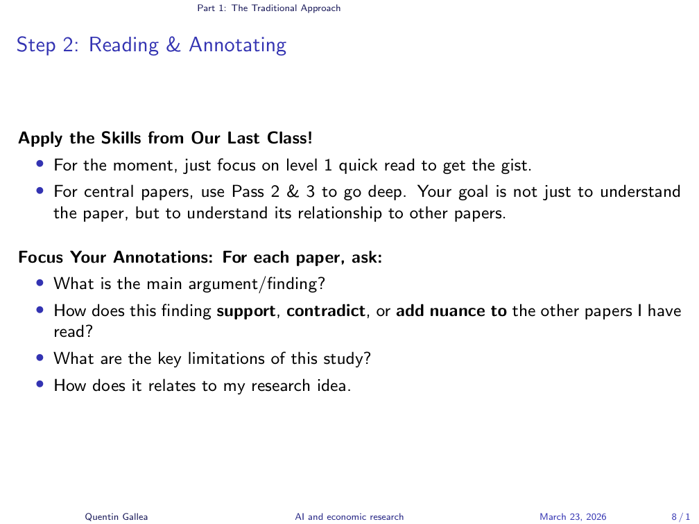{.slide-image fig-align="center" width="85%"}

Once you've gathered key papers, apply the reading skills from the previous session. For the literature review context, you especially want to understand the introduction and related work sections, which map the field.

Use a layered approach: start broad (abstract, conclusion, skim the intro), then go deeper for the papers that matter most. For true seminal work, a full deep read is essential. Throughout, practice **active reading**: take notes on main findings, limitations, where the field is going, and connections to other work.

This step also helps you refine your own research question. You might discover that another paper already answers what you planned to study — time to adjust. Or you might spot a gap that's bigger than you initially thought.

A note on the course: starting from this session, homework will involve working on your own topic of interest, building toward a master thesis proposal over the semester.

---

## Synthesis

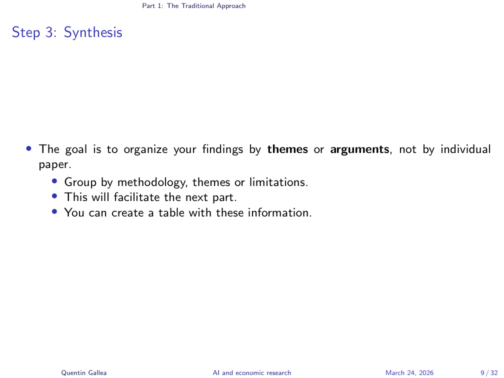{.slide-image fig-align="center" width="85%"}

Synthesis is probably the toughest step. You end up with a large collection of papers and need to choose what to include and how to organize it. Resist the urge to just list papers by citation count. Instead, **plan the structure first**: identify sub-themes, articulations, and groupings.

You can organize by methodology (if that's the key differentiating factor), by theme, or using a **funnel structure** that moves from broad questions to your specific contribution. A summary table mapping papers to themes, methods, and findings can be very useful at this stage.

---

## Writing the Narrative

### The Funnel Structure

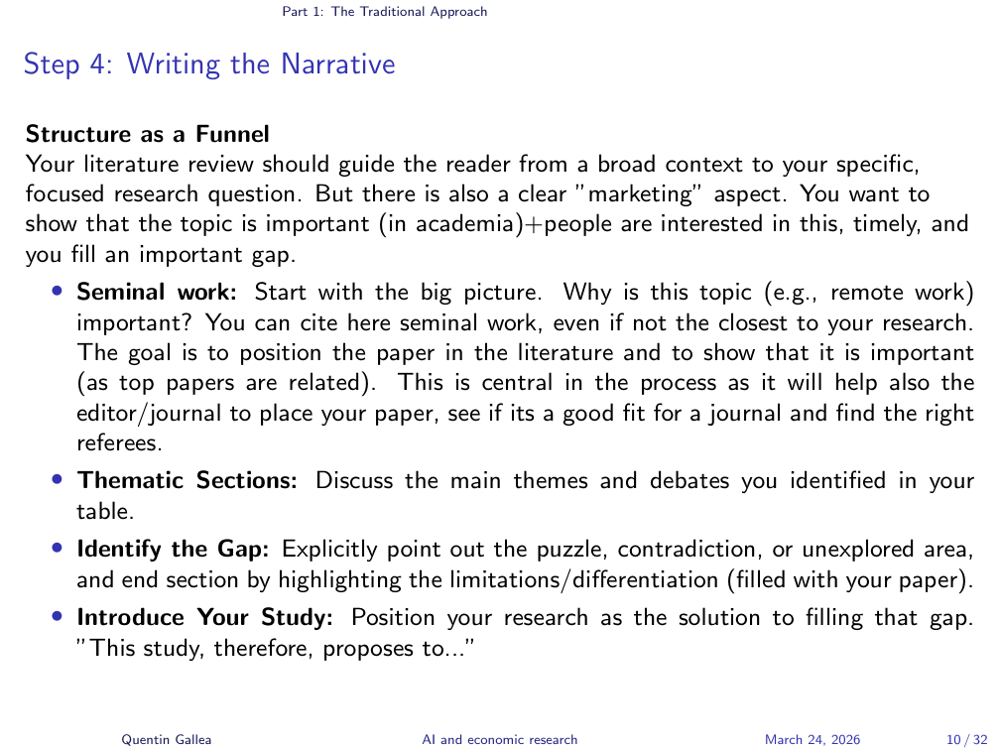{.slide-image fig-align="center" width="85%"}

The writing typically follows a funnel. Start with the **big picture**: the key papers and authors in the field. This simultaneously establishes that the topic is important (studied by top scholars) and that gaps remain.

Then move through different sub-themes, each in its own paragraph or section. For example, in Quentin's research on the impact of weapons on wars, the funnel looked like this: first, the broad literature on drivers of conflict (the grievance vs. greed debate — true seminal work). Then sub-topics: trade and conflict, traditional weapons and interstate wars, drivers of internal conflict. Each connected but with slightly different angles.

At the bottom of the funnel, you arrive at the papers closest to your own work. In his case, two papers: one with flawed methodology (a questionable instrumental variable with a likely violation of the **exclusion restriction**), and one limited to a narrow geographic region with only active-conflict countries. His paper had a broader sample and a broader question — filling a clear gap.

The pattern: important topic, many researchers working on it, different key aspects explored, but when you zoom in on the specific question — no satisfactory answer yet. Here is your paper.

---

### The Marketing Aspect

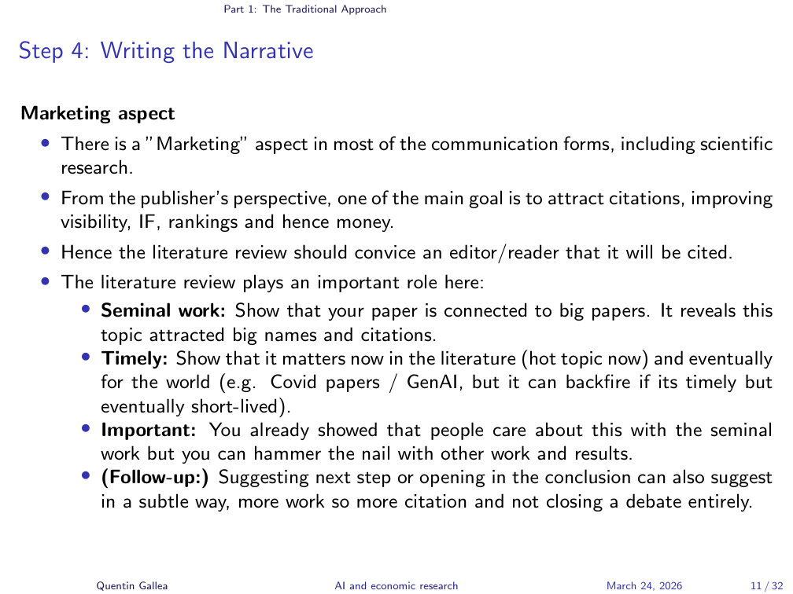{.slide-image fig-align="center" width="85%"}

Like it or not, there is a **marketing aspect** to academic writing. You're trying to show that your paper is important, should be published, and should be cited. This happens through several subtle (and sometimes perverse) mechanisms.

**Citations as currency**: Publishers want papers that attract citations. Researchers signal citation potential by showing the topic is timely, that major scholars work in the area, and that there's interest from researchers, companies, and governments. Some researchers strategically cite likely referees to bias their judgment — a real, if uncomfortable, practice.

**Signaling through references**: Your citation list signals where you think the paper belongs. If you want to publish in a top-five economics journal but only cite *Nature* and *Science*, the editor sees a mismatch. If you want a general science journal but only cite field-specific outlets, same problem. This also explains why papers from international organizations — the UN, the World Bank — are under-cited in academia: they signal a different audience.

**The publish-or-perish problem**: The pressure to publish creates bad incentives — **p-hacking**, inflated findings, quantity over quality. Focus shifts to outcomes (publication count) rather than process (doing good research). And there's already far too much research being produced for anyone to read. As an example, the Autonomous Policy Evaluation project by David Yanagizawa-Drott published 168 papers in a single batch — nobody is reading all of them.

A student raised an important question: will AI make the overproduction problem worse? If we can generate papers faster, but editors and reviewers are already overwhelmed, what happens? There's no clear answer yet, but it's worth watching.

With the traditional method firmly established, let's now explore what generative AI can bring to the table.

---

## Example: The Jagged Frontier

### Introduction

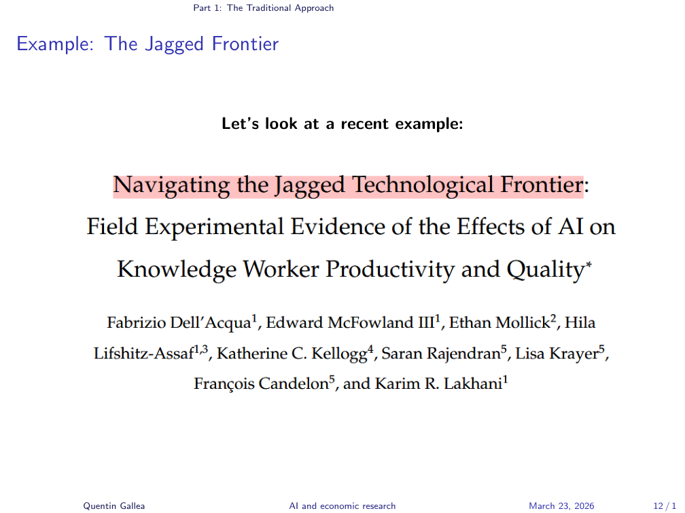{.slide-image fig-align="center" width="85%"}

Let's look at a concrete example of an excellent literature review: the "Navigating the Jagged Technological Frontier" paper by Lakhani and colleagues (recently published). These are top scholars, and their literature review is exceptionally well crafted.

---

### Seminal Work and Gap-Planting

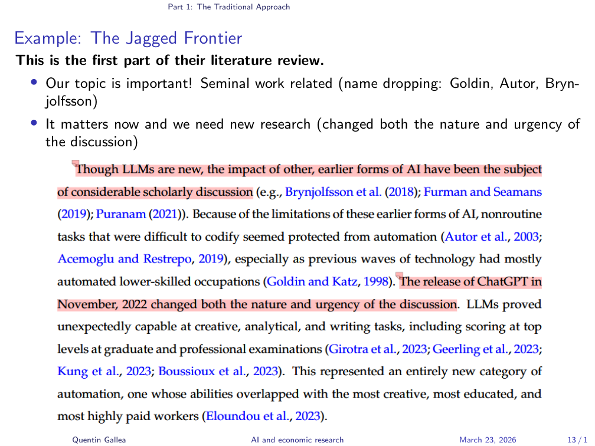{.slide-image fig-align="center" width="85%"}

Look at the opening sentence: *"Though LLMs are new, the impact of other earlier forms of AI have been the subject of considerable scholarly discussion."*

This single sentence does two things brilliantly. First, **name dropping**: it cites the most prominent scholars in the field (Acemoglu, Katz, and others), establishing that this is a topic studied by serious researchers. Second, it **plants the seed of a gap**: by saying "LLMs are new," it implies that prior work hasn't addressed LLMs specifically.

Then: *"The release of [ChatGPT] changed both the nature and urgency of the discussion."* This is textbook positioning — it says: great work so far, huge interest, but we now have urgent new questions. Our research will answer them. In one paragraph, they sell both the importance and the gap.

---

### Pivoting to Specifics

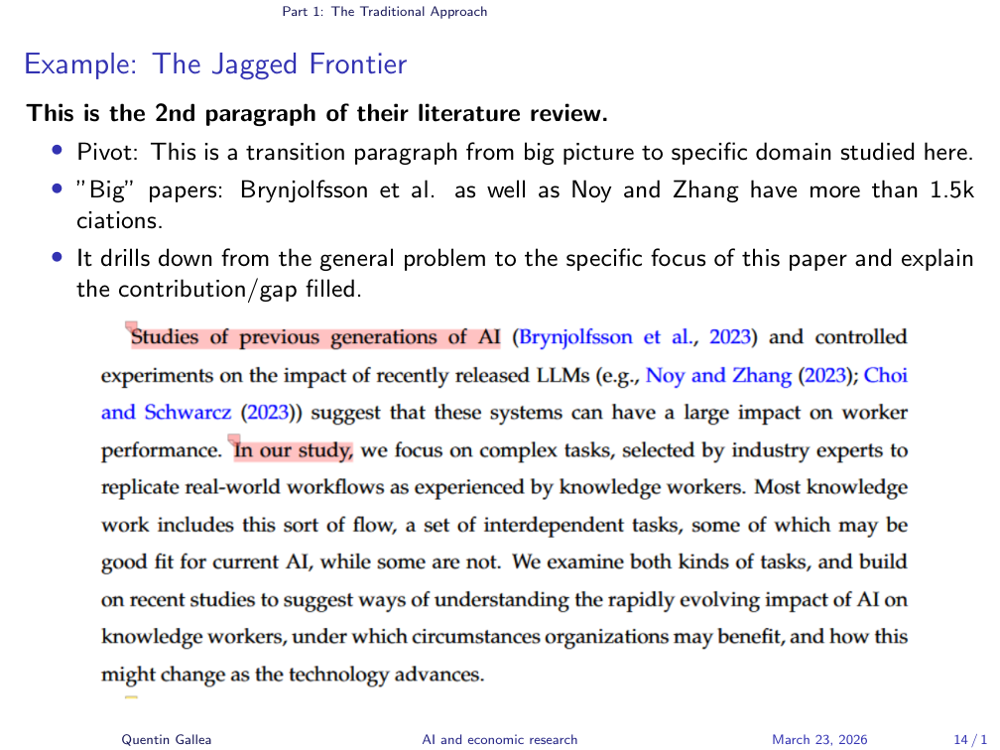{.slide-image fig-align="center" width="85%"}

The second paragraph pivots to more specific, recent work — again with strategic name dropping. The cited papers (Noy & Zhang and others) are from 2023 and already have more than 1,500 citations. People in the field recognize these as important.

The authors then quickly differentiate their own contribution with five specific points. The message: lots of recent attention, but here's exactly why our study matters. And it worked — "The Jagged Technological Frontier" itself has over 1,000 citations since the 2023 working paper.

---

### Themes and Urgency

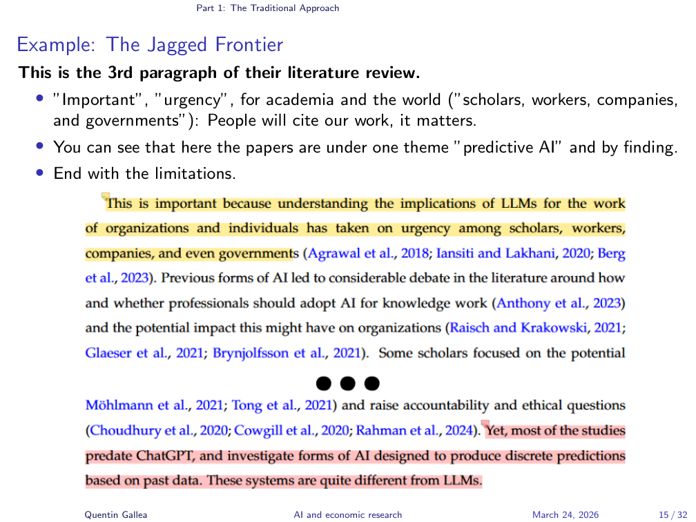{.slide-image fig-align="center" width="85%"}

The review then moves into specific **themes**, going deeper into sub-areas of the literature. Watch the keywords: "understanding for organizations has taken an urgency," "among scholars, research workers, companies and governments." Every phrase signals importance, breadth, and timeliness.

The pattern: seminal work, then their contribution, then deeper thematic coverage, then contribution again. Each cycle reinforces the gap. They conclude: *"Yet most studies predate ChatGPT... and investigate forms of AI designed to produce discrete predictions based on past data, which are quite different from [LLMs]."* Novelty and gap, restated clearly.

---

### Structuring the Final Argument

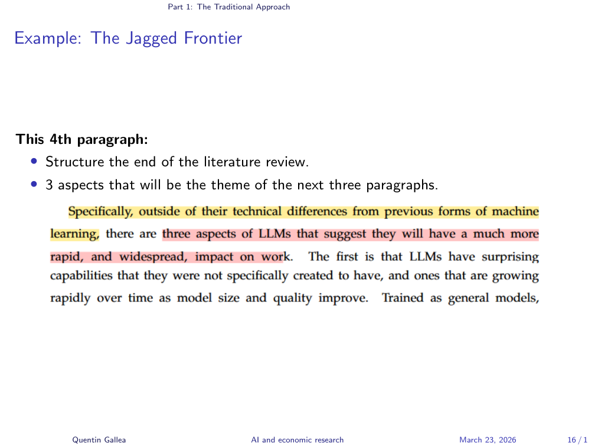{.slide-image fig-align="center" width="85%"}

The next section identifies three specific aspects that make LLMs different from prior AI, with a dedicated paragraph for each. This structure justifies why their research question is both new and urgent — it's not just "more AI research" but a fundamentally different phenomenon requiring fresh investigation.

---

### The Puzzle

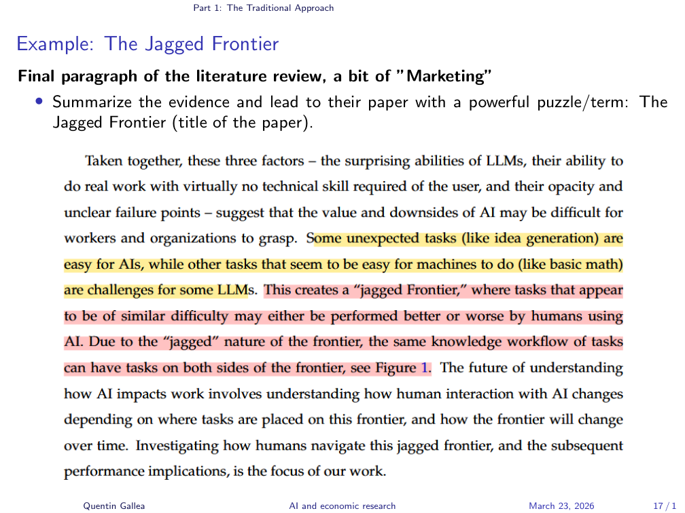{.slide-image fig-align="center" width="85%"}

Finally, they introduce their key concept: the **jagged technological frontier**. The idea is that tasks very similar from a human perspective can fall on opposite sides of AI's capability boundary — some are within AI's frontier, some are beyond it. They coined a catchy term, paired it with a compelling visual in the paper, and created something memorable.

When a literature review is done this well, it's genuinely exciting to read. You see the architecture of the argument, the strategic choices, the storytelling. That's the standard to aim for.

---

### Summary of the Traditional Approach

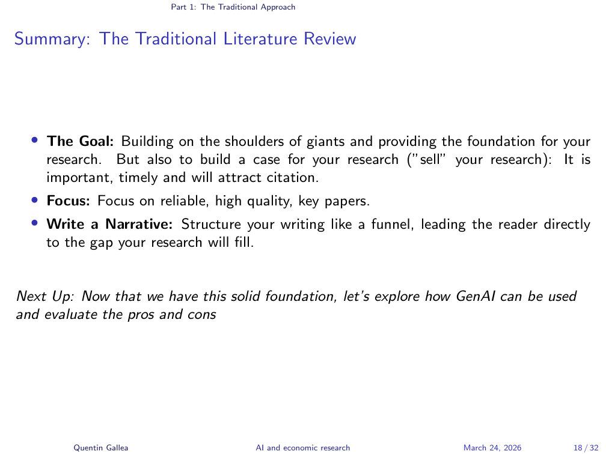{.slide-image fig-align="center" width="85%"}

To summarize: the goal is to use previous findings to build on and sell your research. Focus on what's reliable and what's key to advancing the literature. And remember — it's not a boring list. It's a narrative you construct with **storytelling**.

---

## GenAI and Literature Review

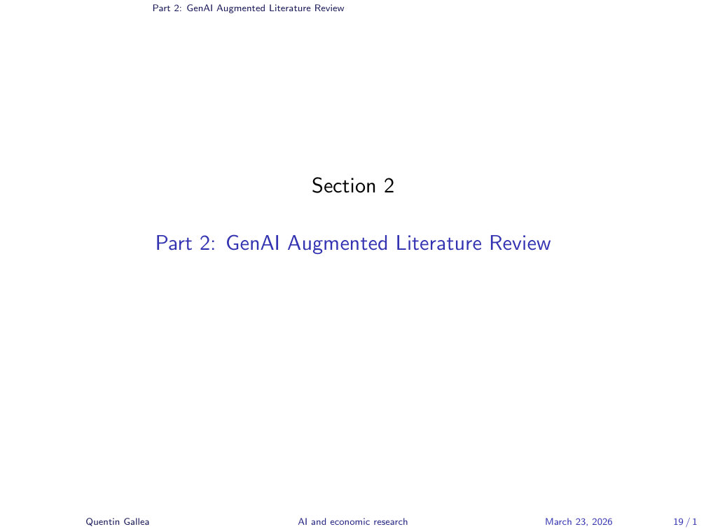{.slide-image fig-align="center" width="85%"}

Now that we have this solid foundation in the traditional approach, what can generative AI do to help?

---

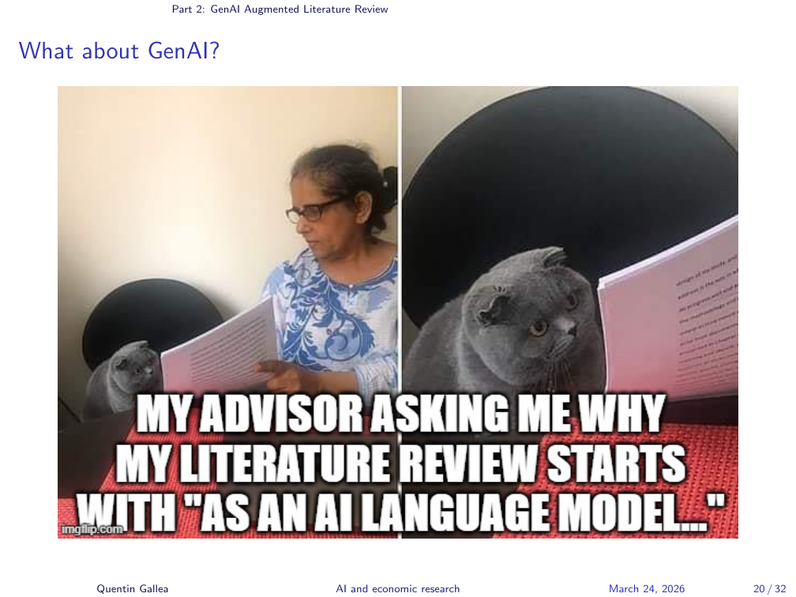{.slide-image fig-align="center" width="85%"}

Generative AI might help with literature review, but there's an obvious problem: you need **reliable citations**, and LLMs hallucinate.

---

## Full Automation: Not There Yet

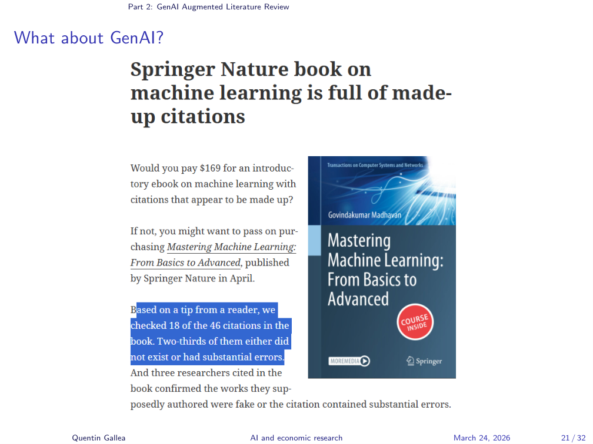{.slide-image fig-align="center" width="85%"}

This isn't hypothetical. The Springer Nature book on machine learning mentioned in an earlier session contained numerous fabricated or erroneous citations — 18 out of 46 citations didn't exist or had significant errors. And it was published.

---

### GenAI Tools Overview

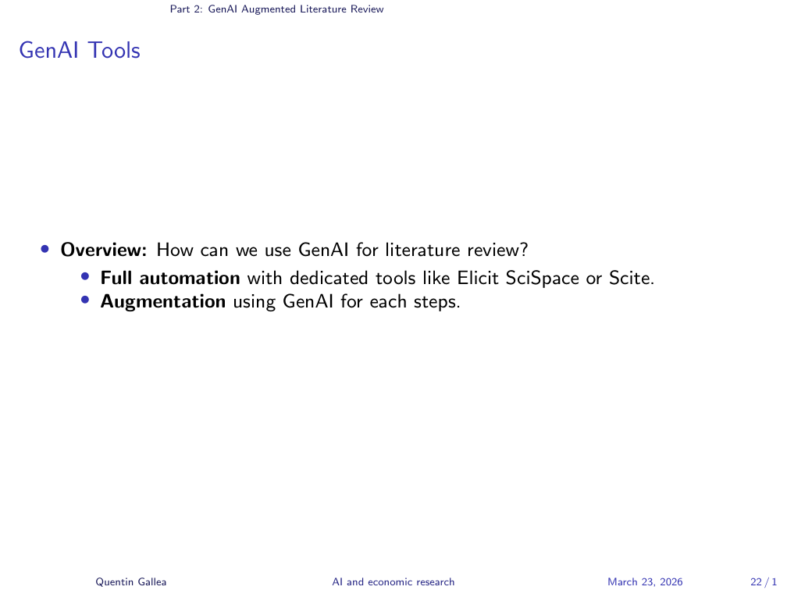{.slide-image fig-align="center" width="85%"}

There are two basic approaches to using AI for literature review: **full automation** (let the tool do the review) or **augmentation** (use AI to help with specific tasks while you remain in control).

---

### Testing Full Automation

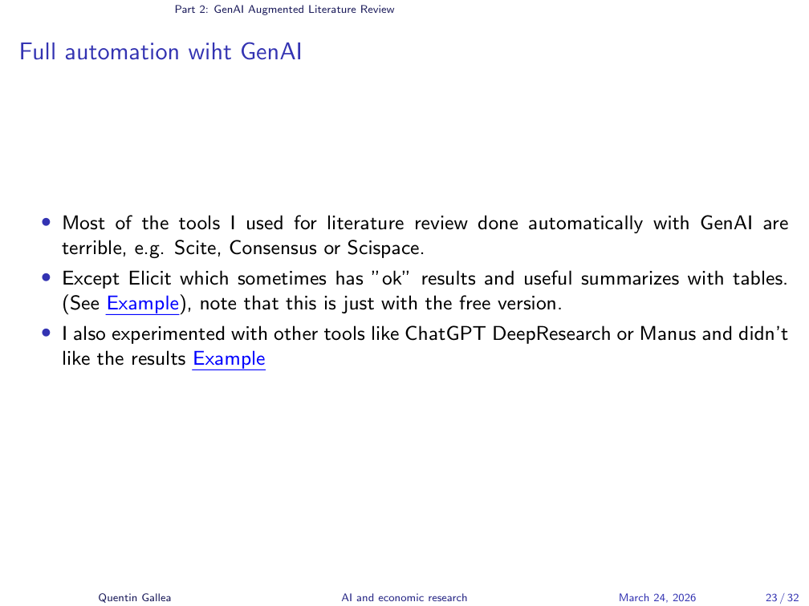{.slide-image fig-align="center" width="85%"}

Full automation is not convincing yet. Tools like **Scite**, **Elicit**, and **Consensus** have been tested extensively, along with deep research modes in Claude and other tools. The results consistently fall short: the tools tend to surface papers that are topically close but lack quality, they miss seminal work, and they don't capture the nuances that matter for a rigorous review.

That said, these tools can be useful for an earlier, more limited task: **finding an initial list of candidate papers**. A student suggested using Consensus to generate a starting list, then manually judging quality and selecting which papers to actually read. That's a valid approach — using AI for discovery rather than synthesis.

---

### Elicit: Question Refinement

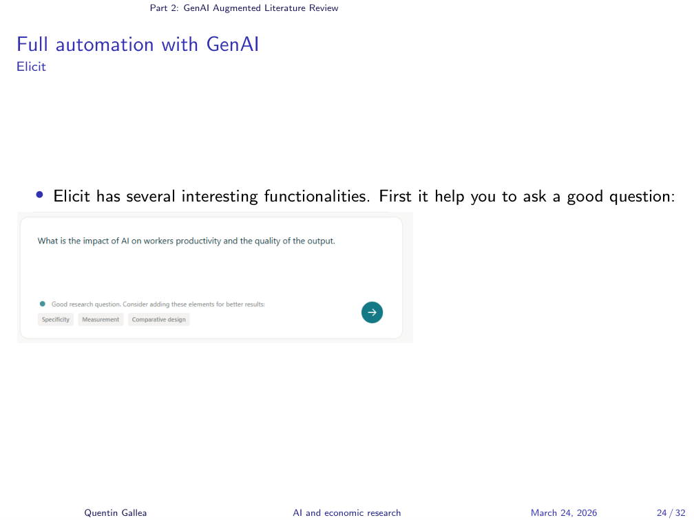{.slide-image fig-align="center" width="85%"}

One useful feature in **Elicit**: when you enter a research question, it tells you if it's too broad and suggests refinements. For example, it might ask: are you interested in generative AI specifically or AI more broadly? Are you measuring productivity at the worker level or the aggregate level? This **question refinement** step has real value.

---

### Elicit: Structured Tables

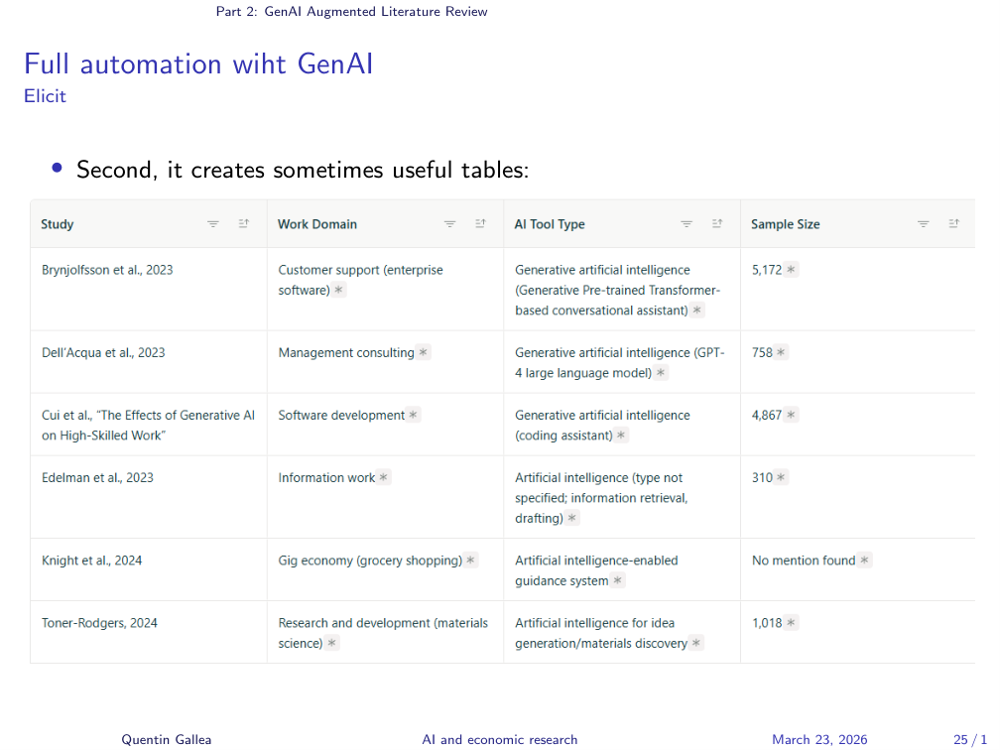{.slide-image fig-align="center" width="85%"}

Elicit also generates structured **comparison tables** — showing, for example, sample size, which AI tool was studied, and the context for each paper. It's an interesting summary format. It doesn't mean it's correct (the usual caveats apply), but the structure itself can be useful as a starting point.

---

## Augmentation: The Recommended Approach

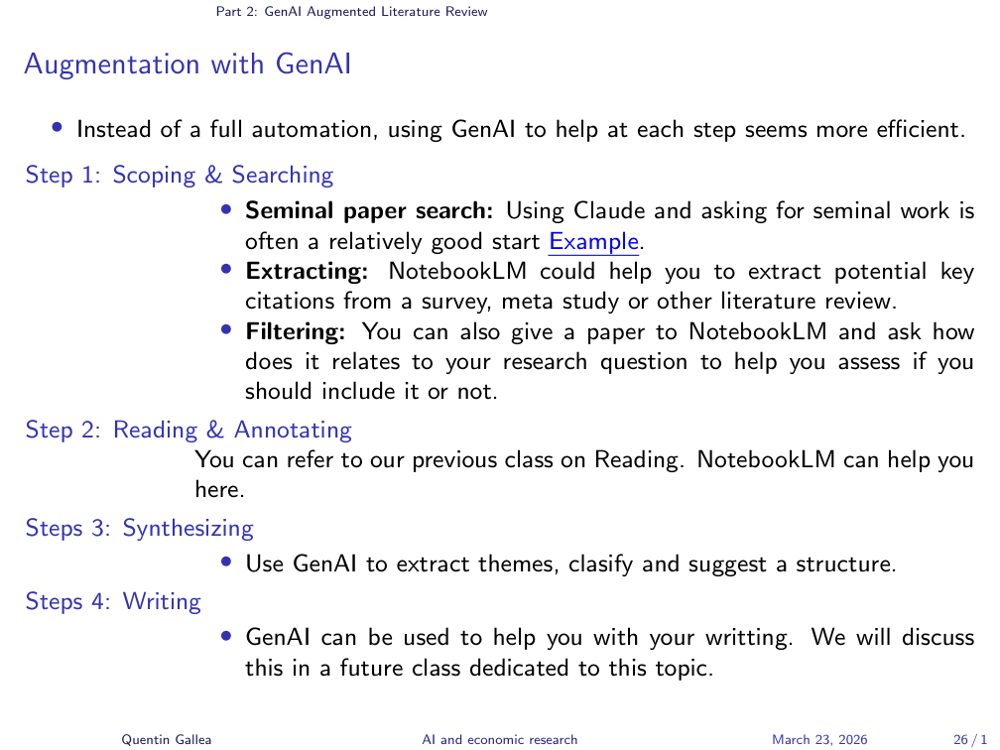{.slide-image fig-align="center" width="85%"}

The recommended approach is **augmentation** — using AI to assist at specific steps rather than replacing the entire process.

**Finding seminal work**: Ask Claude (or another LLM) for seminal work in a field. In Quentin's experience, LLMs do this well — they identify highly cited, well-known papers rather than obscure, low-quality ones. They pick up the "big signal." This is a good starting point, though you always verify quality.

**Extracting and filtering citations**: Use NotebookLM with a seminal paper loaded as a source. Ask it to identify which citations in the paper's literature review you should read further, given your specific research question. This helps skim through long reference lists efficiently.

**Deciding whether to read a paper**: Give NotebookLM a paper and your research question, and ask whether you should include it in your review. This helps when you have a long candidate list and limited time.

**Organizing themes**: When you've collected many papers and need to create sub-themes (Step 3), AI is good at perceiving the big picture and suggesting how to group and articulate your literature. Upload your notes or paper summaries and ask for a thematic structure.

**Reading and note-taking**: As covered in the previous session, NotebookLM helps with extracting key information, taking notes, and understanding complex papers.

---

### Example Prompts for AI-Powered Synthesis

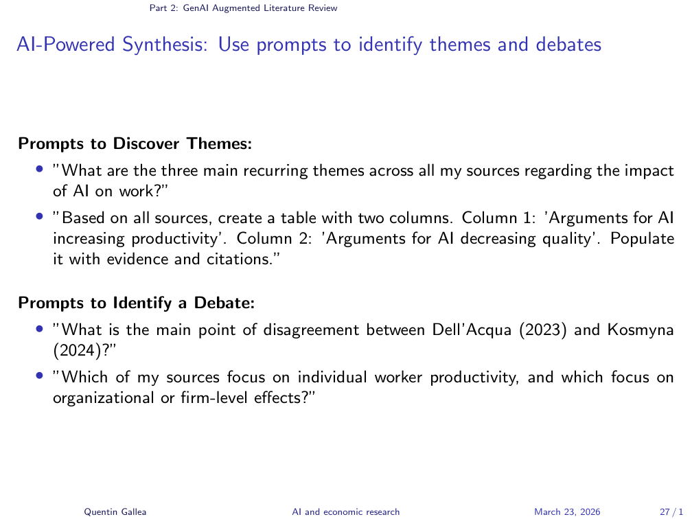{.slide-image fig-align="center" width="85%"}

The slides include example prompts for using AI to identify themes, debates, and structural patterns in your collected literature. These are self-explanatory — adapt them to your own research question and paper collection.

---

## Critical Assessment

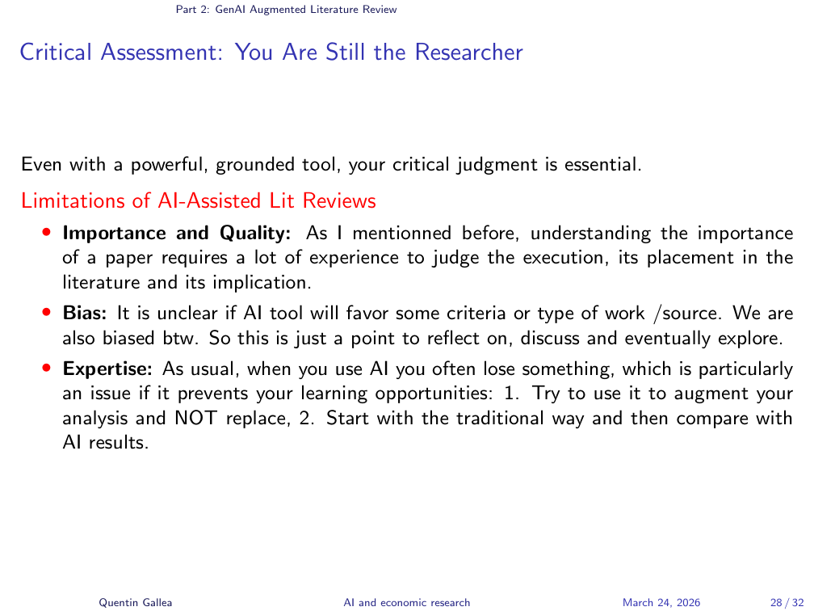{.slide-image fig-align="center" width="85%"}

As always: **critical thinking** comes first. Filter in what's useful, filter out what's not. Consider whether you want to form your own view first and then use AI to fill gaps, or start with AI and then verify.

Be mindful that AI has biases too — different from human biases, but biases nonetheless. Humans might overweight famous names or be swayed by catchy terminology ("the jagged technological frontier"). AI might overweight papers that are well-represented in its training data, or surface confident-sounding but mediocre work. We don't fully know what AI's biases are yet, which is itself a reason for caution.

---

## Applying Our Guidelines

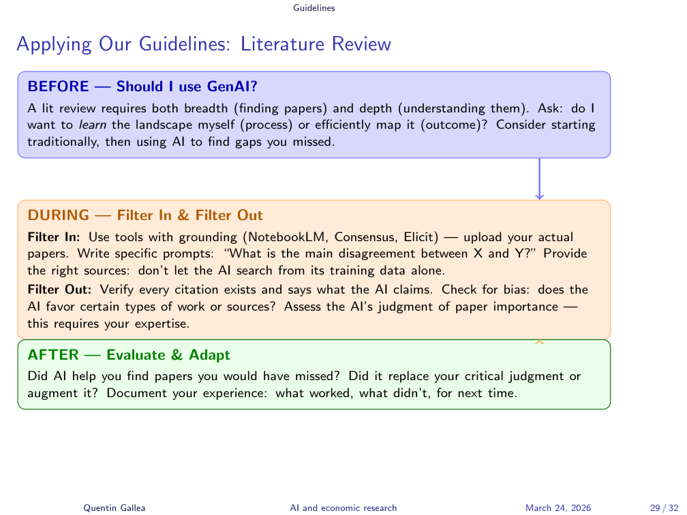{.slide-image fig-align="center" width="85%"}

This slide presents the decision framework from earlier sessions applied to literature review: **augment or replace?** Start with the traditional approach or compare with AI results? At the learning stage especially, start without AI, then see whether AI adds value — following the usual assessment of whether the outcome or the process matters, and whether to filter in or filter out.

---

## In-Class Application

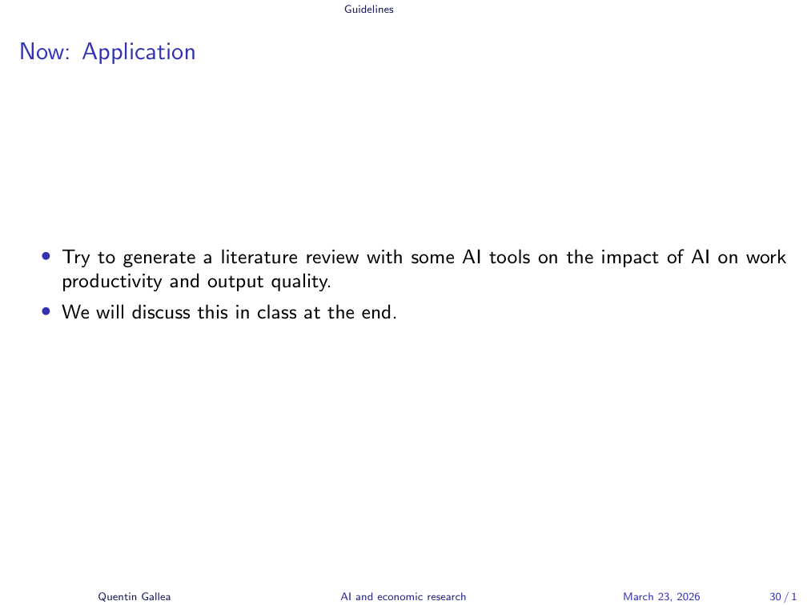{.slide-image fig-align="center" width="85%"}

Students spent 20 minutes using AI tools to find key papers on "the impact of AI on work and productivity." Here are the main takeaways from the class debrief:

**Tools and results**: Students tried Claude, ChatGPT, Elicit, and Consensus. Results across Claude and ChatGPT were similar — both returned around 10 papers, but many were too general (AI broadly, not generative AI specifically). The key well-known papers (Noy & Zhang among others) did appear, which is a good sign.

**Precision matters**: Students confirmed that the initial question was too broad. When the same question was entered in Elicit, the tool flagged this and suggested refinements — matching the class's own conclusion. This validates that Elicit's question refinement feature genuinely helps.

**Elicit's free tier**: On the free version, Elicit surfaced about 50 papers but ranked some with zero citations and unknown authors at the top — a bad start for a literature review. The ranking algorithm needs scrutiny.

**Consensus showed promise**: Quentin explored Consensus in more depth and found several useful features: journal quality filters (Q1/Q2), methodology filters, field-of-study selection, a visual summary showing the balance of findings (yes/no/mixed with percentages), and a screening visualization. The structured layout was appealing, though the results still need manual verification.

**An interesting bias question**: Some tools surfaced papers by unfamiliar authors and from lesser-known journals. The instinct is to dismiss these as errors, but it raises a thought-provoking possibility: AI might help reduce our own **confirmation bias** in literature review. We tend to rely on famous names and top journals as proxies for quality. AI, lacking these social biases, might surface relevant work we'd otherwise miss. This deserves more exploration.

**Overconfidence warning**: One student noted that Claude presented its recommendations with high confidence, even for papers from journals the student couldn't verify as high-quality. LLM confidence is not a reliable signal of paper quality.

---

## Homework and Next Steps

### Homework

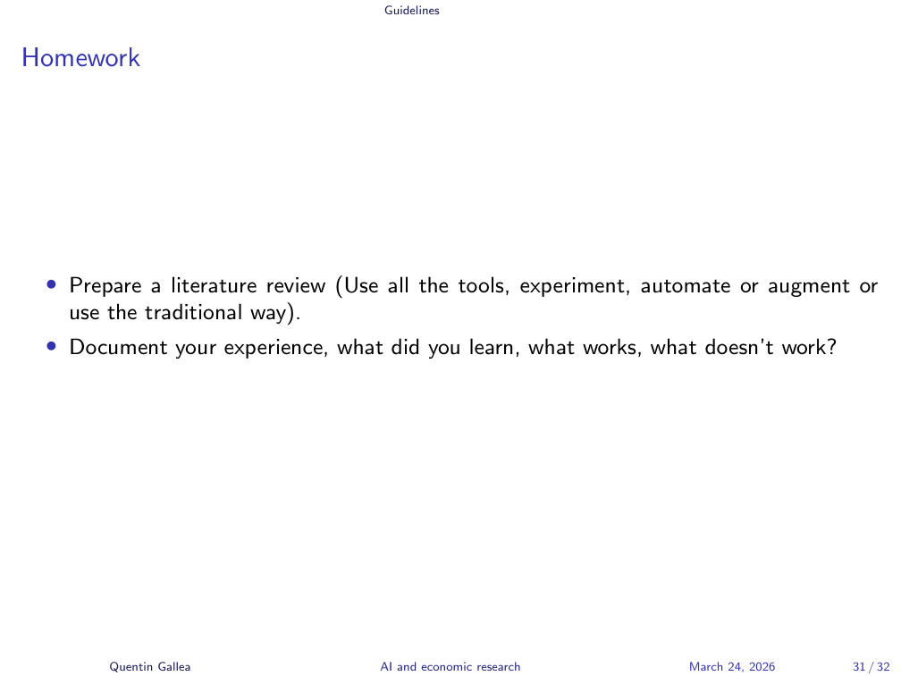{.slide-image fig-align="center" width="85%"}

The homework builds toward the semester-long master thesis proposal:

1. **Start traditionally**: Collect papers on your topic without AI. Classify them by theme. Identify a gap you'd be interested in addressing with a master thesis.
2. **Then use AI**: Ask Consensus, Elicit, or an LLM to do a literature review on the same topic. Compare results.
3. **Try structuring with AI**: At the synthesis stage, do it yourself first, then ask an LLM (e.g., Claude) for suggestions on how to organize the themes.
4. **Document your experience**: Take notes on what was useful, what was misleading, and what you'd recommend. Bring these observations to the next class for discussion.

---

### What's Next?

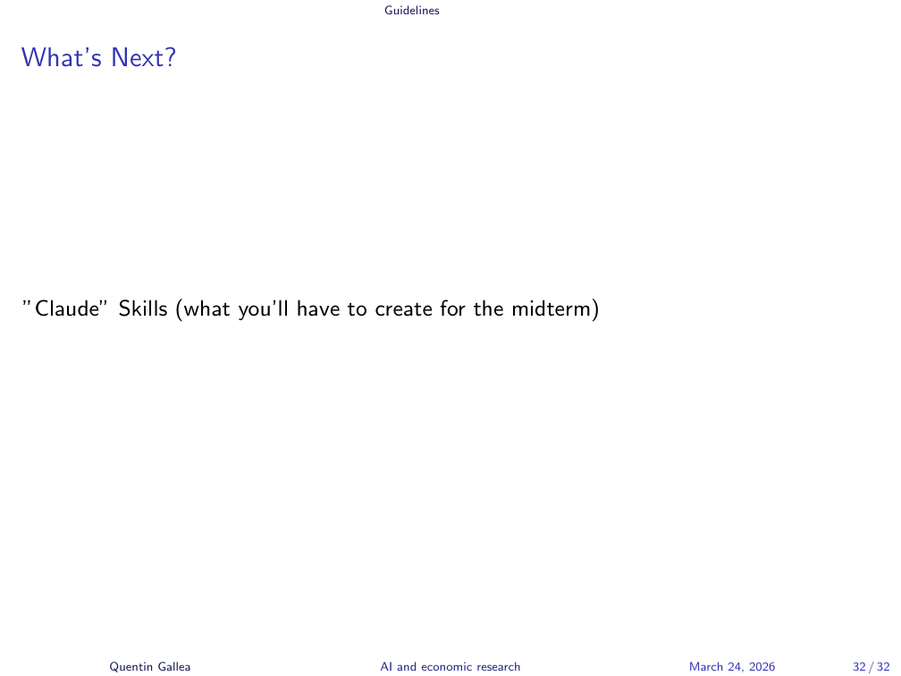{.slide-image fig-align="center" width="85%"}

Next week covers **skills** — reusable instruction sets that can be used across AI platforms (not just Custom GPTs, which are ChatGPT-specific). Skills are platform-agnostic text files that define how an AI should execute a particular task. Quentin will explain the concept, show examples, and demonstrate how to build them.

The group project will also be introduced: small teams (2-3 people) will build a skill to help with their research, present it in class, and demonstrate how it works. Details next week.

Note: there are some public holidays coming up. Two sessions will be replaced by videos with lighter workload, and the skill presentations will happen on the 17th.

::: {.callout-tip}
## Key Takeaways
1. **A literature review is a strategic narrative**, not a list of summaries. It uses a funnel structure to establish importance, map the landscape, and build toward the gap your research fills.
2. **Start with landmark papers, not keyword search.** Use citation mining — backward and forward — to map the field from anchor points.
3. **Augment, don't automate.** Full automation tools aren't reliable yet. Use AI for discovery (finding candidates, filtering, organizing themes) while doing the judgment work yourself.
4. **Always verify AI outputs.** Citation hallucinations are real and published. Check every reference, be skeptical of confident recommendations, and remember that AI has its own biases.
:::
