::: {.callout-note}
## Lecture Overview
This session introduces **skills** -- reusable, text-based instruction sets that turn one-off prompts into portable, composable AI tools. Starting from the problem of repetitive re-explanation in LLM conversations, we build toward increasingly sophisticated examples: a simple writing-style skill, a multi-round academic referee pipeline, and a full autonomous replication system. The session also covers skill optimization, A/B testing, and the mid-term evaluation briefing.
:::

## Introduction

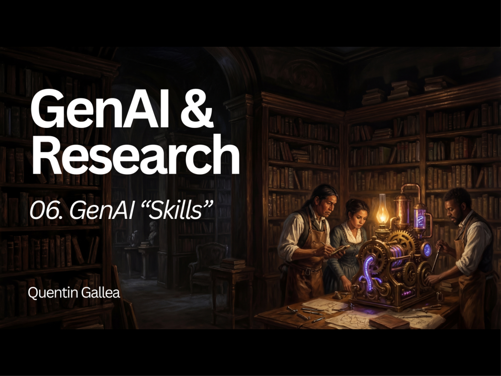{.slide-image fig-align="center" width="85%"}

---

### Student Feedback on Literature Review Tools

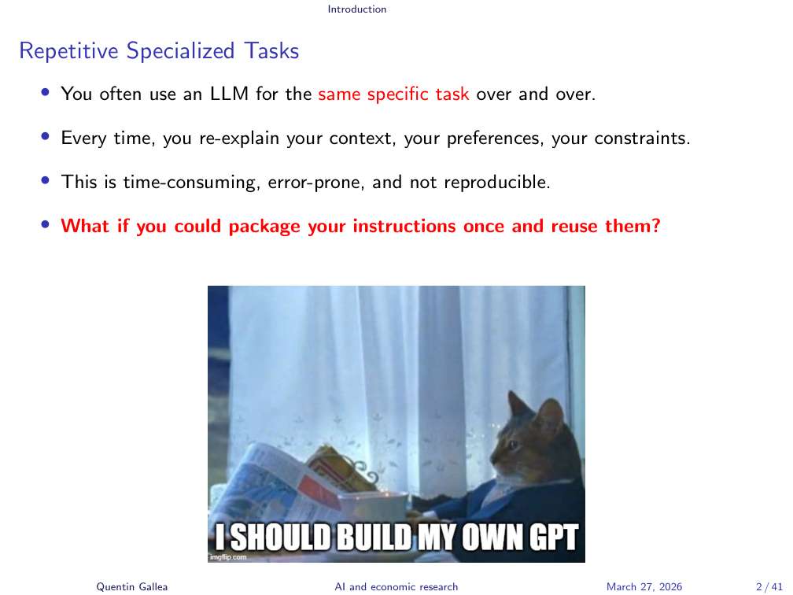{.slide-image fig-align="center" width="85%"}

Before diving into today's topic, the class shared experiences from their literature review homework.

One student discovered **LeapSpace**, an Elsevier tool that pulls actual peer-reviewed papers using Scopus and ScienceDirect content. The student found it useful for sourcing legitimate references on a topic they had never explored in the literature before. The key advantage: you can directly access and verify the papers it suggests, unlike tools that sometimes hallucinate sources. The trade-off is that, like many such tools, it tends to surface papers closely aligned with your query but not necessarily the landmark papers in the field.

Another student tested **Consensus** (available at a 40% discount). They highlighted two strengths: clickable links that let you download papers directly, and the ability to go from vague queries ("what is the best...") to highly specific ones. You can categorize results on the side panel for clean reference management. The instructor confirmed that Consensus also lets you filter by **journal quality quartile** -- a feature that addresses one of the biggest limitations of AI-powered literature tools: surfacing low-quality sources alongside high-quality ones.

Now, on to today's topic: **skills**. This is not only important for the midterm evaluation, but it represents a genuinely powerful approach to working with LLMs. The problem is familiar to anyone who uses AI regularly: you open new chats and keep re-explaining yourself. Memory and custom instructions help, but they are not precise enough for structured, repeatable tasks. A **skill** packages your methodology, context, and expectations into a reusable tool that delivers consistent quality every time.

---

### From Prompts to Persistent Tools

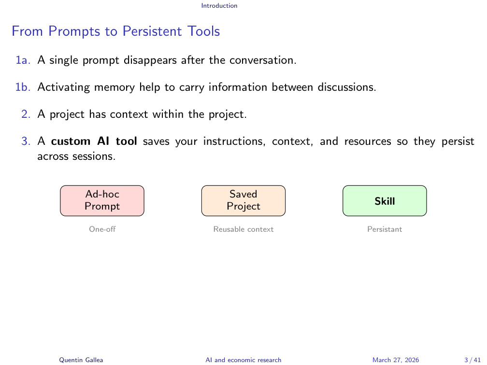{.slide-image fig-align="center" width="85%"}

There is a natural progression in how people work with LLMs. First, you just prompt -- but prompts disappear into a sea of conversations. A quick tip: rename important conversations (Quentin uses lowercase titles so they stand out), and use the starred/pinned feature to keep key chats accessible. But this is suboptimal.

The next level is **projects**. You give specific instructions, upload files, and have them accessible across multiple conversations within the project. This is great for something like a master thesis, where you want your papers, guidelines, and current drafts always available -- whether you are working on coding, writing, or literature review.

But a **skill** is different from a project. A skill is something you might use across multiple projects, for different subjects, at different points in time. It is a set of custom guidelines you can call easily, anywhere.

## The Skill Ecosystem

Every major platform now offers some version of reusable AI tools -- but not all implementations are created equal. Understanding the landscape helps you choose the right approach.

### Every Platform Now Offers Reusable AI Tools

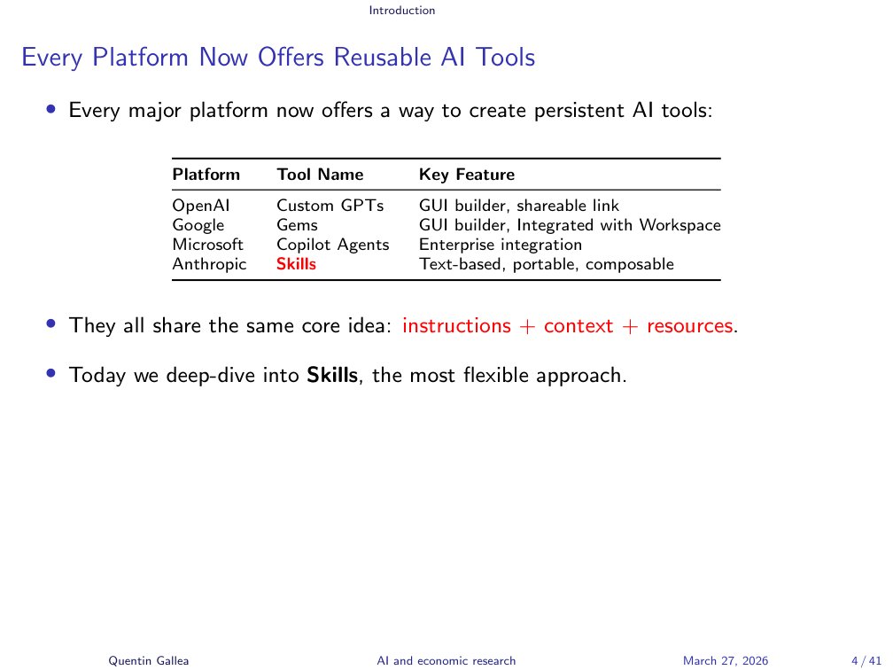{.slide-image fig-align="center" width="85%"}

Every major platform now offers some version of reusable AI tools. OpenAI has **Custom GPTs** -- essentially a chat with saved instructions and reference files, like an additional system prompt you can always access. Google has **Gems**, which work similarly through a builder interface. Microsoft **Copilot Agents** (via Copilot Studio) offer the same concept.

Anthropic created **Skills**, and they have a distinctive advantage: skills are just text files. Because of this, they are inherently portable. You can take a skill file and use it in any conversation with any LLM -- it should work to some extent. For now, skills are most tightly integrated with **Claude Code**, which understands the folder structure and manages skill loading automatically.

---

### Skills Are Text Files, and That Changes Everything

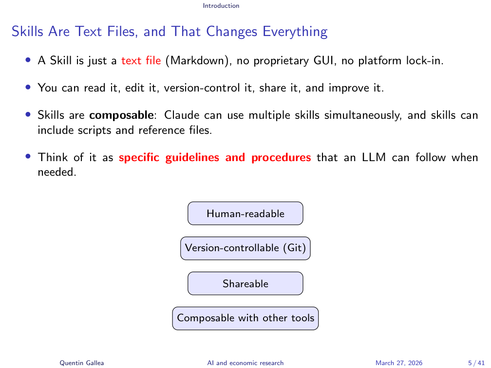{.slide-image fig-align="center" width="85%"}

All these tools share the same basic idea: specific instructions that affect the model's behavior, give structure to problem-solving, define expected outputs, and optionally include context or reference files.

A skill is a text file with the `.md` extension -- **Markdown**, the same lightweight formatting language used in Python notebooks, GitHub READMEs, and many other places. Double asterisks make text bold, hashtags create headings -- it is simple and readable.

Because skills are just text, they unlock several advantages over platform-specific tools. You can read and edit them in any text editor. You can use any LLM to help refine the instructions. You can **version control** them (e.g., on GitHub), track changes, and roll back to previous versions -- something impossible with Custom GPTs or Gems, where a bad edit can overwrite your work permanently. You can share them easily, and you can **compose** them -- connecting one skill to another for more powerful workflows.

---

### Today's Plan

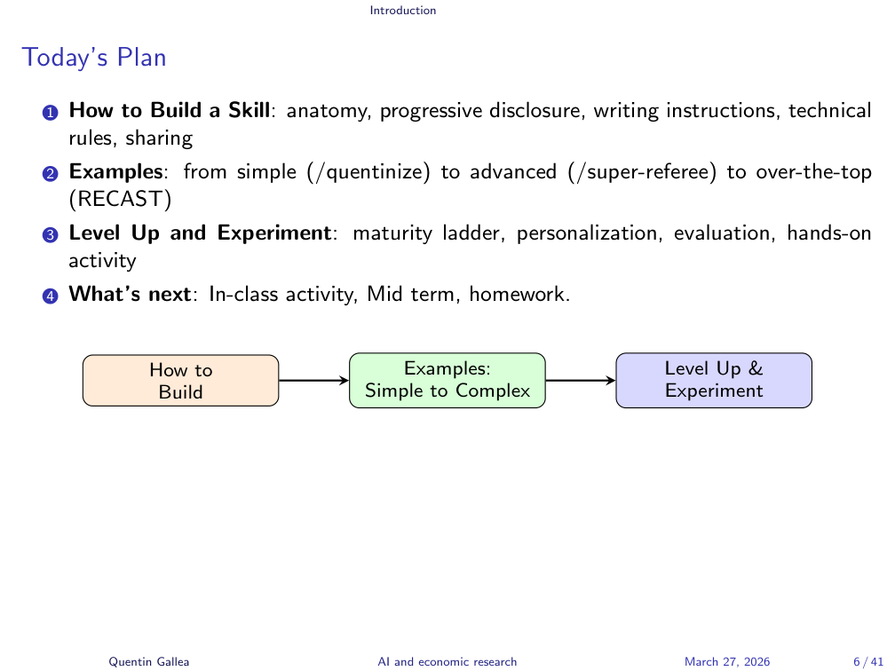{.slide-image fig-align="center" width="85%"}

Today's session covers how to build a skill, with real examples ranging from simple to advanced. Then we will look at techniques for going beyond basic skills -- optimization, evaluation, and composition. The session wraps up with the midterm briefing and in-class practice time.

## Anatomy of a Skill

With the big picture in place, let us look at what a skill actually contains and how it works under the hood.

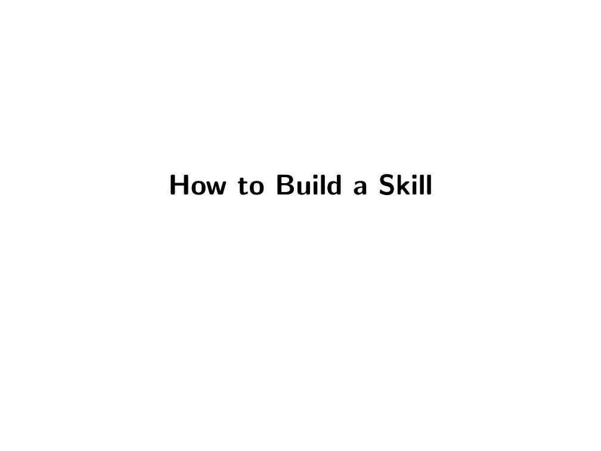{.slide-image fig-align="center" width="85%"}

---

### A Skill Is a Folder with Instructions

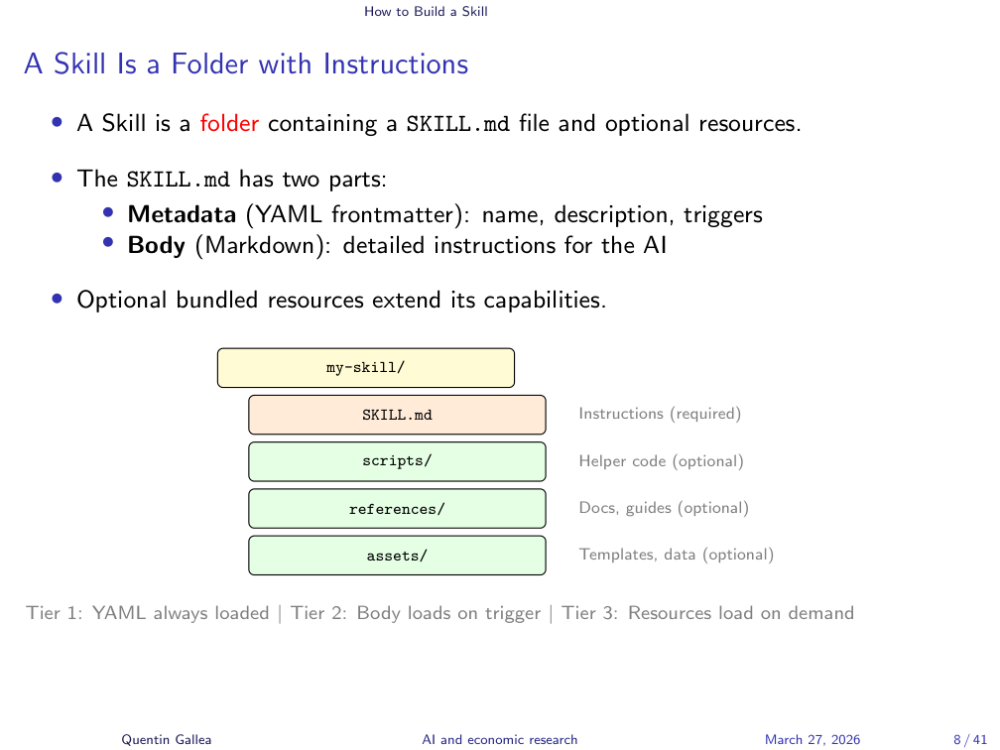{.slide-image fig-align="center" width="85%"}

At its core, a skill is just a **folder** with one main text file. That file is called `SKILL.md` (capitalized, in Markdown format). The folder name matters -- it becomes the skill's name.

Beyond the main file, you can organize additional resources into three subfolders: **scripts** (e.g., Python scripts), **references** (longer text files with domain knowledge), and **assets** (images or other non-text files). But the minimum viable skill is just a folder containing `SKILL.md`.

One student shared that they had already built a skill using Claude's built-in skill creator -- prompting Claude with what they wanted and iterating on versions within the same skill. That is exactly the right approach.

---

### Skills Load Only What They Need, When They Need It

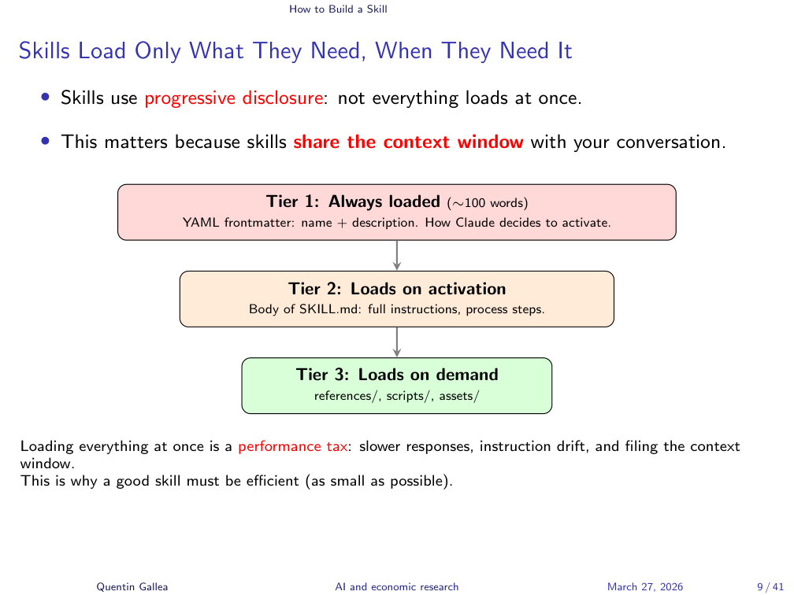{.slide-image fig-align="center" width="85%"}

The `SKILL.md` file has two parts: a **front matter** (in YAML format) and a **body** (in Markdown). The front matter contains the skill's name, description, and trigger conditions.

Why separate things into subfolders instead of one long file? Because the **context window** is a scarce resource. You do not want to flood it with information that is not needed for the current task.

Skills use **progressive disclosure** to manage this. You can have dozens of skills available, but only the front matter -- a short description of up to 1,024 characters -- is always loaded. That tiny text is enough for Claude to decide "this task matches that skill." Only then does it load the full `SKILL.md`. And reference files? They are loaded and **unloaded** as needed -- brought in for a specific step, then released to free up context space.

This means a key part of skill design is optimization: can you cut the skill's length in half and still get the same output quality? Often, yes. And you should test this.

---

### The SKILL.md File

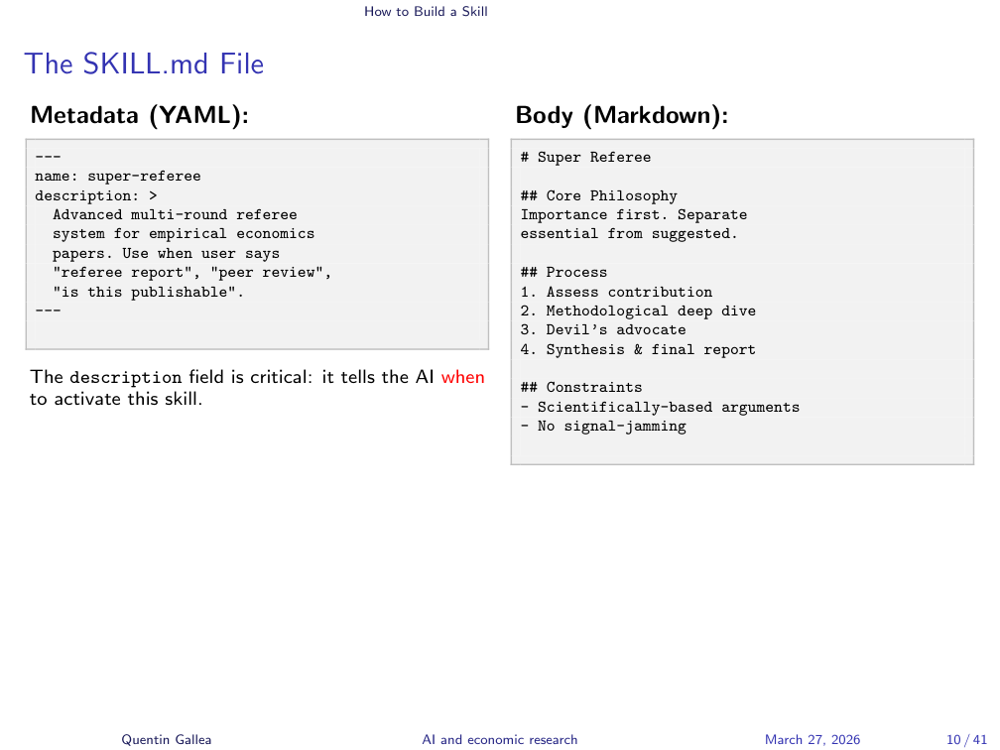{.slide-image fig-align="center" width="85%"}

The file structure is straightforward: the YAML front matter at the top with metadata (name, description, triggers), followed by the Markdown body with your actual instructions.

---

### Skills Trigger Automatically or On Command

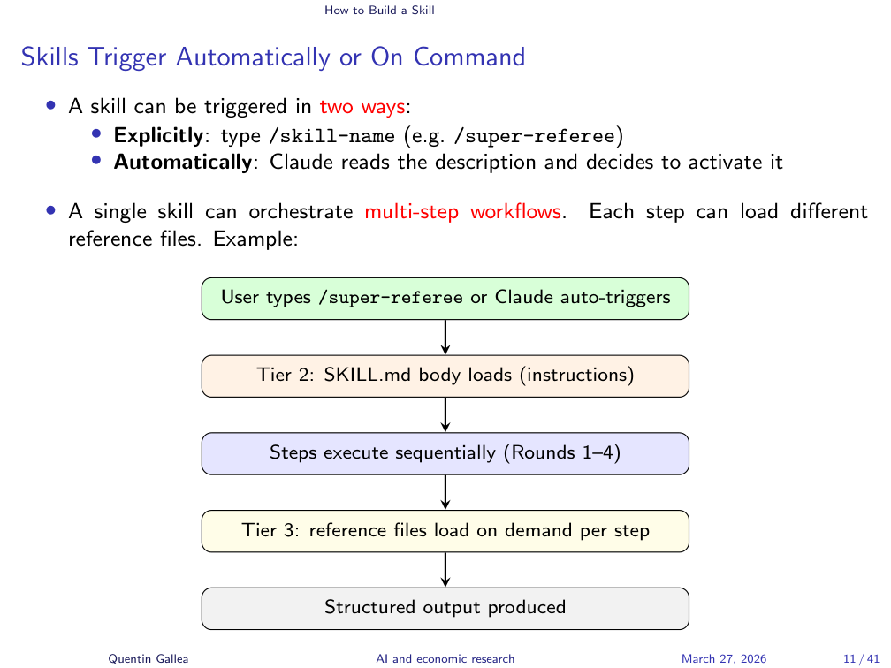{.slide-image fig-align="center" width="85%"}

There are two ways to trigger a skill. You can call it explicitly with a **slash command** (e.g., `/super-referee`), or Claude can trigger it **automatically** based on the description and trigger words in the front matter.

The instructor demonstrated this live with the `/super-referee-light` skill in Claude.ai, showing the SKILL.md code view with the front matter description: "Use this skill whenever the user uploads an academic paper and asks for a referee report, peer review, detailed critique, methodological audit..." along with specific trigger phrases.

For automatic triggering, you need a clear description of when the skill should activate. When you upload a paper and say "let's referee this," Claude reads the descriptions of all enabled skills, identifies a match, and loads the appropriate one. You can see this reasoning in the thinking phase.

The body of the skill then contains the actual instructions: core philosophy, rules, input phases, review rounds, output format -- whatever structure your task requires. The instructor scrolled through the super-referee skill showing sections for core philosophy, budget, rules, a four-round review pipeline, and the final report format.

## Writing Effective Skill Instructions

Knowing the structure is one thing; writing instructions that actually produce consistent, high-quality results is where the craft lies.

### Writing Good Instructions

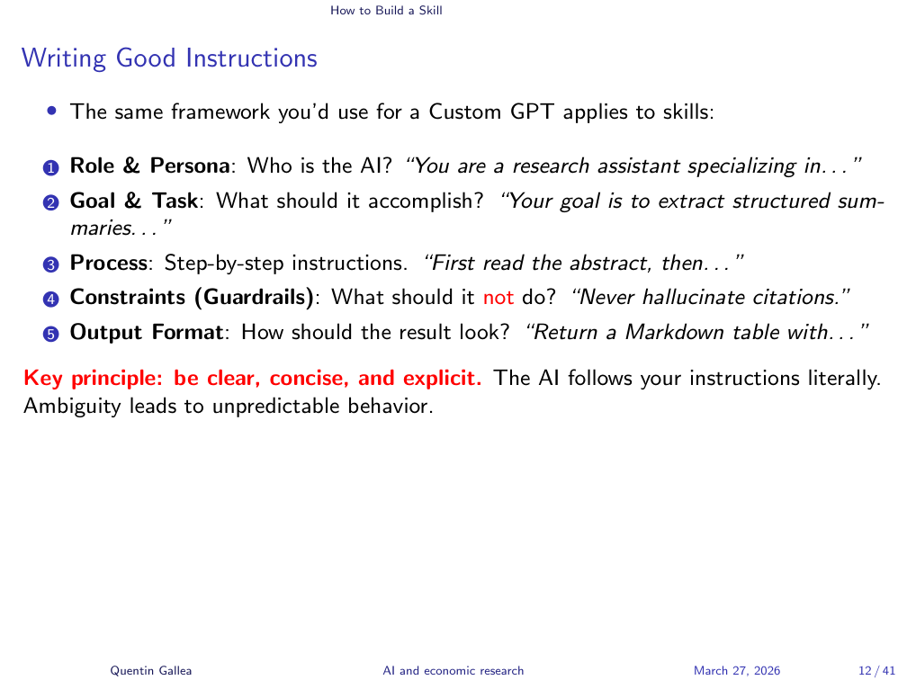{.slide-image fig-align="center" width="85%"}

You prepare a skill in advance for tasks you expect to reuse. But always connect back to the core question: is this something worth automating or augmenting? Is it about process or outcome? What do you gain, and what do you lose?

Skills can apply to virtually anything you do with an LLM -- not just research. As a concrete example, the instructor built a skill called **/quentinize** to fix a universal annoyance: the generic, "AIish" tone of LLM writing. Em dashes everywhere, "not X but Y" structures, corporate buzzwords. The `/quentinize` skill encodes Quentin's personal writing style -- based on his book *The Causal Mindset* -- so any text can be rewritten in his voice.

The instructor then demonstrated a broader content pipeline: he takes claims from social media, feeds them to a skill that matches them against a curated list of causal reasoning concepts from his book, generates a draft analysis, and pushes structured content (Instagram post, LinkedIn post, video transcript) directly to Notion using connectors.

An important design choice came up in the Q&A: should you give the LLM your entire book as a reference file? No. A 250-page book would flood the context window. What works better is a **curated summary file** -- a condensed Markdown file with key concepts and cues. Claude is remarkably good at taking brief cues and applying them correctly. This is far more efficient than loading the full source material.

---

### The Golden Rule: Keep Your SKILL.md Lean

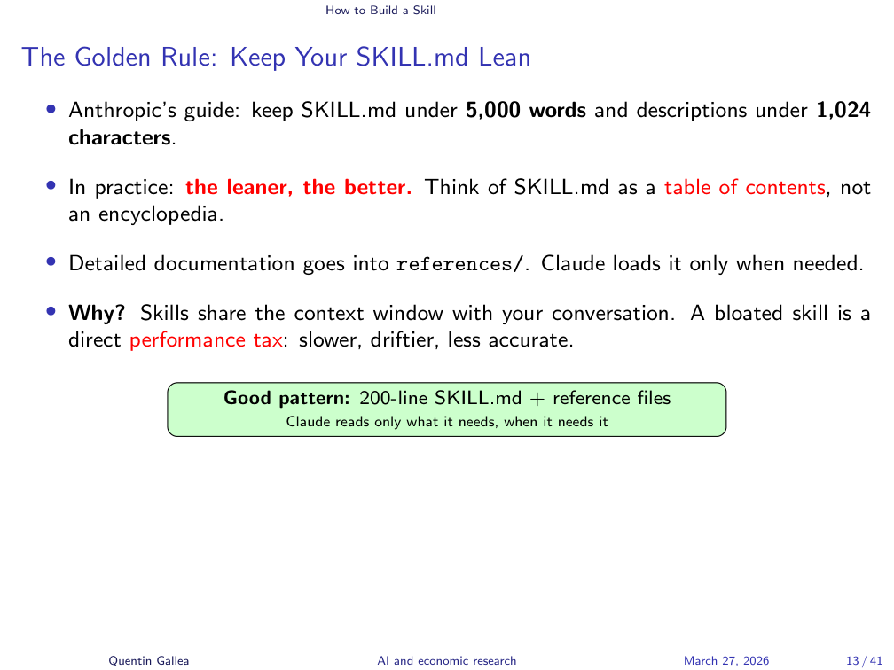{.slide-image fig-align="center" width="85%"}

To recap the structure: a skill is a text file (`SKILL.md`) inside a named folder. It triggers via slash command or automatic detection. But the golden rule is: **keep it lean**.

A powerful tool for building skills is Claude's own **Skill Creator** -- a built-in skill that generates skills. The instructor demonstrated starting a new skill by typing "let's create a skill to help me read scientific papers," which triggered the skill creator's guided question flow. Let the Skill Creator generate your front matter -- it knows the formatting rules and character limits.

Practical guidelines: the front matter description should be under **1,024 characters**, with no XML. The main `SKILL.md` body should ideally stay **under 200 lines**. Anything beyond that belongs in reference files that can be loaded and unloaded as needed. This keeps your context window clean and your skill performant.

---

### Writing Trigger Descriptions

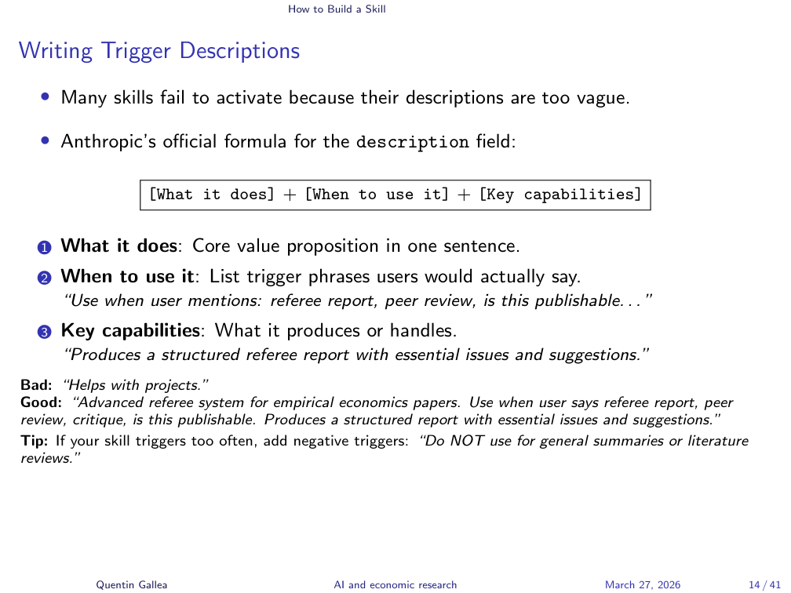{.slide-image fig-align="center" width="85%"}

Testing whether your triggers work correctly is important. Most of the time, well-written triggers activate reliably. But if a skill loads too often -- firing on tasks where it is not needed -- you can include **negative triggers**. For example: "Do NOT use for general summaries or literature review." This keeps the skill focused on its intended use case.

---

### Technical Rules You Must Follow

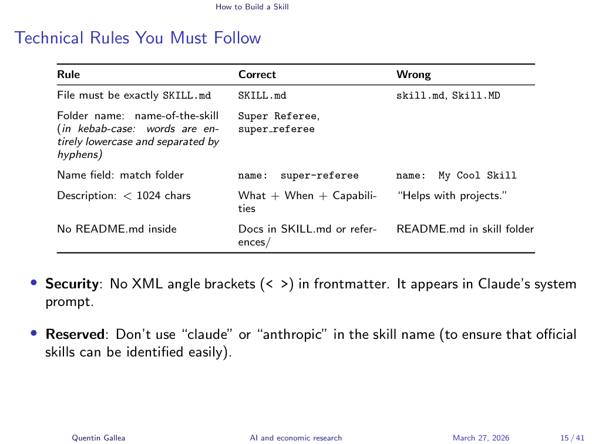{.slide-image fig-align="center" width="85%"}

If you use the Skill Creator, these rules are followed automatically. But it helps to know them:

- The folder name must use **kebab-case** (lowercase with hyphens, e.g., `super-referee-light`). This name *is* the skill name.
- Inside the folder, the main file must be called `SKILL.md` (uppercase).
- The `name` field in the YAML front matter must match the folder name exactly.
- Avoid using "claude" or "anthropic" in skill names -- these are reserved.

---

### Asking Inputs from the User

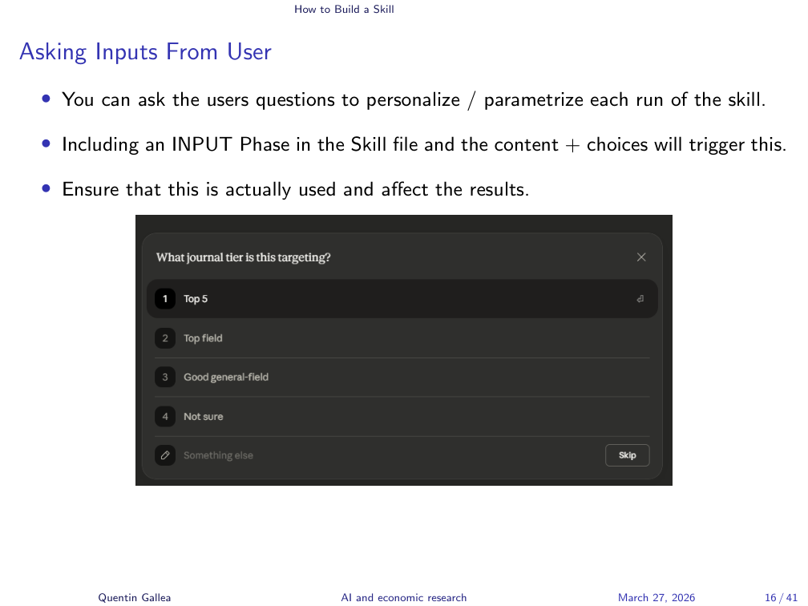{.slide-image fig-align="center" width="85%"}

One powerful feature: you can configure a skill to **ask the user questions** before running, personalizing each execution. In the super-referee skill, the first question is: "What is the target journal tier?" This matters because you evaluate a paper differently for a top-five journal versus a third-tier outlet.

The instructor showed the input phase section of the super-referee-light skill, where multiple inputs are defined with their options. The key is that you must also specify later in the skill *how* to use each input -- collecting it is not enough; the instructions must reference it in the relevant steps.

---

### The Skill Creator: Let Claude Build Your Skill

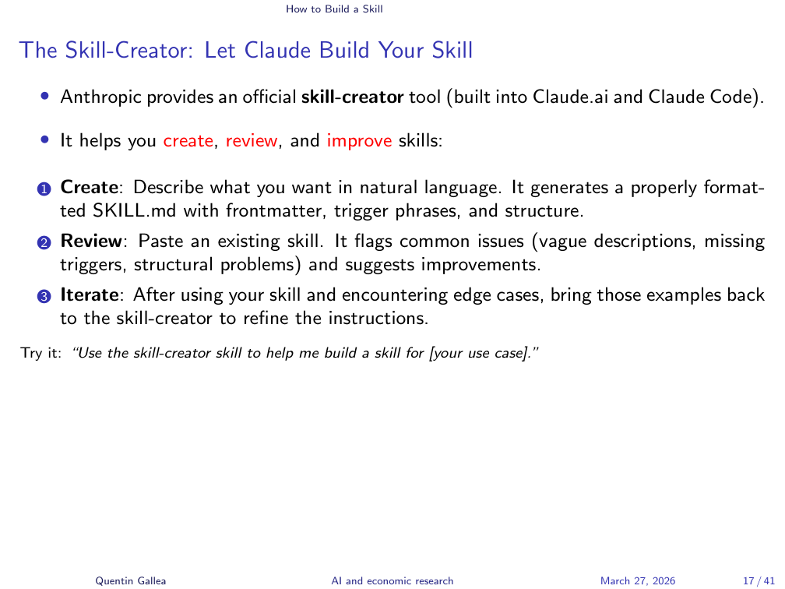{.slide-image fig-align="center" width="85%"}

The **Skill Creator** is not just for building the first version. It is also useful for optimizing and evaluating existing skills. More on evaluation shortly.

## Sharing and Installing Skills

Once you have built a skill, the natural next question is: can I share it? And can I use what others have built?

### Skills Are Just Folders: Share Them Like Files

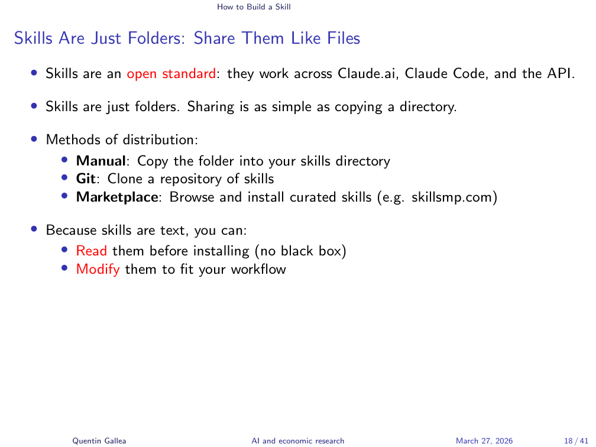{.slide-image fig-align="center" width="85%"}

Because skills are just folders, there is a thriving ecosystem for sharing them. **skillsmp.com** is a marketplace with over a million community-built skills. The instructor browsed the site, filtering by the "Research" category and sorting by popularity -- showing skills downloaded hundreds, thousands, or even 100,000 times.

Everything is on GitHub, so you can read the full skill file before installing. Now that you understand the structure -- front matter, body, references -- you can evaluate any skill's quality just by reading it.

---

### Installing a Skill on Claude.ai

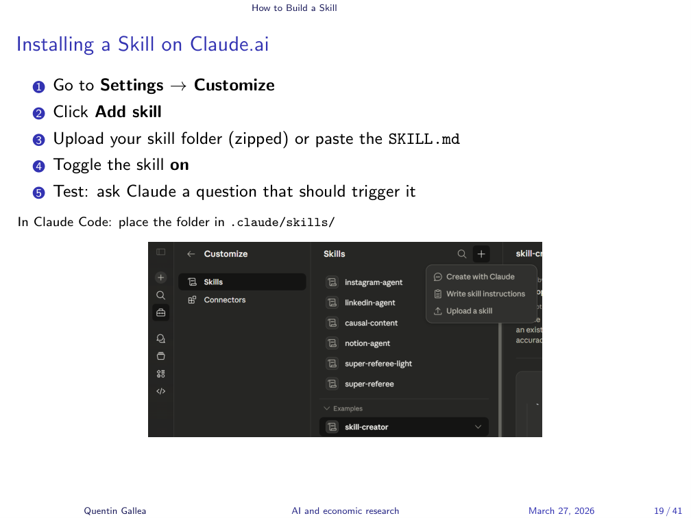{.slide-image fig-align="center" width="85%"}

Installing a skill is straightforward. On skillsmp.com, you can either click "Copy to your skills" (which adds it directly to your Claude.ai skill list under Customize > Skills) or download it as a `.skill` file and upload it manually via the "+" button.

One quirk: the `.skill` file format is actually just a **zip archive**. If you want to inspect its contents, rename the extension from `.skill` to `.zip` and extract it. Inside you will find the familiar folder structure: `SKILL.md`, subfolders with references, and so on.

## Examples: From Simple to Advanced

The best way to understand skill design is to see it in action. The following three examples span the complexity spectrum -- from a 10-minute writing tool to a fully autonomous research pipeline.

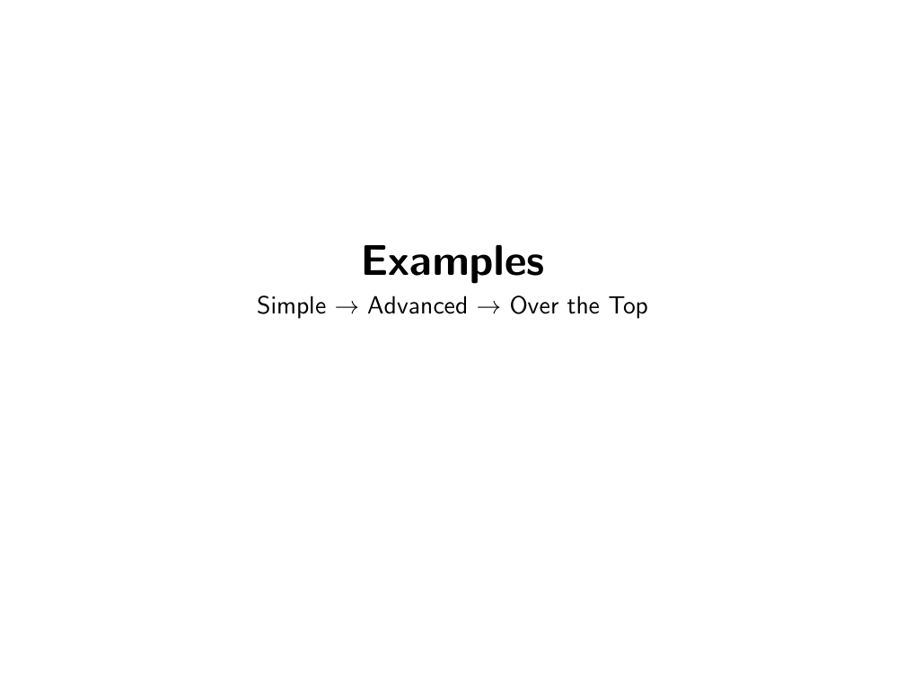{.slide-image fig-align="center" width="85%"}

---

### Simple: The /quentinize Skill

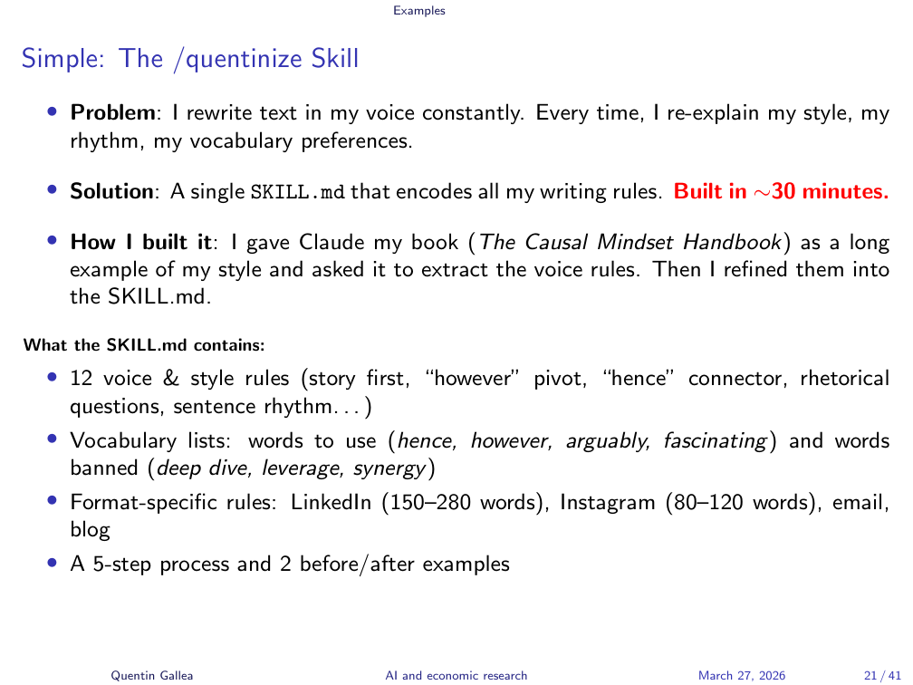{.slide-image fig-align="center" width="85%"}

The **/quentinize** skill is a simple example -- something you could build in 10 minutes. The instructor could not easily articulate his own writing rules explicitly, so he gave Claude his entire book and asked it to extract the patterns. The result captures his style: story first, concept second; rhetorical questions; personal stakes; words he favors ("however," "hence"); and strict bans (no em dashes, no "not X but Y" structures, no corporate jargon like "deep dive," "leverage," "synergy").

After the first version, the instructor iterated. For instance, the skill initially produced only one rewrite; he updated it to generate multiple variants. This kind of iterative refinement is central to building good skills.

---

### The /quentinize Process

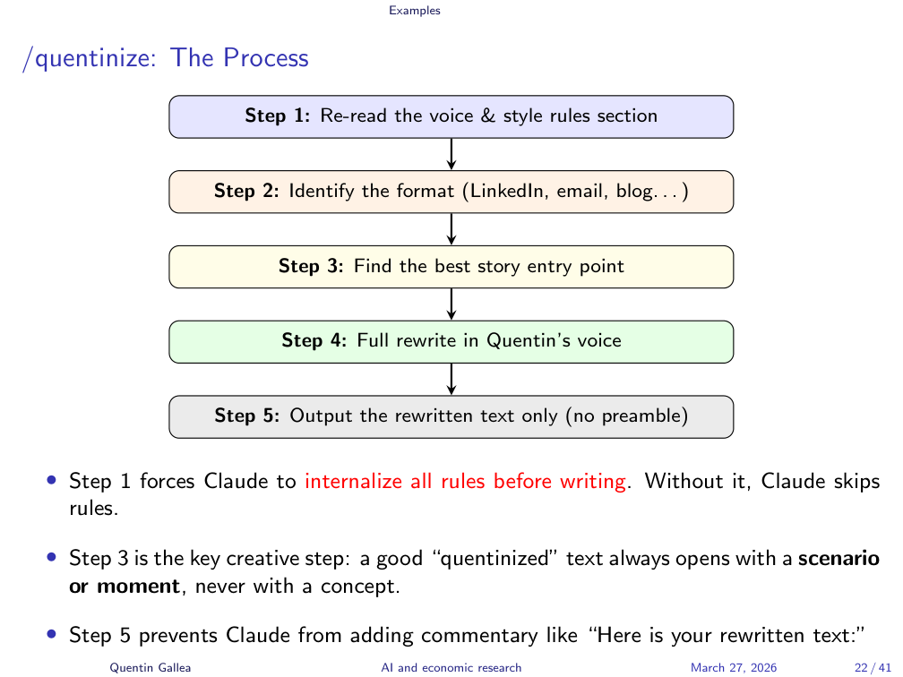{.slide-image fig-align="center" width="85%"}

The process follows five steps: re-read the style rules, identify the format, find the story entry point, do a full rewrite, and output only the result. This was demonstrated live rather than narrated step-by-step.

---

### Before and After

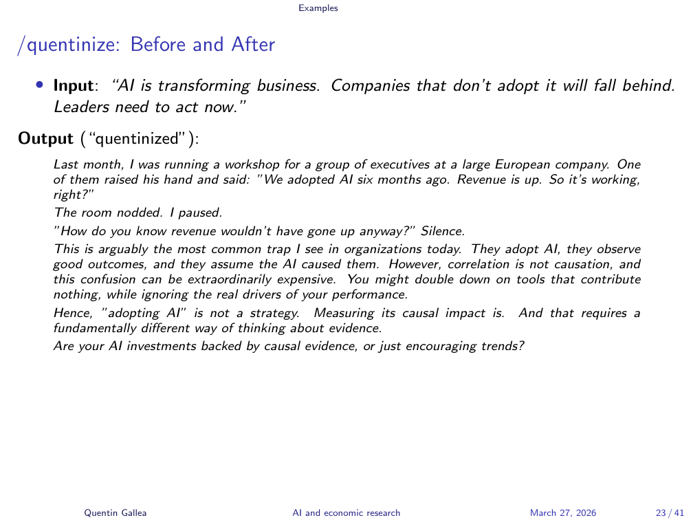{.slide-image fig-align="center" width="85%"}

The instructor demonstrated a before/after comparison. Input: "AI is transforming business. Companies that don't adopt it will fall behind. Leaders need to act now." Output: a story-driven rewrite starting with "Every week I talk to senior leaders. Last month I was running a workshop for a group of executives..."

The rewrite is not perfect -- scanning it with **GPT-0** (GPTZero), an AI detection tool, it is still flagged as partially AI-generated (around 39% human vs. 92% for raw AI text). But that is the point: the skill produces a **structured draft** that sounds closer to the instructor's voice, which he then edits further. It is a starting point, not a finished product.

The instructor noted that he has never actually used the skill's output for any online post -- he prefers to write spontaneously and authentically. His own posts are never flagged as AI-generated. The skill is a drafting aid, not a replacement for genuine writing.

A student asked whether you need to feed the skill your entire expertise. The answer: Claude already has broad knowledge, and if you have enabled **memory across chats**, it accumulates personal context over time (work projects, teaching, preferences). This is a personal choice with trade-offs -- you are sharing significant information with the platform. But combined with a well-designed skill, it means you rarely need to re-explain your background.

---

### Advanced: The /super-referee Skill

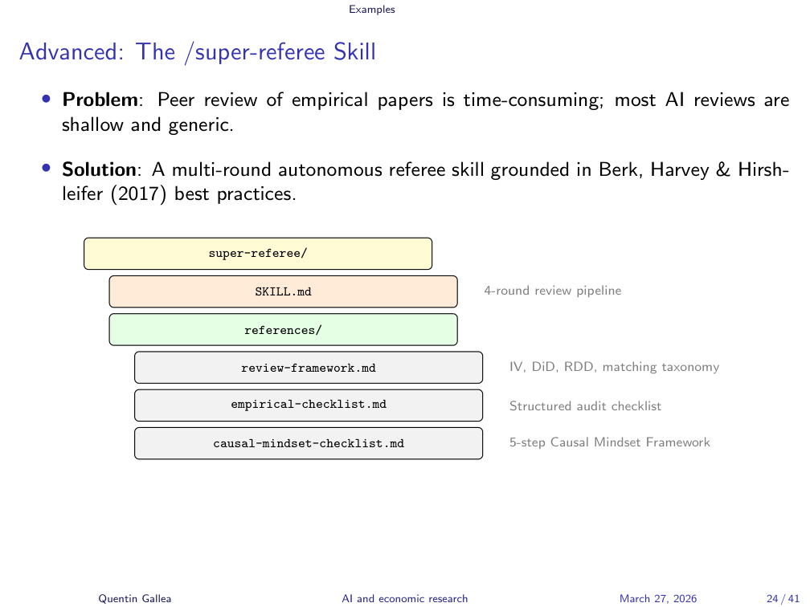{.slide-image fig-align="center" width="85%"}

The **/super-referee** skill represents the level expected for the midterm. It is a structured, multi-round tool for generating academic referee reports.

Why build this as a skill? Peer reviewing is time-consuming, benefits from a consistent structure, and is a task done repeatedly. Sometimes you need it to help get started or support your thinking when you are busy. And importantly, a human referee brings personal biases and sometimes gets lazy -- having an AI co-reviewer can catch things you might miss.

Notice the reasoning here: the instructor explicitly argued *why* AI is appropriate for this task, connecting back to the course's core framework -- when to use AI, when not to, and making it a conscious decision.

---

### The 4-Round Pipeline

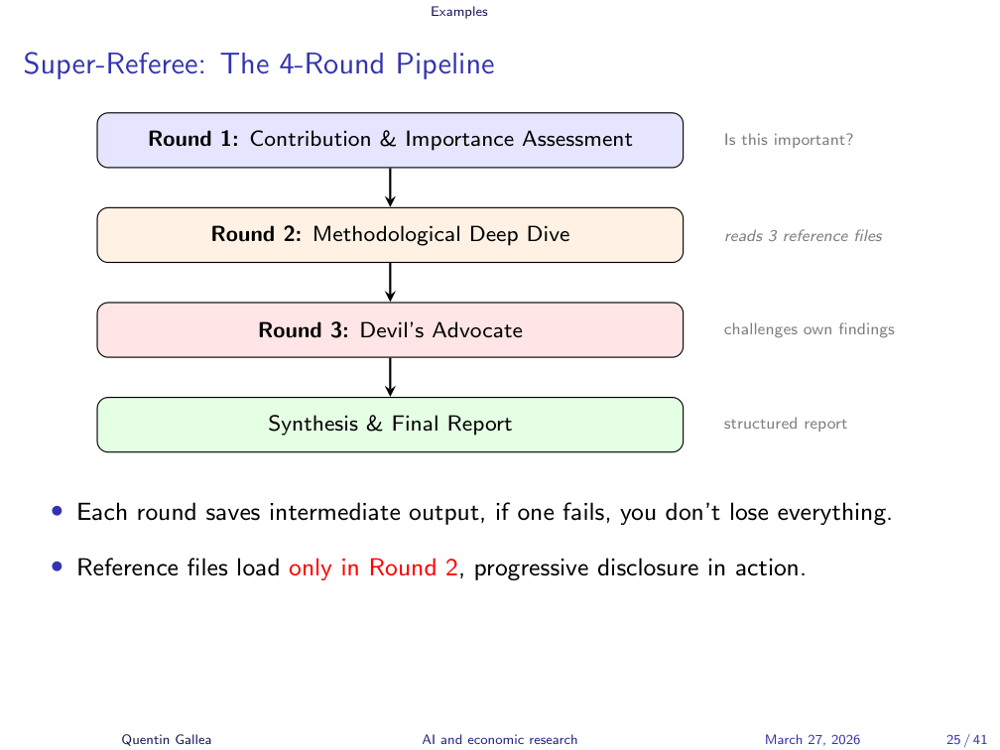{.slide-image fig-align="center" width="85%"}

The super-referee runs a **four-round review pipeline**, grounded in Berk, Harvey & Hirshleifer's (2017) paper *"How to Write an Effective Referee Report and Improve the Scientific Review Process"* (Journal of Economic Perspectives). This is important: the skill is not built on vibes -- it replicates a trusted, published methodology.

The reference files are personalized and domain-specific. For example, there is a review framework for **difference-in-differences** methodology based on the practitioner guide that the instructor frequently cites. Another reference draws on concepts from *The Causal Mindset* for challenging causal claims in non-technical terms. These references do not contain the full papers -- they are curated structures *based on* those papers, which is more efficient.

The four rounds work as follows: Round 1 assesses importance and fit ("Is this paper worth publishing? Would I be proud to have written it?"). Rounds 2 and 3 handle the technical deep dive using the methodology-specific reference files. Round 4 is a self-challenge round -- crucial for LLMs, which tend to be overly accommodating. Left unchecked, the model will inflate minor comments to justify a "revise and resubmit" verdict. This round forces it to ask: "Are my critiques actually substantive, or am I nitpicking to seem thorough?"

---

### Philosophy as Constraints

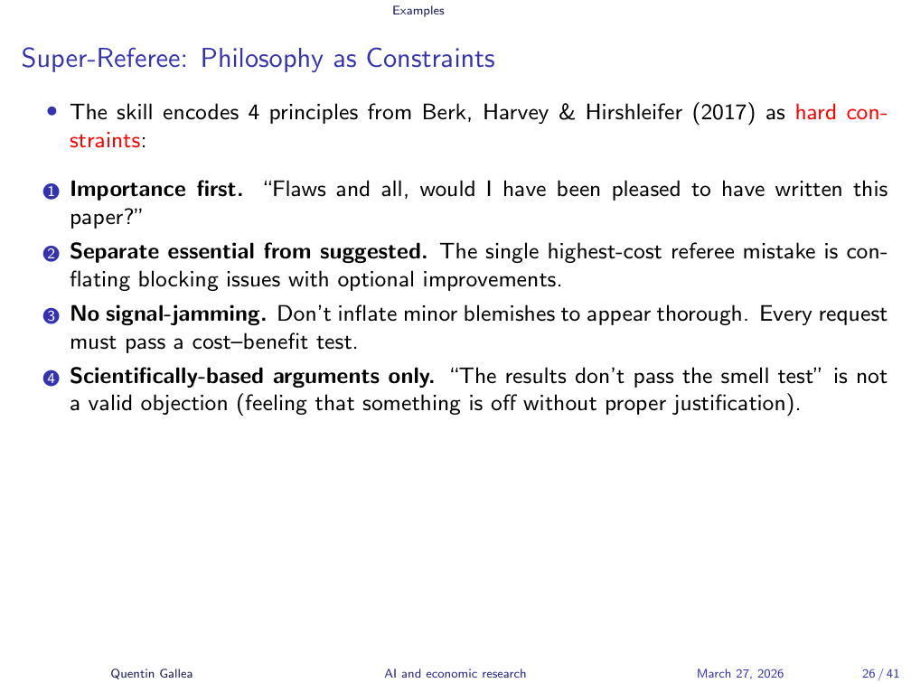{.slide-image fig-align="center" width="85%"}

The "light" version of the super-referee was created by optimizing the original, heavier skill -- reducing length while maintaining (or even improving) output quality. It uses **progressive disclosure** properly: the main `SKILL.md` stays short, and reference files load and unload as needed, keeping the context window clean.

---

### Progressive Disclosure in Practice

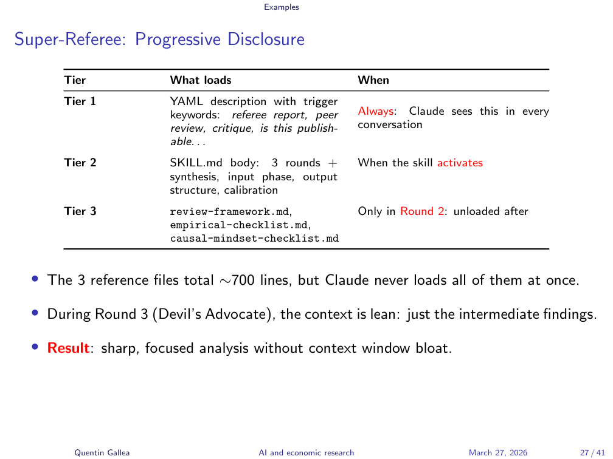{.slide-image fig-align="center" width="85%"}

To summarize the skill complexity ladder: the `/quentinize` skill is a simple example -- one file, straightforward rules. The `/super-referee` is closer to midterm expectations: multiple rounds, reference files, user inputs for personalization, and documented iterations showing how the skill evolved through testing. You do not *have* to include user inputs for the midterm, but they are a great way to make each run context-appropriate.

---

### Full Pipeline Example: RECAST

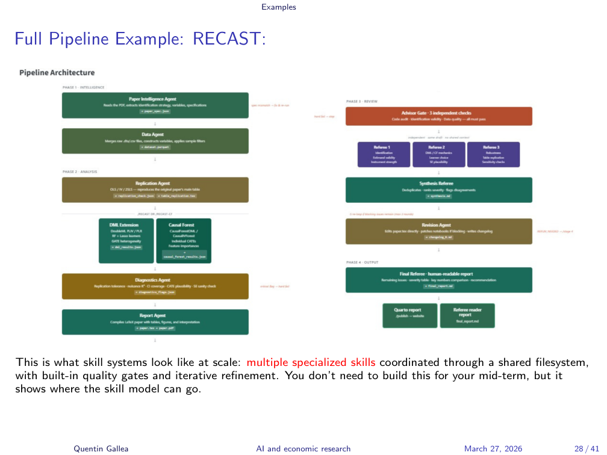{.slide-image fig-align="center" width="85%"}

To show how far you can push this, the instructor demonstrated **RECAST** (Replication Extension with Causal Statistical Toolkit) -- a full pipeline that takes a published paper, automatically replicates its analysis, then applies modern causal inference methods (double machine learning, causal forests) as extensions. The instructor noted that this is still a work in progress -- he was not yet fully satisfied with the results.

The instructor showed the RECAST platform, built entirely with Claude Code. The workflow: one slash command triggers hours of autonomous work -- data extraction, replication verification, methodology extension, and then three independent AI referee rounds with synthesis and revision loops. The system iterates up to three times until the analysis is accepted or rejected by its own referees.

As a concrete result, the instructor showed a replication of "Out of Africa: Genetic Diversity and Economic Development" using causal forests -- with replication accuracy within less than 1% of the original paper's results, followed by complete referee rounds with discussion.

This is next-level work requiring Claude Code (covered in the final session), but it illustrates where skills can go when composed into multi-agent pipelines.

## Leveling Up: Evaluation and Optimization

Building a skill is only the first step. The real craft lies in measuring whether your skill actually works -- and making it better without making it bigger.

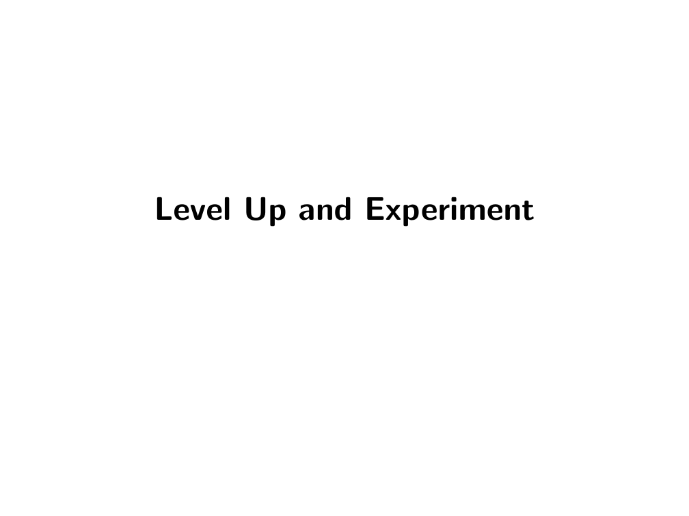{.slide-image fig-align="center" width="85%"}

---

### The Skill Maturity Ladder

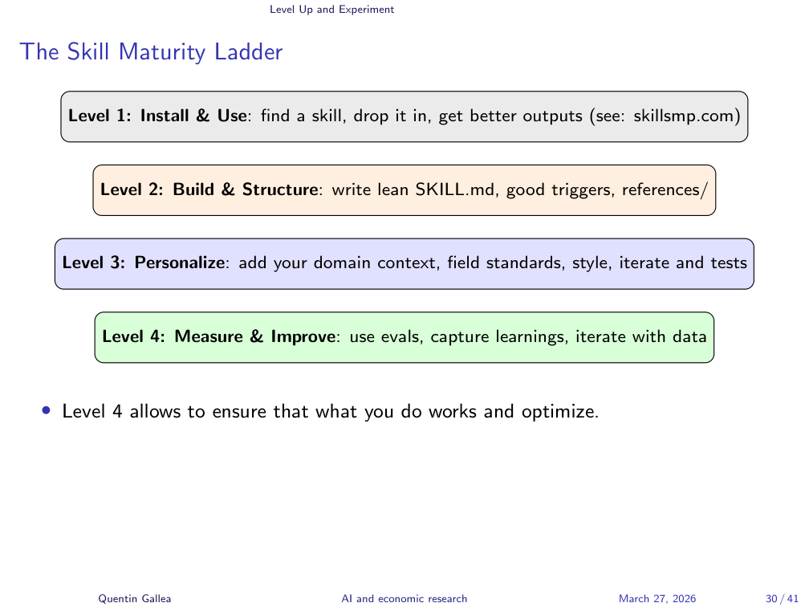{.slide-image fig-align="center" width="85%"}

Building good skills follows a natural progression:

**Level 1: Discover.** Browse existing skills online (e.g., skillsmp.com), download them, study the structure, try to apply them, and think about how you would improve them. Start with what exists.

**Level 2: Create.** Use the Skill Creator to build your own skill. This gets you a solid first version with proper formatting.

**Level 3: Refine.** Go beyond the basic `SKILL.md` -- add user inputs, reference files, specific context. Optimize for length and precision.

**Level 4: Evaluate.** This is where the real difference lies. You can always tweak a skill and *feel* like it improved, but you do not actually know unless you test systematically. A/B testing and structured evaluation are what separate a good skill from a great one.

---

### Personalizing Skills for Research

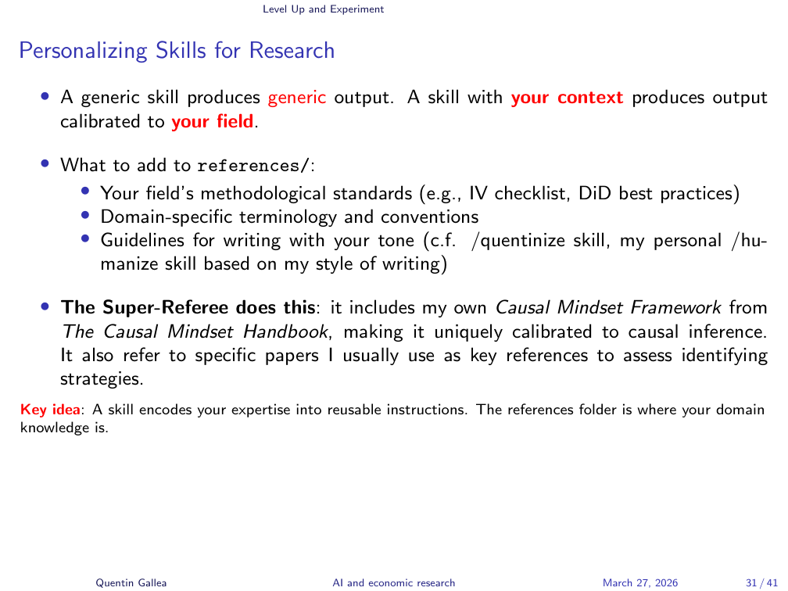{.slide-image fig-align="center" width="85%"}

The super-referee is effective precisely because it is personalized. Simply asking Claude (even with deep thinking or deep research mode) to "referee this paper" would not follow the specific methodology, the specific frameworks, or the specific evaluation standards that the instructor has built into the skill. Personalization is what makes a skill more valuable than a one-off prompt.

---

### Evaluating and Improving Skills

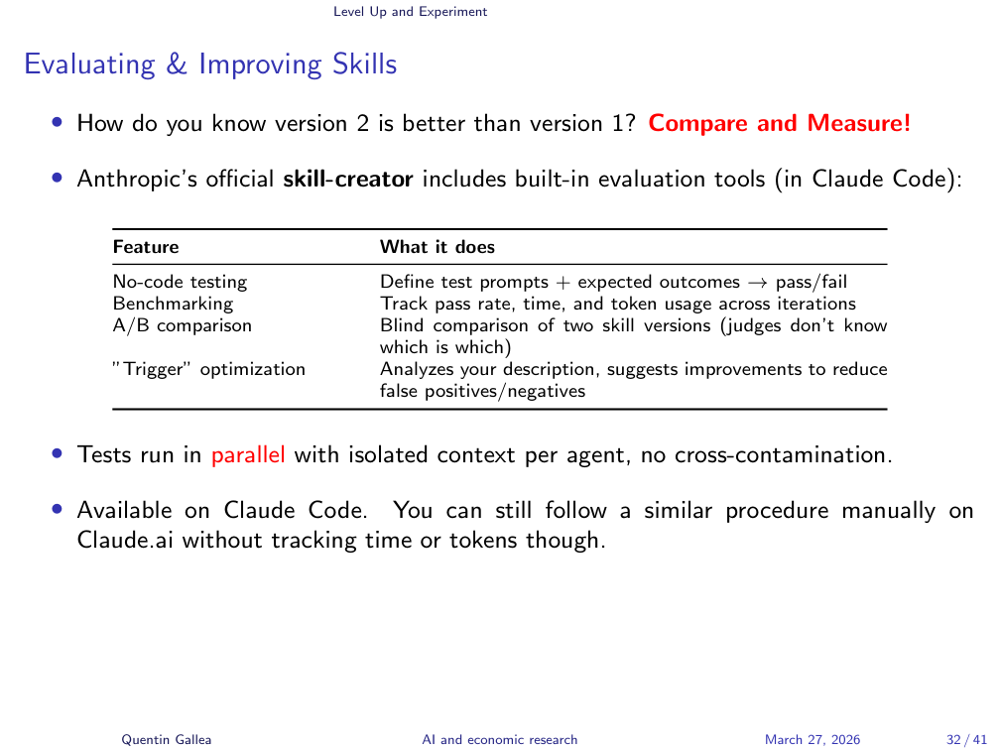{.slide-image fig-align="center" width="85%"}

Here is where it gets powerful. The Skill Creator includes a built-in **evaluation tool**. You can take two versions of a skill (e.g., the full super-referee vs. the light version), define evaluation criteria, and run structured comparisons.

The instructor demonstrated launching an evaluation within Claude Code, comparing two skill versions on defined criteria.

---

### A/B Testing in Practice: Full vs. Light

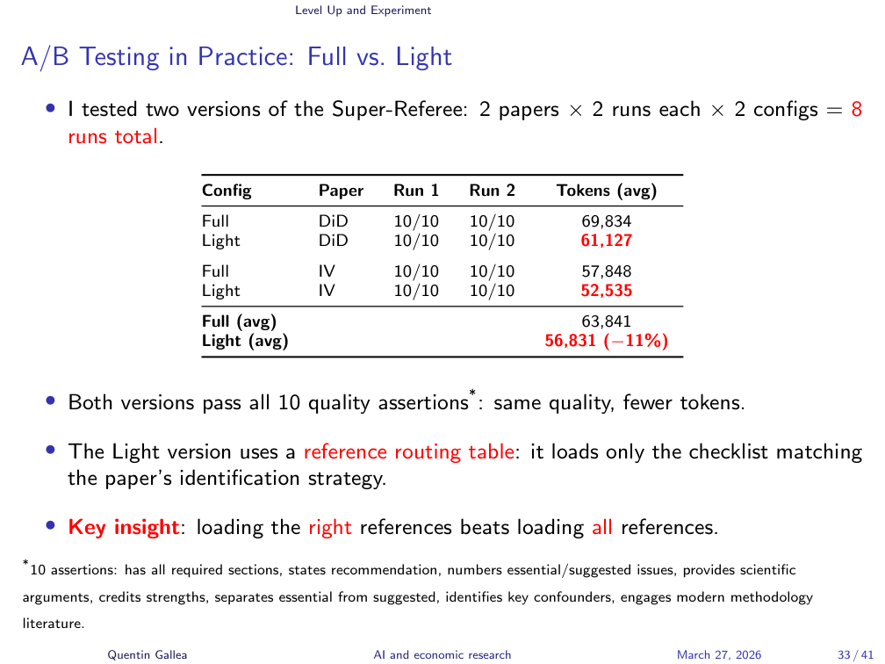{.slide-image fig-align="center" width="85%"}

The instructor ran a small **A/B test**: two papers, each refereed twice by both the full and light versions of the super-referee skill (8 test runs total). A benchmark evaluation tool compared the outputs across 10 predefined criteria.

Results: the full version took about 10 seconds longer and consumed roughly 7,000 more tokens (a token is approximately 0.75 words). But on all 10 quality criteria, both versions performed identically. On some more nuanced benchmarks, the light version actually scored *better*.

The secret to making it lighter: a **reference routing table**. Instead of loading entire reference files, the skill specifies which *sections* to load based on the paper's methodology. Reviewing a difference-in-differences paper? It loads only the DiD review framework, not the instrumental variables section. This means you can have rich, detailed references without paying the context window cost for irrelevant portions.

## Mid-Term Evaluation

With the technical foundations covered, let us turn to what you need to deliver.

{.slide-image fig-align="center" width="85%"}

---

### Mid-Term Evaluation (20% of Final Grade)

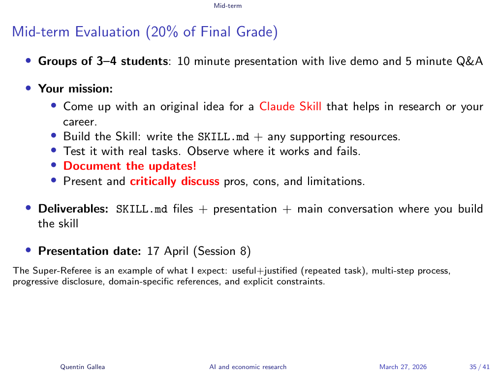{.slide-image fig-align="center" width="85%"}

The midterm is in three weeks (April 17). Next week is a public holiday -- students will watch a pre-recorded video on brainstorming and creativity with GenAI.

The midterm assignment: work in **groups of 3--4** to build a Claude skill and deliver a **10-minute presentation** (plus 5 minutes for questions). The skill should address a meaningful, repeatable task, built using the techniques covered in class.

**What to submit:**

- Presentation slides (any format)
- The `SKILL.md` file and all subfolders
- The link to your main Claude conversation(s) where you built the skill

The conversation log is critical. The instructor wants to see the **process**: How did you iterate? What limitations did you encounter? How did you react? The evaluation is not just about the final output -- it is about demonstrating critical thinking throughout the development process.

---

### Evaluation Criteria

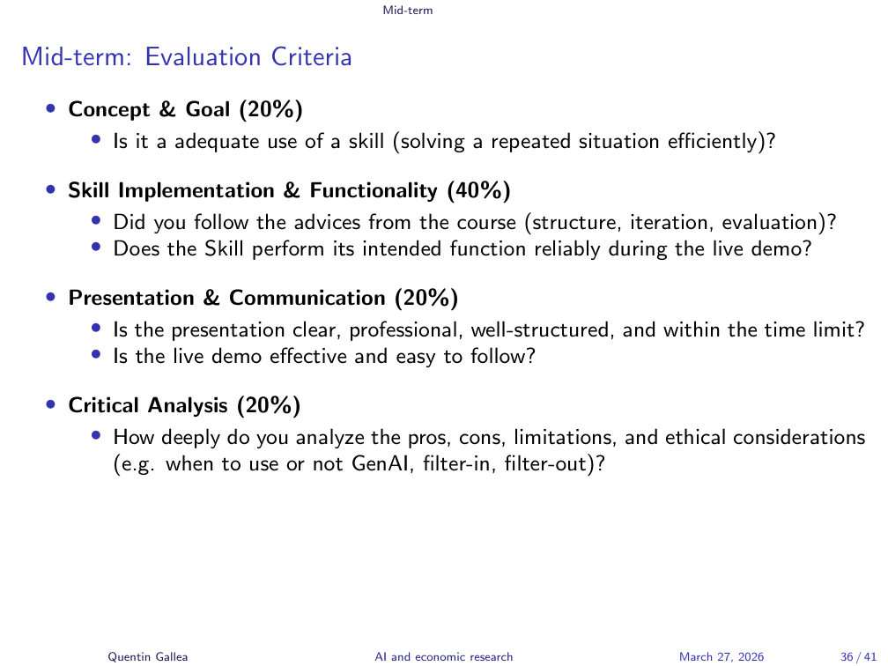{.slide-image fig-align="center" width="85%"}

Evaluation covers four areas: the **concept and goal** (is there a clear reason for this skill?), **technical implementation** (does it use the features covered in class -- inputs, references, optimization?), **does it actually work**, and **critical analysis** (what are the risks, limitations, and trade-offs of using AI for this task?).

The super-referee is a good benchmark for what is expected: user inputs, reference files, personalization, documented iterations from a simple starting point.

---

### Presentation Structure

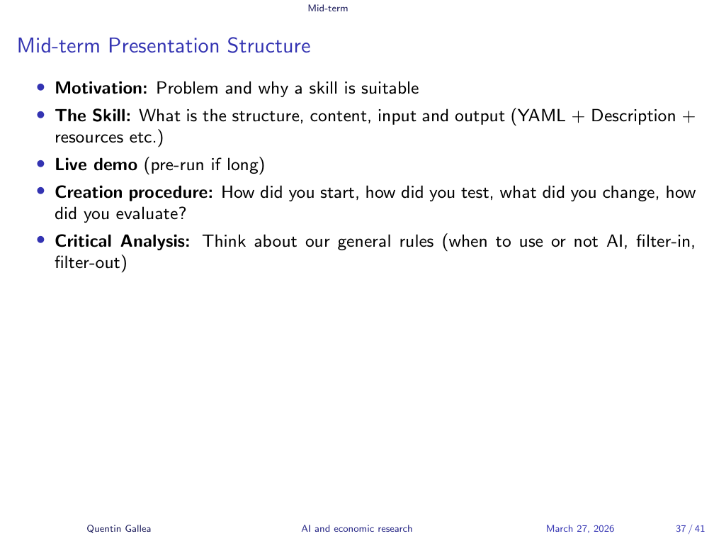{.slide-image fig-align="center" width="85%"}

Recommended presentation structure:

1. **Motivate** -- Why this skill? What problem does it solve?
2. **Present the skill** -- Structure, content, inputs, expected output.
3. **Live demo** -- Run it in real time if possible. If the skill takes too long, prepare a conversation from earlier that morning. Do not cherry-pick your best output -- authenticity matters.
4. **Development process** -- Show how you iterated. Version 1 had this problem, so you changed that. This is where you demonstrate learning.
5. **Critical analysis** -- Question the use of AI for this task. Pros, cons, risks, limitations.

A student asked whether the skill must be connected to research. Ideally yes, but the instructor accepts skills related to studying and academic work more broadly. The key is that it should be something genuinely useful and repeatable.

Another student asked about overlap with existing skills on skillsmp.com. This is not a concern -- the marketplace has thousands of skills in the research category. The evaluation focuses on the *process* and critical thinking, not just the output. Downloading an existing skill and submitting it would be obvious from the conversation logs.

## Closing and Next Steps

{.slide-image fig-align="center" width="85%"}

---

### In-Class Activity

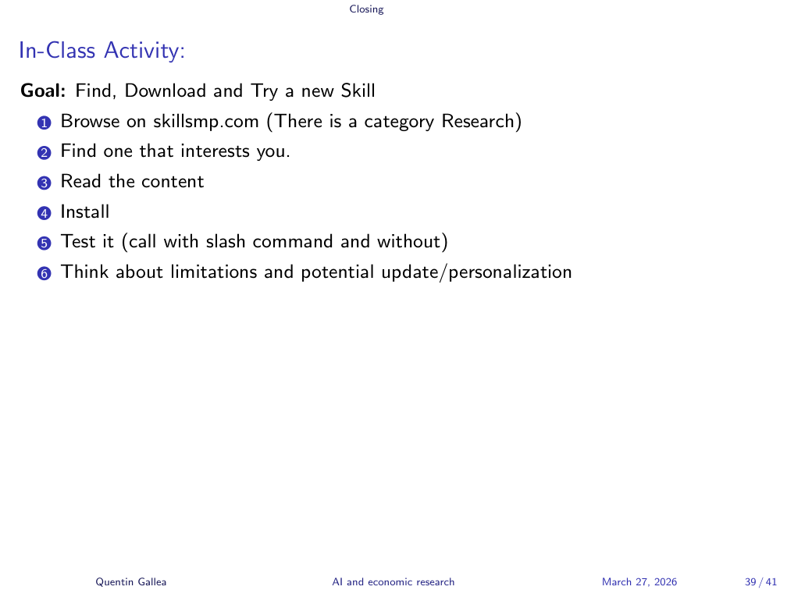{.slide-image fig-align="center" width="85%"}

For the remaining class time, the instructor recommended a structured exploration exercise before starting the midterm project:

1. **Browse** skillsmp.com -- spend time seeing what exists, especially in the Research category. Look for popular skills with good ratings (stars indicate user satisfaction, not downloads).
2. **Pick one** that looks useful. Read the entire `SKILL.md` and reference files to understand the structure.
3. **Install it** in Claude.ai and test it. Does it trigger correctly? Do you need to call it explicitly or does it activate automatically?
4. **Note limitations** -- what would you do differently?

This is Level 1 on the skill maturity ladder. Once you have a feel for how existing skills work, you are ready to start building your own for the midterm.

---

### Applying Our Guidelines

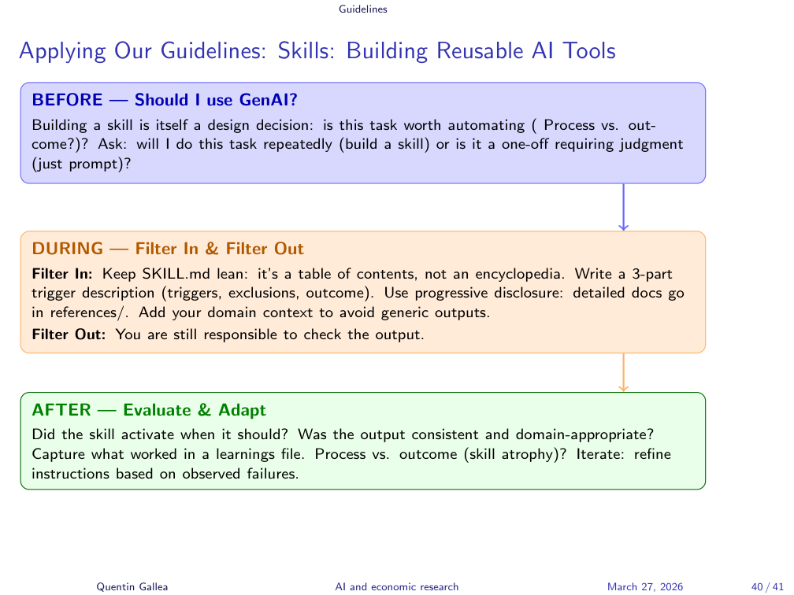{.slide-image fig-align="center" width="85%"}

---

### What's Next?

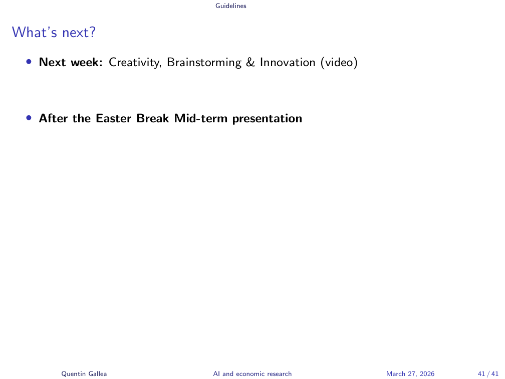{.slide-image fig-align="center" width="85%"}

Next week is a public holiday. The brainstorming and creativity session will be available as a shorter pre-recorded video -- the instructor wants students to focus their time on building their skills for the midterm. The next in-person class is in three weeks for the midterm presentations.

::: {.callout-tip}
## Key Takeaways
1. **Skills turn prompts into portable tools.** A skill is a Markdown text file in a folder -- platform-portable, version-controllable, and composable. Unlike Custom GPTs or Gems, you own the file and can use it anywhere.
2. **Keep it lean, load on demand.** The context window is your scarcest resource. A well-designed skill keeps the main `SKILL.md` short and uses reference files with progressive disclosure -- loading only what is needed for the current step.
3. **Evaluate, do not just iterate.** Anyone can tweak a skill and *feel* like it improved. Structured A/B testing with defined criteria is what separates a good skill from a great one. The light super-referee proved that shorter can be better -- faster, cheaper, and equally precise.
:::
