::: {.callout-note}
## Lecture Overview
Research is a deeply creative endeavor, from spotting the right question to crafting a convincing narrative. This session explores how GenAI fits into the creative process, where it helps, where it hurts, and how to alternate between divergent and convergent thinking to get the best out of both human intuition and AI capabilities.
:::

## Research, and Creativity

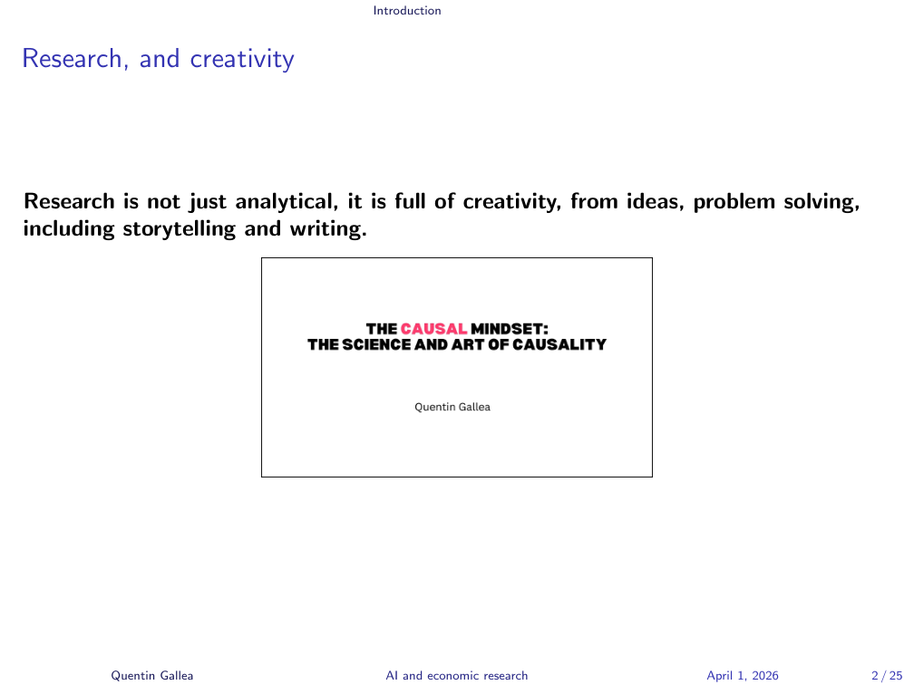{.slide-image fig-align="center" width="85%"}

When people think about research, especially in economics, they picture equations, regressions, and p-values. But here is the thing. Research is fundamentally a creative act.

Finding a good question requires seeing something no one else noticed. Building an identification strategy is a design problem. And writing a paper that convinces a skeptical referee? That is storytelling, plain and simple.

I experienced this firsthand writing *The Causal Mindset Handbook*. The book was as much about creative framing, finding the right analogy, the right opening, as it was about getting the econometrics right. The same applies when I prepare a TEDx talk or build course materials: the analytical backbone matters, but the creative wrapper is what makes people actually listen.

---

## Where Creativity Matters in Research

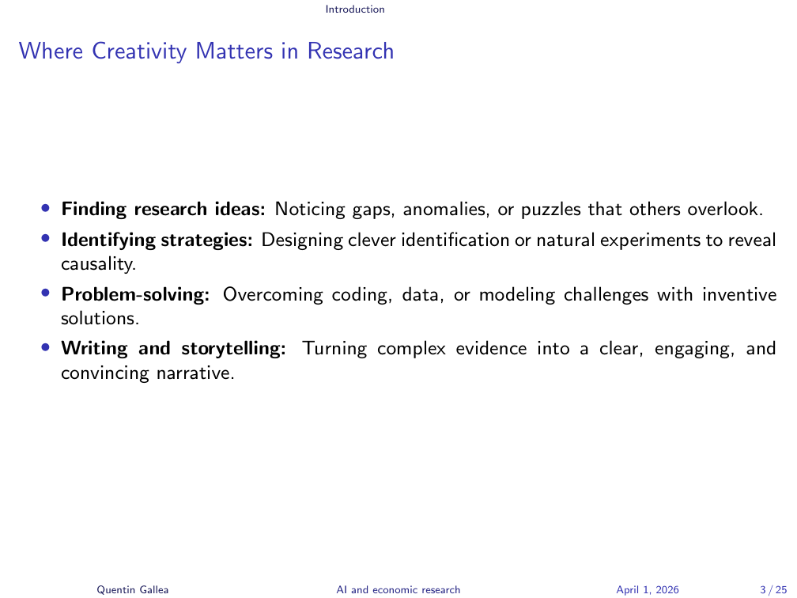{.slide-image fig-align="center" width="85%"}

Creativity shows up at every stage of the research pipeline. Let me illustrate.

**Finding research ideas.** The best papers do not come from scanning the literature for "gaps." They come from noticing something odd: an anomaly in the data, a contradiction between two established results, a real-world event that creates a natural experiment nobody has exploited yet.

**Identifying strategies.** This is where economics gets inventive. Think of the clever use of colonial settler mortality as an instrument (Acemoglu, Johnson & Robinson 2001), or using river directions to study trade routes (as in Nunn & Trefler 2010, one of the papers I am currently replicating in RECAST). These are not textbook moves. They require creative leaps.

**Problem-solving.** Anyone who has spent three days debugging econometrics code knows: research is full of moments where you need to pause and think deeply about alternative solutions.

**Writing and storytelling.** You can have the most rigorous causal estimate in the world. If you cannot explain why it matters in plain language, it will not have impact. This is also why I often start with intuition, big picture, key takeaway and then eventually use jargon or show the math.

---

## Where Ideas Happen

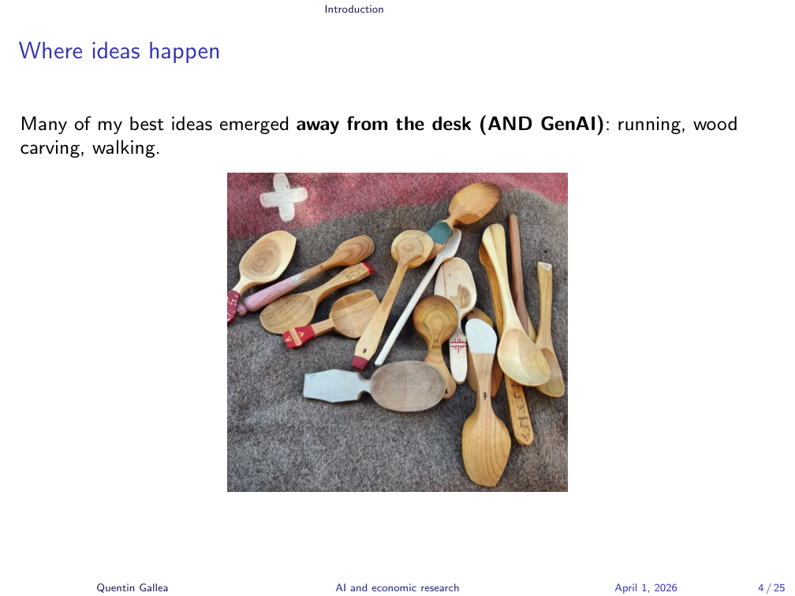{.slide-image fig-align="center" width="85%"}

Here is a truth that might feel counterintuitive in a course about GenAI: **many of my best ideas emerged away from the desk, and away from GenAI.** Running. Wood carving (c.f. picture). Walking.

There is solid neuroscience behind it. When you step away from focused work, your brain does not stop working on the problem. It just works differently.

Do you think that stepping away is wasting time? It is not. The shower insight, the idea that arrives while you are doing the dishes, these are real. And they are a feature of how your brain processes complex problems.

---

## Why Disconnecting Works: the Default Mode Network

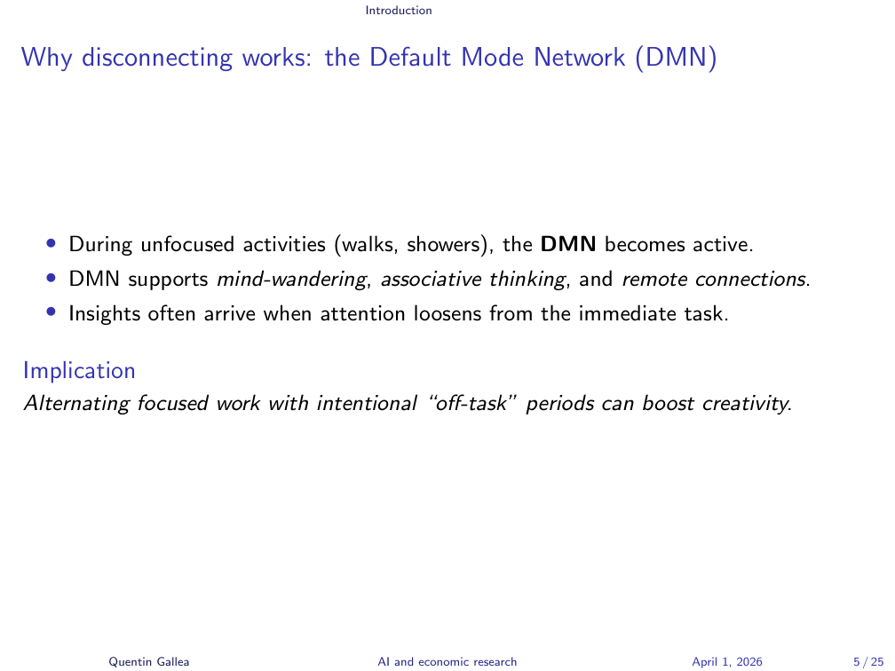{.slide-image fig-align="center" width="85%"}

The science behind those "shower insights" has a name: the **Default Mode Network (DMN)**. During unfocused activities (walks, showers, repetitive manual tasks), the DMN becomes active. It supports mind-wandering, associative thinking, and the kind of remote connections that produce breakthroughs.

This is why insights often arrive when your attention loosens from the immediate task. Your brain is making connections between ideas that would never meet during focused, linear thinking.

Hence, the practical takeaway is simple: if you have been stuck on a problem for an hour, the most productive thing you can do might be to go for a walk. Without your phone.

---

## Balancing Focus and Mental Space

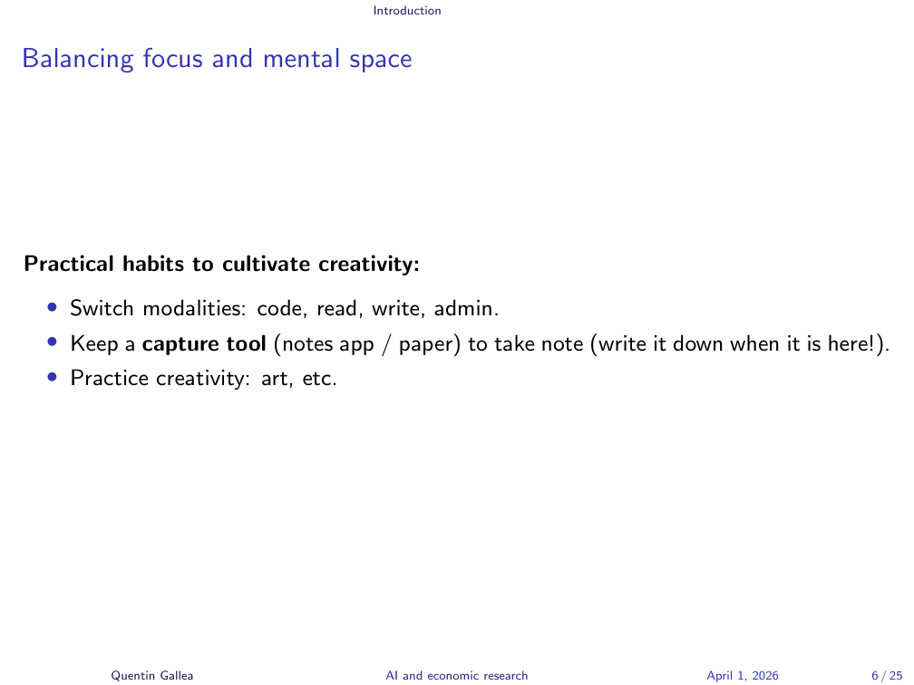{.slide-image fig-align="center" width="85%"}

So how do you cultivate this in practice? A few habits that work.

**Switch modalities.** Do not code for eight hours straight. Alternate: code for a while, then read a paper, then write a paragraph, then do some admin. Of course spending enough time on each part and not switching carelessly every hour. 

**Keep a capture tool.** When the idea arrives, and it will, at the worst possible moment, you need to write it down immediately. A notes app, a scrap of paper, a voice memo. The idea that seems unforgettable at 7am will be completely gone by lunch. I use this principle in my own workflow, which is why I built the `todo-capture` skill in Claude Code: frictionless capture, directly into Notion, so nothing gets lost.

**Practice creativity.** Art, music, cooking, carving. Anything that exercises creative muscles in a different domain transfers back to your research thinking.

---

## Two Modes of Creative Thinking

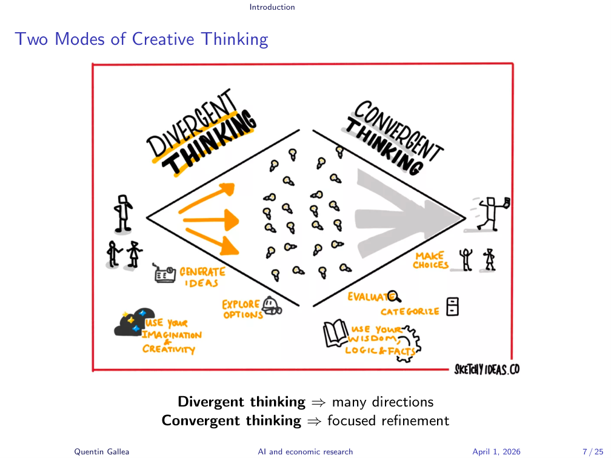{.slide-image fig-align="center" width="85%"}

All creative work oscillates between two complementary modes.

**Divergent thinking** is about generating as many ideas as possible, without judgment. It is the brainstorming phase: quantity over quality, weird combinations welcome, no idea is too crazy.

**Convergent thinking** is about narrowing down. You apply filters: Is this feasible? Is it original? Does it matter? You evaluate, categorize, and discard.

However, here is the catch. These two modes must be separated in time. If you start judging ideas while you are still generating them, you kill the divergent phase. The inner critic needs to wait its turn.

This framework, borrowed from creativity research (Guilford, 1967), applies beautifully to economics research. And it maps directly onto how we can use GenAI effectively.

---

## Divergent Thinking

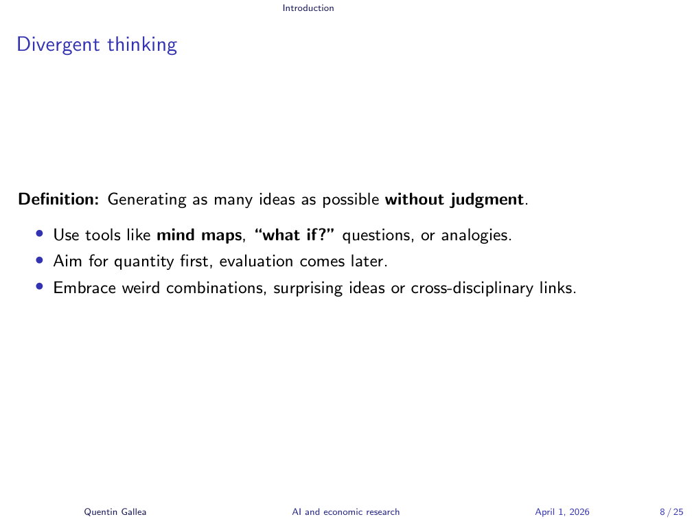{.slide-image fig-align="center" width="85%"}

Divergent thinking is about opening up the possibility space. The goal is to generate as many ideas as possible without filtering.

Use mind maps, "what if?" questions, or analogies from unrelated fields. Ask yourself: what would happen if the opposite of my hypothesis were true? What would a sociologist say about this? What would this look like in a different country, a different century?

The key principle: **aim for quantity first.** Evaluation comes later. Embrace weird combinations, surprising ideas, and cross-disciplinary links. The idea that sounds absurd at first might contain the seed of something novel.

In my experience training over 15,000 researchers and practitioners, the number one creativity killer is premature judgment. People discard their most interesting ideas because they sound "unrealistic" before they have even explored them properly. That is a mistake.

---

## Convergent Thinking

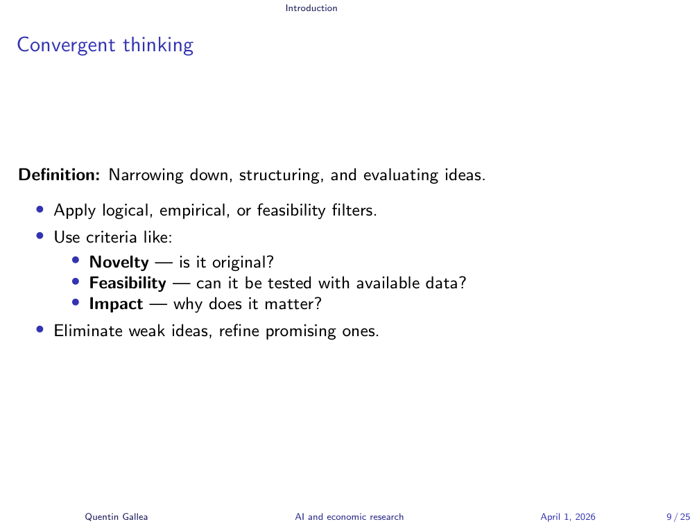{.slide-image fig-align="center" width="85%"}

Once you have a rich pool of ideas, it is time to switch modes. Convergent thinking means narrowing down, structuring, and evaluating.

Apply logical, empirical, or feasibility filters. For research ideas in economics, three criteria matter most.

**Novelty.** Is it original? Does it say something the literature has not said? This is where you need to know the existing work well enough to see what is new.

**Feasibility.** Can it be tested with available data? The most brilliant idea in the world is useless if you cannot operationalize it. Data availability, identification strategy, sample size, these are the reality checks.

**Impact.** Why does it matter? Not just for the academic community, but for the real world. This is something I always we always discuss in my consulting work at Enlighten Advisory: so what? Who cares? What changes if this is true?

Eliminate weak ideas ruthlessly. Refine promising ones. But only after you have given divergent thinking its full space.

---

## Alternating Between Modes

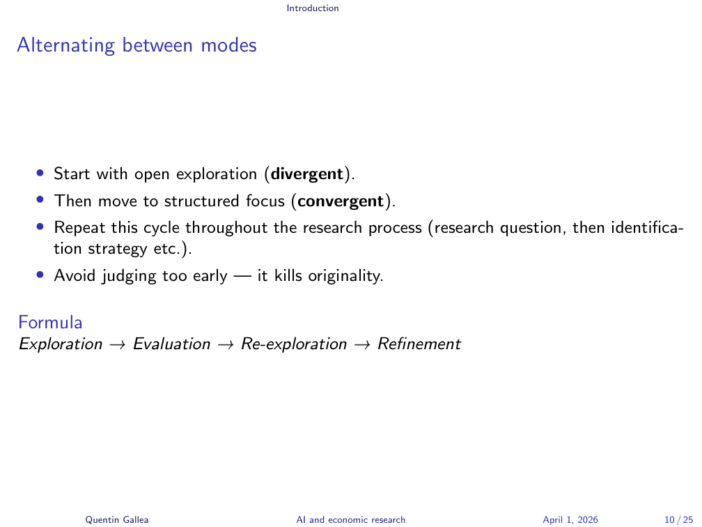{.slide-image fig-align="center" width="85%"}

The real power comes from cycling between these modes throughout the research process:

**Exploration → Evaluation → Re-exploration → Refinement**

Start with open exploration when choosing your research question. Then converge: which question is most promising? Once you have chosen, diverge again on identification strategy, brainstorm multiple approaches before converging on the best one. Then diverge on robustness checks, and converge on which ones to run.

This cycle applies at every stage: research question, identification strategy, data collection, analysis, writing. Each stage gets its own divergent-convergent loop.

---

## Is It Really Creativity When It's GenAI?

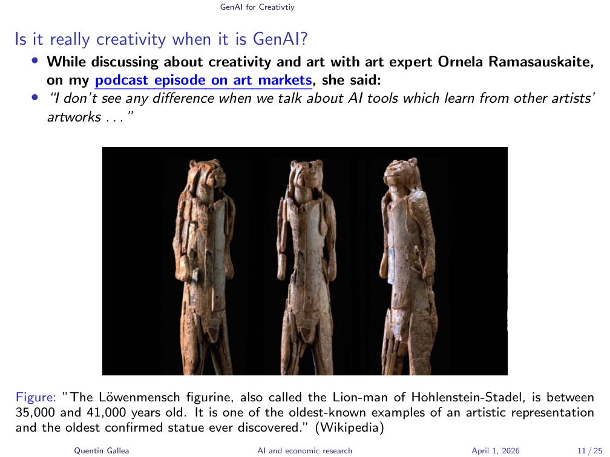{.slide-image fig-align="center" width="85%"}

I discussed this question with art expert Ornela Ramasauskaite on my podcast episode about art markets. Her answer surprised me. She pointed out that human artists have always learned by imitating, combining, and remixing the work of others. In that sense, she sees no fundamental difference with AI tools that learn from existing artworks.

Now consider the Löwenmensch figurine, the Lion-man of Hohlenstein-Stadel. It is one of the oldest known artistic representations, between 35,000 and 41,000 years old. A human body with a lion's head. The artist did not invent humans or lions. They combined existing concepts into something new.

Is that so different from what a language model does when it combines patterns from its training data into novel outputs? The philosophical debate is rich. However, the practical question for us is simpler: **can we use these tools to produce better research?** The answer is yes, with the right guardrails.

---

## AI as a Creative Companion

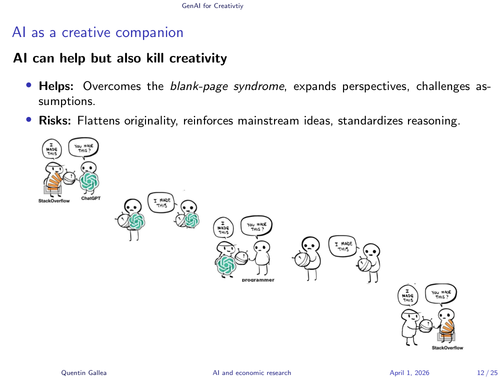{.slide-image fig-align="center" width="85%"}

Picture this. You have been staring at an empty document for twenty minutes. Nothing comes. You know the topic, you know the data, but the first sentence refuses to appear. This is the blank-page syndrome. And this is arguably where AI helps most: it breaks the paralysis. It gives you something to react to, something to disagree with, something to improve.

AI also expands your perspectives by suggesting angles you had not considered. And it challenges assumptions by asking "have you thought about X?" when you are deep inside your own framework.

However, there is a catch. AI can flatten originality. If everyone uses the same model with similar prompts, research ideas start to converge. It reinforces mainstream ideas (LLMs are trained on the most common patterns in text, which means they tend to suggest the most conventional approaches). And it standardizes reasoning in ways that can kill the quirky, unconventional insight that becomes a breakthrough paper.

Hence, the question you should always ask yourself: am I developing my own creative muscles, or am I outsourcing them?

---

## AI Is Always Available

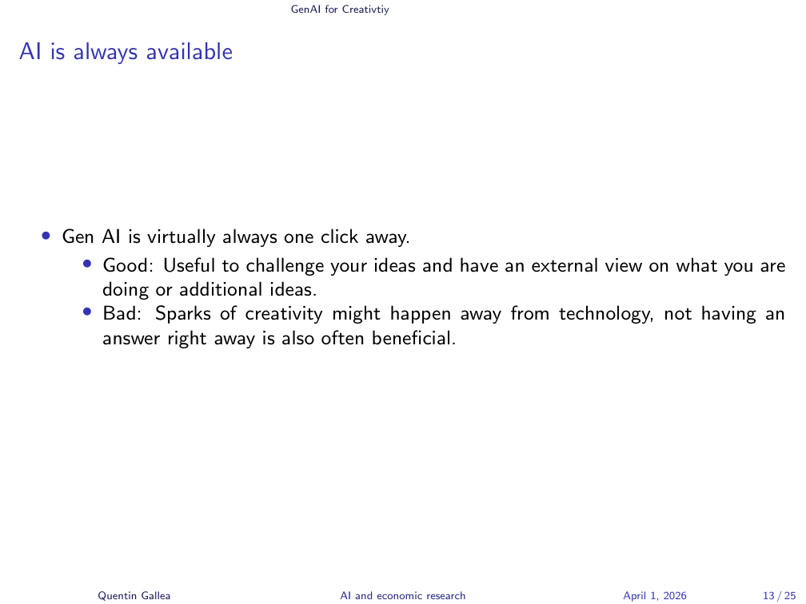{.slide-image fig-align="center" width="85%"}

GenAI is virtually always one click away. That is both a blessing and a curse.

On the positive side: it is useful to challenge your ideas and get an external perspective at any time. When I am working on a paper at 11pm and I want to stress-test an identification strategy, I can bounce it off Claude immediately. No need to wait for a colleague's availability.

However, remember the Default Mode Network? Those sparks of creativity happen when you disconnect from technology. If every moment of uncertainty is immediately filled by an AI response, you lose the productive struggle that generates original thinking. Not having an answer right away is often beneficial. It forces your brain to work the problem in the background.

This connects to a broader point I often make in talks: the most valuable skill in the GenAI era might be the discipline to **not** use it. To sit with uncertainty. To let your mind wander. To trust the process.

---

## The Impact of AI on Creativity

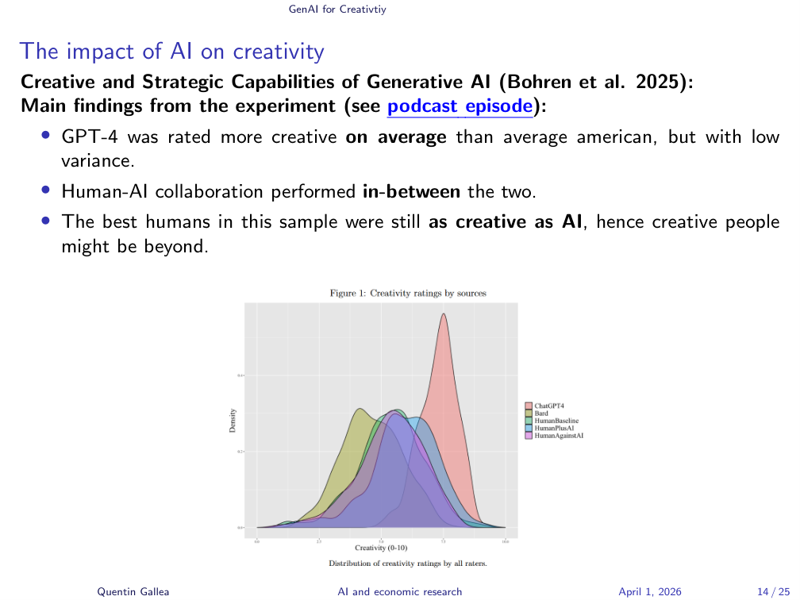{.slide-image fig-align="center" width="85%"}

Let me illustrate with a concrete study. Bohren et al. (2025) ran an experiment measuring the creative and strategic capabilities of generative AI. The findings are nuanced.

**GPT-4 was rated more creative on average than the average American**, but with notably low variance. In other words, AI is consistently decent but never brilliant and never terrible. It clusters around a high-ish mean.

**Human-AI collaboration performed in-between** the two. Better than humans alone on average, but not as consistently high as pure AI. This is a surprising finding: adding a human to the loop did not always help.

**The best humans in the sample were still as creative as AI.** This is the crucial point. The ceiling of human creativity remains at or above AI capability. Highly creative people are not being outperformed. They are being joined at their level by a tool that brings everyone else up.

Look at the distribution chart on the slide. The AI distribution (pink) is tall and narrow: high average, low spread. The human distribution (green) is wide and flat: lower average, but with a long right tail of exceptional creativity. Hence, the right question is not "is AI more creative than humans?" It is: "where on that distribution are you, and how can AI complement your position?"

---

## Thought Diversity and the Risk of Homogenization

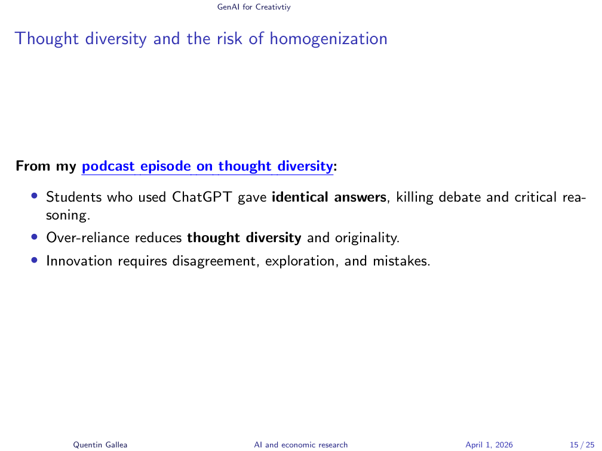{.slide-image fig-align="center" width="85%"}

I discussed this at length on my podcast episode on thought diversity, and it is one of the risks I care most about.

Here is the observation. Students who used ChatGPT for the same assignment gave near-identical answers. The diversity of thought that makes classroom debate productive simply vanished. Everyone converged on the same well-polished, reasonable, thoroughly average response.

But is this really surprising? Think about it. If everyone runs the same input through the same model, the outputs will cluster. That is how the technology works.

This is a direct threat to innovation. Progress, in science, in business, in society, requires disagreement, exploration, and mistakes. If everyone's thinking is filtered through the same model, we lose the variance that produces breakthroughs.

This also connects to the Acemoglu et al. (2026) paper on knowledge collapse that I have reviewed recently.

---

## The Cybernetic Teammate

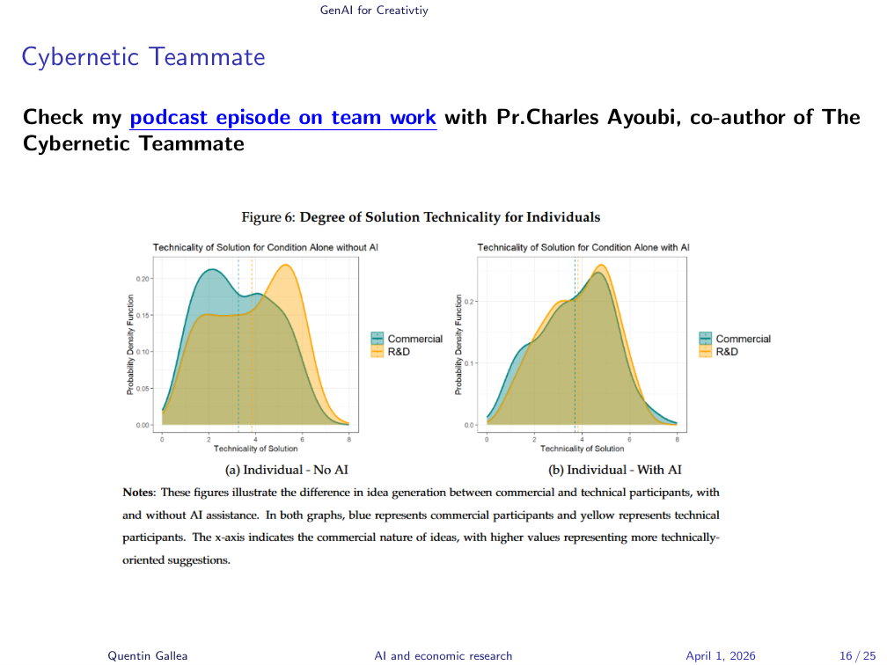{.slide-image fig-align="center" width="85%"}

The research on AI-human teamwork adds another dimension. Prof. Charles Ayoubi, co-author of *The Cybernetic Teammate*, joined me on my podcast to discuss how AI changes team dynamics.

The figure on the slide is particularly telling. It shows the degree of solution technicality for individuals working alone versus with AI. Without AI, there is a clear difference between commercial and technical (R&D) participants. They bring different strengths, different perspectives. With AI, the distributions converge.

This is fascinating, and somewhat concerning. Fascinating because it means AI can help people think outside their comfort zone. Concerning because it suggests that the complementary diversity that makes teams productive might get smoothed out when everyone has the same AI assistant.

Hence, a question worth reflecting on: if AI erases the difference between how a marketer and an engineer approach a problem, do we gain efficiency or lose something crucial?

---

## Creativity vs. Hallucinations

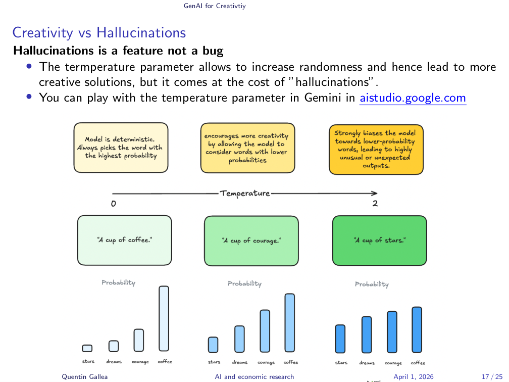{.slide-image fig-align="center" width="85%"}

Imagine you are completing the sentence: "A cup of ___." At temperature 0, the model is deterministic. It always picks the most probable word. "A cup of coffee." Predictable. Accurate. Boring.

Raise the temperature, and the model starts considering less likely tokens. "A cup of courage." That is a metaphor. That is creative. Go even higher: "A cup of stars." Unexpected, possibly poetic, possibly nonsense.

Here is the reframe that often surprises people: **hallucinations are a feature, not a bug**, at least when you understand what is happening mechanically. Creativity and hallucination are two sides of the same coin. They both come from the model departing from the most probable output. When that departure is useful and novel, we call it creative. When it is factually wrong and misleading, we call it a hallucination.

Understanding this tradeoff is crucial for using AI effectively in research. For brainstorming and idea generation, you *want* higher temperature, you want the unexpected combinations. For fact-checking and data analysis, you want lower temperature, you want reliability. You can experiment with this yourself in Google's AI Studio (aistudio.google.com).

---

## AI for Divergent and Convergent Thinking

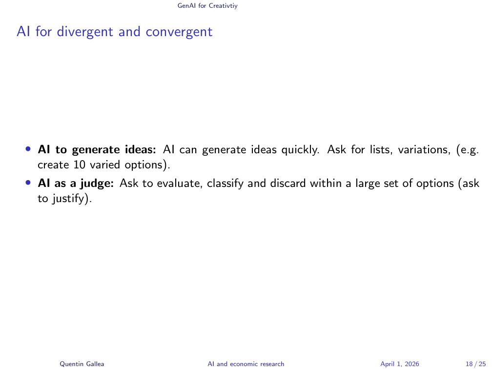{.slide-image fig-align="center" width="85%"}

Now let me connect the divergent/convergent framework directly to GenAI usage.

**AI for divergent thinking (generating ideas).** AI can produce ideas at a speed and volume that is impossible for a single human. Ask for lists, variations, alternatives. The key is prompting for diversity: "Give me 10 ideas, and make them as different from each other as possible." The more varied the raw material, the better your convergent phase will be.

**AI as a judge (convergent thinking).** Once you have a large set of options, whether research questions, identification strategies, or paper titles, you can ask the model to evaluate, classify, and rank them. However, always ask it to justify its reasoning. The justification is often more valuable than the ranking itself, because it forces the model to articulate criteria you might not have considered.

This two-phase approach, generate with AI then evaluate with AI, is the pattern I use in my own multi-agent content pipeline. The `causal-content` skill generates concept angles, that I can filter. Also my `quentinize' skill creates always 3 variations such that I have something to compare and judge.

---

## GenAI for Creativity in Research: Divergent Use Cases

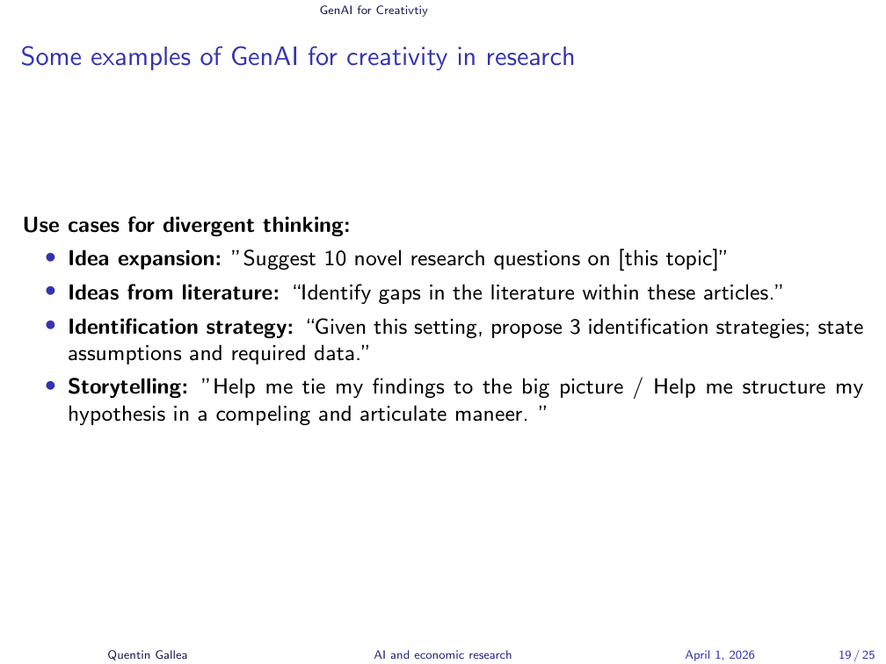{.slide-image fig-align="center" width="85%"}

Let me illustrate with concrete prompt patterns you can use today for divergent thinking in your research.

**Idea expansion.** "Suggest 10 novel research questions on [this topic]. Make them range from incremental extensions to radical reframings." This works especially well when you upload your own draft or literature review as context.

**Ideas from literature.** "Identify gaps in the literature within these articles. What questions do they collectively fail to answer?" This is the kind of task where tools like NotebookLM or a well-prompted Claude conversation with uploaded PDFs can shine.

**Identification strategy.** "Given this setting, propose 3 identification strategies. For each, state the key assumptions and the data required." This is arguably one of my favorite uses. It forces you to think beyond your first instinct. Even if the AI's suggestions are not perfect, they expand your solution space.

**Storytelling.** "Help me tie my findings to the big picture" or "Help me structure my hypothesis in a compelling and articulate manner." This is where AI can help you see the forest when you have been staring at trees for months.

---

## GenAI for Creativity in Research: Convergent Use Cases

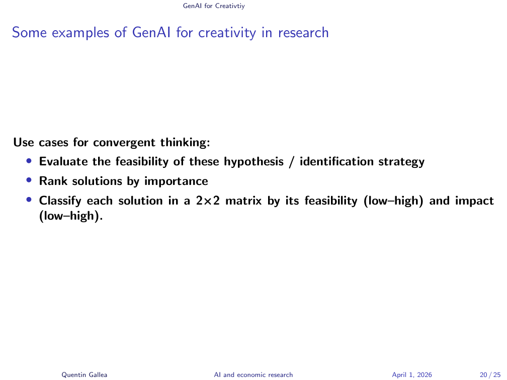{.slide-image fig-align="center" width="85%"}

And for convergent thinking, similar logic, different prompts.

**Feasibility evaluation.** "Evaluate the feasibility of these hypotheses / identification strategies. For each, identify the strongest assumption and the most likely threat to validity." This mimics what a good referee would do, and it is the logic behind the `super-referee` skill I built for reviewing empirical economics papers.

**Ranking.** "Rank these solutions by importance. Justify each ranking with one sentence." Simple but powerful. The justifications often reveal dimensions you had not weighted properly.

**Matrix classification.** "Classify each solution in a 2×2 matrix by its feasibility (low/high) and impact (low/high)." This is a classic framework, but it works beautifully for research prioritization. The top-right quadrant (high feasibility, high impact) is where you want to be.

---

## Example: Multi-Paper Workflow with NotebookLM

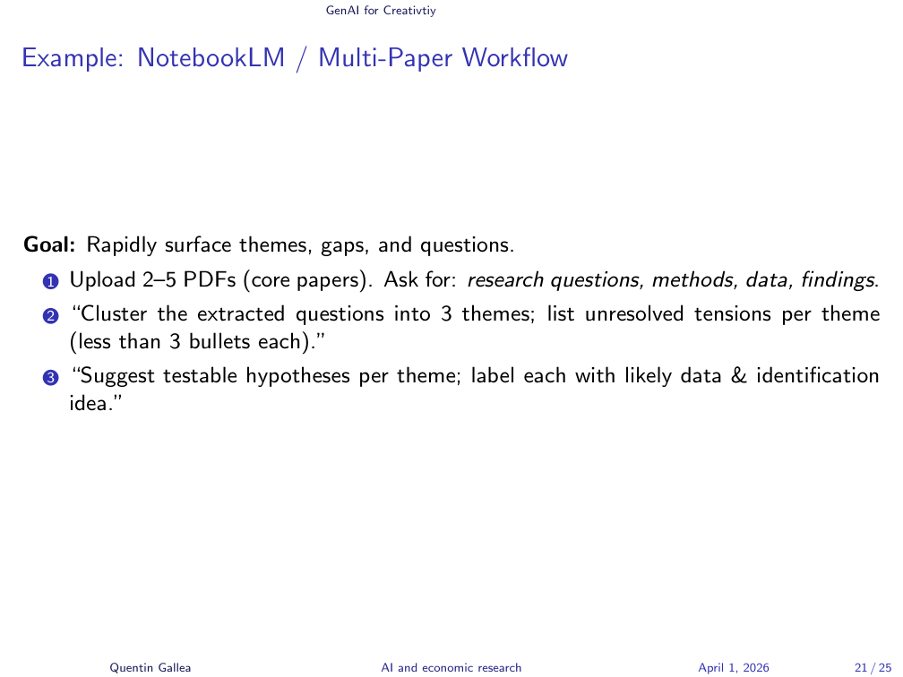{.slide-image fig-align="center" width="85%"}

Here is a workflow you can try this week. Three steps.

**Step 1: Upload 2 to 5 core PDFs** into  NotebookLM. Ask it to extract from each paper: the research question, the method, the data, and the key findings.

**Step 2: Cluster and identify tensions.** Prompt: "Cluster the extracted questions into 3 themes. List unresolved tensions per theme (less than 3 bullets each)." This is where the magic happens. The model identifies contradictions and gaps across papers that you might miss when reading them one by one.

**Step 3: Generate hypotheses.** Prompt: "Suggest testable hypotheses per theme. Label each with likely data and an identification idea." Now you have a structured set of research directions, grounded in the existing literature, with concrete next steps.

I use a similar logic in RECAST, where the pipeline reads existing papers and then extends them with modern causal ML methods like Double/Debiased Machine Learning. The principle is the same: start from the literature, identify what is missing, and generate structured ideas for extension.

---

## Safeguards: Start Without AI

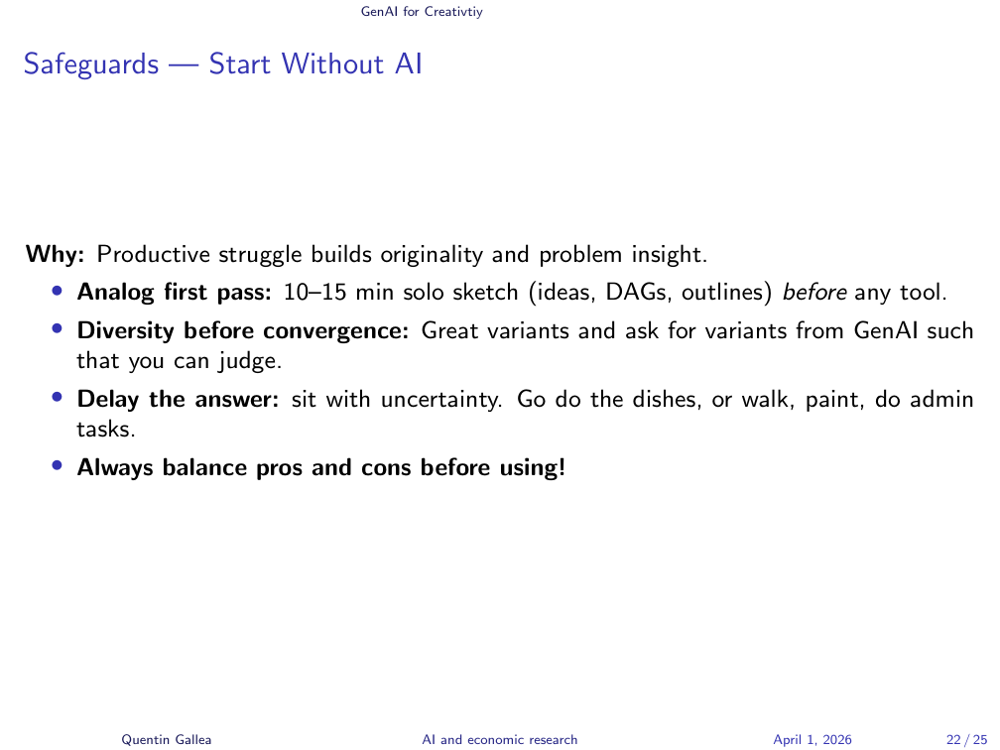{.slide-image fig-align="center" width="85%"}

I want to end the core content with what might be the most important point in this session.

**Why start without AI?** Because productive struggle builds originality and problem insight. If you go straight to the AI, you skip the phase where your brain develops its own understanding of the problem. You get an answer faster, but you learn less. And your answer is less likely to be original.

Practical safeguards.

**Analog first pass.** Spend 10 to 15 minutes sketching ideas solo, on paper, on a whiteboard, in your head, before opening any AI tool. Draw a DAG. Write an outline. List your hypotheses. This forces you to confront what you actually know and what you do not.

**Diversity before convergence.** Generate your own variants first, then ask GenAI for its variants. Now you can compare and judge from a position of having done your own thinking.

**Delay the answer.** Sit with uncertainty. Go do the dishes. Walk. Do admin tasks. Paint. Carve a spoon. Let the Default Mode Network do its work. The answer that comes after a period of productive uncertainty is almost always better than the one you get by immediately prompting an AI.

**Always balance pros and cons before using.** Not every task benefits from AI involvement. Sometimes the most productive use of your time is to think alone.

---

## Applying Our Guidelines: Creativity & Brainstorming

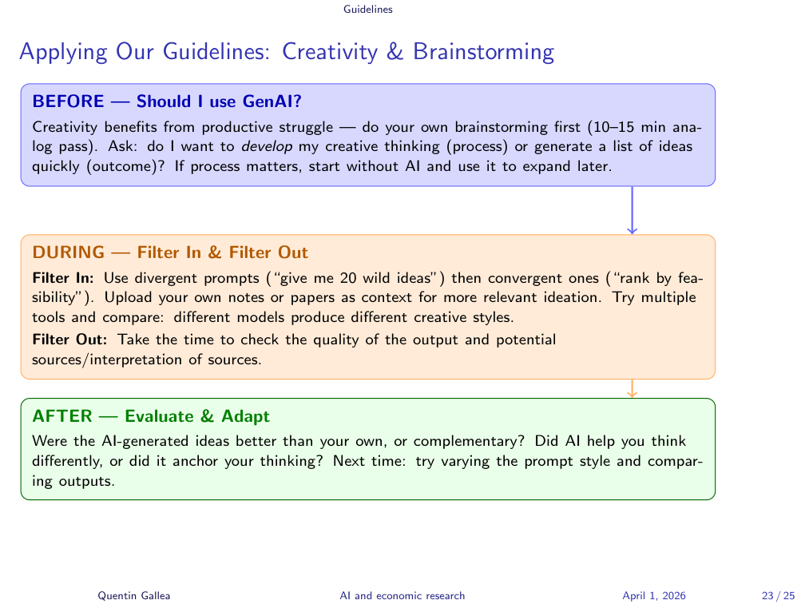{.slide-image fig-align="center" width="85%"}

---

## Homework

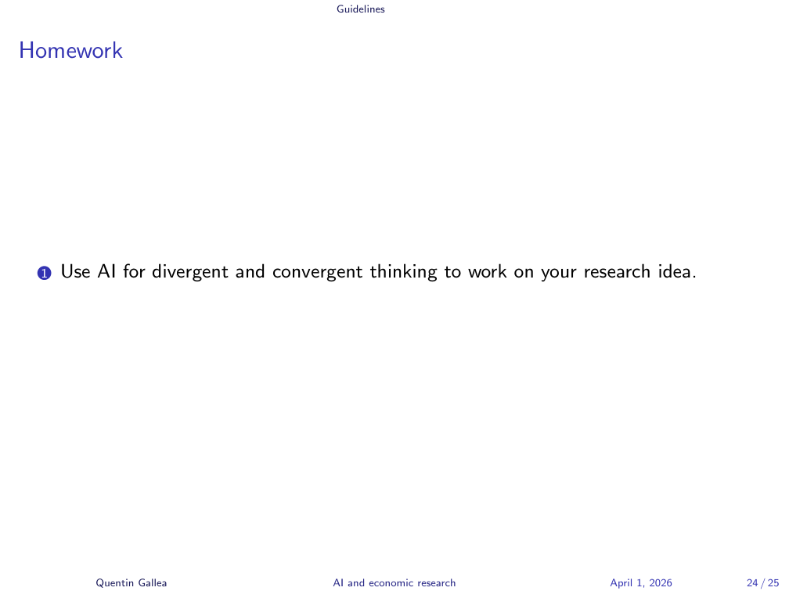{.slide-image fig-align="center" width="85%"}

Your assignment: **use AI for both divergent and convergent thinking to work on your research idea.**

Concretely: start with a solo brainstorming session (analog, 10 to 15 minutes). Then use GenAI to expand your idea space (divergent). Then use GenAI to evaluate and prioritize (convergent). Document what the AI added, what you discarded, and what surprised you.

The goal is not just to produce ideas. It is to develop a workflow for creative collaboration with AI that you can use throughout your research career.

---

## What's Next?

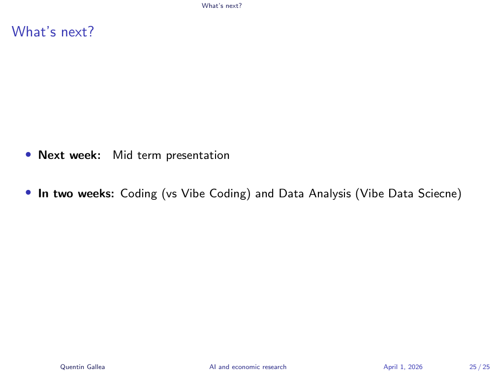{.slide-image fig-align="center" width="85%"}

In two weeks is your **mid-term presentation**. 

In three weeks, we move from creativity to execution: **Coding (vs. Vibe Coding) and Data Analysis (Vibe Data Science)**.

---

## Key Takeaways

::: {.callout-tip}
## What to Remember
1. **Research is creative at every stage**, from finding the question to writing the paper. Do not treat AI as a shortcut past the creative work. Treat it as a tool to amplify it.
2. **Divergent before convergent.** Generate widely, then evaluate ruthlessly. Never do both at the same time, and give AI a distinct role in each phase.
3. **Start without AI.** The 10 to 15 minute analog-first pass protects your originality and deepens your understanding of the problem. Productive struggle is not wasted time.
4. **Beware homogenization.** If everyone uses the same AI the same way, thought diversity collapses. Your job is to bring the variance, the weird angle, the unconventional framing, the contrarian hypothesis.
5. **Creativity and hallucination share a mechanism.** Understanding the temperature tradeoff helps you calibrate AI for the right task: high creativity for brainstorming, high reliability for analysis.
:::
