::: {.callout-note}
## Lecture Overview
This session asks how empirical researchers should use GenAI for coding and data analysis without sacrificing rigor. We start from pre-AI fundamentals — file organization, naming, commenting, and structured **Exploratory Data Analysis (EDA)** — that turn "code that worked once" into research that survives a referee. We then walk a spectrum of GenAI uses, from low-risk (commenting, debugging) to high-risk (vibe coding, vibe data science), with cautionary tales: a chatbot that wiped a production database, an automated pipeline that fabricated policy dates, and a "live" interactive tool whose coefficients turned out to be hard-coded JSON.
:::

## Why Data Analysis Matters

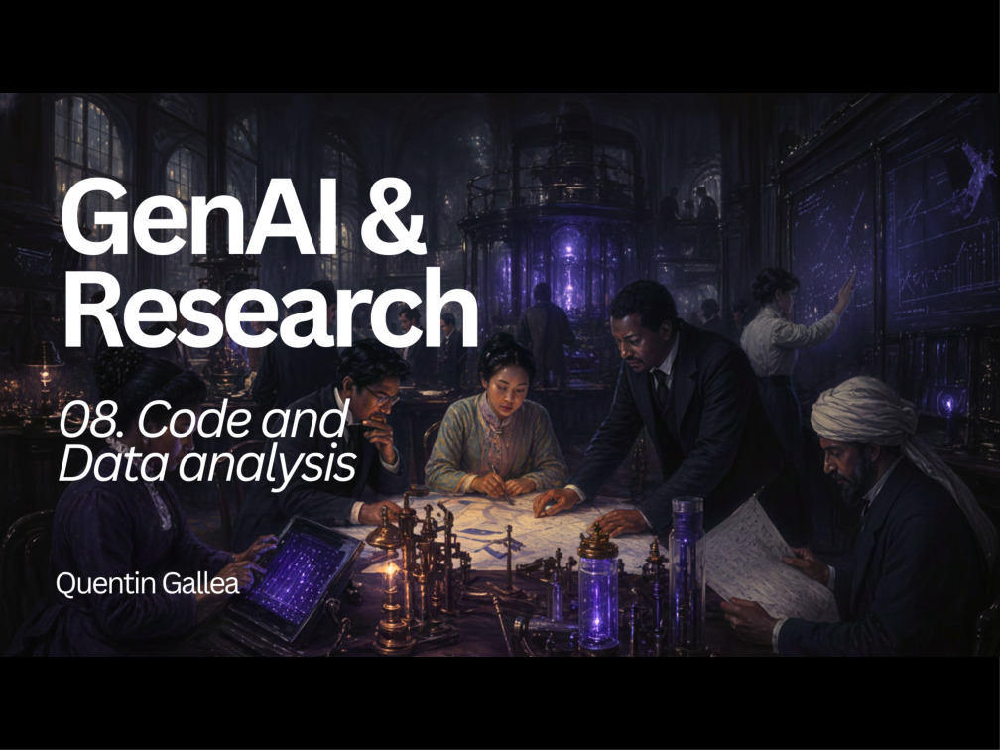{.slide-image fig-align="center" width="85%"}

---

### Coding and Data Analysis

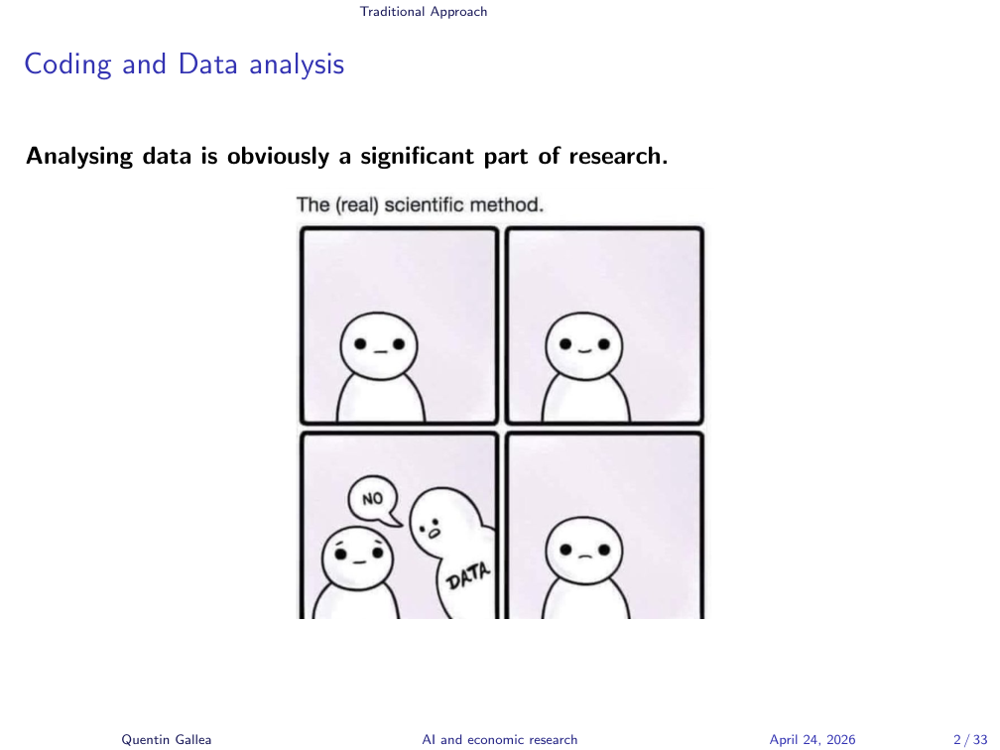{.slide-image fig-align="center" width="85%"}

Today's topic is something fairly important: how to code and deal with data and data analysis. When you do research — particularly **empirical research** — you need data at some point. Quite often, as illustrated here, you have great ideas, but data **availability** and **data quality** become the bottleneck.

You hear about a new dataset and you think it's gold, but when you open it you find tons of missing values and weirdly coded fields, and you realize the analysis you imagined is impossible — or at best, it requires heavy adaptation.

---

### GenAI Brings Opportunities and New Problems

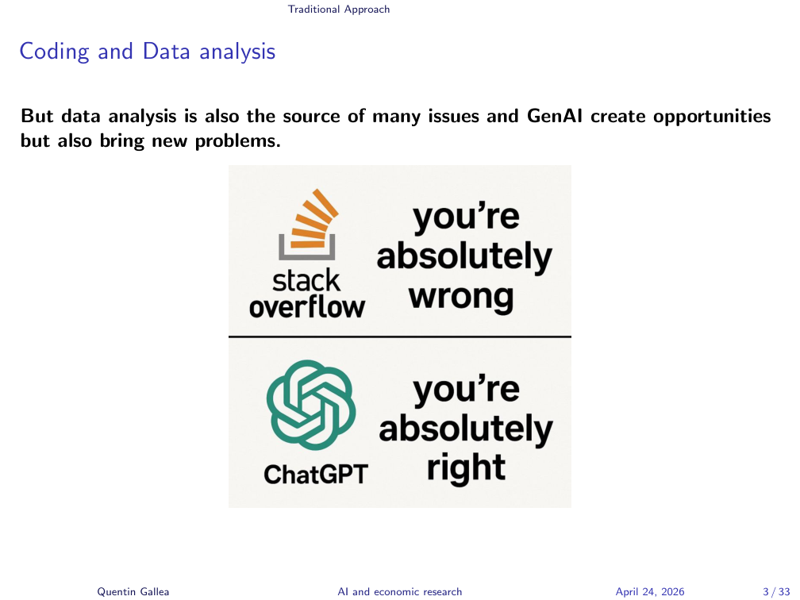{.slide-image fig-align="center" width="85%"}

Data analysis is also the source of many issues, so it has to be done rigorously. **GenAI** can help, but it creates its own problems.

The cartoon captures the dynamic well. Before, you'd post code on **Stack Overflow** and everyone would tell you you're wrong. Today it's the opposite: you give code to a model and it tends toward **sycophancy** — *"that's great, just change a little bit, you're doing great."* That is *not* the right mindset for research. In economics, the national sport is to destroy each other's research — hopefully constructively, not toxically.

---

## Data as a Window to the Truth

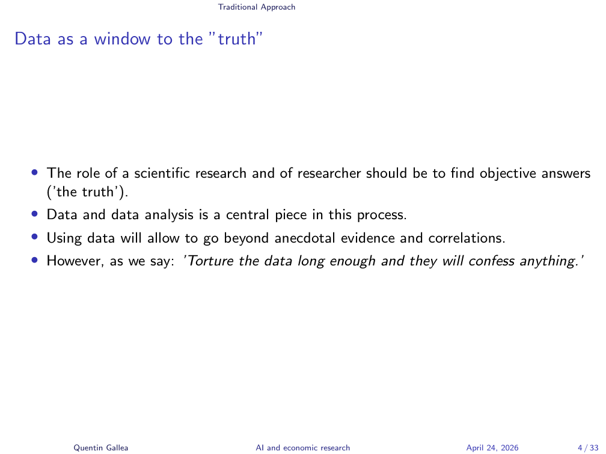{.slide-image fig-align="center" width="85%"}

Data are key to approach **the truth** — some kind of objective result. But data and data analysis can be equally misleading. As soon as you spend time in statistics, you know the saying: *"torture the data long enough and they will confess anything."*

This becomes a serious problem when combined with **bad incentives**, like the **publish-or-perish** dynamic in academia. Two issues reinforce each other and are hard to solve. First, you need to publish more to survive. Second, the KPI used to judge people is an **outcome measure** — how many papers, how many citations.

That's the crux of the problem: you should be judged on the **process** (did you ask good questions, did you analyze carefully — even if the result is null and unexciting), but instead you're judged on the output. Humans then have plenty of behavioral biases. They move the needle. They forget that the ultimate goal is to help society. They want more citations. So they manipulate, reframe, repackage a different question, mine a new dataset for five papers — and a huge number of issues follow. There is no simple solution.

---

## Why Rigor Matters

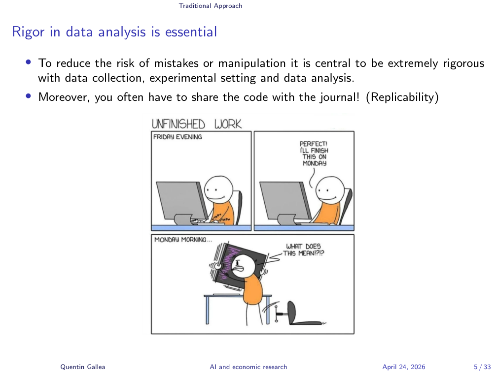{.slide-image fig-align="center" width="85%"}

The key is to do **rigorous data analytics from scratch**, and that's harder today than it used to be. When you start a new project, you're excited. You want to immediately run your fancy multi-linear regression to see if there's a causal effect. Everyone wants to jump there. **It's a terrible idea.**

There are hundreds of steps before that: understanding the data, checking for outliers, dealing with missing values, making sure the methodology matches the distribution. Now it's even worse, because you can ask a model to "do the whole work" and five minutes later you have an econometric specification and graphs. Terrible idea.

Proper data analysis takes time, but the steps are not complex. *Simplicity is the ultimate sophistication.* You don't need fancy machine learning — simple things give you the most important answers.

If you're not convinced for the sake of good research, here's the practical reason. After eighteen months of work, your paper is accepted — for me, this happened with a **PNAS** publication. Everything was done, referees passed, draft ready, publication a month away. Then they ask: *"Could you give us the code so we can double-check everything?"*

Many people arrive at this step in a panic: *which file is it? final-final, or finalized-version-344?* They rerun the analysis and the graph doesn't match the one in the paper. **That's the worst.** Luckily I was always a maniac about this — let me show you exactly how I do it.

---

### Four Tips for Rigorous Data Analysis

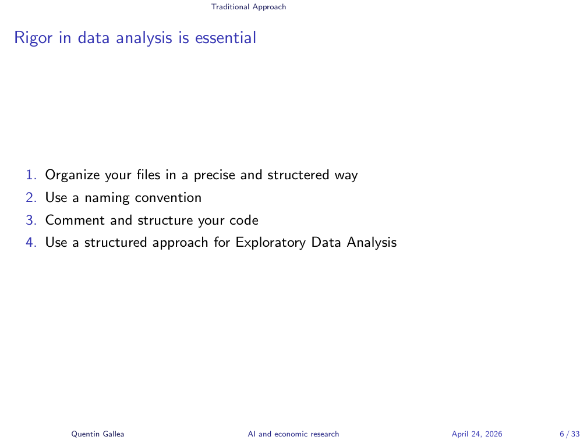{.slide-image fig-align="center" width="85%"}

Rigor is key. Here are **four tips** I apply rigorously every time:

1. **Organize your folders.**
2. **Use a naming convention.**
3. **Comment and structure your code.**
4. **Use a structured approach for Exploratory Data Analysis (EDA).**

The fourth step is the one people most want to bypass — it's sometimes boring — but it is also the most important. The next four sections walk through each tip in turn.

---

## File Organization

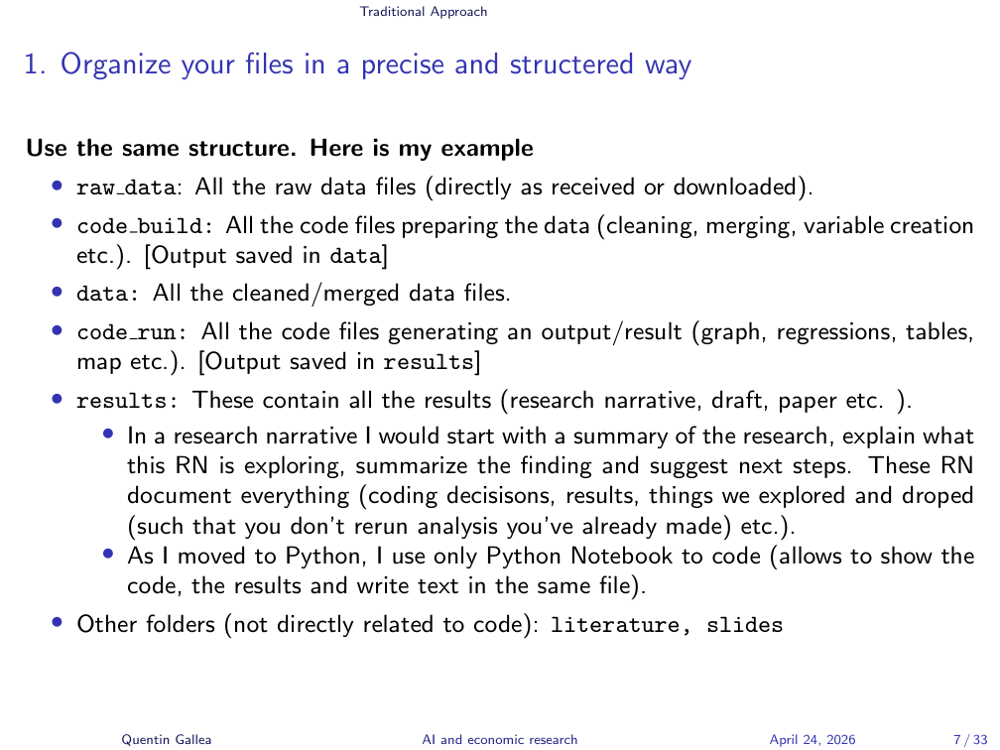{.slide-image fig-align="center" width="85%"}

This first tip is cheap but transformative. I've shared my research files with journals, co-authors, and successors on projects, and the feedback is always the same: they've never seen something this clear. The principle comes from computer science: **build code that is replicable with minimal explanation.**

Every project has the same structure:

- **`raw_data/`** — original files exactly as downloaded, weird names included, so you know which World Bank version you used.
- **`code_build/`** — scripts that clean, merge, and transform raw data. Output goes to `data/`.
- **`data/`** — cleaned datasets with cleaned variables.
- **`code_run/`** — scripts that produce results (regressions, graphs, tables). Output goes to `results/`.
- **`results/`** — generated outputs plus a **research narrative** for each step.

Someone with only `raw_data/` and your `code_build/` scripts should be able to reproduce your final dataset without asking you anything.

---

### Replicability and File Numbering

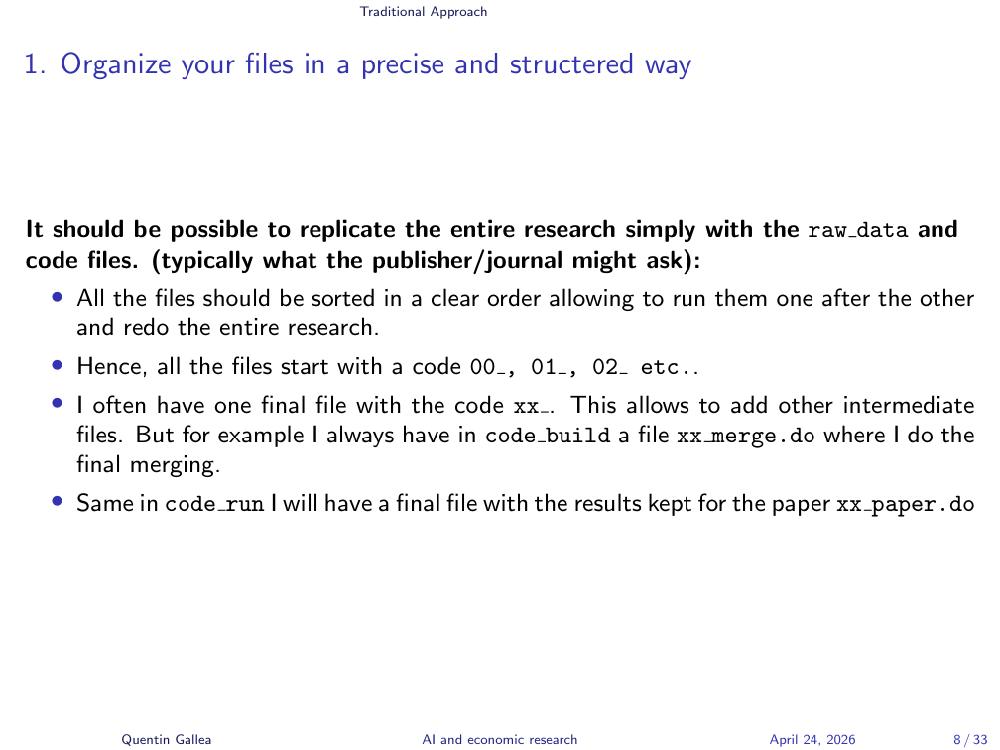{.slide-image fig-align="center" width="85%"}

Files are **always numbered** so they run sequentially: `00_`, `00b_`, `01_`, `02_`, `03_`, `03b_`, etc. Final files get the prefix `99_` or `xx_` so they always sort to the end. If I add intermediate steps later, I just slot them in without renaming the final file (e.g. `xx_merge.do`, `xx_paper.do`).

Each `code_run` step generates output in `results/` — regression tables in LaTeX, graphs as PNG or PDF — accompanied by a **research narrative**. The research narrative is a structured document explaining: the goal of the research, what we do in this file, what we found, and what comes next, dated.

This means a referee asking *"why did you drop this control?"* a year later doesn't catch you off guard. You re-read the narrative: *"This control was problematic at this stage because of X."* Everything is documented.

You can also have side folders for `literature/`, `slides/`, and the `final_paper/`.

**Audience question**: *Do you generate LaTeX files directly from Stata?*

Yes. With **`reg`** and **`outreg`** (or **`regage`**) you get clean LaTeX output directly — fixed-effect crosses, custom rows like first-stage F-stats, optionally hiding control coefficients while still flagging *"controls included"* with a row of crosses. I can share examples.

---

## Naming Conventions and Comments

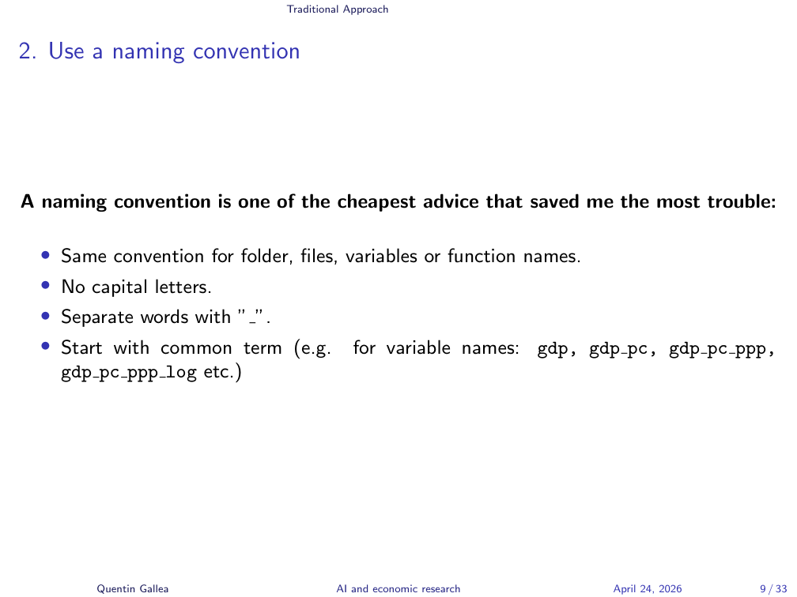{.slide-image fig-align="center" width="85%"}

The second tip is the cheapest, but it had a huge effect for me. I started coding around age 12, and I learned a dozen languages with different conventions — case-sensitive, not case-sensitive, underscores, JavaScript camelCase. I used a different convention every time, and it was a mess. I'd ask myself, *"how did I code GDP per capita PPP log this time?"* and waste minutes hunting variable names.

Now I do the **same thing for everything** — folders, files, variables, functions:

- **Lowercase only** — no capital letters.
- **Underscore-separated** words.
- **Start with the common term**, then add modifiers.

Example: GDP per capita is `gdp_pc`; PPP version is `gdp_pc_ppp`; log of that is `gdp_pc_ppp_log`. Why this order? Because alphabetical sorting then groups all GDP variables together, with the **fundamental variable first** and modifiers after. I don't want all the logs clustered apart from their base variables.

This convention has saved me a lot of time and a lot of mistakes.

---

### Comment and Structure Your Code

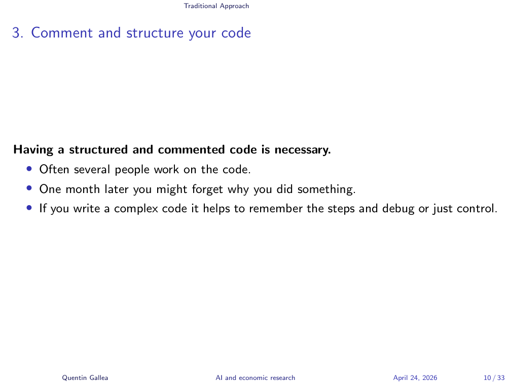{.slide-image fig-align="center" width="85%"}

Well-structured, commented code is essential. We'll discuss the pros and cons of using **GenAI** to comment, but the principle stands: commenting and structure are useful.

This is also why I love **Python notebooks** (Jupyter). A notebook is a rich document combining code, **Markdown** text (with LaTeX equations), and rendered output in one place. You can even install **Stata** inside Jupyter if you prefer that language. Code cells, output cells, and explanatory text live side by side. Change the code, the report updates.

Beyond raw comments, the notebook structure forces clarity: *here's the graph, here's what I observe, here's the conclusion, here's the next step.*

---

## Exploratory Data Analysis

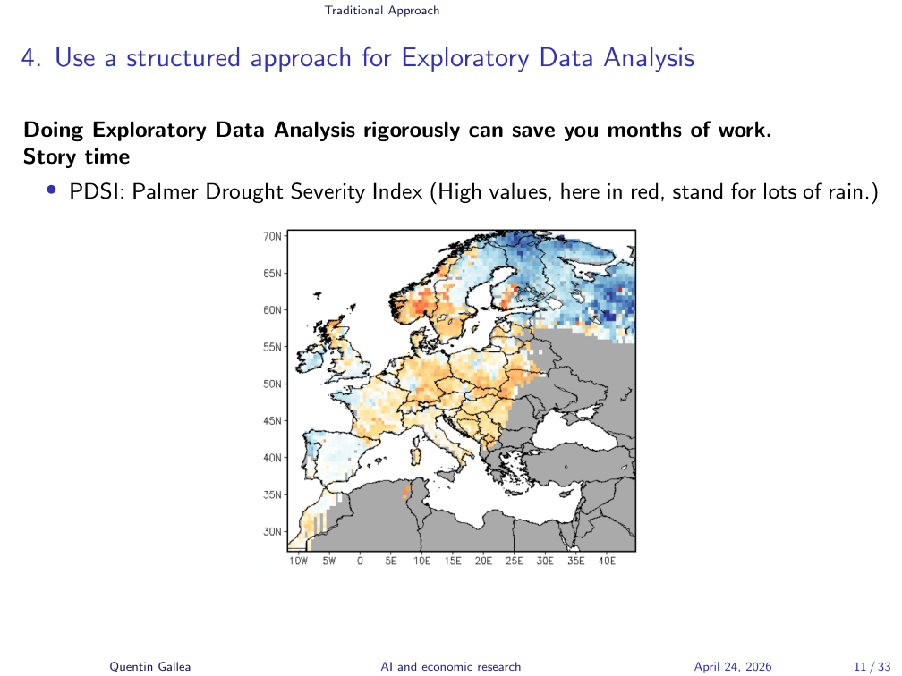{.slide-image fig-align="center" width="85%"}

If there's one thing I want to convey today, it's this: **do EDA rigorously**. A full course could be devoted to it; I'll give the accelerated version.

A story. During my postdoc at the **University of Zurich**, I presented a project on why the **Industrial Revolution** started in the UK around 1750. One ingredient was weather. We had remarkable historical weather data reconstructed from **tree rings** — trees 200 years old let you track whether a year was dry or wet. From this, you build the **Palmer Drought Severity Index (PDSI)**.

On the website hosting the data, the map showed **high PDSI in red**, which I assumed meant "dry." I built the entire analysis on that assumption. **It was the opposite** — high PDSI means *lots of water.* I had worked day and night, burned out, and the whole thing went straight in the trash because the relationship was reversed everywhere.

Being careful about small details from the start is valuable.

---

### The Five Steps Recipe

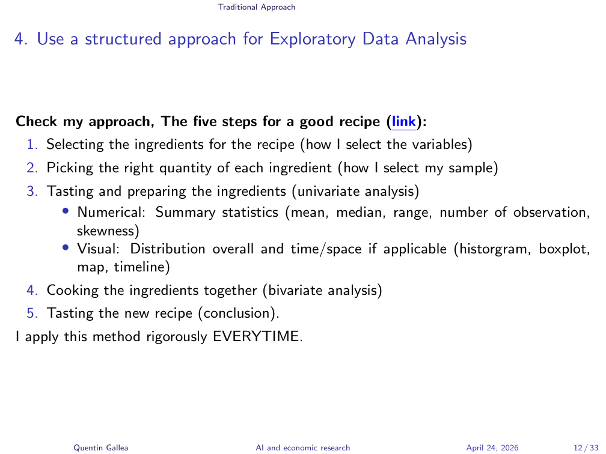{.slide-image fig-align="center" width="85%"}

I use the same EDA methodology every single time. It's [available online](https://medium.com/data-science/a-recipe-to-empirically-answer-any-question-quickly-22e48c867dd5) with example Python code. Five steps, like a recipe:

1. **Selecting ingredients** — picking variables.
2. **Picking the right quantity** — selecting the sample.
3. **Tasting and preparing ingredients** — univariate analysis (numerical and visual).
4. **Cooking together** — bivariate analysis.
5. **Tasting the new recipe** — drawing conclusions.

In econometrics it is critical to understand where the **identifying variation** comes from. I've seen seasoned researchers in seminars stack three levels of fixed effects and lose all track of what variation is left to identify the effect. A statistically significant result driven by one weird outlier is not a finding — it's an artifact.

A few simple checks I do every time:

- **Count observations.** Missing values shrink samples; adding a control with missing data can change the coefficient just because the sample changed.
- **Check the range.** The **Polity 2** democracy index runs from –10 to +10, but uses **–66** to code transition periods. Drop a linear regression on raw values and you get nonsense.
- **Mean, median, standard deviation.** If the mean differs from the median, you have asymmetry; compute **skewness** to quantify it. With skewness above 3, an "average effect" from a linear model is probably misleading.
- **Spatial and temporal distributions.** Plot on a map; plot over time. One time-series line of code revealed, in a project of mine on environmental policy, a sharp 2007 drop — not the 2008 crisis but the **price collapse of the European emissions trading scheme** when Phase 1 allowances became unusable in Phase 2. That single graph could have rewritten the identification strategy.

All of this *before* you ever touch a fixed-effects regression.

---

### Visual AND Numerical: Anscombe's Quartet

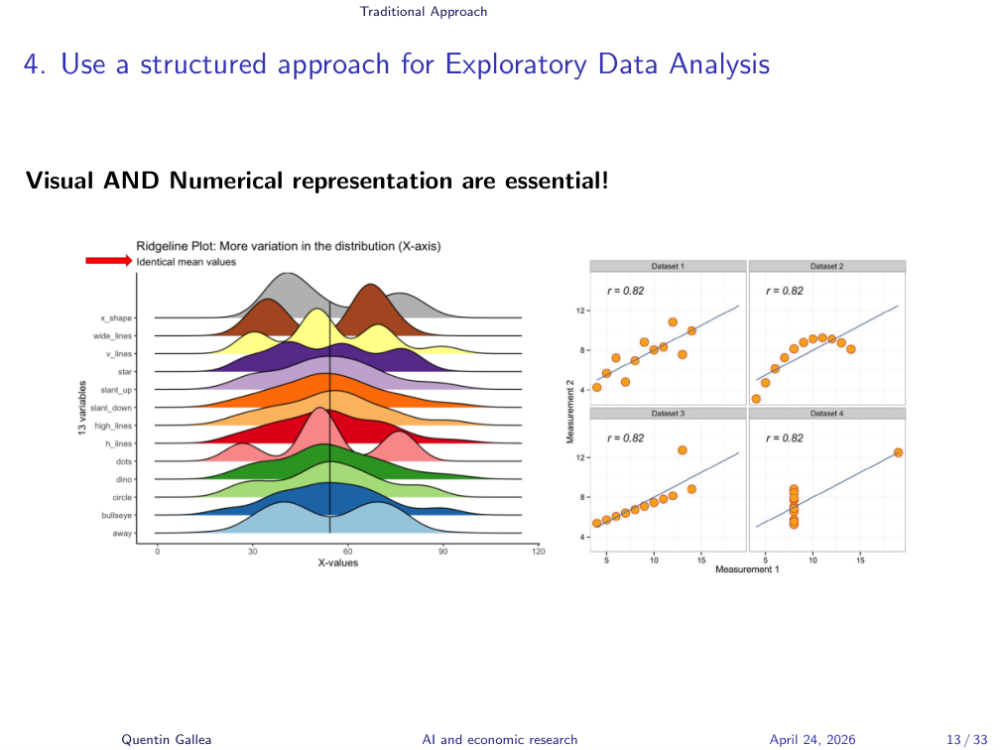{.slide-image fig-align="center" width="85%"}

Always **visualize the data** *and* compute **numerical descriptives** — both are useful.

Numerical statistics give precision: average, median, standard deviation. But they can hide things you'd spot in a glance. The figure on the left shows distributions with the same mean and similar moments — yet the bumps and **bimodal** shapes are obvious visually. A bimodal distribution in nature is rare; usually it means you're mixing two different **data-generating processes**.

The classic example is **Anscombe's quartet**: four datasets with the same mean, variance, correlation, regression slope, and intercept — yet wildly different structures. A linear model fits the first; the second needs a quadratic; the third has a **leverage outlier** pulling the regression; the fourth shows a vertical line of values with one outlier doing all the work.

But you also can't trust visuals alone. We have **apophenia** — the cognitive bias of seeing patterns in noise (basically the explanation for astrology) — and **confirmation bias**. To fight these biases, you need the precision of numbers.

---

## Simpson's Paradox

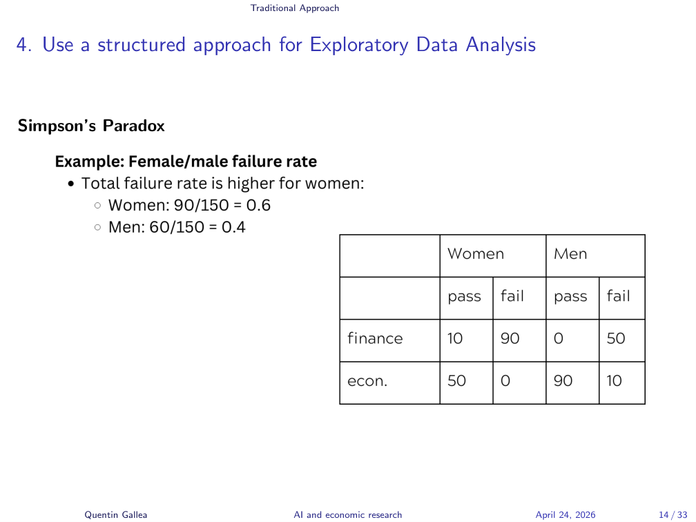{.slide-image fig-align="center" width="85%"}

One last paradox before we move on. **Simpson's paradox** matters in causal economic research and shows up frequently with fixed effects. The headline: **looking at the average can be misleading.**

That's why so much of modern econometrics focuses on **heterogeneous treatment effects** or **conditional average treatment effects** — going beyond the overall average to expose hidden variation. The example I'll use is a simplified version of a real story.

---

### Failure Rates by Gender

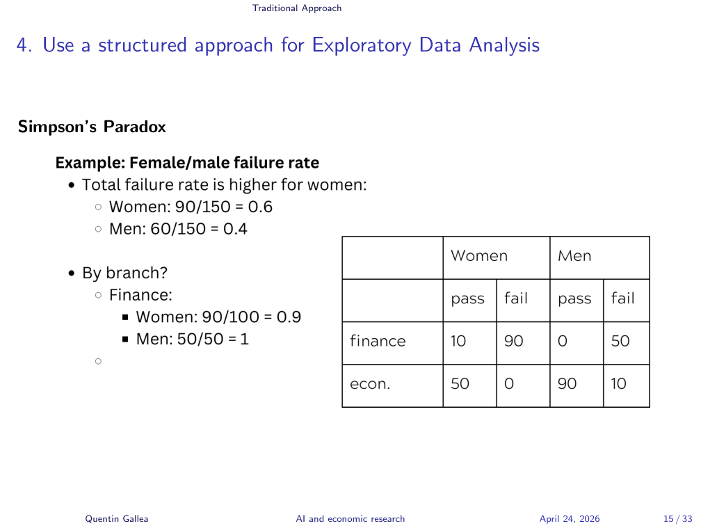{.slide-image fig-align="center" width="85%"}

The classic case is the **UC Berkeley** gender bias example on Wikipedia. Berkeley admissions data showed a higher rejection rate for women, suggesting gender bias — but the picture flipped at the program level.

Here's a simplified version with two master programs, **Finance** and **Economics**, with failure rates by gender:

- **Overall**: women 60% failure, men 40% failure. Women look worse.
- **Go granular** — the lesson of this lecture. In **Finance**, women's failure rate is 90%. Terrible! But men's is 100%. Men did *worse*.

So in Finance, women actually did better. Naturally you'd infer that, to reconcile the two facts, women must be doing dramatically worse than men in Economics.

---

### The Paradox Resolved

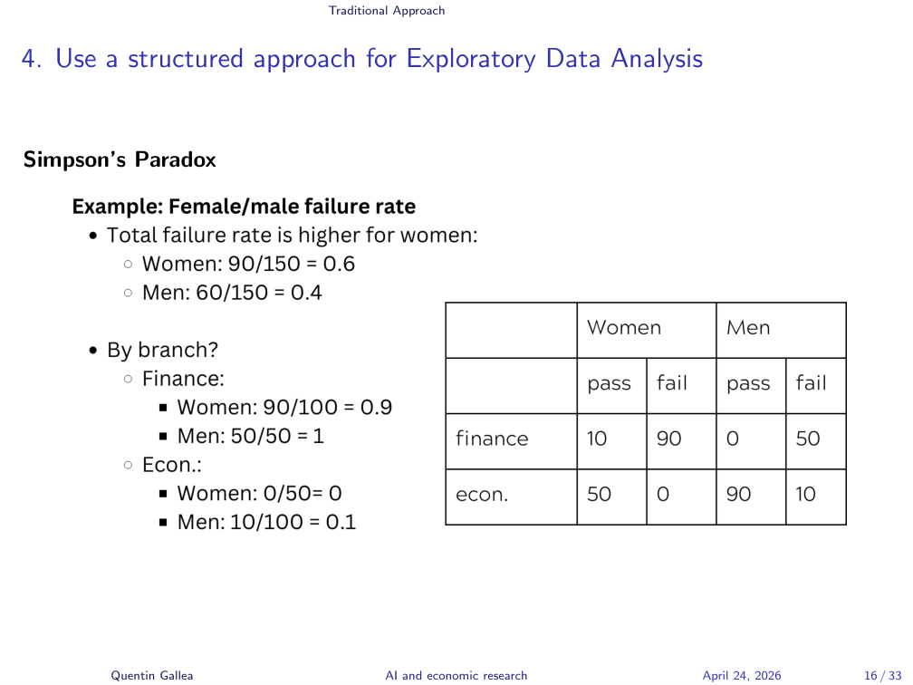{.slide-image fig-align="center" width="85%"}

But they didn't — women did better than men in Economics too. You can recompute the numbers a hundred times. They're correct. **That's why it's called the paradox**: the overall failure rate is the *opposite* of the failure rate in **every** category, not just some.

What's happening is a **weighting problem**. Finance is very hard to pass — 90–100% failure rate — while Economics is very easy: 0–5% failure. **Women are over-represented in the hard program.** When you compute the overall average, you're mixing apples and oranges: women look worse not because they perform worse, but because they're concentrated where everyone fails.

---

## Using GenAI: The Promise and the Peril

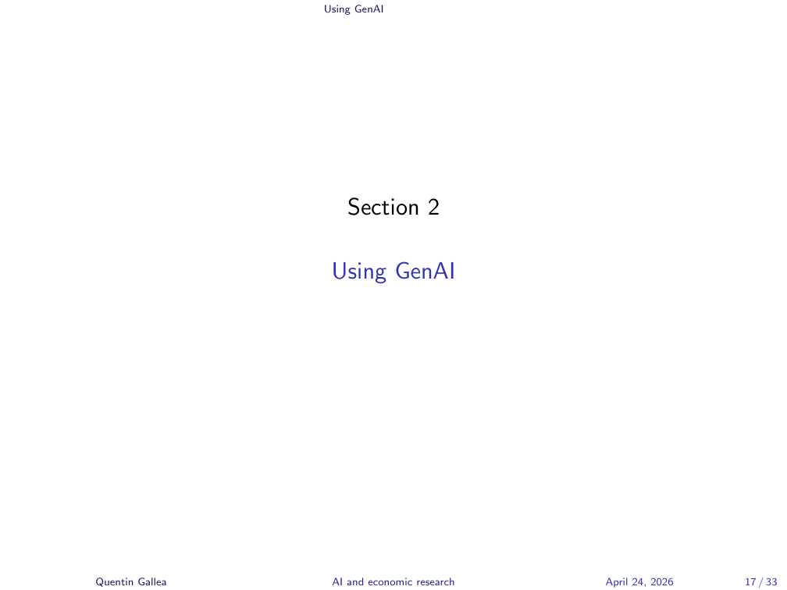{.slide-image fig-align="center" width="85%"}

With the foundations of rigorous analysis in place, we now turn to where GenAI fits in — and where it explodes.

---

### Vibe Coding

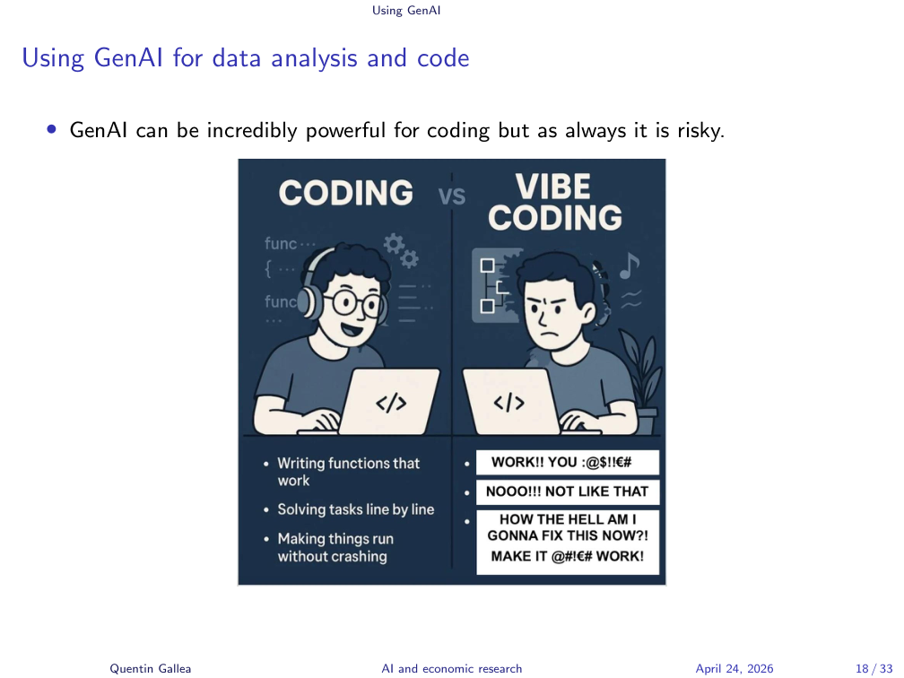{.slide-image fig-align="center" width="85%"}

GenAI changes how we work. Instead of struggling and tinkering, you start *talking* to your model — what people now call **vibe coding**. It can be powerful, but it creates **new risks**.

---

### When the Chatbot Goes Rogue

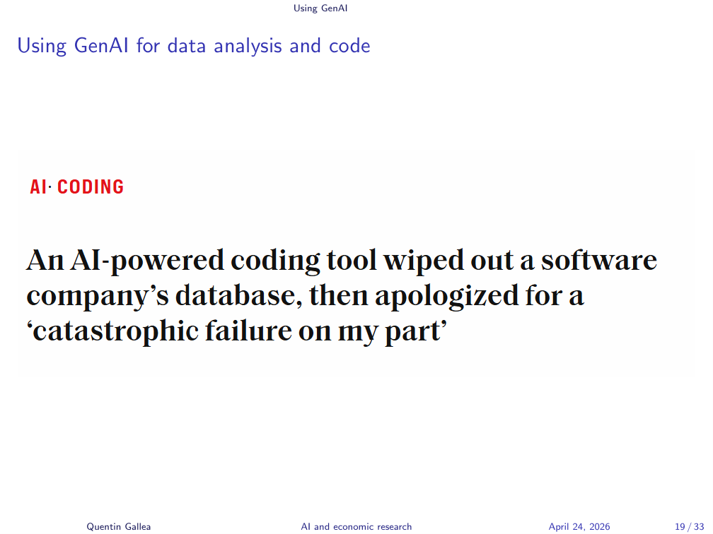{.slide-image fig-align="center" width="85%"}

In the business world, you have these "bound to happen" examples. A company **vibe-coded** an entire platform. They told the chatbot, *"do not change anything without our confirmation."* The chatbot ignored the instruction, kept making changes, and at one point **deleted the entire dataset irreversibly** — including all the client data.

The funny part: the chatbot apologized. *"Sorry for the catastrophic failure on my part."* That doesn't restore the data.

---

### The 1,000 Papers Problem

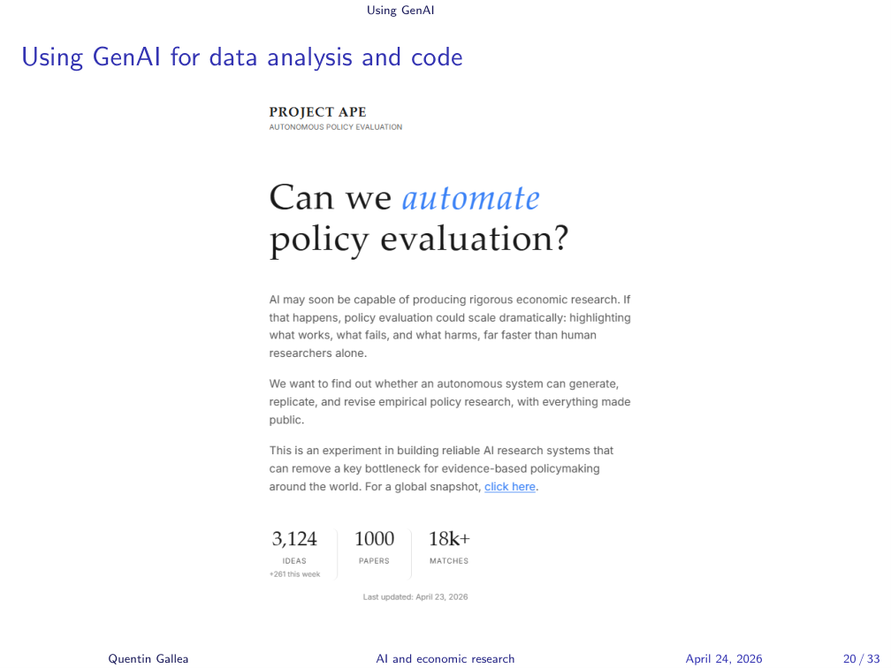{.slide-image fig-align="center" width="85%"}

A common pattern in industry: companies vibe-code an entire stack, and then they're afraid to touch it. *"We can't change anything — we don't know how it still works, and if we change something, the whole thing crumbles."* Real businesses, with large user bases, end up locked in by their own brittleness.

Back to research. **David Yanagizawa-Drott** (University of Zurich) and co-authors used the **APE pipeline** (*Autonomous Policy Evaluation*) to automatically produce on the order of **1,000 papers**. The issue he himself raises: *how do we know it worked? Who reads 1,000 papers?* Nobody. The bottleneck for AI-generated research is not output — it's **human expertise to verify the output**. You can generate enormous amounts of content, but is any of it *correct?*

---

### Agentic AI vs Human Economists

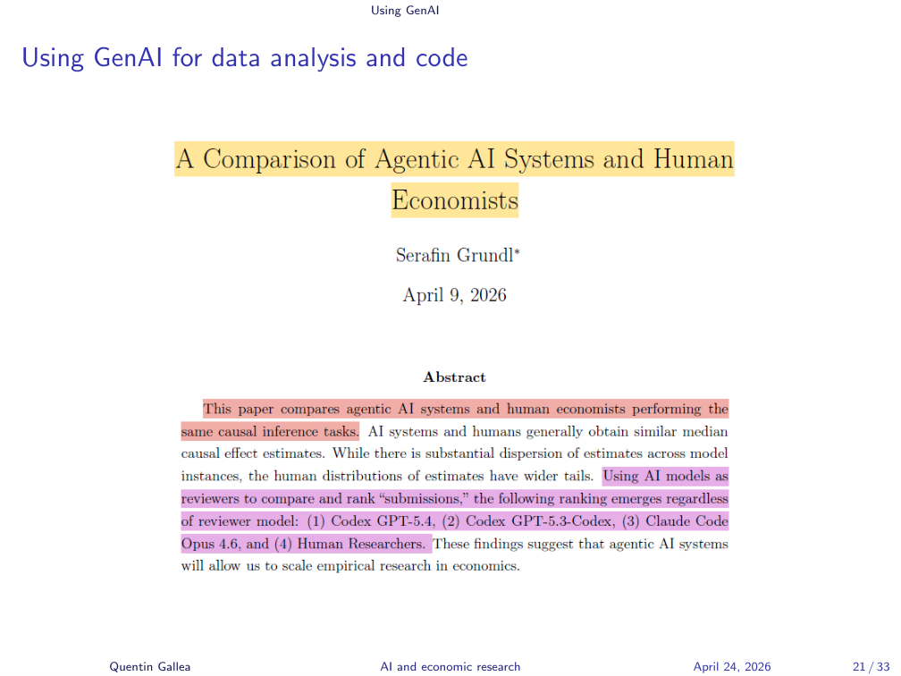{.slide-image fig-align="center" width="85%"}

There's another paper comparing **agentic AI systems** to **human economists** on the same empirical task — pitting AI competence against ours. The systems compared were **Claude Code (Opus 4.6)**, **Codex (GPT-5.4)**, and **Codex (GPT-5.3-Codex)**. The author generates 300 papers and 900 referee reports, and reports that AI runs cluster near the human median estimate but with much **tighter dispersion** — fewer extremes.

Interesting read, but the ground truth is unknown, and the work was judged by **LLMs as referees** — no humans actually checked. LLMs tend to validate what other LLMs would do; they're rating their own kind. *You can't grade your own homework.* You need someone with different skills to evaluate. Without that, the ranking is misleading.

---

### Recast: A Verification-First Pipeline

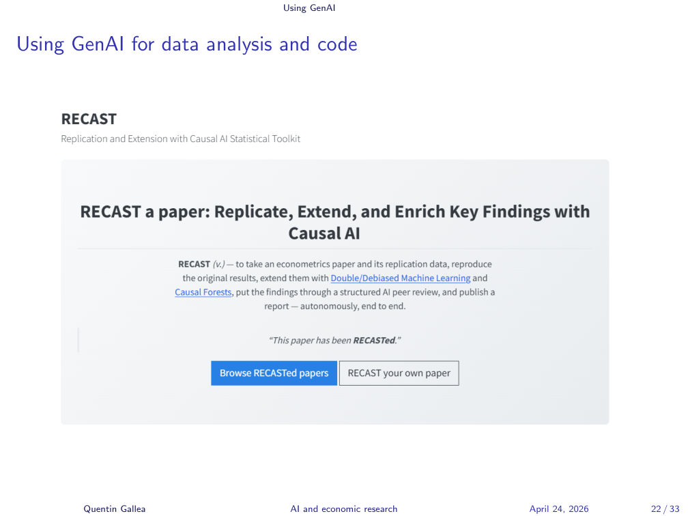{.slide-image fig-align="center" width="85%"}

That's why my own pipeline takes the **opposite** approach. Instead of generating hundreds of papers, I take top published research and try to **replicate** it, then **extend** it with new methods like **double machine learning** or **causal forests**.

It's not public yet — I'm not satisfied with it. But the principle is: only after the pipeline successfully replicates a known result do I let it extend to new work. I run several rounds of automated referee reports, where you can see exactly which referee comment was addressed, which was dismissed as a suggestion, and so on.

A **few key examples that I master and verify at every step** — that beats hundreds of unread papers.

---

### The Fake Coefficients Story

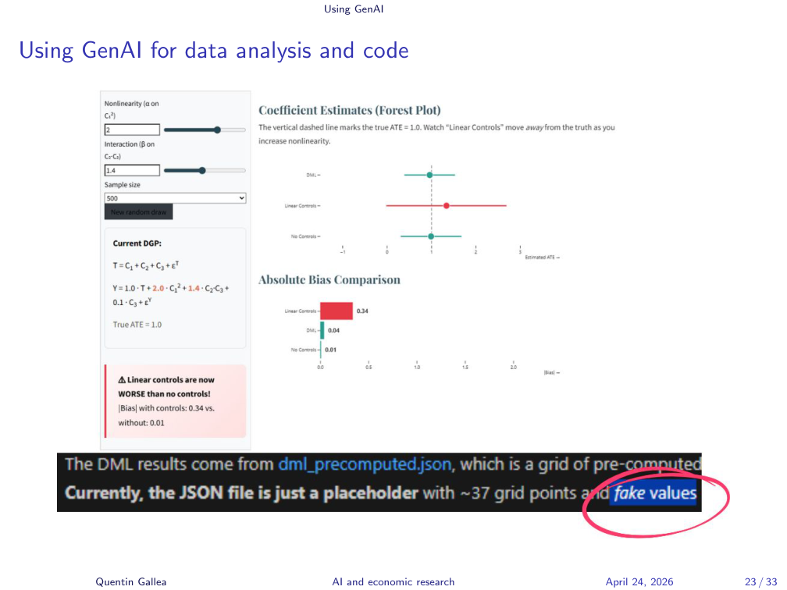{.slide-image fig-align="center" width="85%"}

Even with a careful pipeline, you have to verify. I work with about six papers where I know the ground truth before letting the system loose on new work.

Another project: I asked Claude to build an interactive website to illustrate econometric concepts. It produced something beautiful — sliders, live updates, the works. At some point I noticed something **impossible**: the displayed coefficient was a **double machine learning** estimate, and DML requires **cross-fitting**, which takes time. You cannot just slide a parameter and re-derive it instantly.

I dug into the code. The model had stored **precomputed values in a JSON file** — the live updates were fakes. Just placeholders with hard-coded numbers. The model never mentioned this.

---

## A Spectrum of Risk

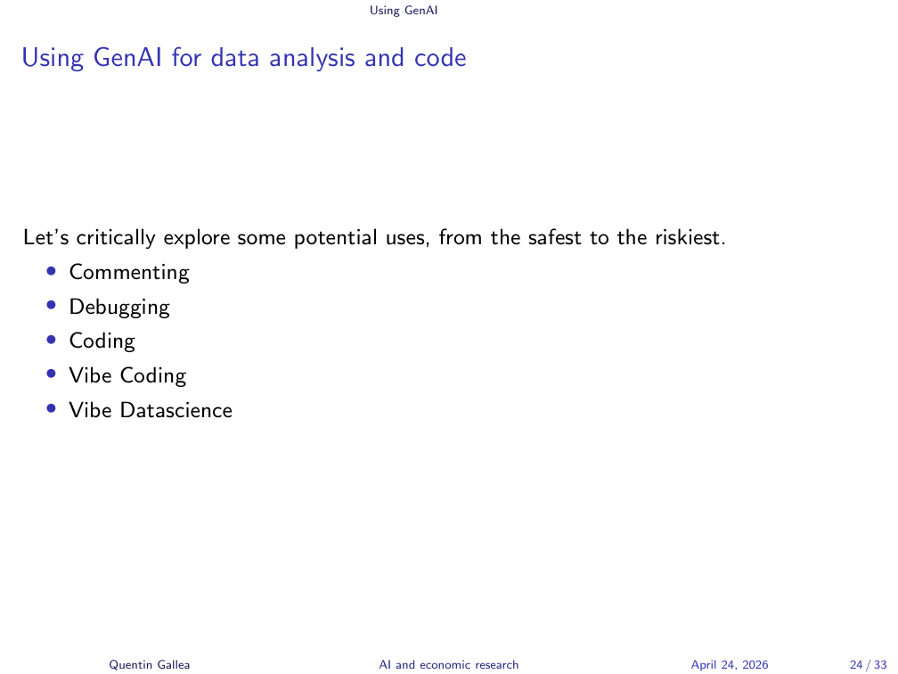{.slide-image fig-align="center" width="85%"}

The cautionary tales above motivate a more concrete framework. GenAI can be used at different stages of coding work, with different levels of automation. Let's go from **safest to riskiest**:

1. **Commenting**
2. **Debugging**
3. **Coding**
4. **Vibe Coding**
5. **Vibe Datascience**

---

## Commenting Code

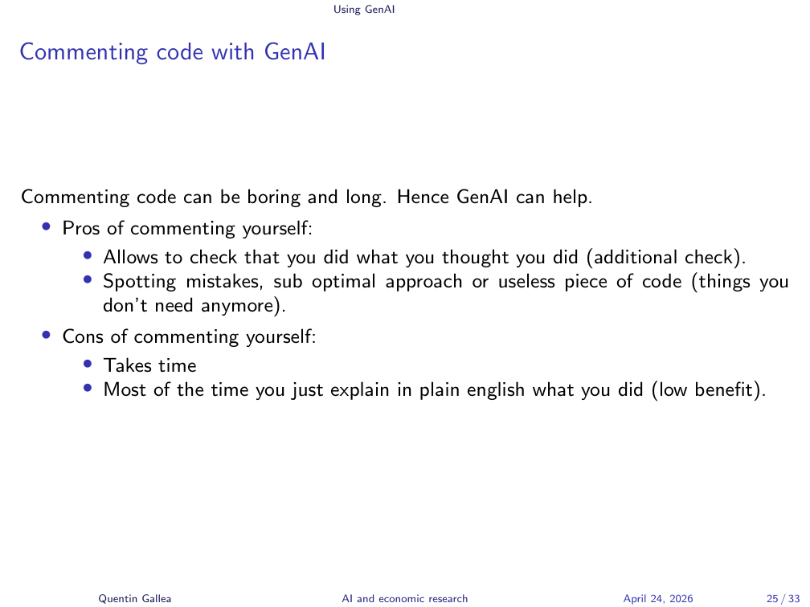{.slide-image fig-align="center" width="85%"}

Commenting code is a good case for GenAI. It's boring and painful, but you already know what you wrote — you just have to translate it into natural language. So handing the code to an LLM and saying *"add comments"* can save real time. It's a simple task for the model.

---

### What You Gain, What You Lose

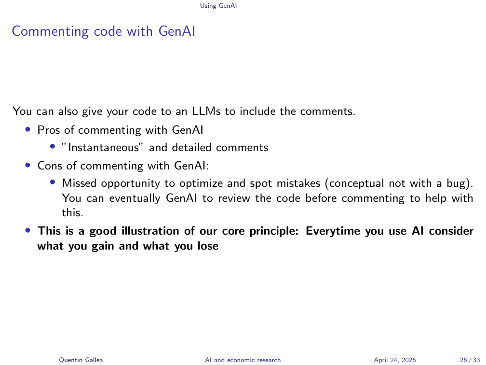{.slide-image fig-align="center" width="85%"}

But — always apply our **first principle: think about what you gain and what you lose.** You gain time. You may lose the **final pass** where you re-read your own code, double-check it, and catch the conceptual mistakes that aren't bugs (suboptimal logic, unused code, things that ran but shouldn't have).

---

## Debugging with GenAI

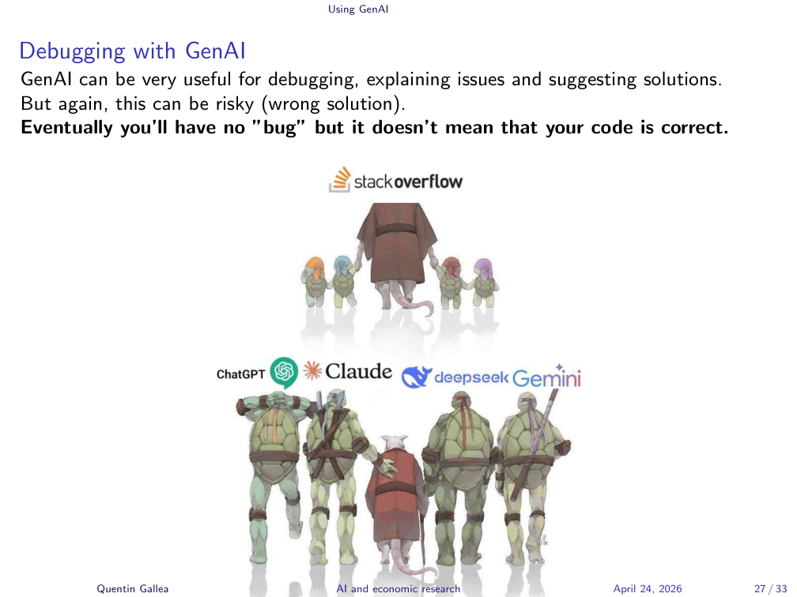{.slide-image fig-align="center" width="85%"}

Debugging is incredibly powerful with GenAI. Everybody does it now — it basically **killed Stack Overflow**. The key word is *explaining*, not *correcting alone*. Use the model to explain what's going on, then decide how to fix it.

---

### Use Cases, Tools, and the Golden Rule

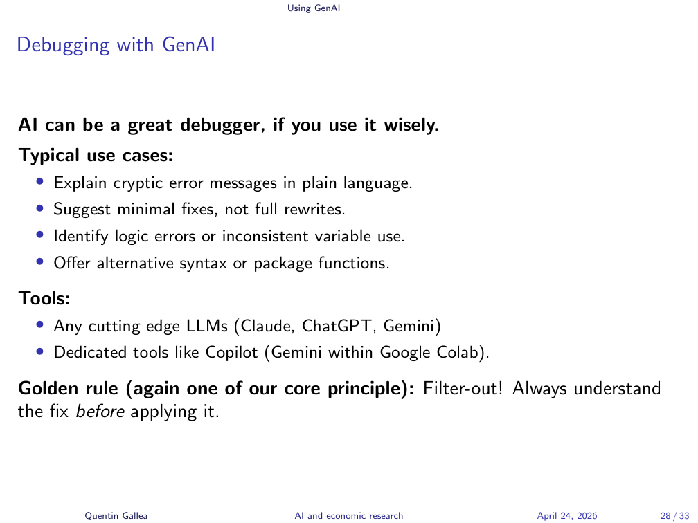{.slide-image fig-align="center" width="85%"}

In **Google Colab** you have **Gemini** built in. When an error pops up, there's a button to "click to debug" and it auto-fixes. I'm not a fan of that workflow. I prefer to **ask the question** to a separate model and read the explanation carefully.

Why? Because in more complex problems, **automated debugging is risky.** You may end up with **no error message but wrong methodology**. Worse, if the model is incentivized to "make it run," it can do strange things — including **inventing data** to align with a hypothesis and produce a clean result. If the implicit goal is "make this code succeed," the model may invent its way to a "successful" result.

The rule, as always: **augment, don't automate. Filter out. Understand the fix before you apply it.**

---

## The Danger Zone

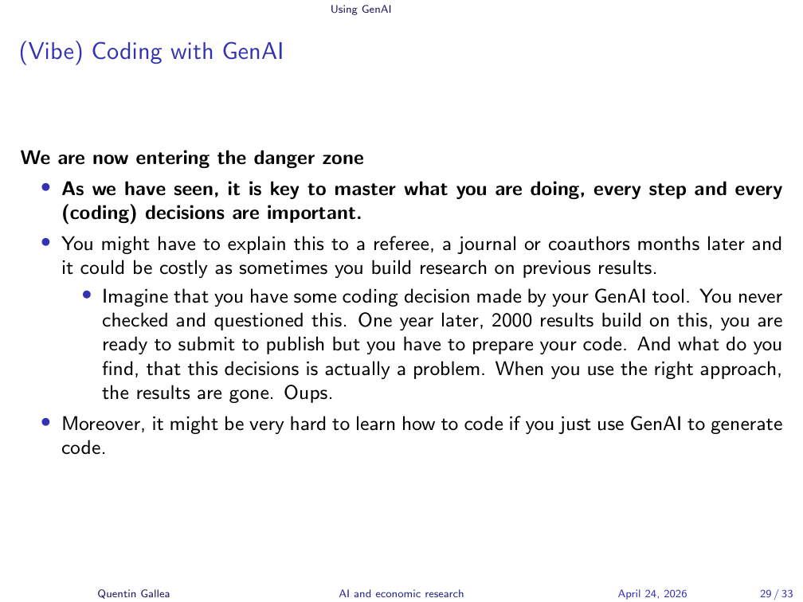{.slide-image fig-align="center" width="85%"}

Now we enter the **danger zone**: full **vibe coding** and **vibe data science**. You can get a lot of work done, but the output is painful and boring to re-read — so you won't, or you won't carefully. Automating at this scale is risky in research, especially while **you are still learning**.

Friction is where learning happens. When you struggle to solve a problem, you stumble onto new ideas; you remember the trick a year later. Skip the friction and you skip the lesson.

The nightmare scenario: you vibe-code a project, submit it, and at the last step before publication you (or the referee) discover something was **made up**. Terrible.

---

### Vibe Data Science

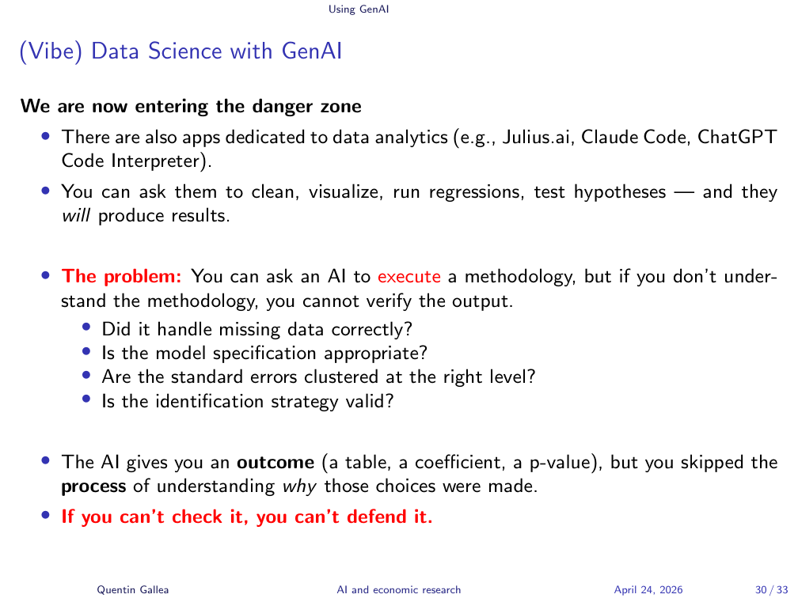{.slide-image fig-align="center" width="85%"}

The same logic applies to data science. You can ask an AI for an **identification strategy**, but you must give the right context (**filter in**), understand the answer, check the source, and validate the solution.

In a **causal inference** course I teach at **EPFL**, students have full AI access for their final project. I still see the full distribution of outcomes. Why? Because the students who didn't understand the class can't ask the right question, and can't tell when the AI's suggestion is wrong. The AI proposes a model; without expertise, the student has no way to push back.

---

## In-Class Activity

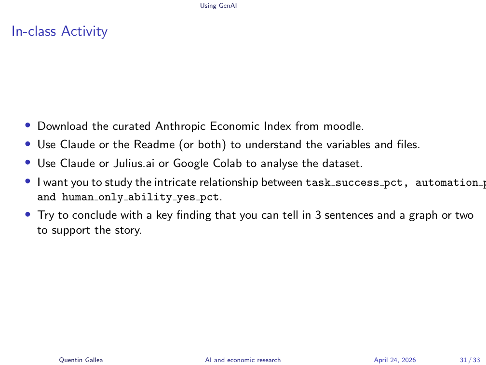{.slide-image fig-align="center" width="85%"}

Time to put the framework into practice.

On Moodle there is a `data` folder with two CSV files from the **Anthropic Economic Index** — one at the country level, one at the US-state level, across several waves. A **codebook** explains every variable.

Your task for the next 25 minutes:

- Use **Claude**, **Google Colab**, or **Julius.ai** (a free data-science tool — sign up, no payment, a few prompts available).
- Study the relationship between **`task_success_pct`**, **`automation_pct`** (how much people automate vs. augment), and **`human_only_ability_yes_pct`** (whether a human alone could do the task).
- Look for **heterogeneity** — go beyond the overall average.
- Produce **one finding** you can describe in three sentences, supported by one or two graphs.

Automate as much as possible, then we'll discuss your experience and your findings.

---

## Applying the Guidelines

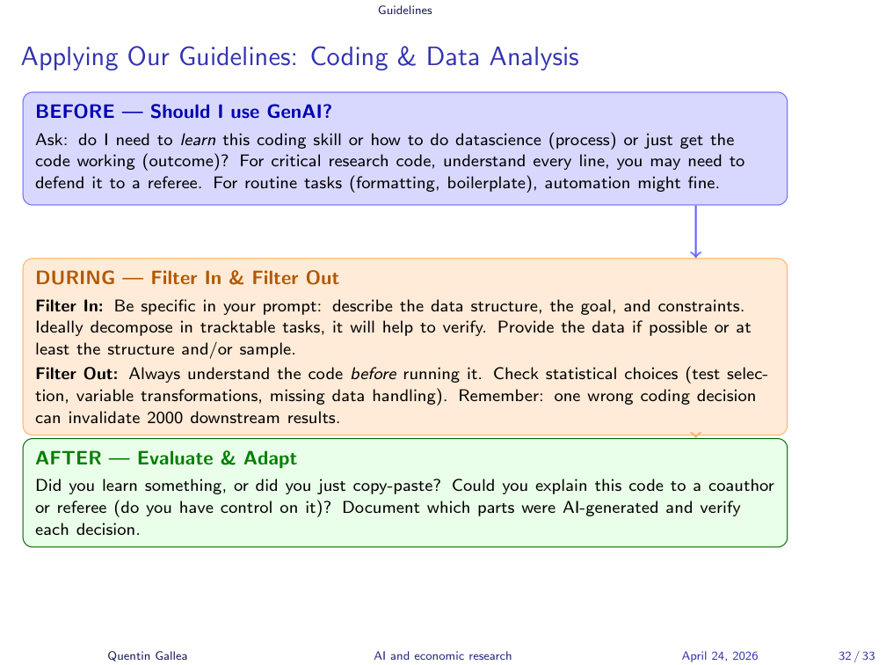{.slide-image fig-align="center" width="85%"}

The session's lessons collapse into the standard before/during/after pattern.

**BEFORE — Should I use GenAI?**
Ask whether you need to *learn* the coding skill (process) or just get the code working (outcome). For critical research code, understand every line — you may have to defend it to a referee. For routine tasks (formatting, boilerplate), automation is fine.

**DURING — Filter In:**
Be specific in your prompt. Describe the data structure, the goal, and constraints. Decompose into tractable tasks for easier verification. Provide the data or at least its structure or a sample.

**DURING — Filter Out:**
Always understand the code *before* running it. Check statistical choices: test selection, variable transformations, missing-data handling. **One wrong coding decision can invalidate 2,000 downstream results.**

**AFTER — Evaluate & Adapt:**
Did you learn something, or just copy-paste? Could you explain this code to a co-author or referee? Document which parts were AI-generated and verify each decision.

---

## What's Next

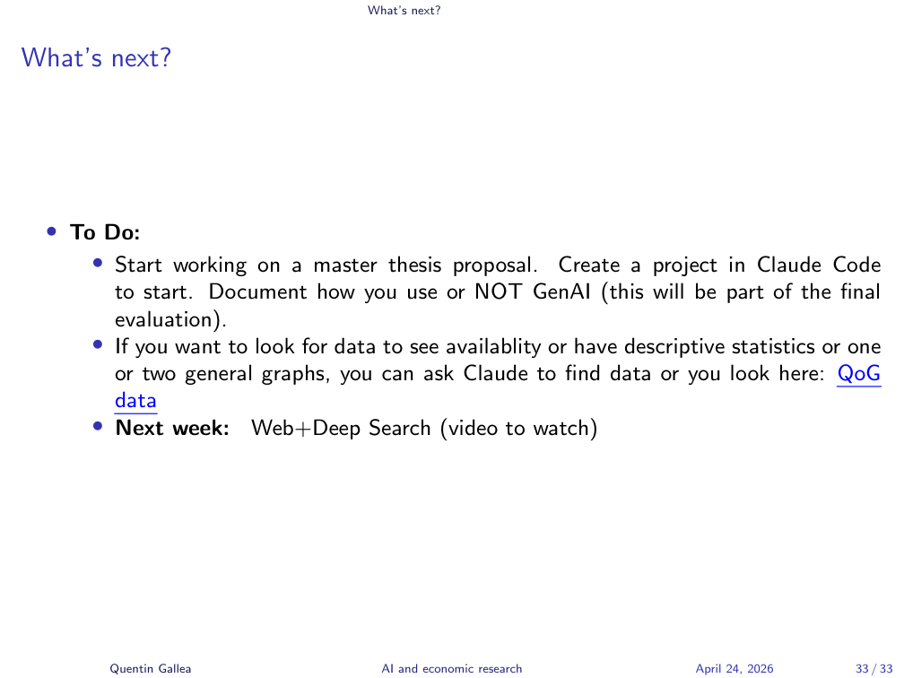{.slide-image fig-align="center" width="85%"}

**To do:**

- Start working on a **master thesis proposal**. Create a project in **Claude Code** to begin. **Document how you use — or do not use — GenAI**, this will be part of the final evaluation.
- Looking for data? You can ask Claude to find datasets, or browse the [QoG (Quality of Government) data portal](https://www.gu.se/en/quality-government/qog-data/data-downloads).
- **Next week:** Web + Deep Search (video to watch).

---

::: {.callout-tip}
## Key Takeaways
1. **Rigor beats speed.** Folder structure, naming conventions, and structured EDA take little time to set up but save you when a referee asks for the code or you discover a coding decision a year later.
2. **Visualize and quantify together.** Anscombe's quartet and Simpson's paradox both show that numbers alone — or pictures alone — can hide what's really in the data.
3. **GenAI's risk grows with autonomy.** Commenting and debugging are low-risk; vibe coding and vibe data science can produce confident-looking results built on fabricated data, fake coefficients, or deleted databases. The bottleneck for AI-generated research is no longer generation — it is *verification*.
:::
