::: {.callout-note}
## Lecture Overview
This session focuses on **Deep Research mode** — the agentic LLM workflow that ships in Claude, ChatGPT, Gemini and Perplexity. We define what it is, place it inside a five-layer taxonomy of "AI search," contrast it with the literature-review tools from week 5, walk through two real examples, and then spend a long part on the things that go wrong: hallucinated URLs, SEO-biased sources, no methodological judgment, replicability failure, and the *Mirage of Synthesis*. We close with a short prompting playbook and a defensible workflow.
:::

## Setup

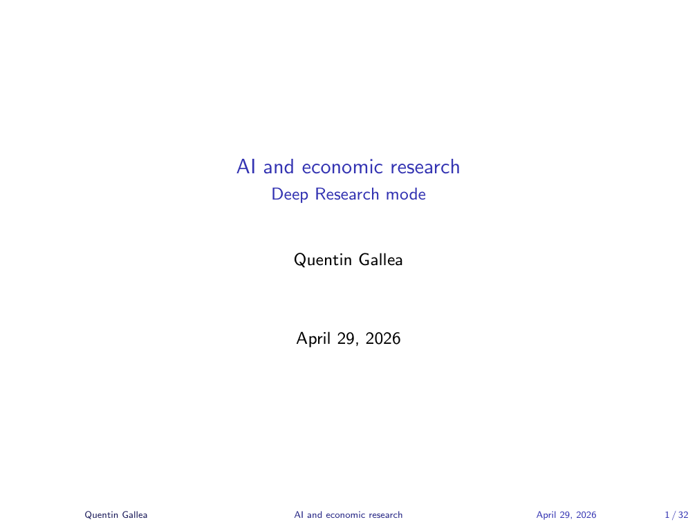{.slide-image fig-align="center" width="85%"}

---

### Today's Agenda

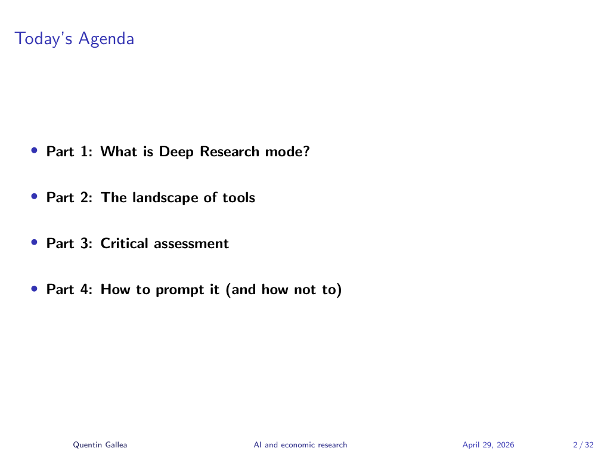{.slide-image fig-align="center" width="85%"}

The class is split into four parts. **Part 1** defines Deep Research mode and explains how it actually works under the hood. **Part 2** tours the landscape of tools and asks where this category sits relative to the literature-review tools we saw in week 5. **Part 3** is where I become cautious — five concrete failure modes that matter for academic work. **Part 4** is the practical part: how to brief one of these agents so the output is worth your time.

---

## Part 1: What is Deep Research mode?

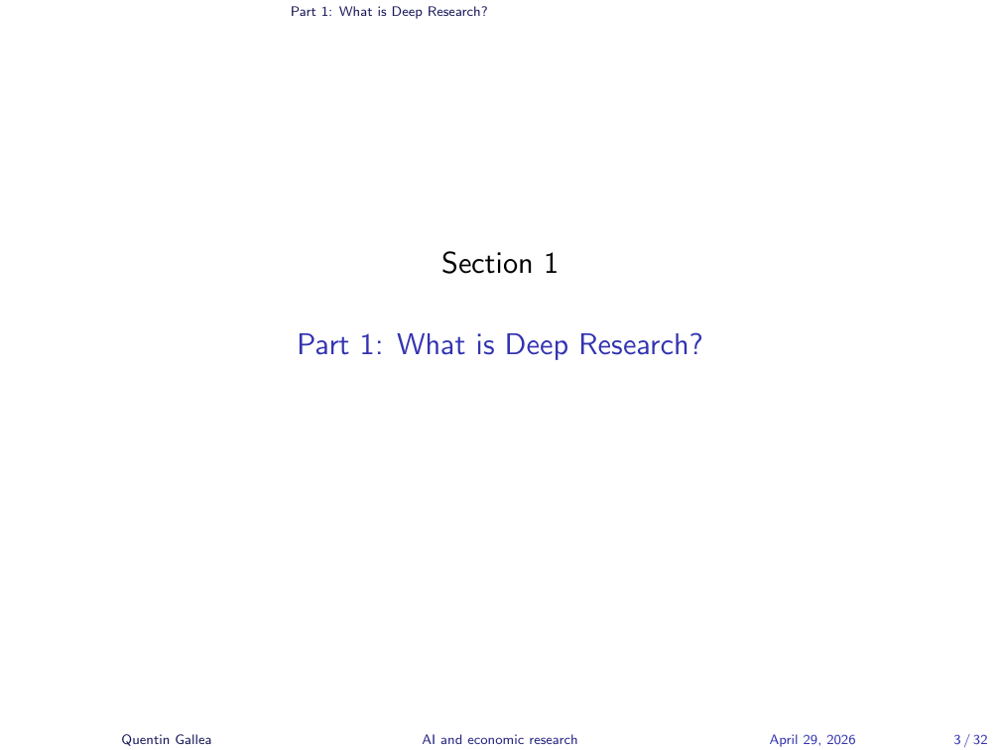{.slide-image fig-align="center" width="85%"}

---

### Definition

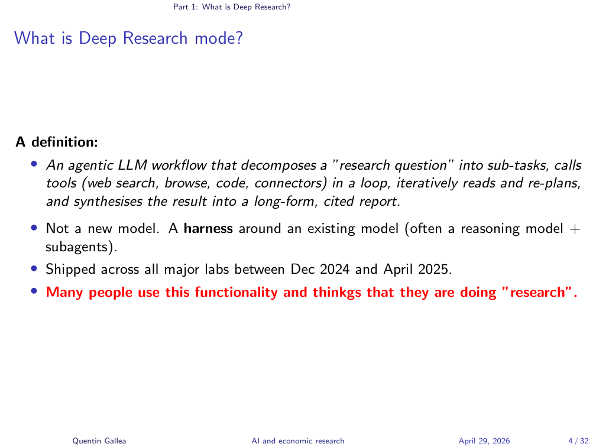{.slide-image fig-align="center" width="85%"}

**Deep Research mode** is an *agentic* LLM workflow: the model decomposes a question, calls tools (web search, browse, code, connectors) in a loop, iteratively reads and re-plans, and writes a long-form cited report. Three things to remember. First, this is **not a new model** — it is a *harness* around an existing model, often a reasoning model coordinating a few subagents. Second, the category went from non-existent to standard in four months (Dec 2024 to April 2025). Third, lots of people now type a question into this thing and tell themselves they are *doing research*. That confusion is the reason for this whole class.

---

### Single Prompt vs. Deep Research

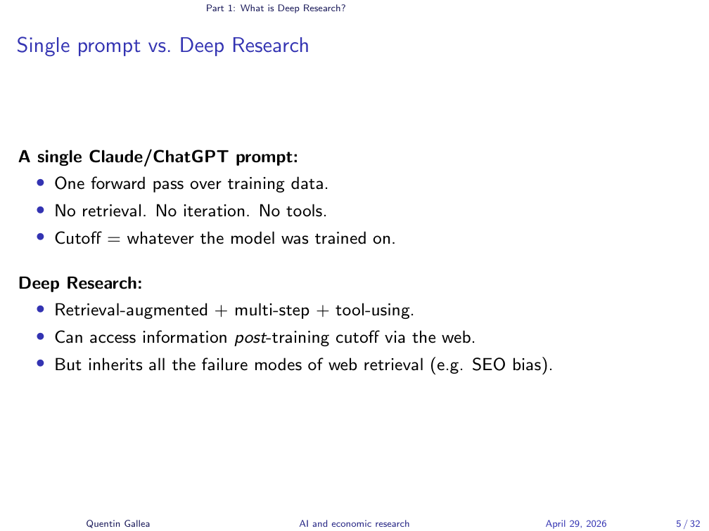{.slide-image fig-align="center" width="85%"}

A regular Claude or ChatGPT prompt is a single forward pass over the model's training data — no retrieval, no iteration, frozen at the training cutoff. Deep Research is the opposite: **retrieval-augmented, multi-step, and tool-using**. The good news is that it can pull information published *after* the training cutoff. The bad news is it inherits every problem of web retrieval — SEO bias, broken links, content farms, paywalls — and we will spend Part 3 unpacking those.

---

### The Agentic Loop

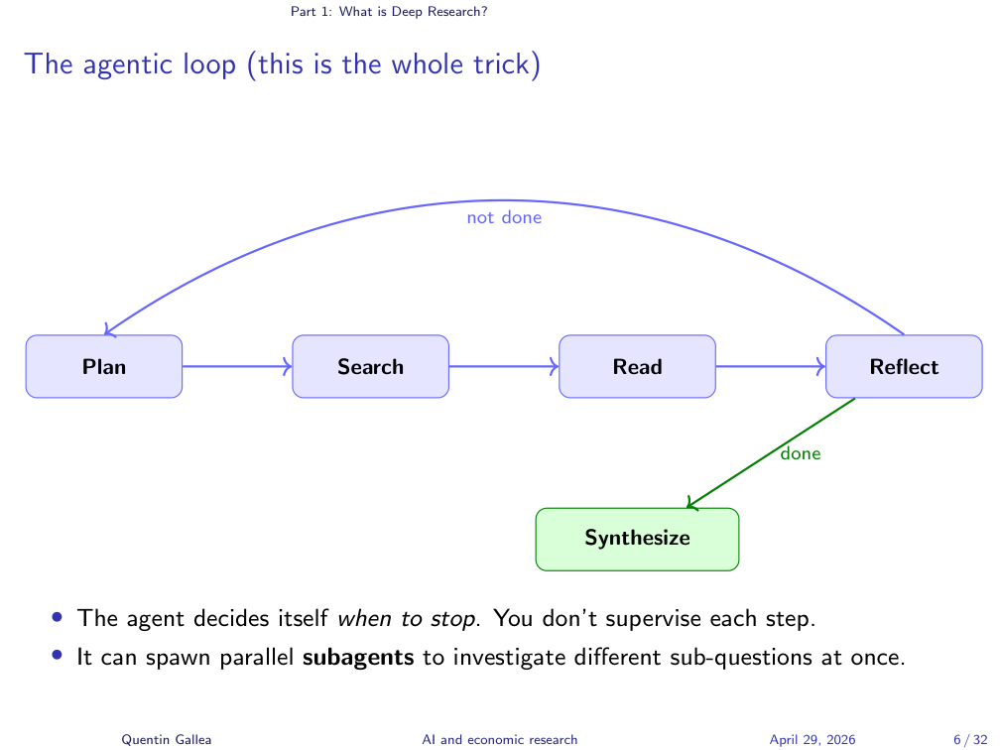{.slide-image fig-align="center" width="85%"}

This loop — **plan → search → read → reflect**, then either go back to plan or move on to **synthesize** — is the entire trick. The agent decides itself when it has enough material to stop. You don't supervise each step; you set it running and walk away. A useful detail: the agent can *fan out* by spawning **subagents** that investigate different sub-questions in parallel, each with its own context window. We will see that architecture next.

---

### What's Actually Happening: Lead Agent + Subagents

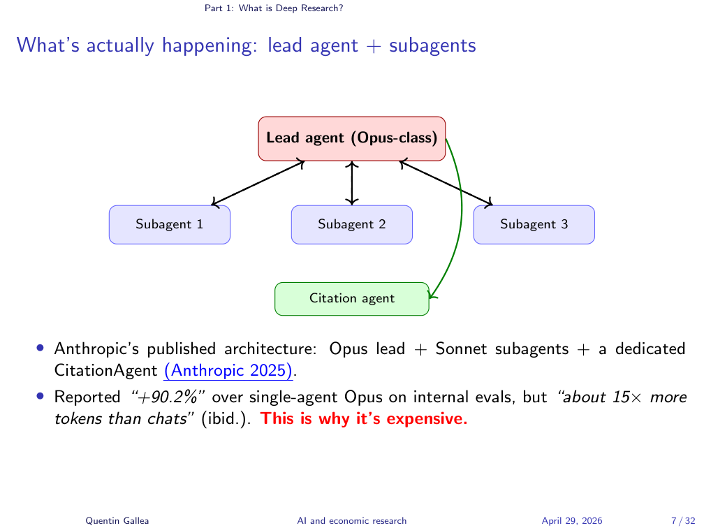{.slide-image fig-align="center" width="85%"}

Anthropic published the architecture of Claude Research in their [engineering blog](https://www.anthropic.com/engineering/multi-agent-research-system): an Opus-class **lead agent** plans the investigation and dispatches several Sonnet-class **subagents**, each digging on one aspect of the question. A dedicated **Citation Agent** then walks through the final report and attaches a URL to each claim. Two reported numbers from that post are worth remembering: **+90.2%** over a single-agent Opus baseline on Anthropic's internal eval, and **about 15× more tokens** than a normal chat. The first is why these tools work; the second is why they are expensive.

---

## Part 2: The Landscape

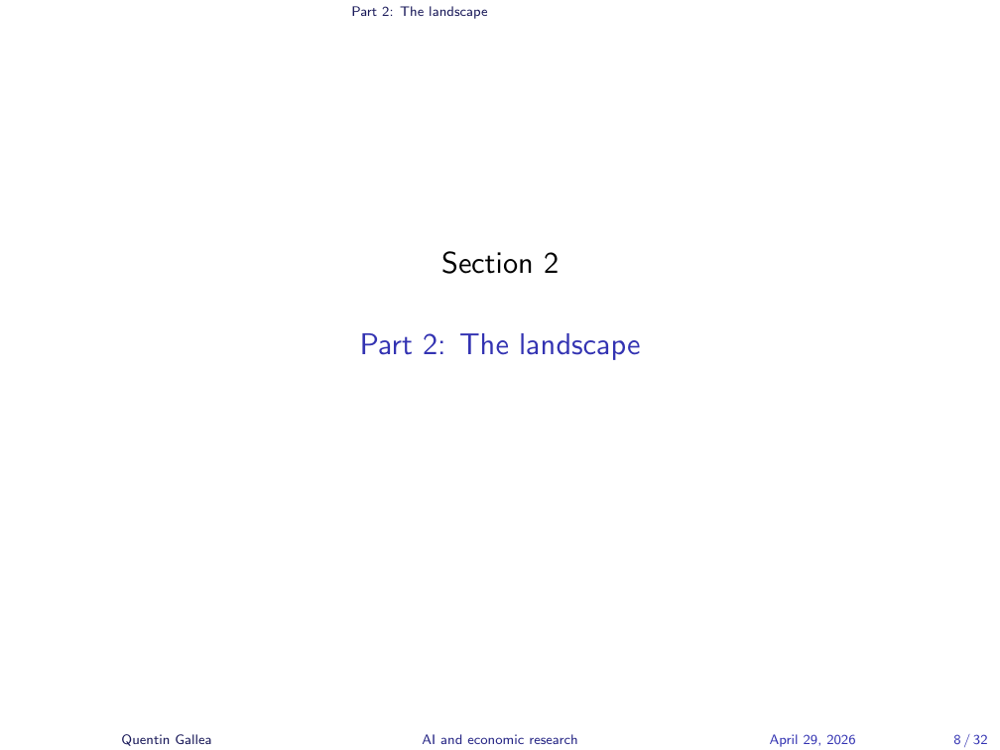{.slide-image fig-align="center" width="85%"}

---

### Five Layers of "AI Search"

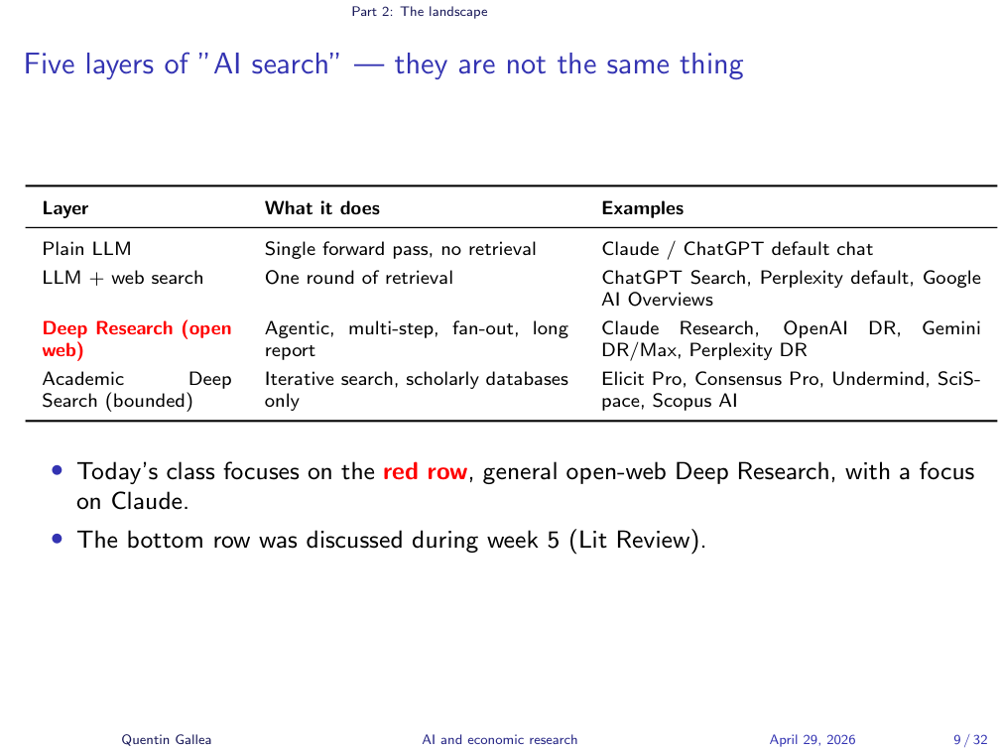{.slide-image fig-align="center" width="85%"}

Not every "AI search box" is the same thing, and **mixing them up is the most common student mistake**. There is the plain LLM (no retrieval), the LLM plus one round of web search (ChatGPT Search, Google AI Overviews), the **agentic open-web Deep Research** layer that we focus on today, and the academic-bounded version we discussed in week 5 (Elicit, Consensus, SciSpace, Scopus AI). Today's red row is *open* — the agent goes anywhere on the web. The bottom row is *bounded* — the agent only sees scholarly databases. The risk profile of those two rows is very different, and I will come back to this on the fabrication slide.

---

### Claude Research

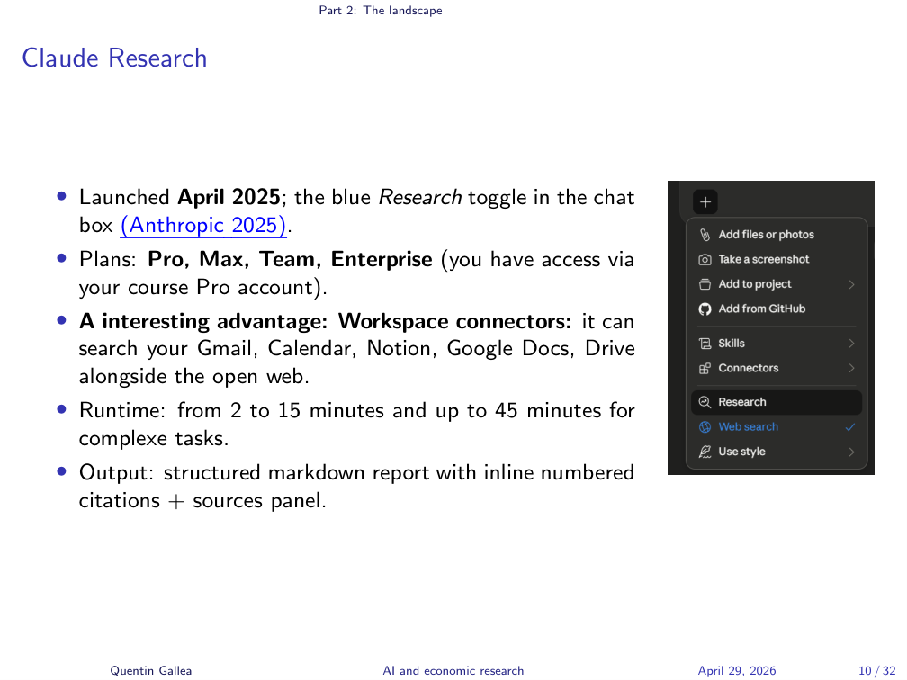{.slide-image fig-align="center" width="85%"}

Claude Research is the blue **Research** toggle in the chat box, available on Pro / Max / Team / Enterprise (you have it via the course Pro account). The genuine edge over the competition is **Workspace connectors**: it can search your Gmail, Calendar, Notion, Drive and Docs alongside the open web. Runtime ranges from a couple of minutes for simple prompts to roughly 45 minutes for hard ones. Output is a structured Markdown report with inline numbered citations and a sources panel.

---

### The Four Side-by-Side

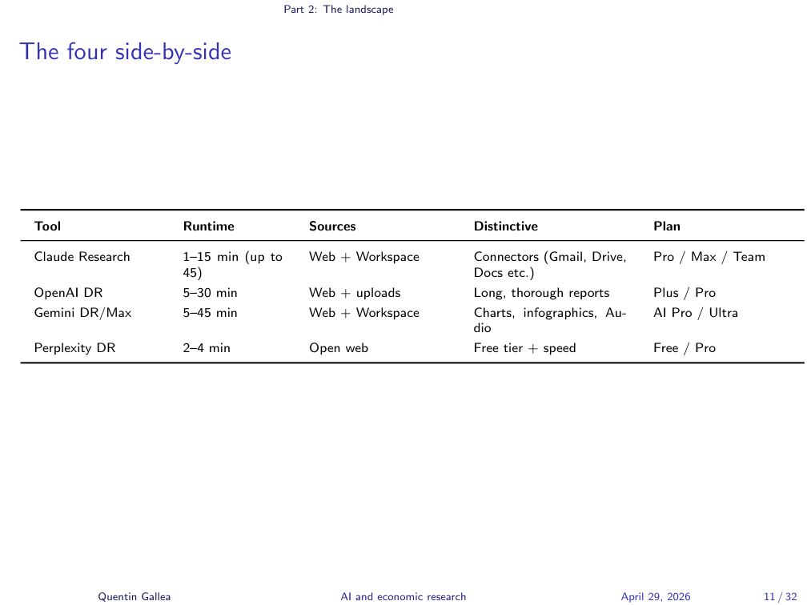{.slide-image fig-align="center" width="85%"}

The four flagship Deep Research tools differ less than the marketing suggests. **OpenAI Deep Research** runs the longest and most thorough reports. **Gemini Deep Research / Max** has the most polished outputs (native charts, audio overviews, Google Docs export) and the highest plan tier. **Perplexity Deep Research** is the fastest and the only one with a meaningful free tier — useful for triangulation. **Claude Research** wins on connectors. For your thesis, Claude + Perplexity (free) is a sensible pair to start with.

---

## How Deep Research Differs from Lit-Review Tools

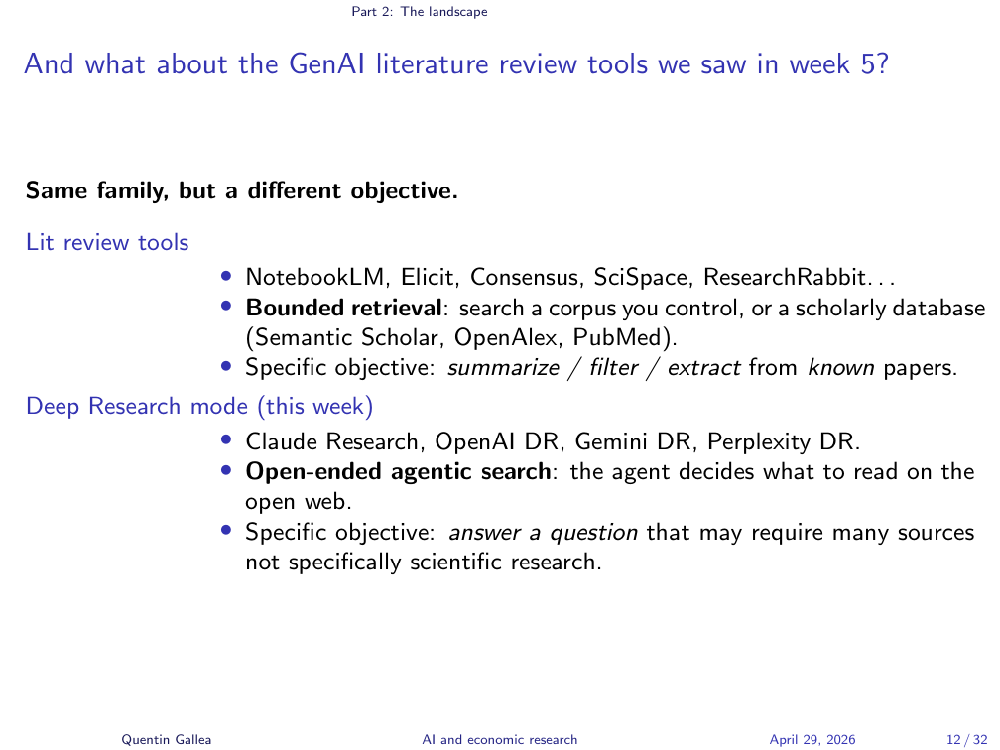{.slide-image fig-align="center" width="85%"}

This is the slide some of you were waiting for. The lit-review tools we covered in week 5 (NotebookLM, Elicit, Consensus, SciSpace, ResearchRabbit) are in the **same family** as Deep Research, but they have a **different objective**. They do *bounded* retrieval over a corpus you control or a scholarly database — Semantic Scholar, OpenAlex, PubMed. The objective is to *summarize, filter, extract* from papers you already roughly know about. Deep Research mode is *open-ended*: you give it a question, the agent decides what to read on the open web, and it tries to answer beyond what is strictly in the academic literature.

---

### The Crucial Difference: Fabrication Risk

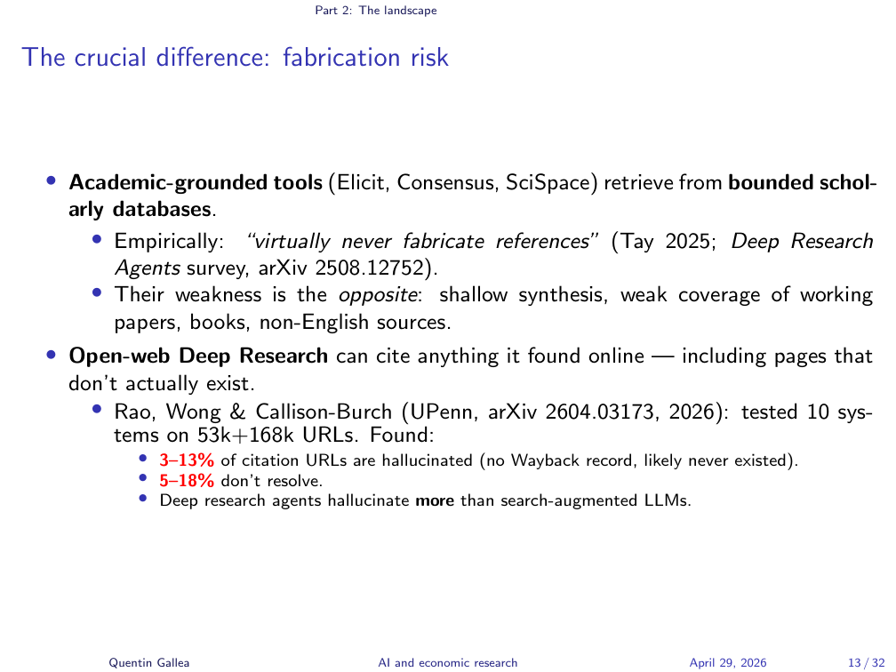{.slide-image fig-align="center" width="85%"}

The risk profile is not the same. Academic-grounded tools retrieve from bounded scholarly databases and **virtually never fabricate references** (Tay 2025; *Deep Research Agents* survey, arXiv 2508.12752). Their weakness is the opposite — shallow synthesis, weak coverage of working papers and books. Open-web Deep Research can cite anything it found online, including pages that don't exist. Rao, Wong & Callison-Burch (UPenn, arXiv 2604.03173, 2026) tested ten systems on more than 200,000 URLs and found **3–13% of cited URLs are hallucinated** and **5–18% don't resolve** — and Deep Research agents hallucinate *more* than plain search-augmented LLMs. That is the cost of going open.

---

### When to Use Which

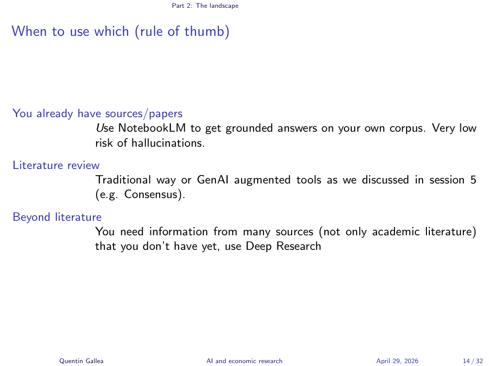{.slide-image fig-align="center" width="85%"}

Three cases. If you **already have papers**, use NotebookLM on your own corpus — almost zero hallucination risk. If you are doing a **literature review** specifically, traditional methods plus the GenAI-augmented tools from week 5 (Consensus, Elicit) are the right setup. If you need **information beyond literature** — recent code, package recommendations, policy reports, blog discussions, news — that is where Deep Research earns its place. The key is to match the tool to the question, not to default to the most powerful one.

---

## Examples

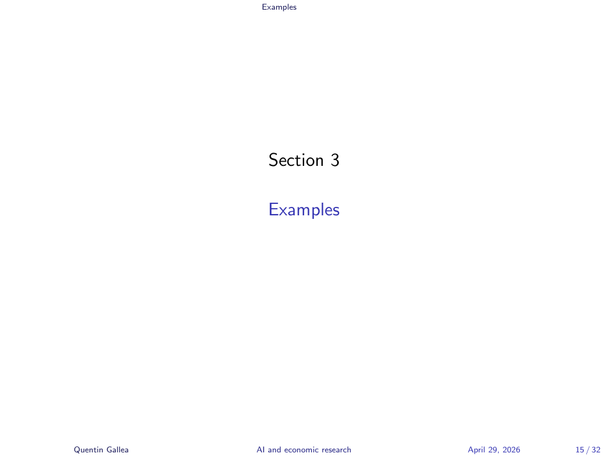{.slide-image fig-align="center" width="85%"}

---

### Example 1: A Question That Needs More Than Papers

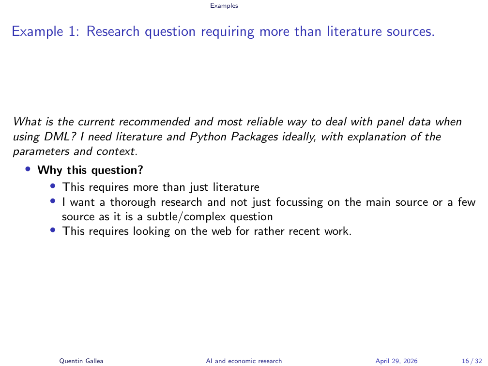{.slide-image fig-align="center" width="85%"}

*"What is the current recommended and most reliable way to deal with panel data when using DML? I need literature and Python packages, ideally with explanation of the parameters and context."* This is a good Deep Research prompt for three reasons. It needs more than just papers (you want package documentation, code examples, recent benchmarks). It is subtle enough that you don't want a single source — you want triangulation. And the literature on it is recent, so coverage from a model's training data alone would be patchy.

---

### Example 2: Preparing a Class

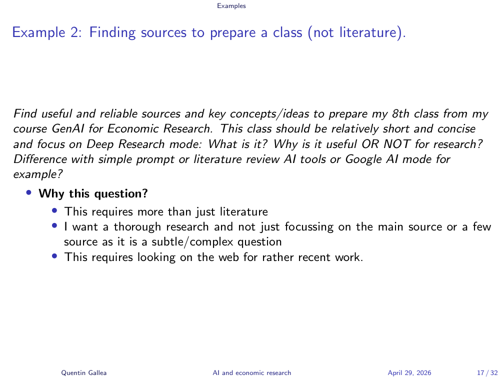{.slide-image fig-align="center" width="85%"}

*"Find useful and reliable sources and key concepts to prepare my 8th class on Deep Research mode for my GenAI for Economic Research course. What is it? Why is it useful or not for research? Difference with simple prompts, lit-review AI tools, or Google AI mode?"* Yes — I used Deep Research to prepare this very class. It is a good test case: comparative, recent, requires aggregating across vendor blogs, academic preprints, and tool-comparison journalism. The structure of *this* lecture is partly the result of that scoping pass — but every claim was then verified manually against primary sources.

---

## Part 3: Why I'm Cautious

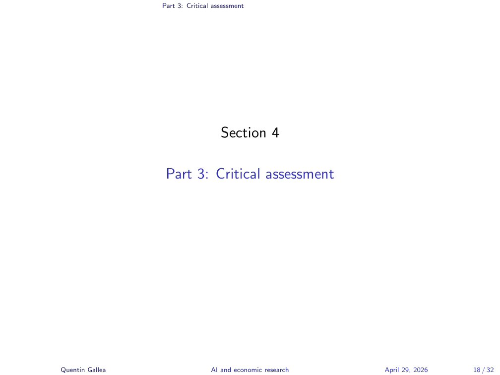{.slide-image fig-align="center" width="85%"}

---

### Five Failure Modes

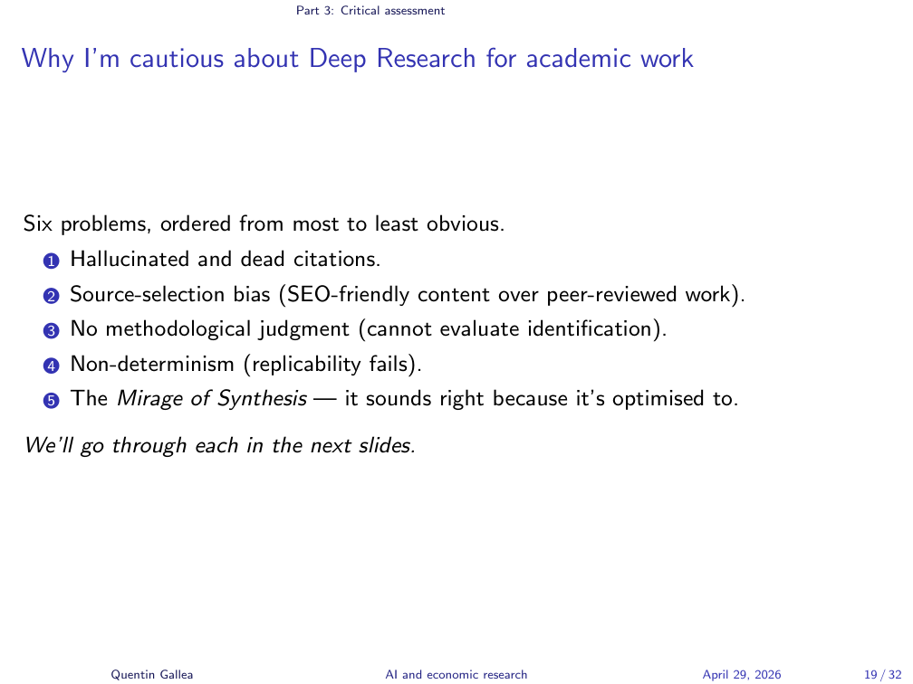{.slide-image fig-align="center" width="85%"}

Five things go wrong with Deep Research, ordered roughly from most obvious to most subtle: **(1)** hallucinated and dead citations, **(2)** source-selection bias toward SEO-friendly content, **(3)** no methodological judgment — the agent can list papers but cannot evaluate identification, **(4)** non-determinism, which breaks replicability, and **(5)** the **Mirage of Synthesis** — reports that *sound* right because the format is optimised to sound right. Each gets one slide.

---

### Limit 1: Hallucinated and Dead Citations

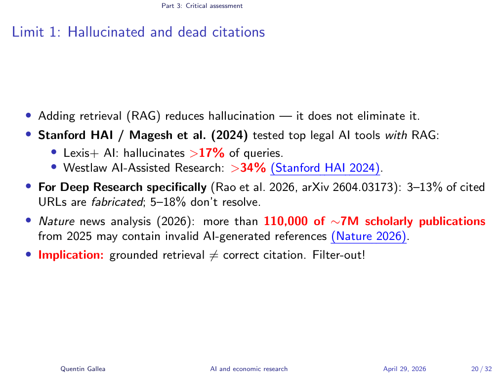{.slide-image fig-align="center" width="85%"}

Adding retrieval (RAG) reduces hallucination — it does not eliminate it. The Stanford HAI study by Magesh et al. (2024) tested top legal-AI tools *with* RAG and found Lexis+ AI hallucinating in over **17%** of queries and Westlaw AI-Assisted Research in over **34%**. For Deep Research specifically, Rao et al. (2026, arXiv 2604.03173) report **3–13%** fabricated URLs and **5–18%** non-resolving links. *Nature*'s 2026 news analysis estimates that **more than 110,000 of ~7M scholarly publications from 2025 may already contain invalid AI-generated references**. Implication: grounded retrieval ≠ correct citation. **Filter out.**

---

### Limit 2: Source-Selection Bias

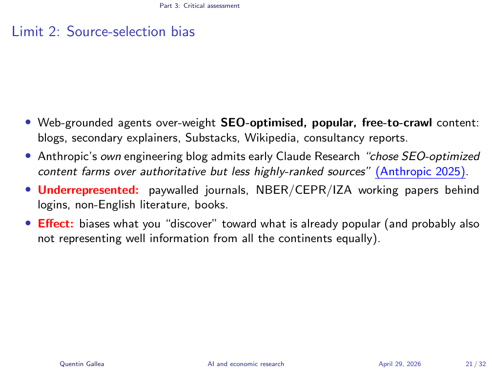{.slide-image fig-align="center" width="85%"}

Web-grounded agents over-weight what is **easy to crawl and well-indexed**: blogs, secondary explainers, Substacks, Wikipedia, consultancy reports. Anthropic's *own* engineering blog admits that early Claude Research *"chose SEO-optimized content farms over authoritative but less highly-ranked sources."* The systematic underrepresentation goes the other way: paywalled journals, NBER / CEPR / IZA working papers behind logins, non-English literature, books. The effect is that "what you discover" gets biased toward what is already popular — and probably toward what is already English-speaking and Western.

---

### Limit 3: No Methodological Judgment

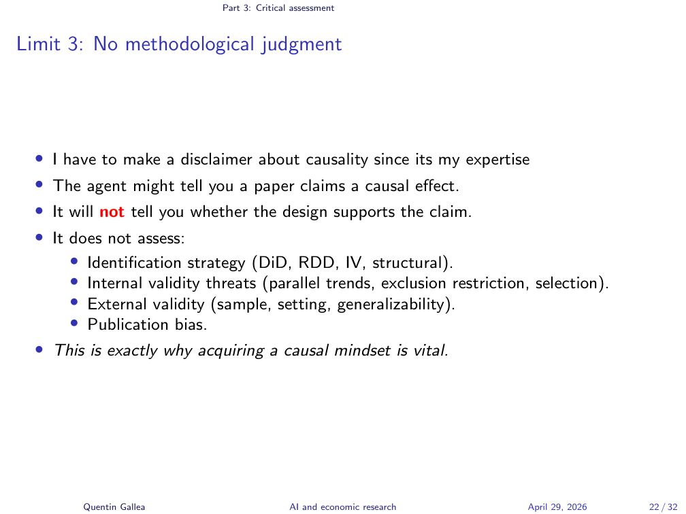{.slide-image fig-align="center" width="85%"}

A short disclaimer — causality is my expertise, so this slide is the one I care about most. The agent will tell you that a paper claims a causal effect. It will *not* tell you whether the **identification strategy** supports the claim, whether parallel trends are plausible, whether the instrument is excludable, whether the sample selects on the outcome, or whether the result generalizes. None of that is in its training objective. This is precisely why we have spent so much of this course on the *causal mindset* — the tool can do the reading, but you have to do the judging.

---

### Limit 4: Replicability Fails

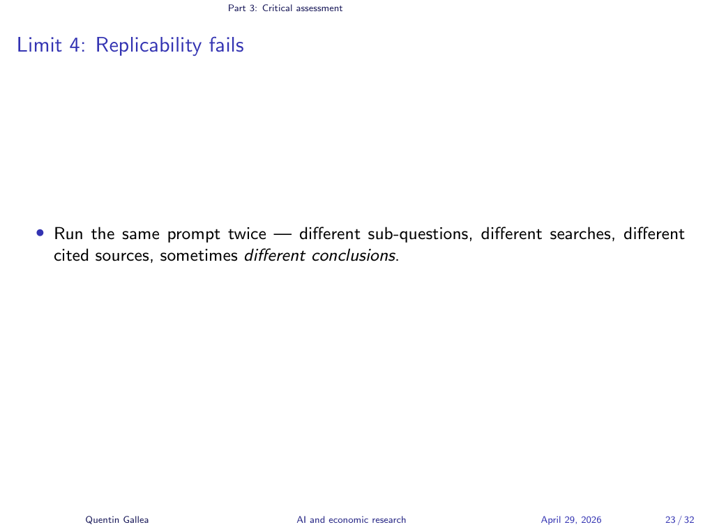{.slide-image fig-align="center" width="85%"}

Run the same prompt twice and you will get different sub-questions, different searches, different cited sources, and sometimes different conclusions. There is no equivalent of "version 1.0 of this paper" — the run is gone. For empirical economics, where reproducibility is the standard we hold each other to, this is a real problem. At minimum: log the prompt, the date, the tool, the model, and save the report.

---

### Limit 5: The Mirage of Synthesis

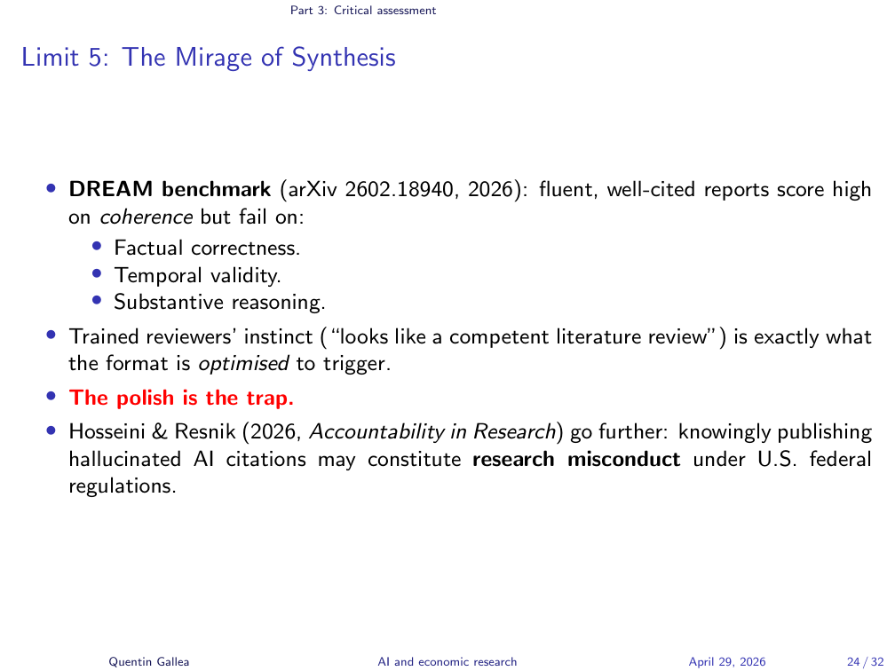{.slide-image fig-align="center" width="85%"}

The most insidious failure. The **DREAM benchmark** (arXiv 2602.18940, 2026) shows that fluent, well-cited Deep Research reports score high on *coherence* but fail on factual correctness, temporal validity, and substantive reasoning. Trained reviewers' instinct — *"this looks like a competent literature review"* — is exactly what the format is *optimised* to trigger. The polish is the trap. Hosseini & Resnik (2026, *Accountability in Research*) go further: knowingly publishing hallucinated AI citations may constitute **research misconduct** under U.S. federal regulations. That applies to a master's thesis too.

---

## Korinek's Framing for Economists

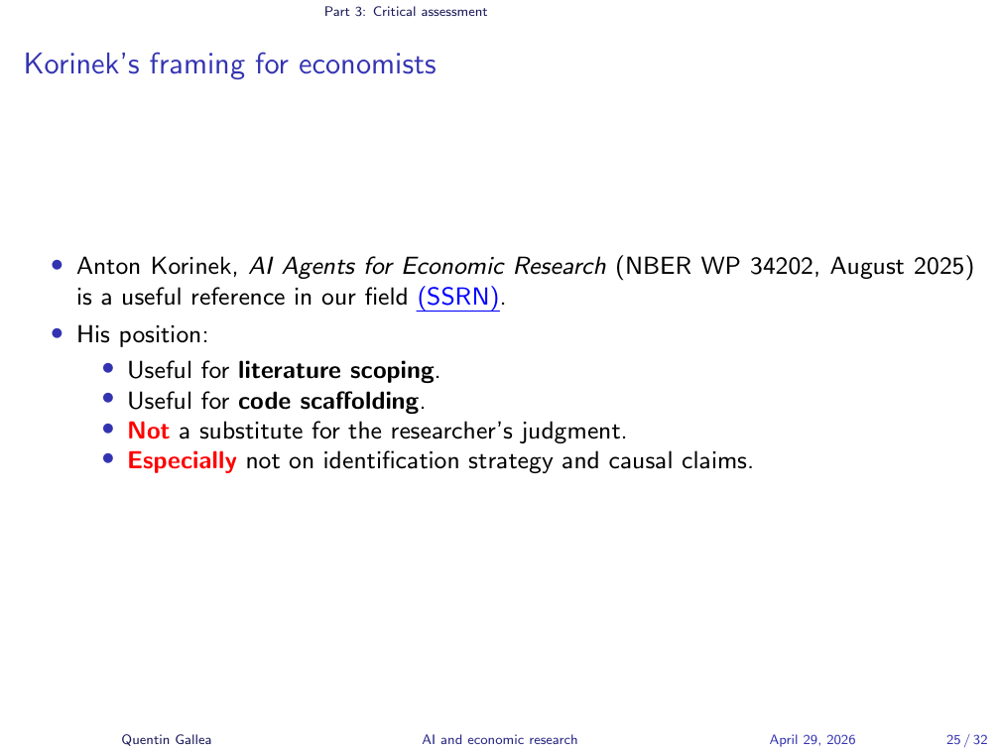{.slide-image fig-align="center" width="85%"}

If you read one thing on this topic for our field, read Anton Korinek's [*AI Agents for Economic Research*](https://papers.ssrn.com/sol3/papers.cfm?abstract_id=5455842) (NBER WP 34202, August 2025). His position lines up with everything in this lecture: Deep Research is genuinely useful for **literature scoping** and **code scaffolding**, but it is **not** a substitute for the researcher's judgment — and *especially* not on identification strategy and causal claims. That is the same line I draw.

---

## Part 4: How to Prompt It

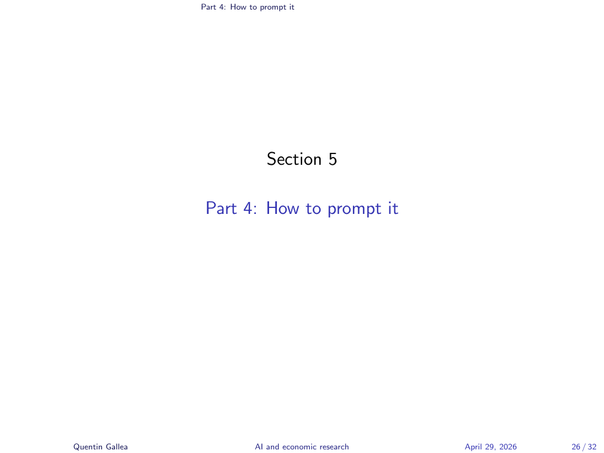{.slide-image fig-align="center" width="85%"}

---

### Treat It Like a Research Assistant, Not a Search Engine

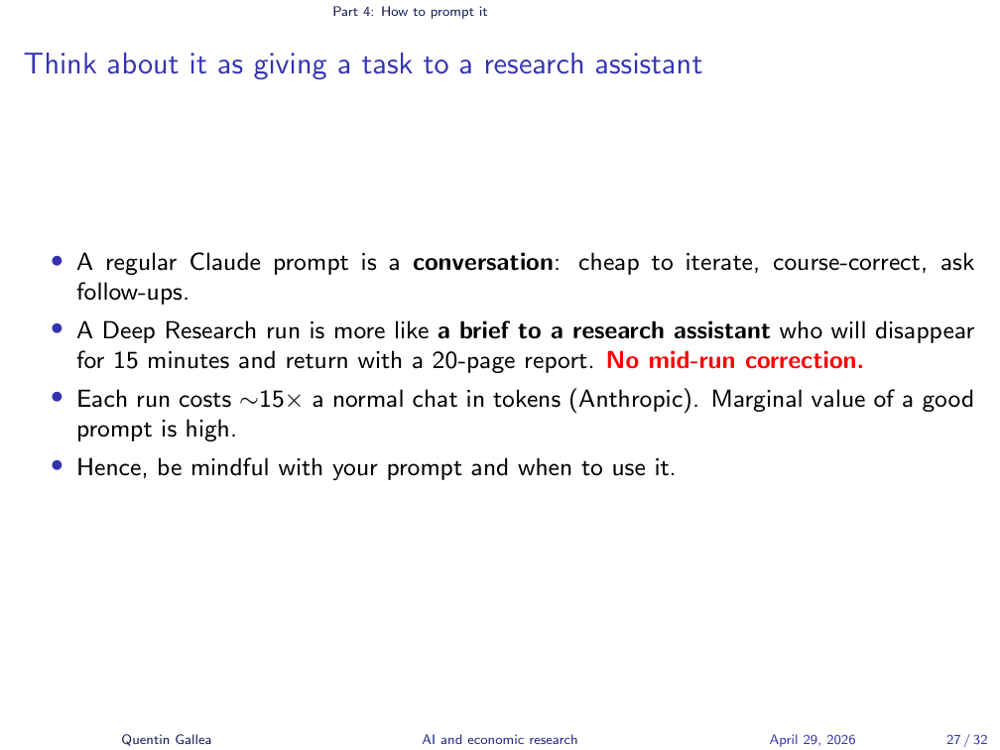{.slide-image fig-align="center" width="85%"}

A regular Claude prompt is a **conversation** — cheap to iterate, easy to course-correct. A Deep Research run is more like **briefing a research assistant** who will disappear for fifteen minutes and come back with a 20-page report. There is no mid-run correction. Each run also costs about fifteen times the tokens of a normal chat, so the marginal value of getting the prompt right *the first time* is high. **Brief it. Don't query it.**

---

### Universal Prompting Principles

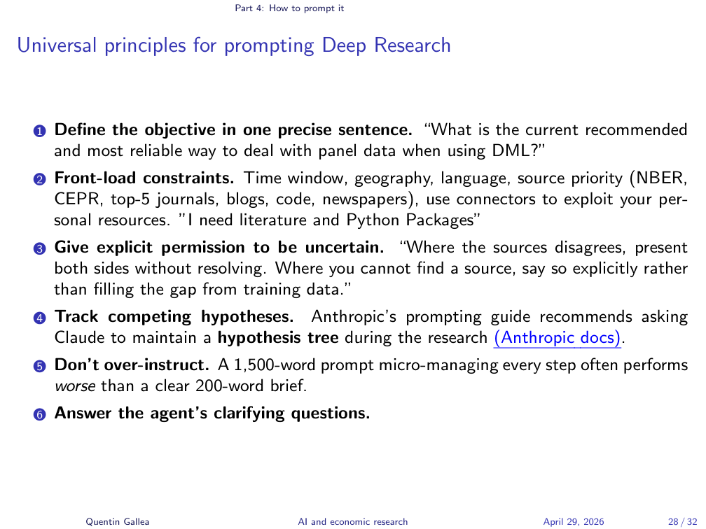{.slide-image fig-align="center" width="85%"}

Six principles that work across Claude, OpenAI, Gemini and Perplexity. **Define the objective in one precise sentence**. **Front-load constraints** — time window, geography, language, source priority (NBER, CEPR, top-5 journals, code, blogs), and use connectors when relevant. **Give explicit permission to be uncertain** — *"where sources disagree, present both sides; where you cannot find a source, say so rather than fill the gap from training data."* **Track competing hypotheses** — Anthropic's own [prompting guide](https://platform.claude.com/docs/en/build-with-claude/prompt-engineering/claude-prompting-best-practices) recommends asking Claude to maintain a hypothesis tree. **Don't over-instruct** — a 1,500-word prompt micro-managing every step usually performs *worse* than a clean 200-word brief. **Answer the agent's clarifying questions** — that is the cheap moment to constrain scope.

---

### A Defensible Workflow

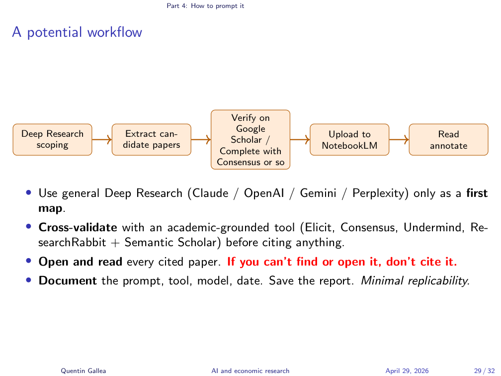{.slide-image fig-align="center" width="85%"}

The workflow that survives a supervisor's scrutiny: use Deep Research as a **first map**, then cross-validate every promising paper through Google Scholar or an academic-grounded tool (Consensus, Elicit), then load the verified set into NotebookLM, then read and annotate. Open every cited paper — **if you can't find it or open it, don't cite it**. Save the prompt, the tool, the model, and the date. That is the minimum viable replicability for a thesis-level lit review built on top of an agent.

---

## Applying Our Guidelines

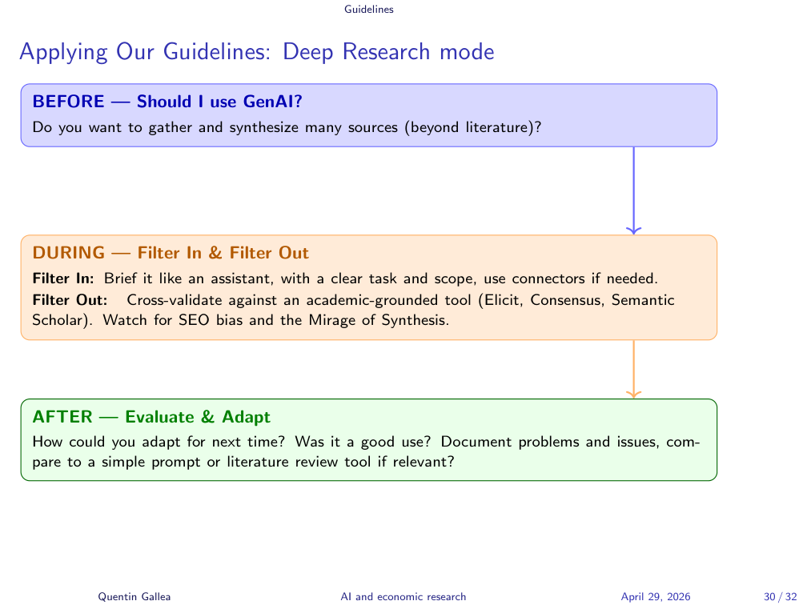{.slide-image fig-align="center" width="85%"}

The same Before / Filter-In / Filter-Out / After framing as every other session. **Before**: do you actually need to gather and synthesize many sources beyond the academic literature? If not, use a simpler tool. **Filter In**: brief the agent like a research assistant — clear task, scope, and connectors. **Filter Out**: cross-validate against an academic-grounded tool, watch for SEO bias and the Mirage of Synthesis. **After**: document what worked and what did not; was Deep Research actually the right call, or would a simple prompt or NotebookLM run have done better?

---

## Closing

### Homework

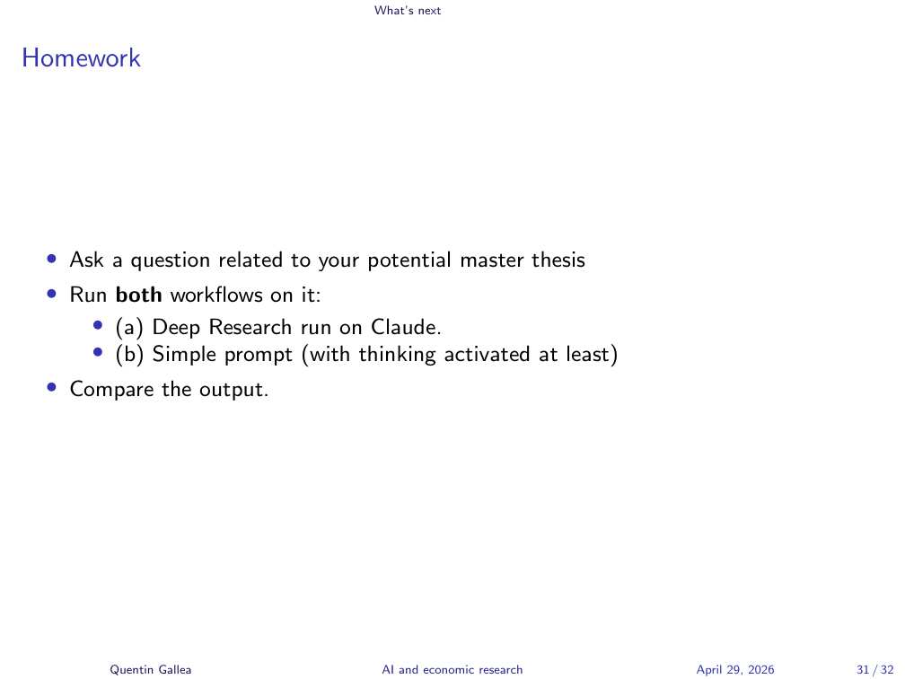{.slide-image fig-align="center" width="85%"}

Pick a question relevant to a potential master's thesis. Run it twice — once through **Claude Deep Research**, once through a **simple Claude prompt with extended thinking on**. Compare the outputs side by side. Where does Deep Research add value? Where is it just noise? Bring the comparison to the next class.

---

### What's Next?

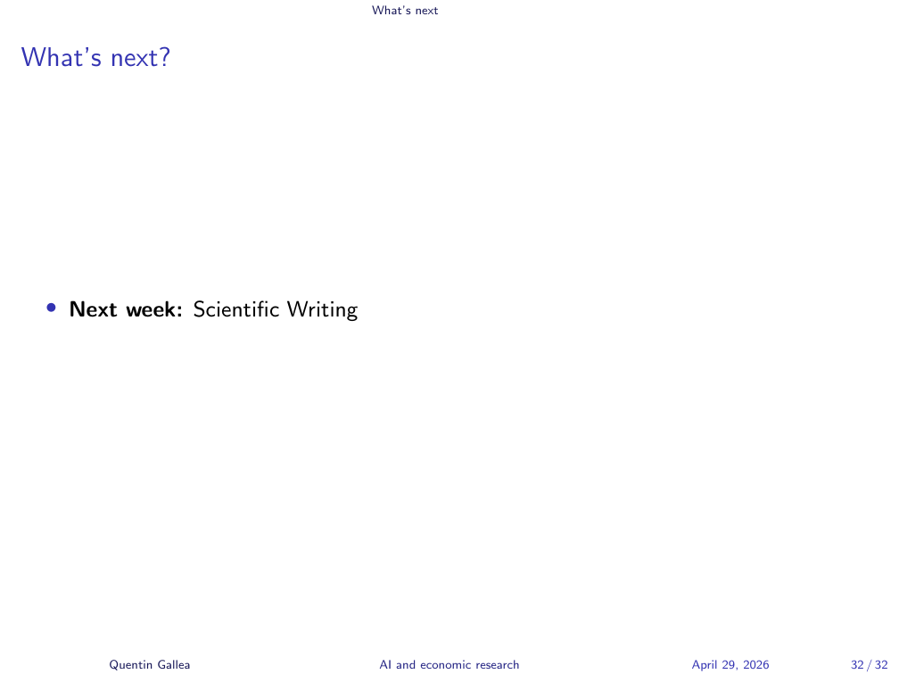{.slide-image fig-align="center" width="85%"}

Next week we move to **scientific writing** — how to use GenAI to draft, edit, and improve manuscripts without compromising authorship norms or your own voice.

::: {.callout-tip}
## Key Takeaways
1. **Deep Research = harness, not a model**: an agentic loop (plan → search → read → reflect) on top of an existing LLM, often with parallel subagents.
2. **It is not a literature review**: it is a *first map*. The lit-review tools from week 5 are bounded and almost never fabricate; open-web Deep Research is richer but hallucinates 3–13% of URLs.
3. **Five documented failure modes**: hallucinated citations, SEO bias, no methodological judgment, replicability failure, and the Mirage of Synthesis. Causal reasoning is the gap your training fills.
4. **Brief it like a research assistant**: clear objective, front-loaded constraints, explicit permission to be uncertain. Don't over-instruct.
5. **Defensible workflow**: Deep Research → verify every paper → NotebookLM → read. If you can't open the source, don't cite it.
:::
