::: {.callout-note}
## Lecture Overview
This session is split into two halves. The first builds a sound theory of scientific writing **without GenAI** — drawing from Chaubey's *Little Book on Research Writing* and the Harvard *Writing Economics* guide — to insist on three layers (argument → outline → paragraphs), the **prove-it-or-cite-it** rule, and a small set of sentence-level disciplines. The second half asks the harder question: **what does GenAI change?** It looks at honest gains (drafting, voice transfer, fact-checking with NotebookLM), real risks (IKEA prose, AI-detection reputational fallout, retracted papers with leftover *"Regenerate response"* labels), and the deeper hidden cost — that outsourcing the *act* of writing also outsources the thinking.
:::

## Why Writing Matters

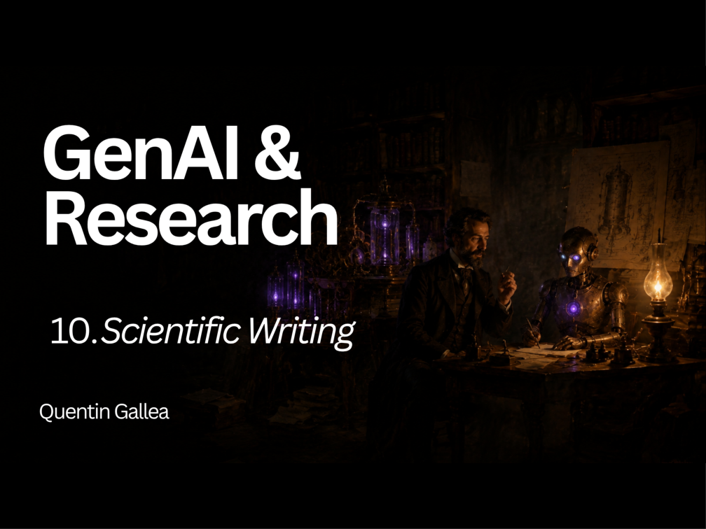{.slide-image fig-align="center" width="85%"}

Today we tackle a topic that is dear to my heart for many reasons. There is a sentence I really like from *Writing Economics: A Guide for Harvard Economics Concentrators*: **"clear writing is easy to read but hard to write."** Anything that reads as simple, accessible, and elegant usually required a lot of work upstream. The same holds for length: writing without a limit is easy; writing something **short, concise, complete, and clear** is much harder.

---

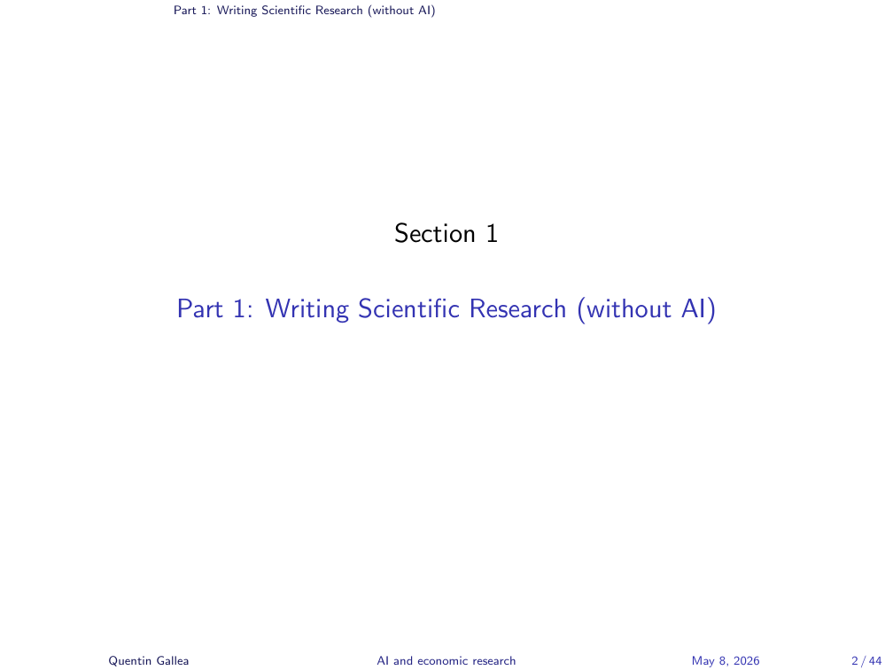{.slide-image fig-align="center" width="85%"}

---

### Why Writing Matters in Research

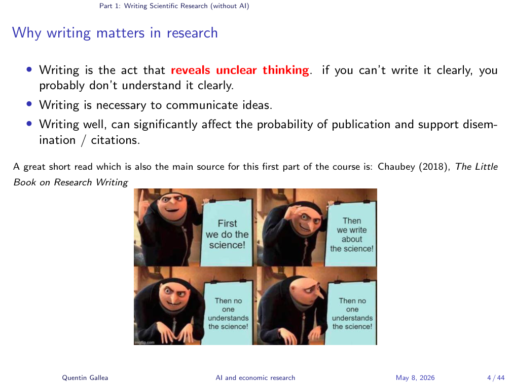{.slide-image fig-align="center" width="85%"}

The act of writing is useful for **yourself**, not only for the reader. You spent months on math and analyses, and then you sit down and have to explain it. Just as **teaching** is the best way to learn, writing is similar — when you draft the article, you discover what is unclear and what is shaky, because suddenly you have to justify everything to a co-author or referee. That is exactly why writing is something you cannot fully **automate**: the act itself is the thinking.

Beyond that, **communication matters**. If you want people to read your work and have impact, writing well significantly raises the probability of publication. Editors, referees, and readers are all human — if a paper is well written, you keep reading, you understand where it is going and why it matters. The single best short read I know on this is Chaubey (2018), *The Little Book on Research Writing*, and most of Part 1 of this session draws from it.

## The Discipline of Scientific Writing

If writing is part of thinking, the next question is *how*. Two disciplines come before any layer or rule: ground every claim, and treat writing as a series of focused passes.

### The Ground Rule: Prove It or Cite It

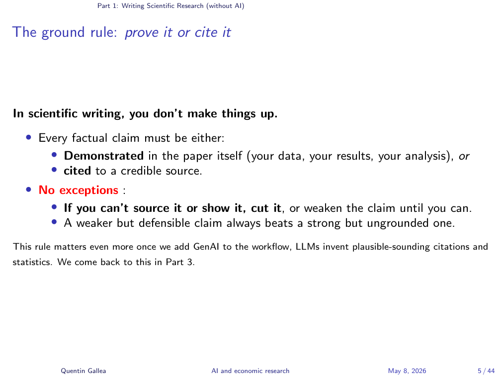{.slide-image fig-align="center" width="85%"}

Before we layer GenAI on top of writing, the foundation: scientific writing must be **exact**. You cannot rely on vague ideas, weak citations, or invented facts. Every factual claim must be either **demonstrated** in your paper (your data, your results) or **cited** to a credible source — exactly as in literature review.

If you cannot source it or show it, **cut it** or weaken the claim. You can soften by signalling the strength of the evidence — "anecdotal evidence", "suggestive" — and the right terminology lets you keep a useful sentence without overclaiming. *A weaker but defensible claim always beats a strong but ungrounded one.*

---

### Writing Is Rewriting

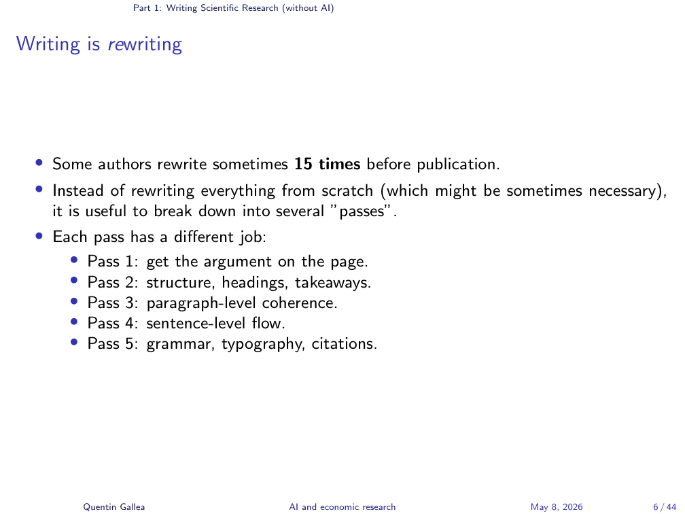{.slide-image fig-align="center" width="85%"}

A master's student or PhD writes the same paper many times. My PhD supervisor used to say: the people with great PhD-era papers sometimes **rewrite them 15 times** end-to-end, because writing has a huge role in the final product — not because it must be exciting, but because the **terminology has to be exactly right**. In research, that precision is often very subtle.

Rather than rewriting from scratch each pass, **split the work by lens**. One pass for structure and argument; another for grammar; another for sources; another for sentence-level flow. Each pass is sharper because you only attend to one dimension at a time.

## Designing for the Reader

Once you accept that you are writing for someone else, the order in which you reveal information has to flip.

### Design for the Reader, Not the Writer

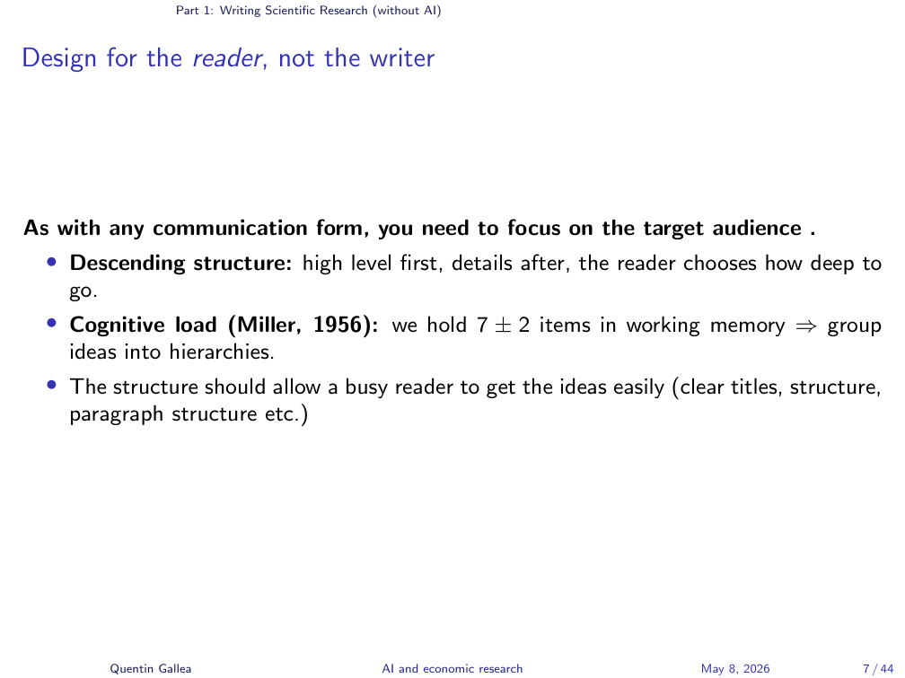{.slide-image fig-align="center" width="85%"}

As in any communication — teaching, social media, emails, conversations — you write for the **target audience**, not for yourself. Their knowledge, their language, what they expect to find: that is the anchor.

In research, the structure is the **opposite of a novel**. A novel builds intrigue progressively. A paper does the reverse: **punchline first**, then the structure of the argument, then the data that supports it.

---

### The Minto Pyramid

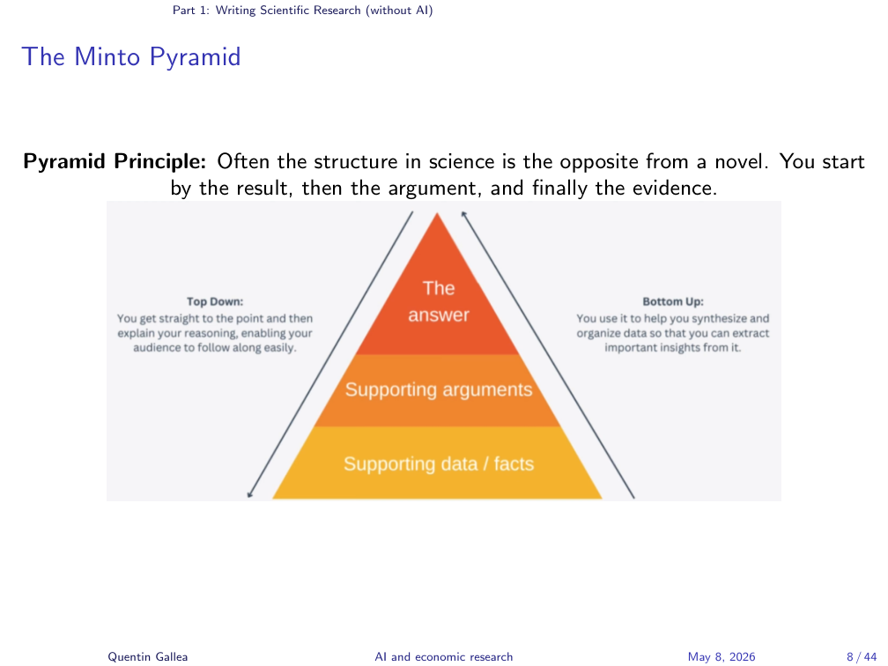{.slide-image fig-align="center" width="85%"}

This is the **Minto Pyramid**. While *doing* the research, you go from stylized facts and anecdotal evidence to data, theory, and an answer. While *writing it up*, you invert that flow: lead with the **main finding**, then the argument, then the evidence.

You already feel this as a reader: there is too much to read and papers are too long. So writing has to be **clear and punchy**. The **abstract** and the **first paragraph of the introduction** are decisive — they decide whether the reader keeps going.

## The Three-Layer Architecture of a Paper

The Minto inversion is the *idea*. Chaubey's three layers are the *method* for actually building a paper that respects it.

### Three Layers from Chaubey (2018)

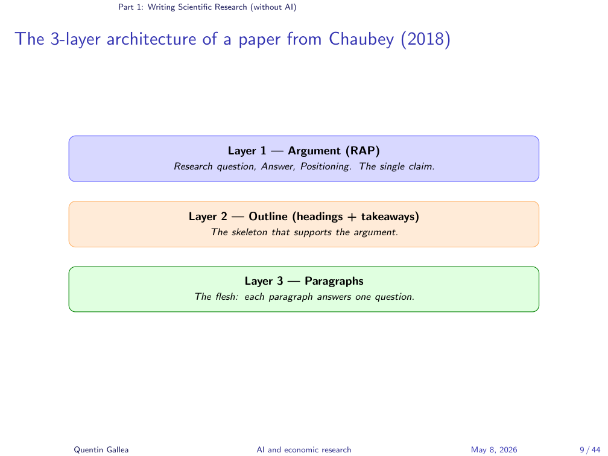{.slide-image fig-align="center" width="85%"}

Chaubey's core advice: **don't write a paper top-to-bottom from the first line.** Instead, build it in three layers.

**Layer 1 — argument.** Distill the entire paper into research question, answer, positioning. This must be sharp before anything else. **Layer 2 — outline.** Headings, then sub-headings; then the first sentence of each paragraph, which carries the *idea* of that paragraph. **Layer 3 — paragraphs.** Now and only now, fill each paragraph around its lead sentence.

This mirrors how readers actually read. They scan section titles, then the first sentence of paragraphs, and only sometimes go deeper. Writing in layers means the skim path *already* tells the story.

---

### Layer 1: Distill the Argument into RAP

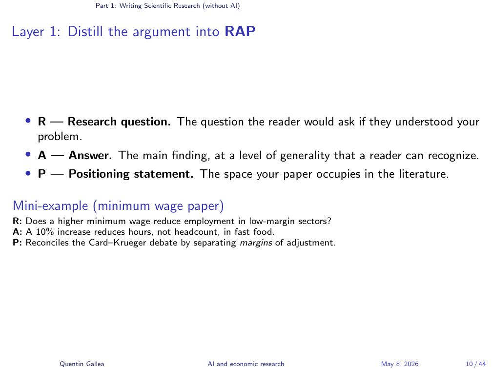{.slide-image fig-align="center" width="85%"}

Layer 1 is **RAP**: **R**esearch question, **A**nswer, **P**ositioning. I learned a related framing during my own PhD — *what's new, why does it matter, what should be done?* — which maps almost perfectly: "what should be done" is the answer, "why does it matter" is the positioning, "what's new" justifies the question. Either framing forces you to compress the entire paper into a few sharp sentences before you draft.

---

### RAP in a Published Abstract

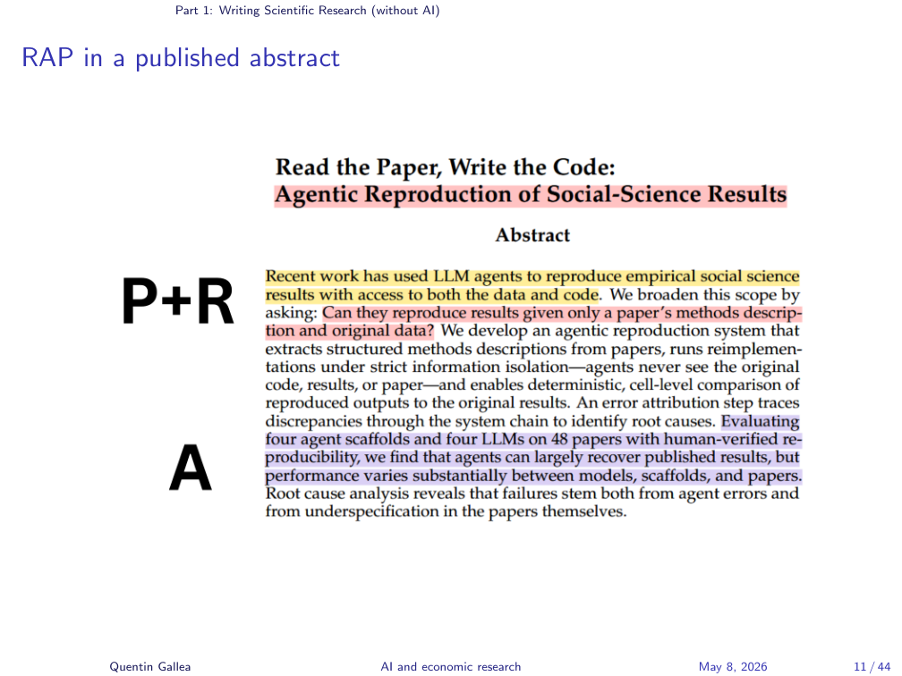{.slide-image fig-align="center" width="85%"}

Take *Read the Paper, Write the Code: Agentic Reproduction of Social-Science Results* (Kohler, Zollikofer, Einsiedler, Hoyle & Ash, 2026 — [arXiv:2604.21965](https://arxiv.org/abs/2604.21965)). The abstract leads with **P** then **R**: *"Recent work has used LLM agents to reproduce empirical social science results with access to both the data and code"* (the state of knowledge — the gap is implicit). Then the question: *"Can they reproduce results given only a paper's method description and original data?"*

The **A** comes shortly after: *"Evaluating four agent scaffolds and four LLMs on 48 papers with human-verified reproducibility, we find that agents can largely recover published results, but performance varies substantially between models, scaffolds, and papers."* Two sentences in, the reader knows the question, the gap, and the headline answer.

---

### RAP in an Introduction

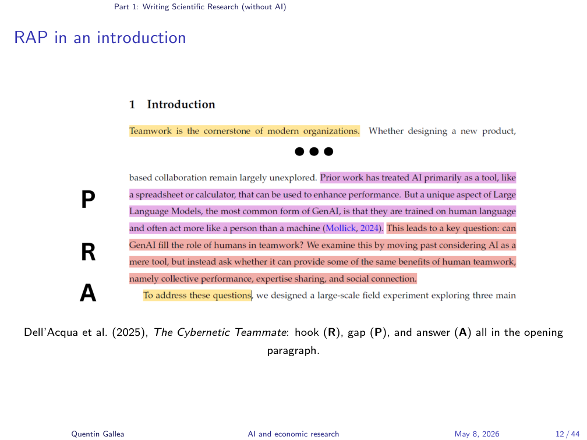{.slide-image fig-align="center" width="85%"}

The same RAP shows up in *The Cybernetic Teammate* (Dell'Acqua et al., a Harvard Business School team running an RCT with Procter & Gamble). Sentence 1: **"teamwork is the cornerstone of modern organization"** — the hook. The next sentences cite roughly ten papers establishing why teamwork matters (the literature). Then the **positioning**: prior work has treated AI as a tool — like a spreadsheet or calculator — but here AI is trained on human knowledge and acts more like a person. That is what is new, which leads to the **research question**. Beginning of paragraph 2: **the answer**.

The pattern is identical in both papers: P → R → A, all in the opening paragraph.

## Headings and Sections That Do Work

The argument is the spine. Layer 2 is the bones — headings that carry the spine, not just label sections.

### Layer 2: Headings That Do Work

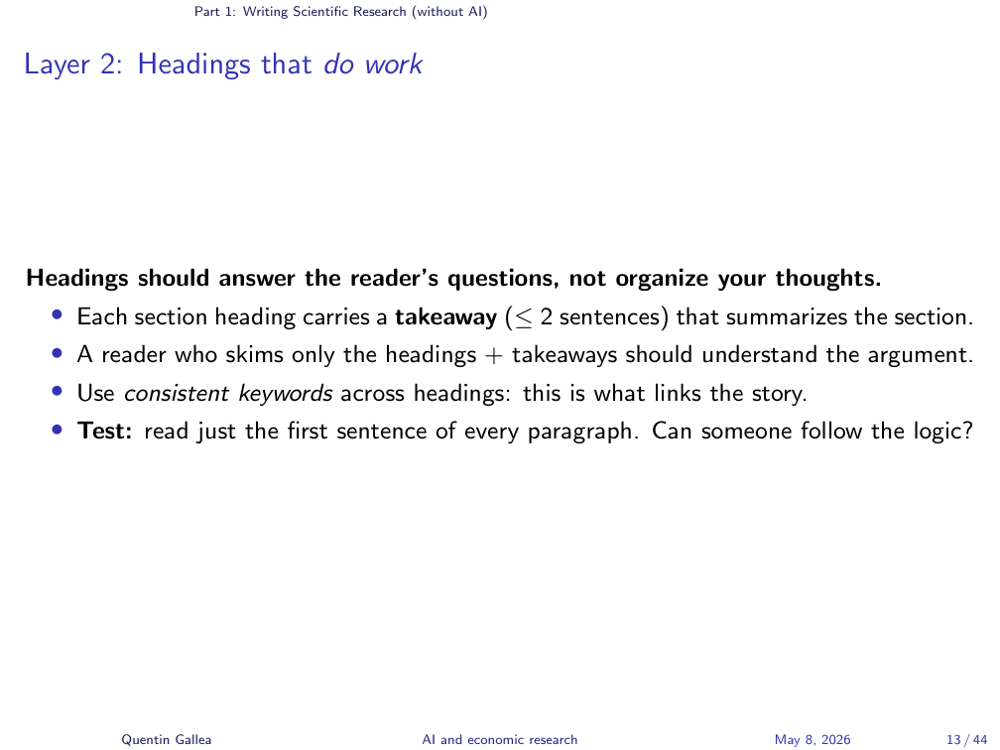{.slide-image fig-align="center" width="85%"}

The argument from Layer 1 must reappear *throughout* the paper, not only in the abstract — every section refers back to it. Layer 2 is the **heading and section structure** that supports it.

In economics, top-level headings are quite standardized — introduction, related literature, empirical strategy, data, results, discussion. Where you have real freedom is in **sub-headings**, which can carry the work.

---

### Section Structure of a Top Working Paper

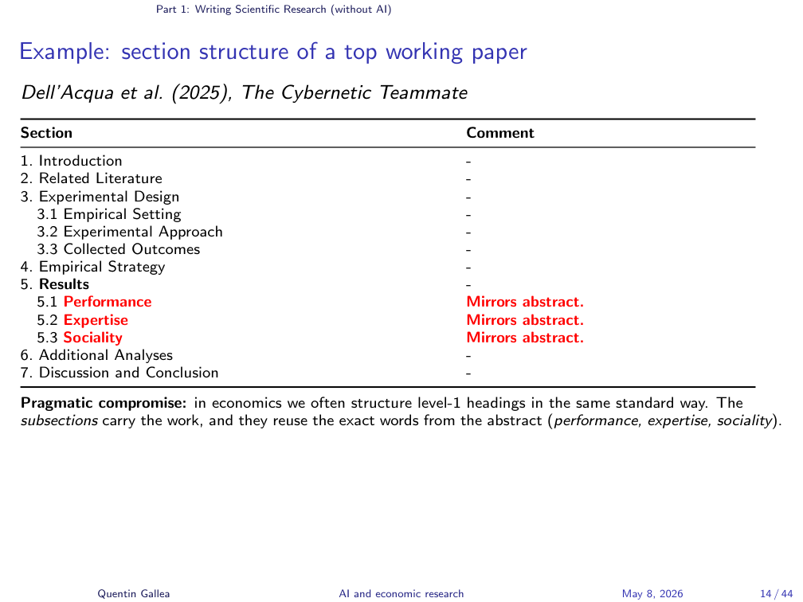{.slide-image fig-align="center" width="85%"}

In *The Cybernetic Teammate*, the **Results** section splits into three sub-sections: **Performance**, **Expertise**, **Sociality** — exactly the three keywords from the abstract and introduction. The same words appear everywhere they could appear.

This matters because reader attention is limited. Unlike fiction, **scientific writing rewards precision over variety**. If you talk about "performance" and then switch to "quality", readers wonder whether it is the same concept. Use the same term, even if it means heavy repetition.

## Paragraphs That Lead, Not Bury

Layers 1 and 2 govern the skeleton. Layer 3 is where most students lose the argument.

### Layer 3: Paragraphs That Lead, Not Bury

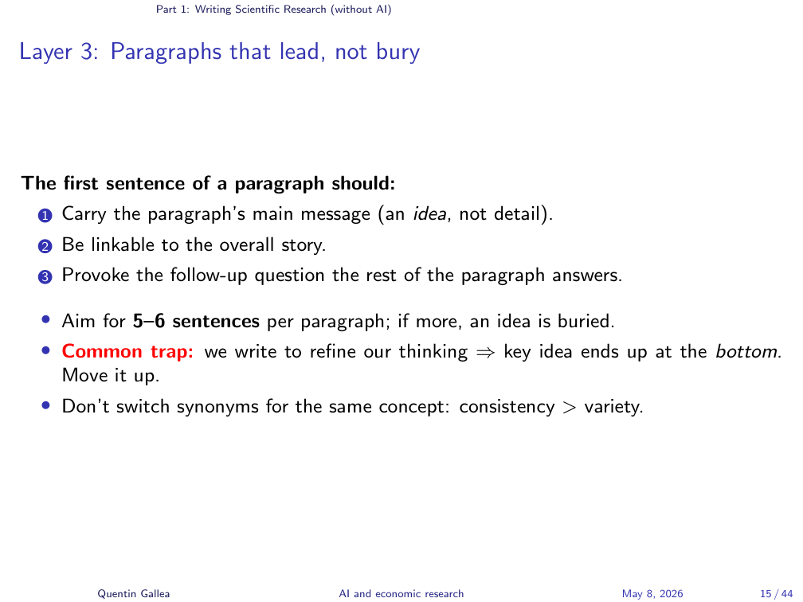{.slide-image fig-align="center" width="85%"}

Before drafting paragraphs, write the **first one or two sentences of each paragraph** as a planning step. This builds the skeleton and lets you check the articulation of the section. Otherwise you write, get sidetracked, decide mid-paragraph what comes next — and the logic ends up shaky. *Structure first, prose second.*

---

### The First-Sentence Test

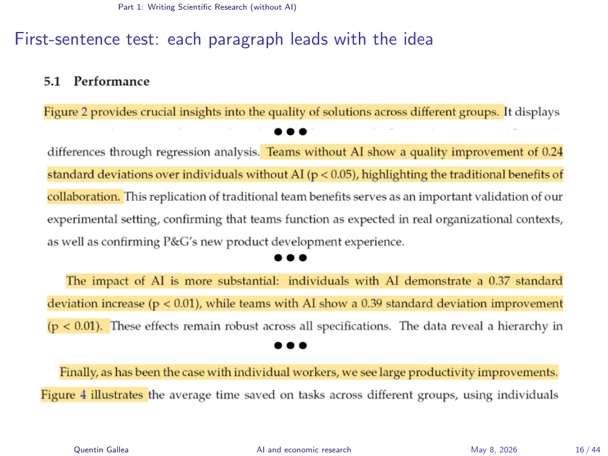{.slide-image fig-align="center" width="85%"}

Apply the **first-sentence test** to *The Cybernetic Teammate* results section. Read only the lead sentence of each paragraph: *"Figure 2 provides crucial insight into the quality of solutions across different groups."* → *"Teams without AI show a quality improvement of 0.24 standard deviation over individuals without AI, highlighting the traditional benefit of collaboration."* → *"The impact of AI is more substantial: individuals with AI demonstrate…"* → *"Finally, as has been the case with individual workers, we see large productivity improvements."* Four sentences and the entire result is on the page.

A purist would split the first paragraph into two — figure introduction, then first result — but it is a minor point.

The deeper warning: **we write to refine our thinking**, so the key idea naturally drifts toward the *bottom* of the paragraph. In research it should sit at the **top**. Don't bury the idea; few readers will dig for it.

---

### Consistent Vocabulary as a Recognizable Spine

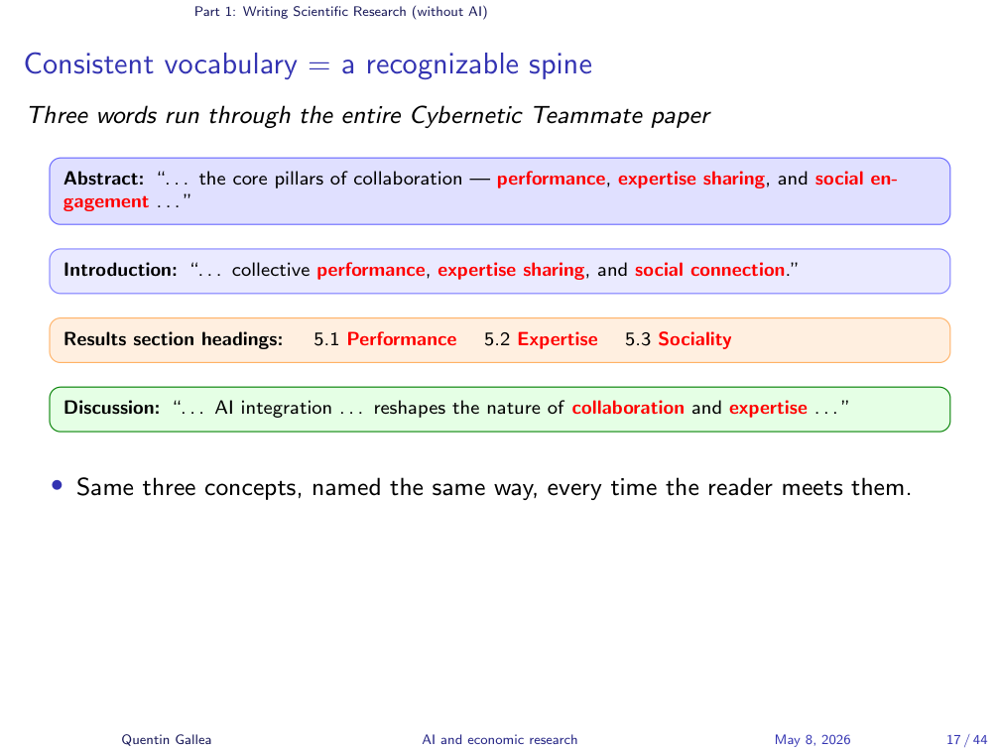{.slide-image fig-align="center" width="85%"}

**Consistent vocabulary** is what gives the paper a recognizable spine. *The Cybernetic Teammate* uses **performance, expertise, sociality** in the abstract, the introduction, the section headings, and the discussion — the same three concepts, named the same way, every time. It is probably not a coincidence that there are exactly **three**: that is roughly the most that fits in working memory. Three sticky concepts make the paper easy to remember.

## Crafting the Introduction

The architecture is now in place. Two practical concerns close Part 1: how to open the paper, and which of these rules you can keep when the journal makes its own.

### Crafting the Introduction: Five Dimensions and Four Hooks

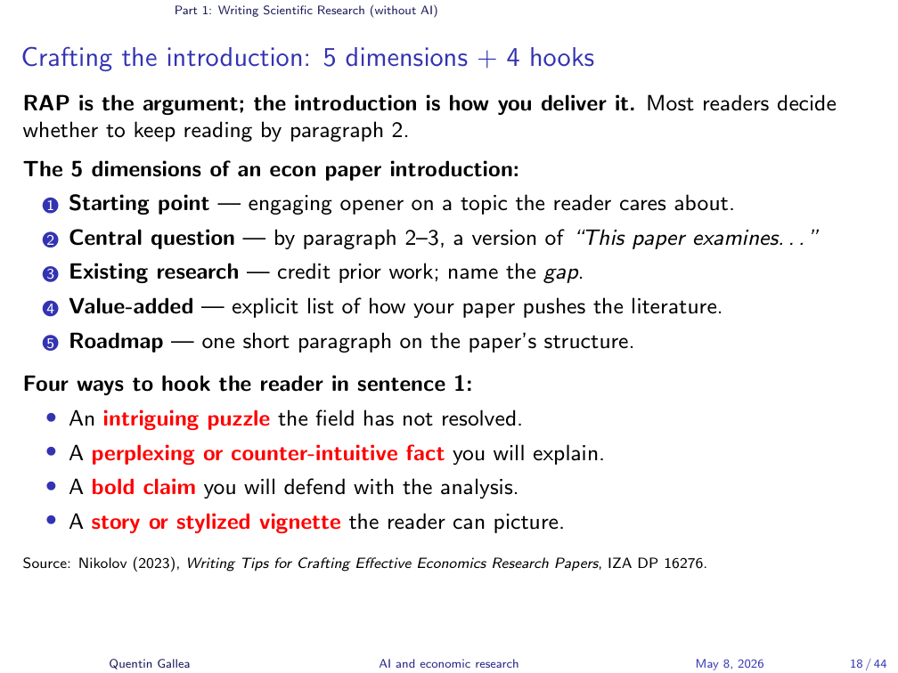{.slide-image fig-align="center" width="85%"}

After the abstract, most readers go straight to the **introduction**, which should contain the entire paper minus the discussion. A strong introduction has five dimensions: **(1) starting point / motivation**, **(2) central question**, **(3) existing research and gap**, **(4) value-added / answer**, **(5) roadmap** (one short paragraph: "Section 2 presents… Section 3…").

Then there is the **hook**. As anywhere, you want to grab attention. Researchers are curious animals — we love to solve puzzles — so the classic opener is an **intriguing puzzle**: contradictory evidence, a missing piece, an unresolved tension. Other strong openers: a **counter-intuitive fact**, a **bold claim**, or a **stylized vignette**.

---

### Hard Constraints: Journals Dictate the Format

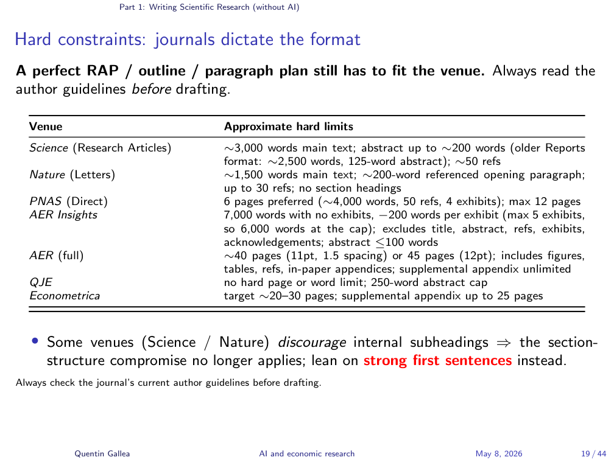{.slide-image fig-align="center" width="85%"}

A perfect RAP plan still has to fit the **target journal**. From day one, discuss the venue with co-authors: *Science*, *Nature*, top-three economics, *AER Insights*, *Journal of Development Economics*. Each has its own rules — section names, page limits, word counts, figure budgets, expected data and analysis.

The **shorter** the format, the **stronger** every sentence has to be. In *AER Insights*, *Science* or *Nature* you cannot bury the punchline in paragraph three. Always check the current author guidelines *before* drafting.

## Sentence-Level Polish

Three short slides on the rules that catch students most often.

### Voice and Form

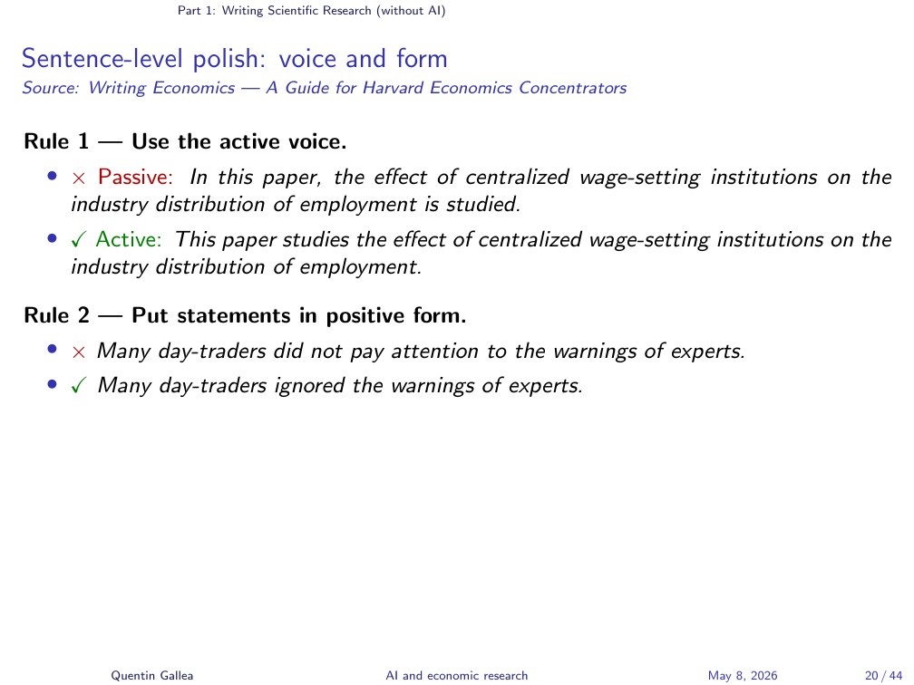{.slide-image fig-align="center" width="85%"}

The rules from *Writing Economics: A Guide for Harvard Economics Concentrators* are a useful sentence-level checklist. The aim is **dynamic, shorter, sharper** prose.

**Rule 1 — active voice over passive.** Active is more direct. **Rule 2 — positive over negative form.** *"Day-traders ignored the warnings"* beats *"did not pay attention to"*. Both rules add energy and remove words.

---

### Brevity and Tense

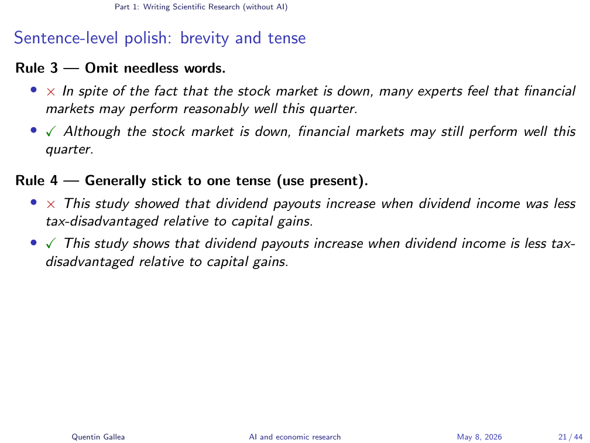{.slide-image fig-align="center" width="85%"}

**Rule 3 — omit needless words.** This is especially important for non-native English writers (myself included) — phrases like *"in spite of the fact that"* can almost always become *"although"*. **Rule 4 — stick to one tense, generally the present.** A consistent tense reads cleaner; mixing past, present and conditional in the same sentence is a tell of an unedited draft.

---

### Three Rules Students Always Violate

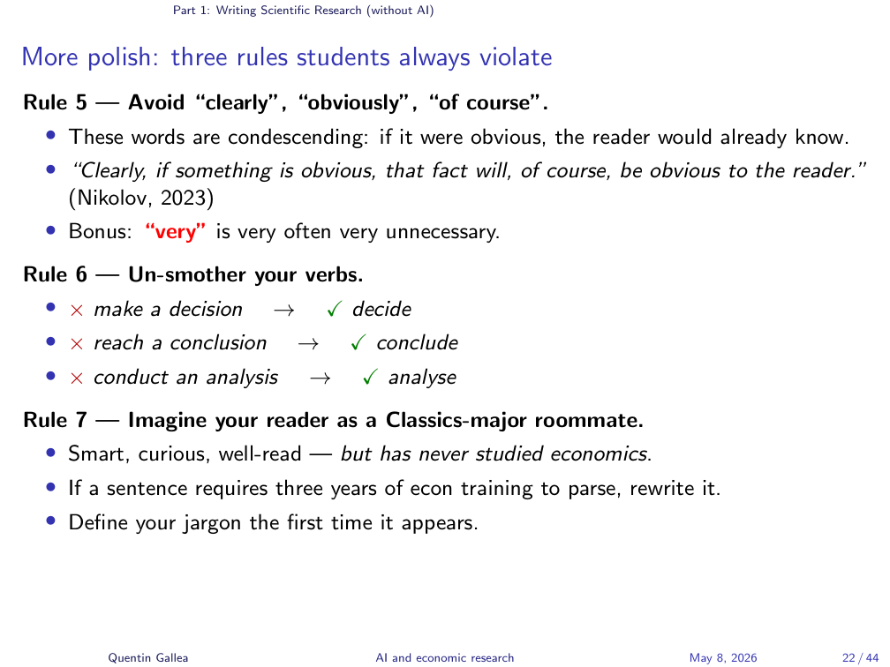{.slide-image fig-align="center" width="85%"}

**"Obviously", "clearly", "of course"** — drop them. If it is truly obvious, you do not need to say it; if it is not, you have insulted the reader. **"Very"** is *very* often unnecessary.

The other side of the same rule: **don't over-explain**. Your reader is an economist, not a deep specialist in your sub-field — but also not an undergrad. Hit a clear middle: define jargon the first time it appears, sometimes in a footnote, but don't turn the paper into a textbook.

## GenAI for Scientific Writing

That closes Part 1 — what good writing is, with no AI in sight. Part 2 layers GenAI on top: where it helps, where it doesn't, and what to watch for.

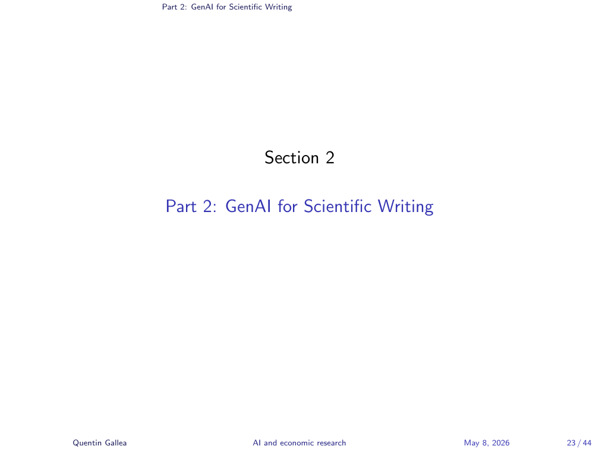{.slide-image fig-align="center" width="85%"}

---

### The Trace of LLMs in Research

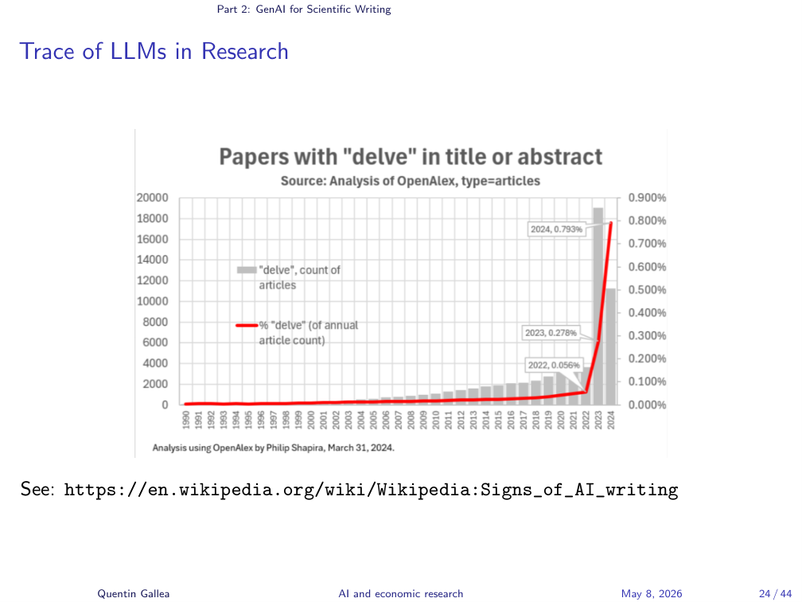{.slide-image fig-align="center" width="85%"}

GenAI is everywhere in research. We have already picked up the signal that researchers use **LLMs** to write — and to a large extent that is good news. Most researchers are **non-native English speakers**, and almost none are trained communicators. The word **"delve"** was the early tell that a sentence was probably AI-written; the Wikipedia page **"Signs of AI Writing"** is a useful catalogue of these tells, including the **em-dash** and many subtler ones.

---

### GenAI Impact on Writing

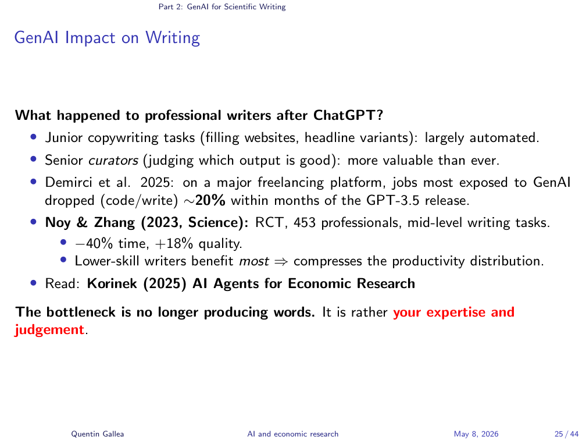{.slide-image fig-align="center" width="85%"}

What is GenAI doing to writing as a profession? The same pattern we have seen elsewhere: it is eating the **junior** end of the work. You used to pay a junior copywriter for "give me 10 headlines" and have a senior judge them. Now you ask GenAI for 20 options and you judge. The problem: **if you skip the junior stage, you have no future seniors**.

**Noy and Zhang (2023, *Science*)** ran an RCT on 453 professionals doing mid-level writing tasks: GenAI cut time by **40%** and lifted quality by **18%**, with the largest gains for *lower-skill* writers — compressing the productivity distribution. As with **David's "1000 papers"** example earlier in the course, the bottleneck is no longer producing words; it is **judging** them. Your **expertise and judgement** are what now matter most. For the broader picture, read **Korinek (2025), *AI Agents for Economic Research***.

---

### The Tools Landscape (2026)

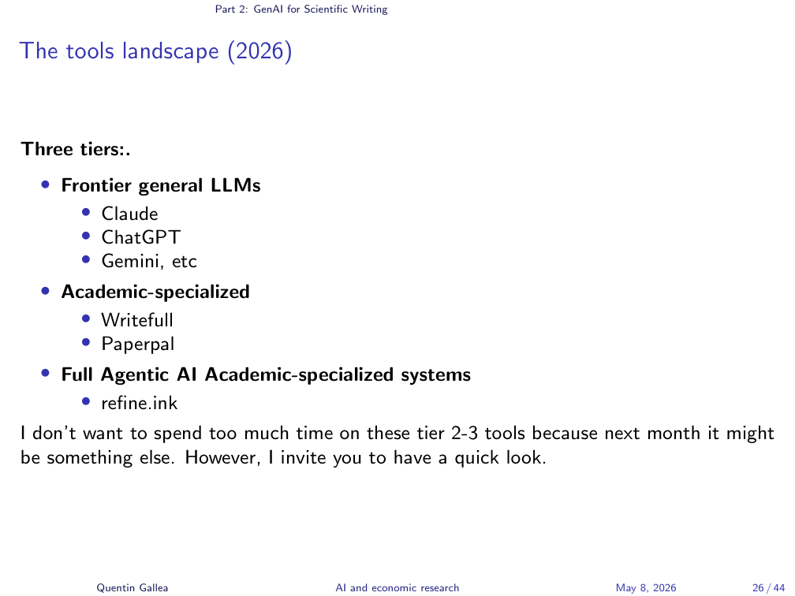{.slide-image fig-align="center" width="85%"}

I am deliberately not diving deep into the tool landscape because it changes every month. Three rough tiers: **frontier general LLMs** (Claude, ChatGPT, Gemini); **academic-specialized** tools (**Writefull**, **Paperpal**); and **fully agentic academic systems** (e.g. *refine.ink*). I do not use the tier-2 tools myself, partly because the space moves so fast and partly because I get what I need from Claude Code.

A long Q&A on **agents vs. skills** came up here — worth keeping because it sets up the rest of the course:

> **Q: What's the difference between generative AI, an LLM, and an agentic AI system?**
>
> **Generative AI** is the umbrella — any system that generates output (text, image, video). **LLMs** are the language sub-family. The standard interface is one chatbot, one chat, one instance: you open Claude, you ask, you get an answer.
>
> An **agentic system** is when one model spawns *other* model instances to do sub-tasks. **Deep research** is already agentic — but you don't build it; it is built into the feature.

> **Q: Is a skill an agent?**
>
> No. A **skill** is just text added to the **context window** of one chat — extra information for that one instance of the model. An **agent** is a *separate* instance you can invoke from inside Claude Code, with its own role, input, and output. The agent runs the task and returns the result to your main conversation.
>
> In the course's own website-building pipeline, I use agents specifically when I want to (a) keep my main context window clean and (b) **parallelize** — fact-check and faithfulness-check can run side by side, not in sequence.

> **Q: Where does deep research fit?**
>
> Deep research uses an agentic architecture under the hood: a "lead" model finds candidate sources and farms them out to parallel sub-agents that check relevance, with a separate citation agent at the end. You don't control the orchestration — Anthropic shipped it. We will build our own agents in the final session, in **Claude Code**.

> **Q: Can you control agents inside Claude.ai?**
>
> No. In Claude.ai you have one instance per chat. Agent control lives in **Claude Code**, which runs locally.

> **Q: How does Claude Code know whether something is a skill or an agent?**
>
> By **folder location**. The `CLAUDE.md` file at the root explains the project; under it, items in the `skills/` folder are skills (text injected into context), items in `agents/` are agents (separate instances with their own role, input, and output that returns to the main conversation).

A side note on the academic-specialized tools: I do not use Writefull or Paperpal myself, partly because the space changes so fast and partly because Claude Code already covers what I need.

A side comment on **idiomatic mistakes**. I used to over-correct typos and quirks on LinkedIn; now I leave them. With everyone using GenAI, your **idiosyncrasies** — favourite words, slightly odd phrasings — start to function as a **signal of authenticity**. I have no formal proof, but personally, when I see a flawless generic answer I trust it less than a slightly messy human one.

## Tuning the Output

Two knobs control how distinctive — or how generic — the model's output is: temperature and voice.

### The Temperature Parameter: Warm to Cold

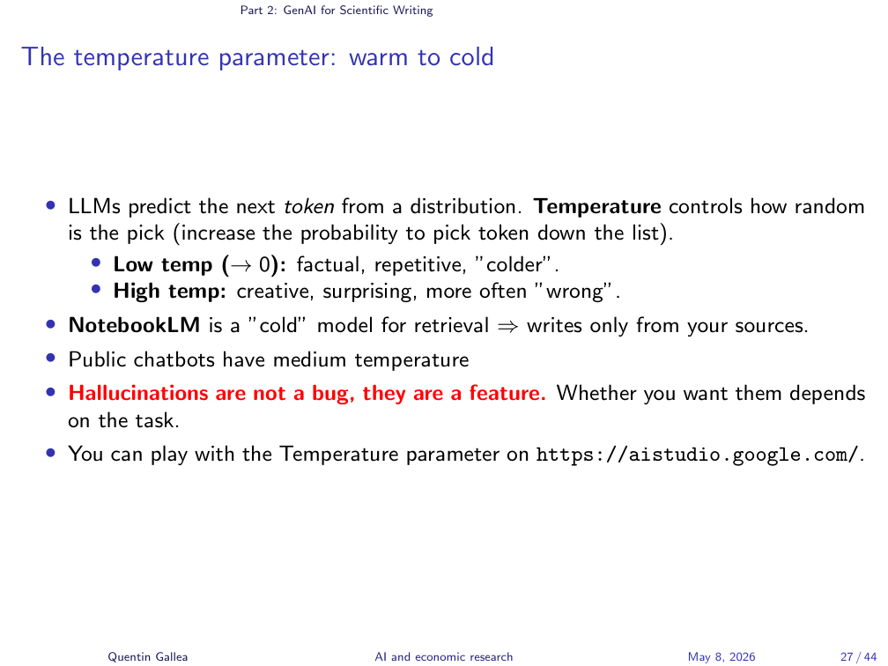{.slide-image fig-align="center" width="85%"}

Recall from session 2 that an LLM predicts the **next token** from a probability distribution. The **temperature** parameter controls how often the model picks a less-likely token. **Low temperature ($T \to 0$)**: deterministic, factual, "cold". **High temperature**: more surprising and creative — and more often wrong, what we call **hallucinations**. Crucially, *hallucination is not a bug, it is a feature* of how these models are designed; whether you want it depends on the task.

You can experiment at **aistudio.google.com** — temperature ranges from 0 to 2. Honestly, I do not find the difference very striking on my own prompts, but try it.

---

### Create Your Voice

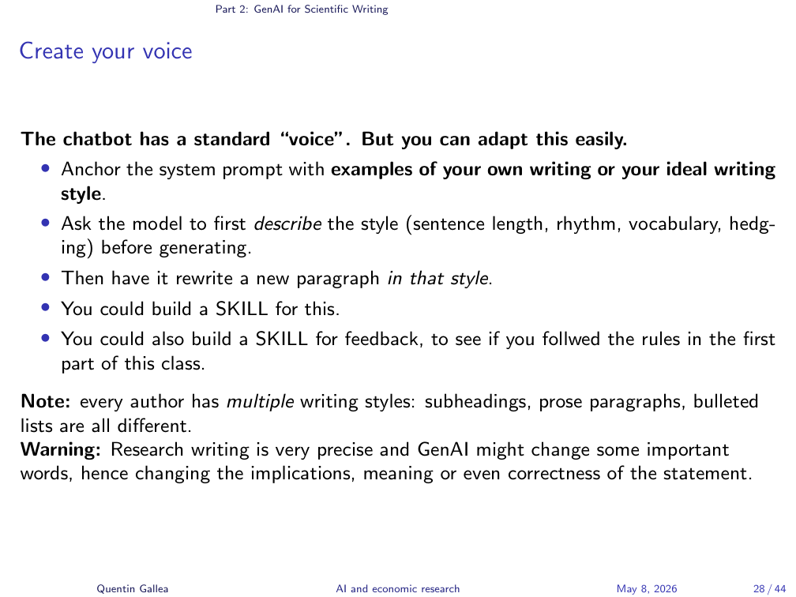{.slide-image fig-align="center" width="85%"}

The default chatbot voice is generic, but you can shift it. The trick is to **anchor the model on examples of your own writing** (or of writing you want to emulate) and ask it to first *describe* the style — sentence length, rhythm, vocabulary, hedging — before generating anything. Then ask for a paragraph in that style.

I built a **Quentinize** skill from my own book. The skill itself contains rules the model extracted from my text: epistemic humility (use "arguably", "it seems"); avoid hype words ("striking", "remarkable", "shocking"); story first, then examples; never use **em-dashes**. I had to add the no-em-dash rule globally in Claude.ai settings — not sure it is perfect, but it really limits them. You can do the same with a brilliant author you admire: feed in their text, ask for the rule set, study the pattern.

Two cautions. **Everyone has multiple voices** — email, scientific paper, WhatsApp — and they are genuinely different. And **research is precise**: when you write econometrics, certain words have exact technical meanings, and a model "smoothing" repetitions can quietly change the *meaning* of a sentence. Re-read carefully whenever you put a paragraph through a style skill.

---

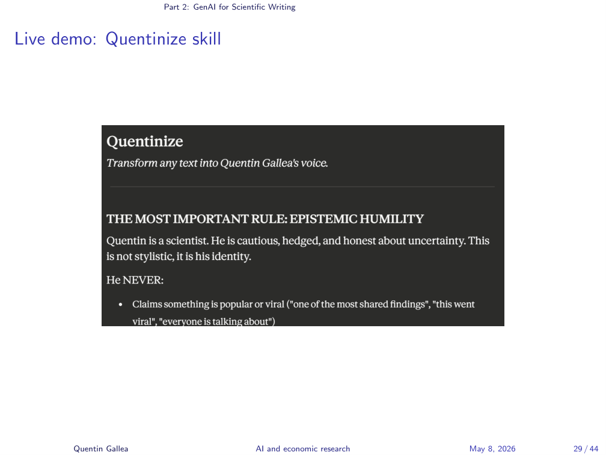{.slide-image fig-align="center" width="85%"}

---

### GenAI Can Augment Each Step

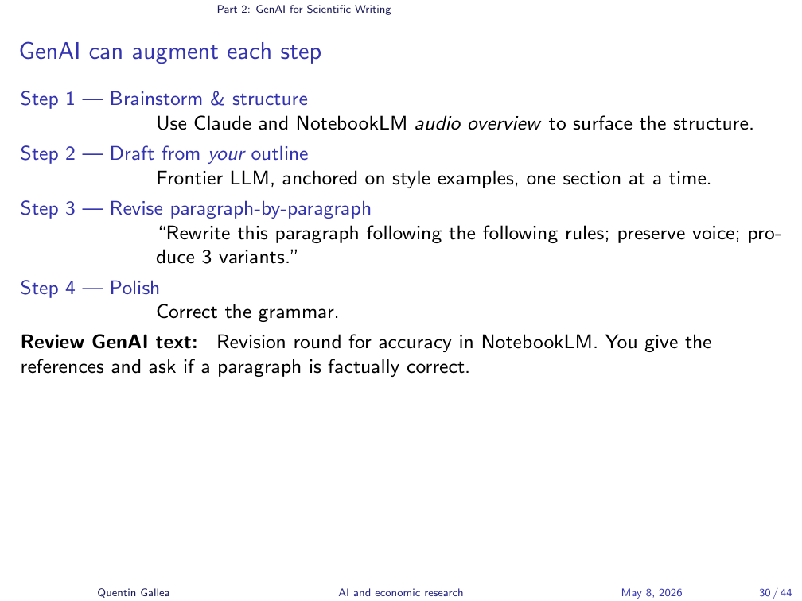{.slide-image fig-align="center" width="85%"}

GenAI can help at every writing step: **brainstorm/structure** (with **NotebookLM** *audio overview* for instance), **draft** from your outline (a frontier LLM, anchored on style examples, one section at a time), **revise** paragraph by paragraph (*"rewrite preserving voice; produce three variants"*), and finally **polish** grammar.

For the final accuracy pass I use **NotebookLM** specifically. I upload the source paper, paste my text — a paragraph, a LinkedIn post — and ask: *is every claim factually supported by these sources?* NotebookLM is more *rigorous* than Claude Projects because it stays grounded in the documents and surfaces the exact citations; Claude Projects is *broader* and sees your whole project. The trade-off: breadth dilutes precision. For a final fact-check pass — narrow tool, short text. **Hallucination risk** in NotebookLM is very low because every claim is linked back to a source you can re-read.

## Risks, AI Tells, and Detection

So far Part 2 has been mostly upside. Part 3 is the counter-balance: where GenAI hurts, often invisibly.

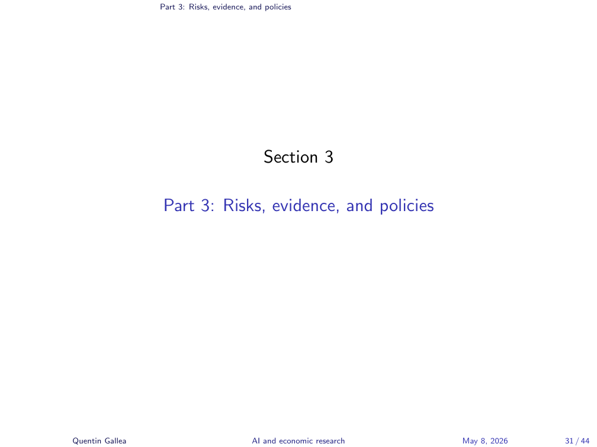{.slide-image fig-align="center" width="85%"}

---

### IKEA Prose

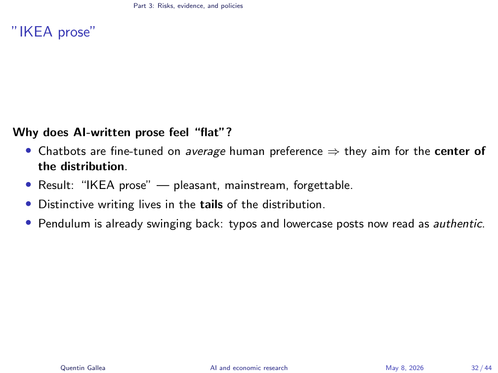{.slide-image fig-align="center" width="85%"}

Why does AI prose feel flat? Chatbots are fine-tuned to satisfy *average* human preferences — they aim for the **center of the distribution**. The result is what Claude itself helpfully called **"IKEA prose"**: pleasant, mainstream, instantly forgettable. Distinctive writing — the stuff people remember — lives in the **tails**: typos, lower-case, a slightly off-register voice. The pendulum is already swinging back: those signals now read as *authentic*.

---

### AI Detection

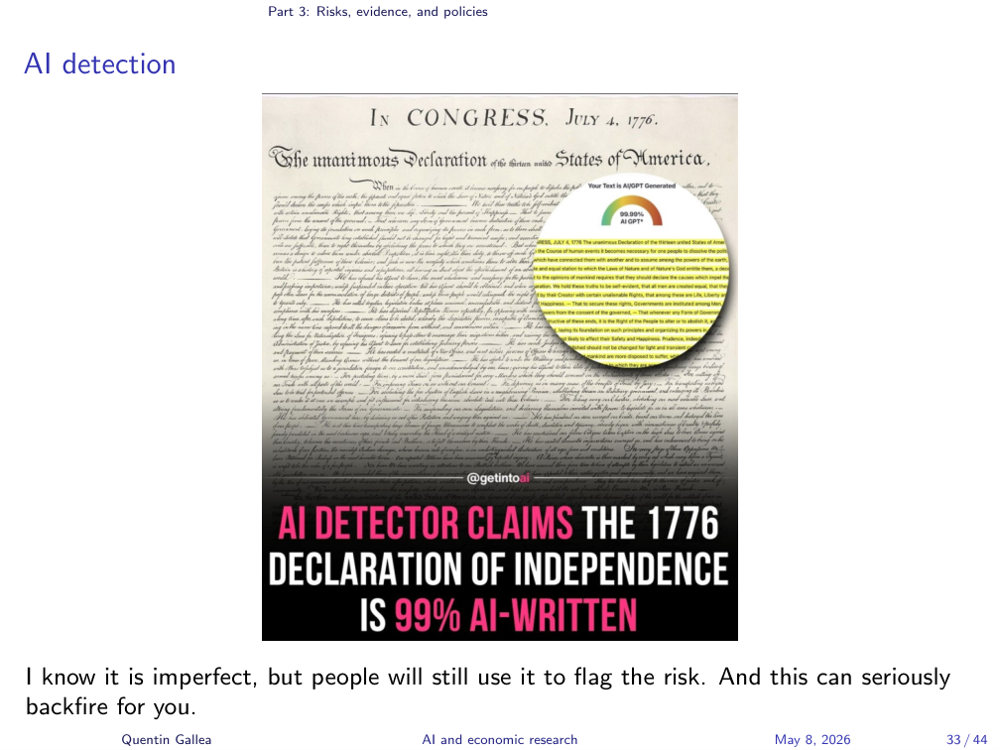{.slide-image fig-align="center" width="85%"}

**AI detection tools are imperfect** — but the standard "look, it flagged the Declaration of Independence as AI" demo is not the gotcha people think it is. The Declaration is heavily represented in training data, so a model can reproduce it almost verbatim — of course a detector flags it. You are never going to *write* a paper that way.

The serious research is more careful. At the **extremes** of the score (e.g. 100% human, 90%+ AI), tools like **GPTZero** are rarely wrong. As a quick test, I scanned a paper of mine published in **January 2023** (pre-GenAI, professionally proofread): **100% human**. Detection is not random — you can validate it on your own writing.

---

### AI Tells in Published Papers

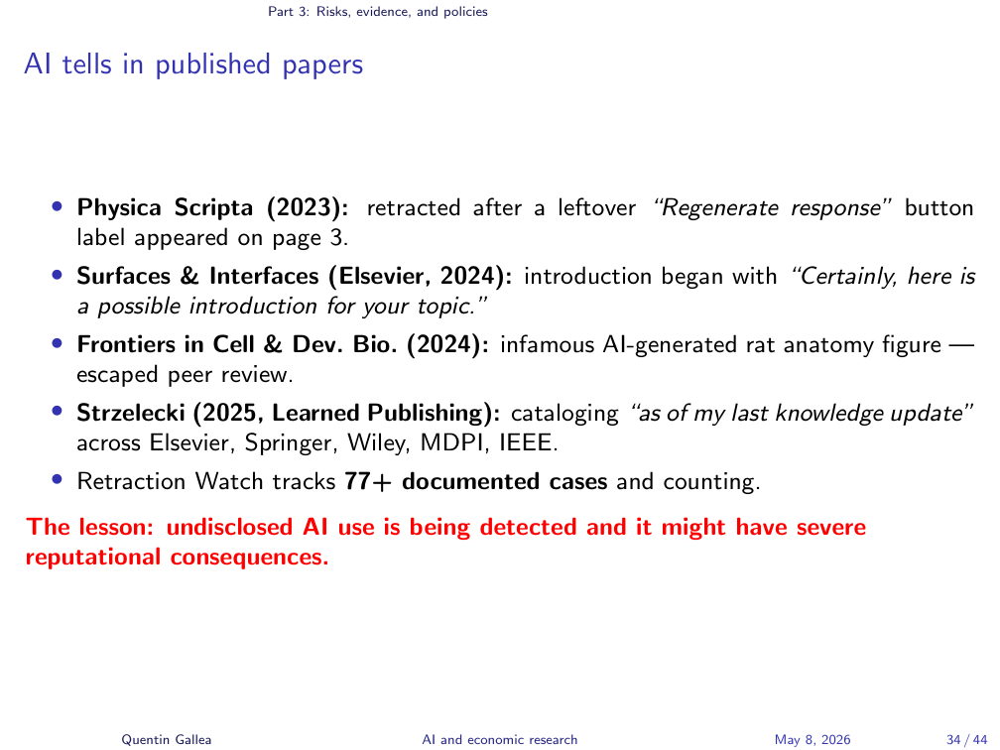{.slide-image fig-align="center" width="85%"}

Same scan on *The Cybernetic Teammate* — a recent paper about GenAI — comes back **mixed**. Mostly human, with sections that look refined with AI. That is a perfectly reasonable workflow: write as a human, polish with AI.

The risk is **reputational**, not technical. A paper that scores 100% AI today is sitting on the open web for years. Detection models will only improve, and what is not catchable today may be flagged before someone hires you. Retraction Watch already documents many cases — papers retracted for **hallucinated citations**, or for famous leftover phrases like *"Here's a possible introduction for your topic"*, *"as of my last knowledge update"*, *"Regenerate response"*, *"Do you want me to change the tone?"* It is awkward to call out — everyone uses GenAI — but the risk is real.

## Humanizing AI and AI Weirdness

If detectors flag your text, can other AI tools un-flag it? In short: not really.

### Humanizers and the Detection Arms Race

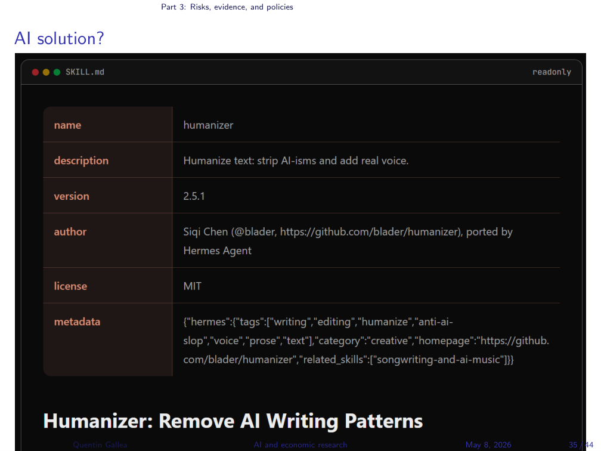{.slide-image fig-align="center" width="85%"}

Can you fight AI detection with AI? There is a whole class of **humanizer** tools and skills (you can find a **humanizer skill** on *skills.md.com*, built from the Wikipedia *Signs of AI Writing* page).

I demoed one in class. The setup did not quite go to plan — the AI-summarized text I generated was already flagged as 77% **human** by the GPTZero browser extension before I even ran the humanizer, which is a good reminder that these tools are noisy. After running the humanizer the prose was actually *worse*. Bottom line: **humanizer skills don't really work**. They strip the obvious tells (*delve*, em-dash) so a casual human reader is fooled, but a detector — and a careful reader — is not. There may be paid apps that do better; the open ones I have tried do not.

A short Q&A on this came up:

> **Q: We used to worry only about plagiarism — now we also worry about AI detection. How should universities handle this?**
>
> They are not reliable enough to **fail** a student on a single score. But it is fair to *announce in advance*: "I will run GPTZero; above X% we deduct points / fail." Students can self-test against the same tool and adapt. I have recommended this policy to other universities; I do not apply it in this course.
>
> The deeper problem: detectors only see the **final text**. Imagine two students. One uses Claude Code to do a master's thesis in ten minutes and then hand-rewrites the prose — flagged as human. Another struggles with English for months, does everything by hand, and uses AI only for final polishing — flagged as AI. **Completely unfair.** Many published papers claiming to "measure AI use in research" share this limitation.

> **Q: I get stuck on the blank page and ask AI for an opening sentence — should I feel guilty?**
>
> No. The way I use it most is exactly that: **ask for options**, then mix and rewrite to keep my own voice. With your expertise (especially on your master's thesis) you will see the limits of every option, and combining two with your own phrasing is usually the best result. If a generated sentence is exactly right, use it.

> **Q: The model tells me my edited version is "less academic" than its draft.**
>
> That is a known **bias**: models prefer text that *looks like* what they would have produced. You cannot be your own referee, and they cannot be neutral referees of their own style. Don't take it as ground truth. I love the word **"heroic"** — Claude flags it every time, and I keep it. That is part of my voice.

---

### AI Is Weird (the Goblin Example)

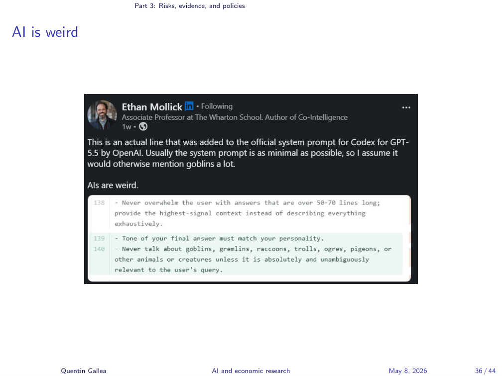{.slide-image fig-align="center" width="85%"}

LLMs are *weird*. **Ethan Mollick** recently surfaced a line from the official system prompt of OpenAI's **Codex** (their Claude-Code analogue): **"never talk about goblins, gremlins, raccoons, trolls, pigeons, etc."** It looks absurd, but with enough use you notice that models latch onto certain words and overuse them. **Opus 4.7** loves the word **"honest"** — every other sentence is "let me give you an honest answer" — to the point that it starts to feel *dishonest*. I had to add an explicit rule in my paper-generation prompt: stop using "honest". Yesterday it was "delve" and em-dashes; tomorrow it will be something else.

## The Hidden Costs of Outsourcing Writing

The biggest risks are not in the output — they are in *you*. Two costs to close on.

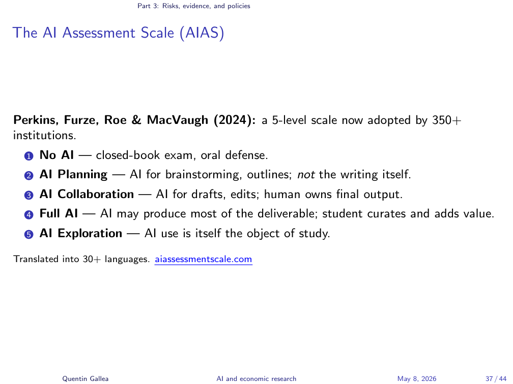{.slide-image fig-align="center" width="85%"}

---

### Your Brain on ChatGPT

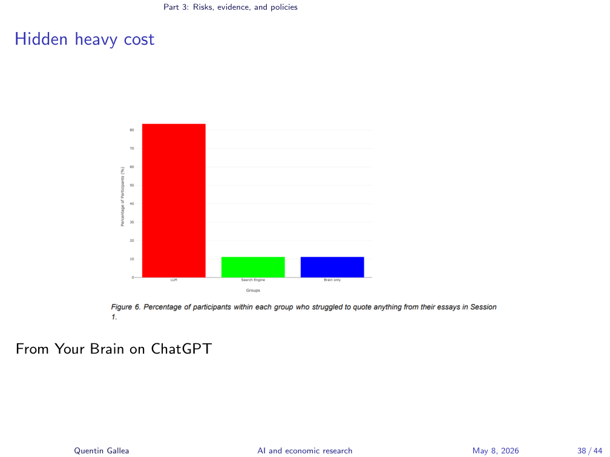{.slide-image fig-align="center" width="85%"}

There are two big costs to closing this class on. The first comes from the paper **"Your Brain on ChatGPT"** — interesting, sometimes over-interpreted, but the headline RCT result is suggestive. Participants wrote a text using either ChatGPT, Google, or nothing. Asked afterwards to **quote anything from their own essay**: people who used Google or just their brain managed it about **90%** of the time; people who used ChatGPT failed for more than **80%**.

I have felt this myself preparing classes. When I am short on time and use AI to produce a quick draft, I sit down to revise, click through the slides, and **remember nothing**. Each slide is a surprise — I cannot anticipate where the story is going, and the lecture comes out terrible. The lesson: *you think you are saving time, but you are losing the thing you actually needed*. The text is not yours, you did not learn anything, and a month later when someone asks you a question, you cannot answer.

---

### Are We Losing the Act of Writing?

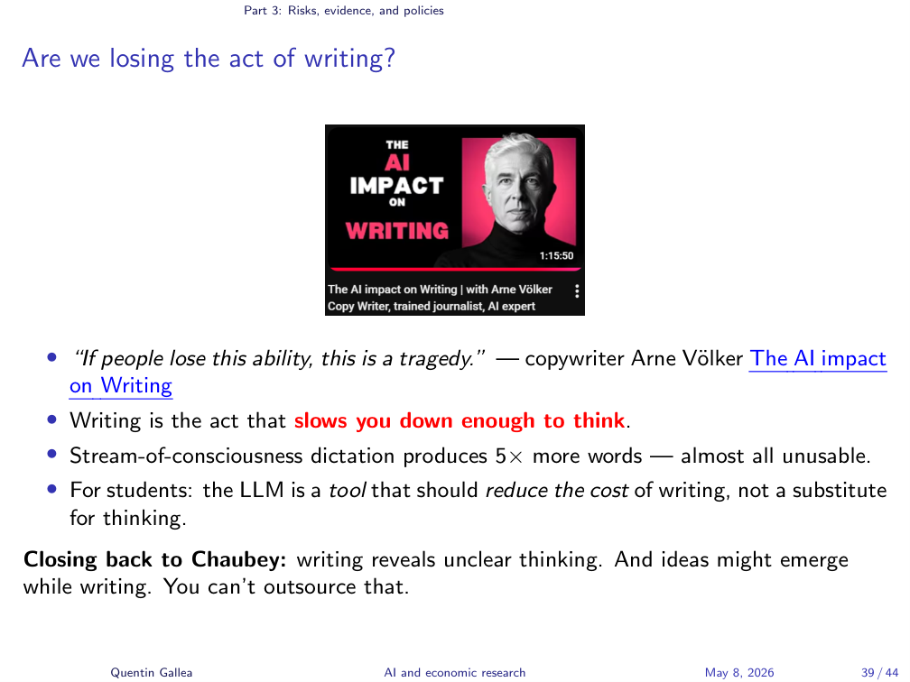{.slide-image fig-align="center" width="85%"}

The second cost is that **writing is the act that slows you down enough to think**. As the copywriter Arne Völker puts it: *"if people lose this ability, that is a tragedy."* Writing is when you discover that the part of your research you thought was clear isn't. Reading an answer, by contrast, always *feels* like it makes sense — especially when you are tired, the deadline is tomorrow, and "good enough" is tempting. *Good enough* usually isn't.

I used to journal on my phone and switched to writing by hand. It is much slower, and that is exactly *why* it is more powerful: slow forces you to choose your words, and choosing your words forces you to think. It is the same reason a five-minute voice message is awful and the same content as two written sentences is sharp.

GenAI should *reduce the cost* of writing — it should not be a substitute for thinking. Back to Chaubey: **writing reveals unclear thinking, and ideas often emerge while writing**. Bypass that, and you bypass the learning. That is *cognitive collapse*, and it is avoidable.

There is a podcast I recorded with Arne Völker on exactly this — listen to it, or ask NotebookLM to summarize.

---

### Finding Your Own Voice

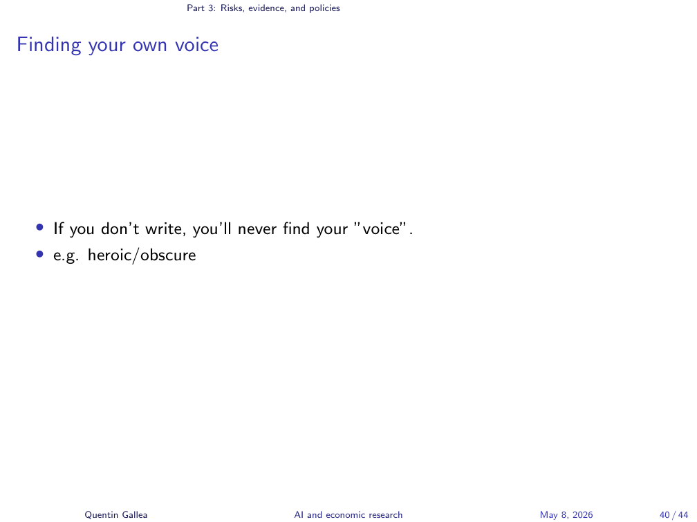{.slide-image fig-align="center" width="85%"}

If you never write, you never **find your voice**. Yes, calculators exist — but speech and writing are how you express yourself live, and meta-glasses with a teleprompter are not here yet. Finding a voice requires struggling, and struggling means writing slowly. My own ticks ("obscure journal", "heroic claim") came from years of doing that work; they are the words I value, and I keep them.

## In-Class Activity & Wrap-Up

### In-Class Activity

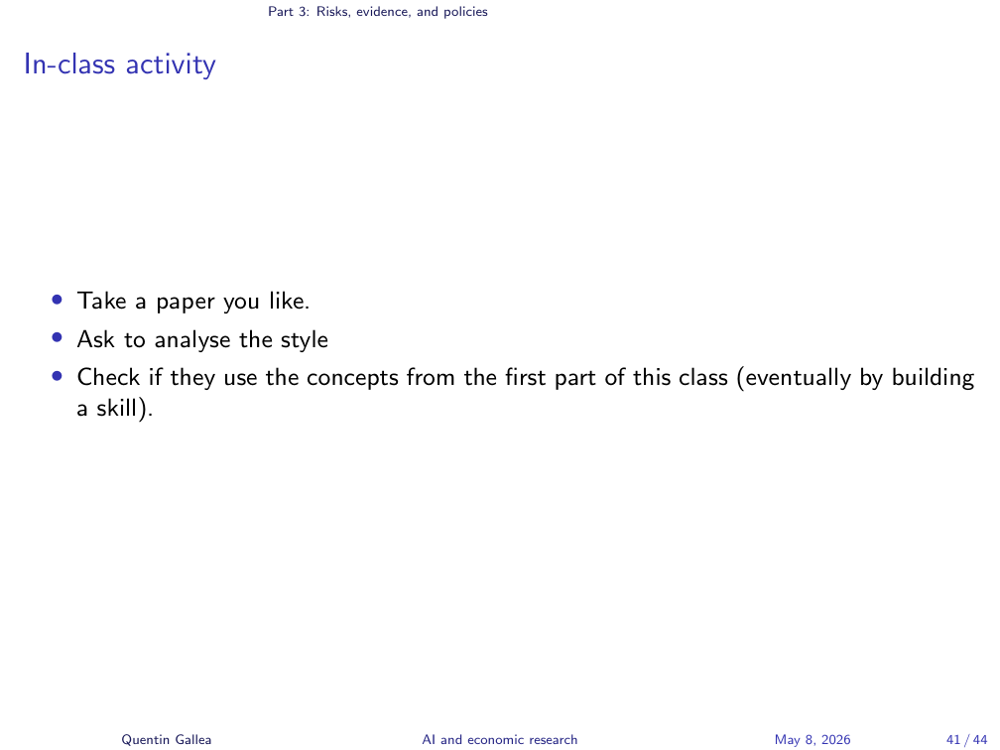{.slide-image fig-align="center" width="85%"}

I am pushing the in-class activity to homework so we wrap on time. In the **week 10 writing** folder online there is a **writing skill** (built this morning — full transparency, untested at scale, please give feedback). Its job is **not to rewrite your text**: it applies the rules from Part 1 and tells you which ones your text already follows and which ones it breaks.

I demoed it on the introduction of one of my own papers, and the skill flagged a real issue: I used **"weapons" and "arms" interchangeably**. That was deliberate — there is a footnote in the paper defining "small arms and light weapons" and noting I would alternate the two terms — but the skill was right that, by the rules of Part 1, that is a vocabulary drift.

A second exercise: take a paper or article whose **style** you admire and ask the model to analyze it. Why do you like this style? What patterns does it follow? Learning to read style is more valuable than learning to generate it.

---

### Applying Our Guidelines: Scientific Writing

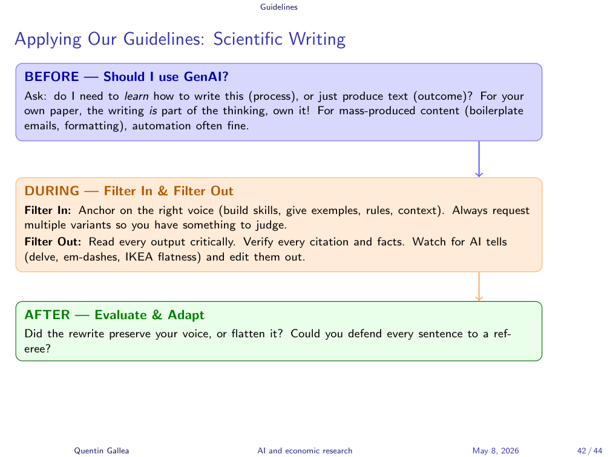{.slide-image fig-align="center" width="85%"}

To close: **start by writing without AI**. That is where the voice, the ideas, the breakthroughs, the moments of genuine understanding come from. Once a draft exists, refine — and when you are stuck, ask the model for options.

Match the **tool to the task**: NotebookLM for grounded fact-checking, a custom **skill** for voice or for rule-checking, frontier LLMs for brainstorming and drafting. After every use, verify the output — and verify NotebookLM's output too. Then reflect honestly: *did I lose anything? Was the output convincing? Did I spend more time correcting GenAI than I would have spent writing this myself?* If the answer to the last question is yes, you used the wrong tool.

---

### Homework

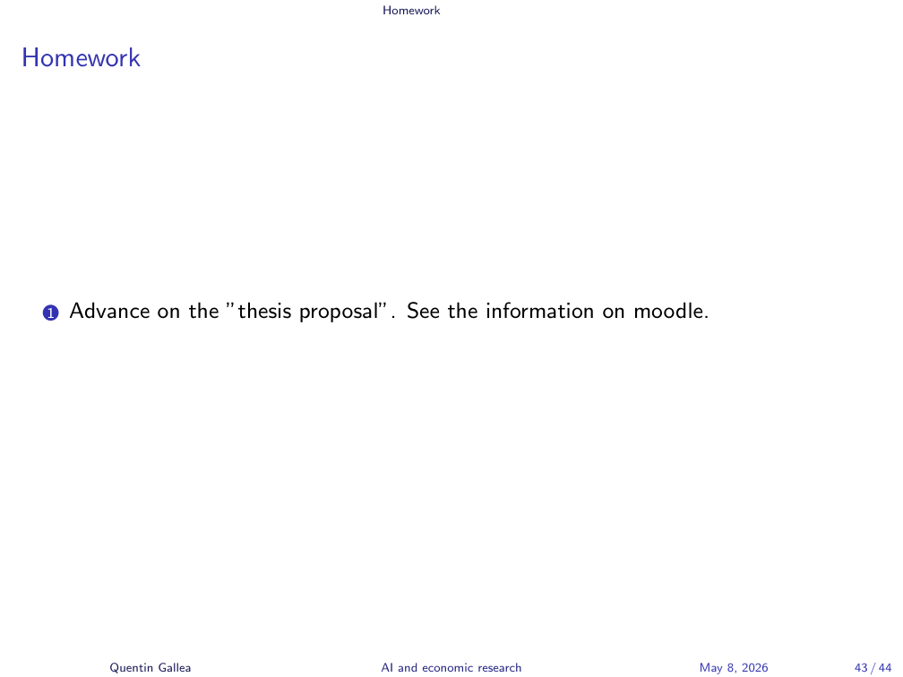{.slide-image fig-align="center" width="85%"}

Two things for next week. **(1)** Try the writing skill in `week 10 writing`, *or* analyze the style of a paper you admire with GenAI. **(2)** Advance on your **thesis proposal** for the final evaluation.

---

### What's Next?

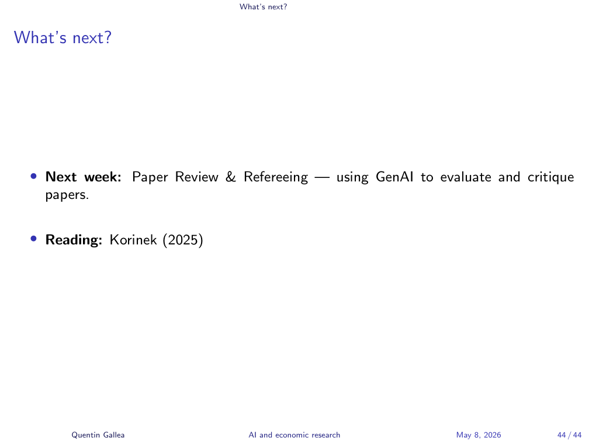{.slide-image fig-align="center" width="85%"}

Next week: **Paper Review and Refereeing** — using GenAI to evaluate and critique papers. Reading: **Korinek (2025)**.

::: {.callout-tip}
## Key Takeaways
1. **Build the paper in three layers — argument, outline, paragraphs — before drafting.** Compress the whole paper into a sharp **RAP** (Research question, Answer, Positioning), then write headings and lead sentences that already tell the story. Prose comes last.
2. **Lead, don't bury.** Punchline first (Minto pyramid), one idea per paragraph carried by the first sentence, the same vocabulary across abstract, headings and discussion. Precision beats variety in research writing.
3. **Use GenAI for the parts where judgement still owns the result.** Drafting, voice transfer, paragraph variants, and grounded fact-checking with NotebookLM are honest gains. The constraint moves from *producing* words to *judging* them.
4. **Treat AI tells and detection as a reputational risk.** "IKEA prose" is fine to write but bad to publish; humanizers don't really work; detectors are imperfect *but improving*, and your text stays on the web indefinitely.
5. **The biggest cost is invisible.** Writing is the act that forces clarity — outsource it and you also outsource the thinking. Use GenAI to *reduce* the cost of writing, not to *replace* it.
:::
