::: {.callout-note}
## Lecture Overview
This session is a hands-on crash course in **agentic AI** — autonomous systems where multiple AI agents collaborate on complex tasks — focused on **Claude Code**. We cover what makes agentic AI different from a chatbot, how to set up Claude Code (the app, the terminal, the VS Code plugin), the key building blocks (CLAUDE.md, plan mode, slash commands, skills, hooks, MCPs, and sub-agents), and how the **before / during / after** framework demands *more* care, not less, when you scale up to agentic workflows.
:::

## Opening: from presentations to agentic AI

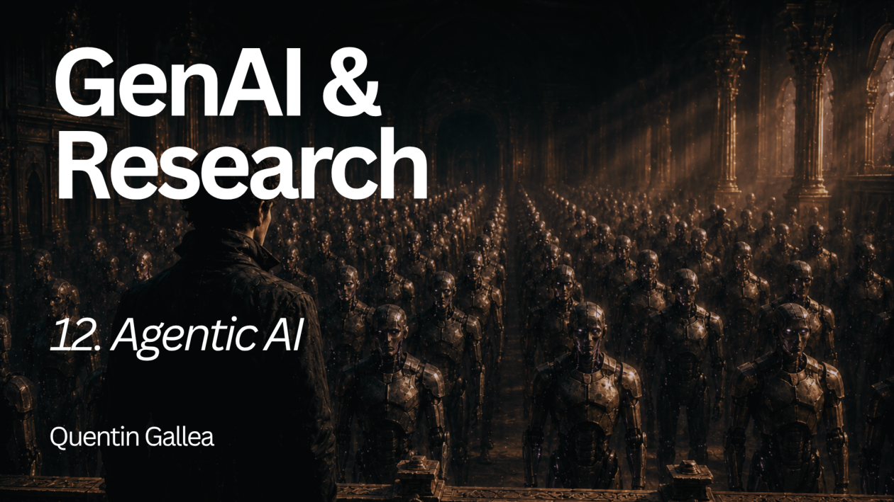{.slide-image fig-align="center" width="85%"}

### Why this session matters

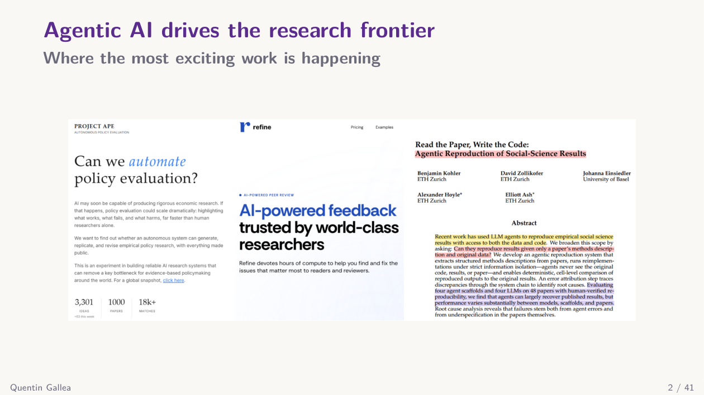{.slide-image fig-align="center" width="85%"}

I originally planned a class on presentation skills, but with only two sessions left I really want to spend time on **Claude Code** and **agentic AI**. Next week we will wrap up the course and host an external speaker — a recent master's graduate who wrote his thesis on rethinking careers in the age of GenAI.

Did anyone try **Refine.ink**? I waited a long time before testing it myself, even though I had free tokens from invitations. People I trust — like Scott Cunningham, author of *Causal Inference: The Mixtape*, and other top researchers who know how to build agentic systems — are still convinced Refine.ink is better at reviewing than what they can build themselves.

I tried it with a paper I just generated using Claude Code (more on that in a few minutes). I had a very clear idea of what I wanted to write, so the task was pure execution — a perfect candidate for an agent. I then submitted the result to Refine.ink. I have not yet finished checking the review carefully, so I am in a gray zone: either Refine.ink is wrong about a specific math point, or it is right and spotted something I would never have caught. I will report back next week.

What makes these tools different from a simple chatbot is that they split a long task into pieces and maintain quality from beginning to end. A chatbot reviewing a whole paper will, at some point, "decide" it has done enough work and skim. Agentic systems explicitly filter and focus throughout. That is the same idea behind my own **Recast** pipeline: a team of referees, each with a different angle, doing several rounds inside Claude Code.

One participant raised a great point: as a junior researcher, you may not know whether you or the model is wrong. For me on this specific paper, I can verify the math by hand, against the code, and against the original source paper — so I will get a definitive answer. But the broader question stands: how do you arbitrate when you are not yet an expert?

A related new paper compares AI reviews to expert reviews on Nature-family papers. I have not read it yet — I just opened it this morning — but the findings appear close to expert-level quality, with one caveat: the AI tended to over-accept, being a bit too kind on the recommendation. Worth reading.

All the frontier work today happens at the agentic AI level: David Reinstein's autonomous policy evaluation project, AI that reads papers and writes code, and so on. That is what we have to dive into now — starting with what "agentic" actually means.

---

## What is agentic AI?

### Defining agentic AI

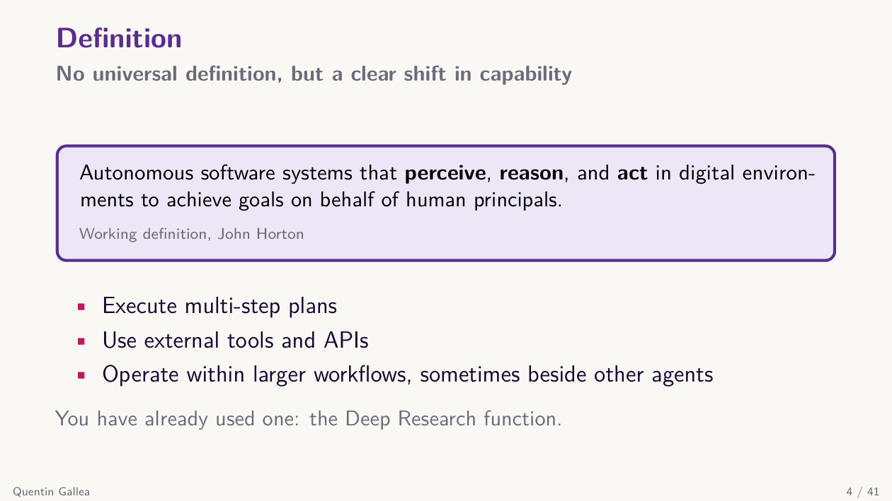{.slide-image fig-align="center" width="85%"}

There is no clean consensus definition. John Horton — in the MIT Sloan primer on agentic AI — describes it as "autonomous software systems that perceive, reason, and act in digital environments to achieve goals on behalf of human principals." I am not fully convinced by that framing.

For me the key distinction is simpler. With Claude.ai you work with **one agent** at a time: one chat window, one conversation. **Agentic AI** means you can run several agents at the same time — several chatbots collaborating on a shared task. Tool use exists in Claude.ai too, so that is not the dividing line. Multiple agents working together is.

---

### How to think about it / work with it

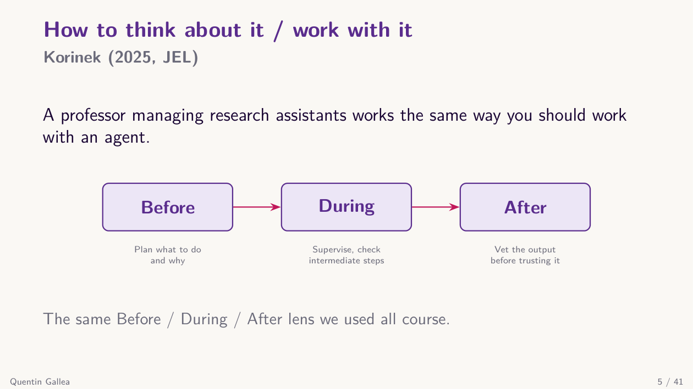{.slide-image fig-align="center" width="85%"}

You have already experienced agentic AI without full control — the **deep research** feature in several platforms uses this architecture: one agent checks sources, another summarizes, and so on. The architecture was preset. With Claude Code or Codex, you design the architecture yourself.

Instead of chatting with one chatbot and breaking the task into manual steps, you now have a team of agents working for you. They can handle more complex tasks, work for longer, and produce more output. The mental model is: you brief your team before they leave to work for an hour.

This has a practical implication. You need a task **worth automating** at this scale, and you have to invest much more effort up front — planning, monitoring, and reviewing. The usual *before / during / after* framework still applies, but agentic AI demands **more** careful instruction, **more** verification, and **more** filtering, not less.

---

### Bigger tasks need more verification

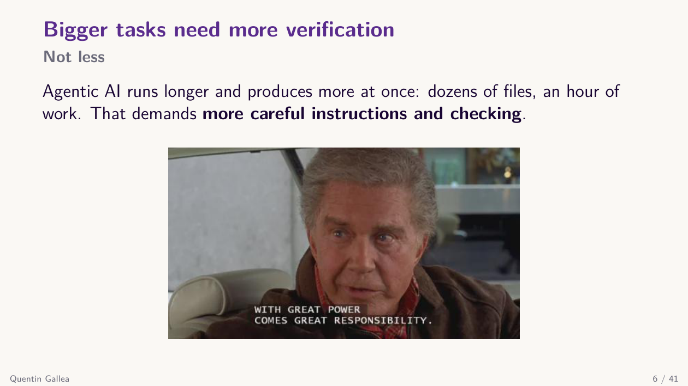{.slide-image fig-align="center" width="85%"}

With a chatbot, if instructions are unclear you notice within seconds and start over. With an agentic system, the agent may work for half an hour and burn a lot of tokens before you realize it went the wrong way. The cost of poor instructions is much higher. If anything, agentic AI requires **more** careful instruction and **more** thorough checking.

With that conceptual frame in place, let us get our hands on the actual tool.

---

## Setup and basic usage

### Claude Code vs Claude.ai

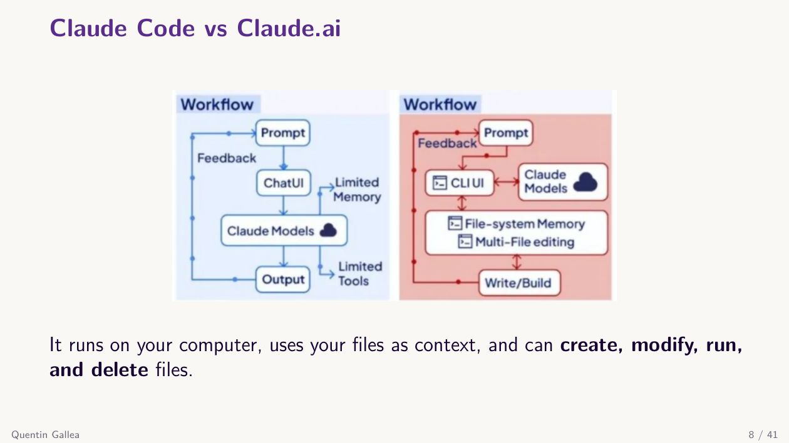{.slide-image fig-align="center" width="85%"}

With **Claude.ai**, you have a web interface: you type a prompt, it goes to the model, the model runs in a limited online sandbox, and you get output back. The sandbox can save files, but only within that web environment.

**Claude Code** is different in two ways. First, you can run multiple agents. Second — and this is the big one — Claude Code has **access to your computer**. The model still runs online, not on your machine, but it can read, create, and erase files, run code, and use your local files as context.

You also open a Claude Code session inside a **specific folder**, not your entire computer. So when I open Claude Code in my "GenAI and Research" course folder, it has the full context of this course and every tool and rule I have defined for it.

---

### Several ways to run it

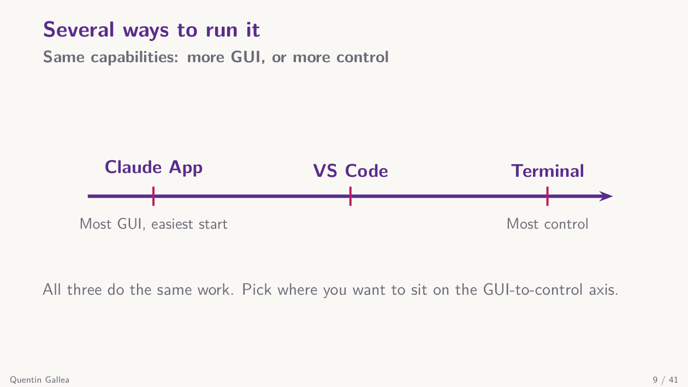{.slide-image fig-align="center" width="85%"}

There are several ways to use Claude Code, trading off user-friendliness against control. The more user-friendly the interface, the harder it sometimes is to access advanced functionality. Your options: the **Claude app**, plugins (e.g., for **VS Code**), or directly in the **terminal**. They all do the same thing — the differences are interface and control.

---

### Claude app

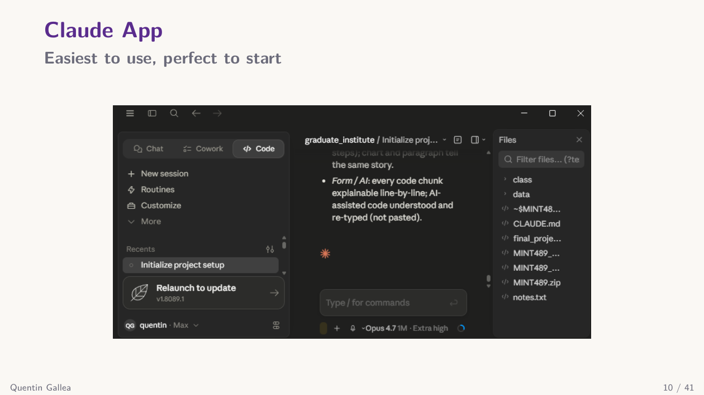{.slide-image fig-align="center" width="85%"}

The Claude app is what you will likely use to practice today. Inside it you get the regular chat (same as Claude.ai — all your previous Claude.ai chats are there), **Co-work** for working with Word, Excel, and similar files, and **Claude Code** for the full coding capabilities.

---

### Terminal: maximum control

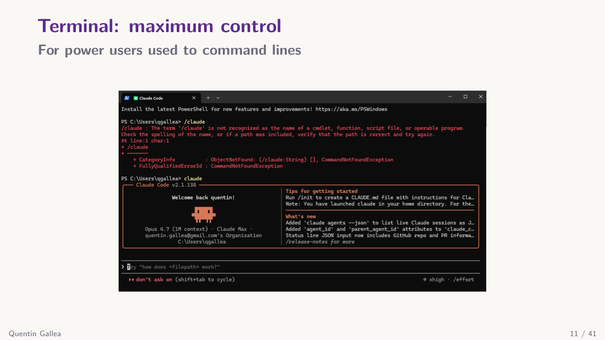{.slide-image fig-align="center" width="85%"}

At the other end of the spectrum is the **terminal**. You open a terminal, launch Claude Code, and start chatting. It is low-level — you need to be comfortable with terminal commands and navigating folders — but you can still talk to it in natural language.

---

### VS Code: the best of both

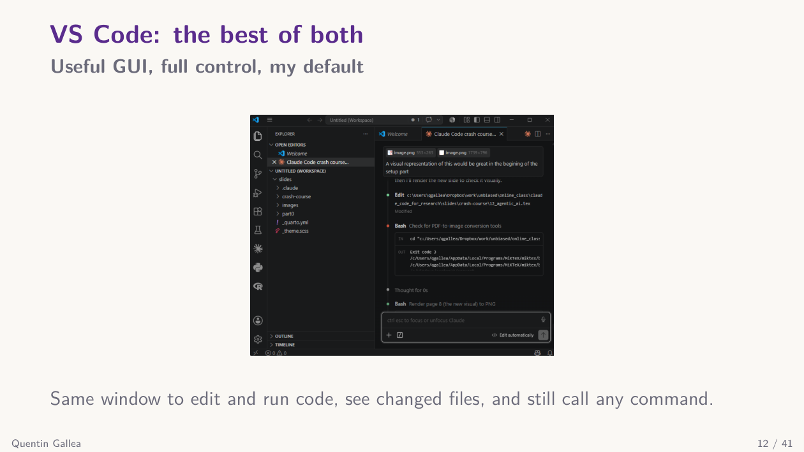{.slide-image fig-align="center" width="85%"}

In between is the **VS Code plugin**. VS Code is a code editor — Python, Markdown, Stata, and so on. With the plugin you get a chat panel inside the editor plus a small graphical layer: you can switch modes, browse **slash commands**, attach files easily, and see your code files alongside the chat.

I recommend the VS Code plugin because you can chat, read your files, edit code, and run code in one place. But it is your call.

---

### How to talk to Claude Code

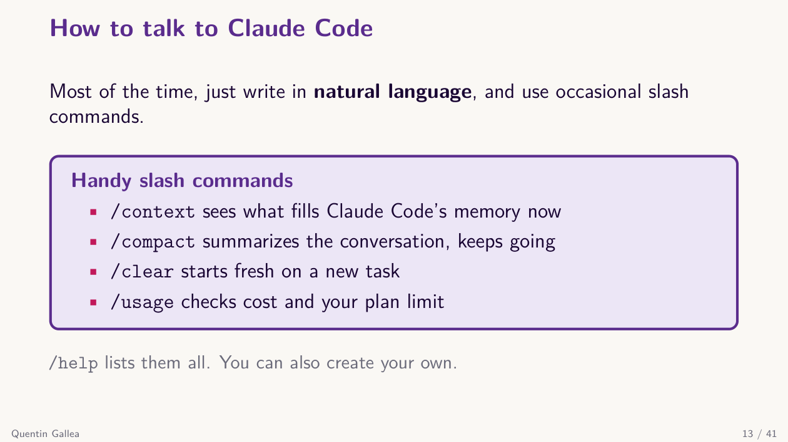{.slide-image fig-align="center" width="85%"}

You blend two modes constantly: **slash commands** and **natural language**.

Slash commands handle specific, structured tasks. For example, `/context` shows a summary of what is currently loaded in the **context window** — system prompt, agents, skills, files, conversation — and how many tokens are used out of the 1 million available. `/clear` wipes the session and starts fresh; after `/clear`, the context drops back to about 2%, just the system prompt and the YAML front matter of agents and skills.

Then I can switch to natural language. For example: "Did I create a session 13 to conclude the class yet?" Claude Code crawls my folder, reads what it needs, and answers — sometimes following up with its own questions.

You can also mix the two. Once today's class is done, I will upload the transcript into the right folder and just type `/build-course-page session 12`. That is a **custom skill** I created. Everything I write after the command is parameters for it. So the typical workflow is a mix of slash commands and natural language.

---

### CLAUDE.md: the context you set once

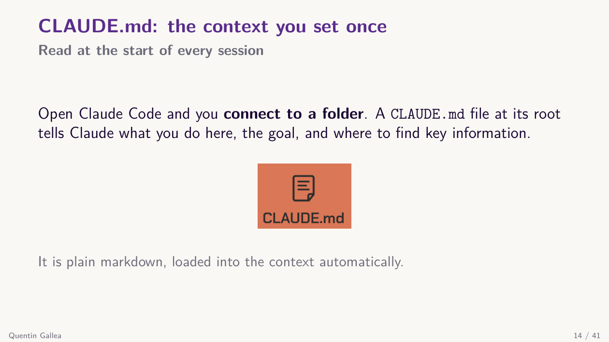{.slide-image fig-align="center" width="85%"}

The key file in Claude Code is **CLAUDE.md** — a Markdown file at the root of your project folder. It is always loaded into memory the moment you open the folder. Think of it as the brain or standing context for the project.

In our course folder, my CLAUDE.md contains the project structure, the list of sessions, the rules I want enforced at all times, the critical perspectives I want preserved, and where to find things. About 200 lines.

This is the big difference from Claude.ai: when you connect to a folder in Claude Code, the identity, context, and conventions of that project should live in CLAUDE.md so they are always present in memory.

---

### Several CLAUDE.md files, combined by scope

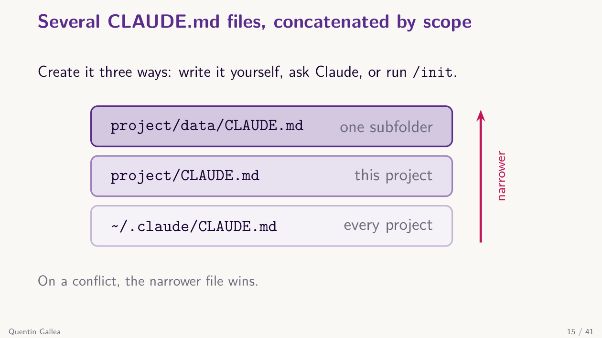{.slide-image fig-align="center" width="85%"}

You can have **multiple CLAUDE.md files at different scopes**. There is a global one at `~/.claude/CLAUDE.md` (in your home directory) — for rules that apply to every project (e.g., "never use the em dash"). Then there is the project CLAUDE.md I just showed you. For complex projects, you can also place CLAUDE.md files in subfolders; these load **on demand** when Claude actually reads a file inside that subfolder.

When several CLAUDE.md files exist, they are **combined into context**, and the **more specific instructions generally take precedence** when there is a conflict — but this is the model's judgment, not a hard deterministic rule. As a heuristic, expect "narrower wins": if the global file says "never use em dashes" but a subfolder CLAUDE.md says "em dashes are fine here," the subfolder rule usually wins inside that folder.

---

### What belongs in CLAUDE.md

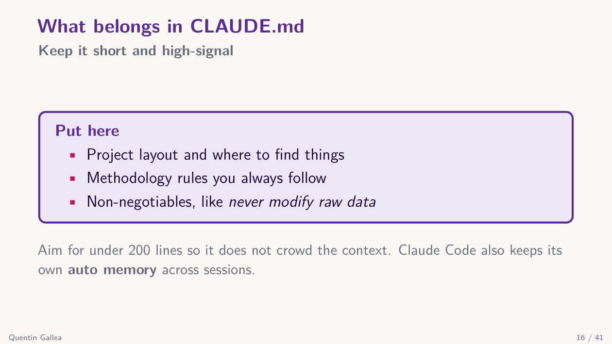{.slide-image fig-align="center" width="85%"}

There are three ways to create a CLAUDE.md. Write it yourself, ask Claude Code to draft one ("here is a new folder, the goal is X — create me a CLAUDE.md"), or run the **`/init` command**. The third option is the most useful first move with Claude Code.

Let me demo it. Yesterday evening I opened a research folder I had never used Claude Code on — imagine inheriting a colleague's messy folder full of code you have never seen. I just typed `/init`. Claude crawls the entire folder, reads documents, infers the structure, and generates a CLAUDE.md.

For my old "small arms imports and conflict and human rights" project (published in the *Journal of Development Economics*), `/init` produced a CLAUDE.md describing exactly what the repo is, what the pipeline does, what the Stata `do` files do, the merge logic, where the final dataset lives, and the path conventions. Onboarding in one command.

A natural follow-up is asking for a cleanup plan. I ran `/init` on my "witch-hunt" project — an empirical economic history paper on early-modern European witch trials — and then asked: "Suggest a plan to clean and reorganize this folder, write it to an MD file." The output included a clear rules section: for example, "top-level folder names must stay unchanged because every `do` file contains a `cd` block that depends on them." Claude inferred that from reading the code, understood it would break collaborators' setups, and locked those names in.

This is a **plan, not an action**. Nothing has changed on disk yet. And that is the best way to use Claude Code: **plan first**, then execute.

This is what **plan mode** does. You can run Claude Code in plan mode — where it can only think and read, never write — or in modes where it executes and modifies files. Plan mode is perfect for exploring a folder, asking questions, or designing a multi-step task before pulling the trigger.

A great question from the audience: if Claude reorganizes folder paths, won't existing code break? The answer is yes, which is why Claude will also update the path references inside every code file and run the code to verify it still works. It uses the **architecture and the file contents together** as context.

Another question: does Claude Code only see local files? Mostly yes — it relies on what is in your folder unless you tell it to go elsewhere. And this is exactly why CLAUDE.md must be **concise**: around 200 lines (mine had 300 and I trimmed it down). If CLAUDE.md is too long you get **context rot** — the model starts to forget or blur details. CLAUDE.md is in Markdown precisely so you can re-read it and verify the key information is still sharp.

Claude Code also has an **auto-memory** feature. As you chat, Claude can decide on its own that some piece of information is worth keeping across sessions and writes it to memory. This is separate from CLAUDE.md. (There is an excellent reference at the official **Claude Code docs**, with a powerful search — use it whenever you forget a slash command.)

---

### The context window

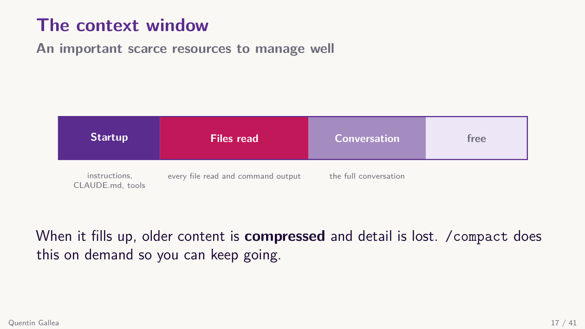{.slide-image fig-align="center" width="85%"}

Back to the **context window** — a scarce resource you have to manage. You start with 1 million tokens, but you are never at zero: the system prompt, CLAUDE.md, and the YAML front matter of every skill and agent are loaded immediately. Once Claude opens files, they often stay in memory because they were read for the task.

Crucially, Claude Code **does not stop** when you hit the limit. Instead it **compacts** the conversation — automatically, or on demand via `/compact`. Compaction writes a summary of what came before, preserving the key elements but dropping fine-grained details and the contents of opened files, to free up room. It is less precise than the original context, but the session keeps going.

---

### Watch the context meter

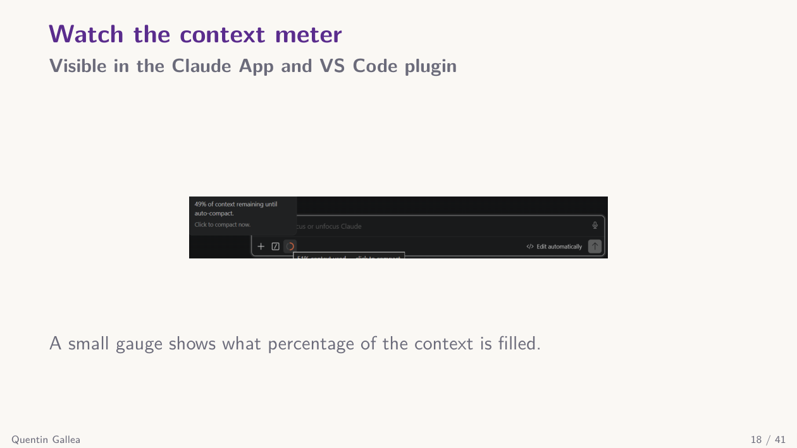{.slide-image fig-align="center" width="85%"}

You can always type `/context` to see where you stand. In VS Code, there is normally a context meter showing the percentage filled (occasionally buggy, but usually visible). The Claude app shows it too — right now I am at 4% of the limit.

---

### Plan mode (always plan)

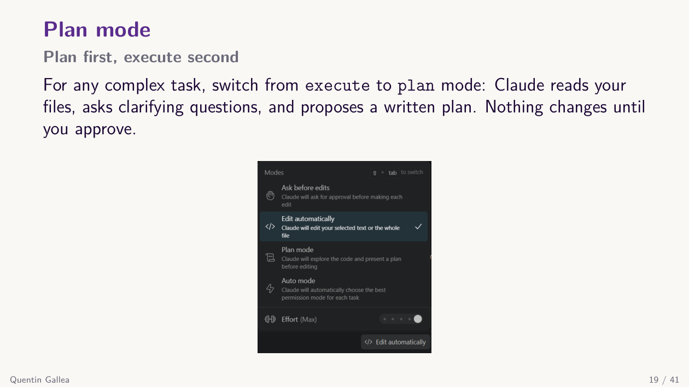{.slide-image fig-align="center" width="85%"}

**Always plan.** In the Claude app you can pick between four modes: *ask permission*, *accept edits*, *plan mode*, or *auto* (Claude decides between them). On top of these there is the `--dangerously-skip-permissions` flag, commonly called "YOLO" mode, where everything is accepted automatically.

- **Plan mode** modifies nothing. Use it for long tasks you want to scope carefully, or for plain questions (like "do I have a session 13 yet?").
- **Accept edits** lets Claude create, modify, and delete files freely. Use it when you trust the plan.
- **Ask permission** (default) confirms each potentially destructive action one at a time. Safe but noisy — you click "yes, yes, yes" all day.

To reduce the noise, you can **pre-approve** a set of commands in the settings JSON file — e.g., common bash commands you never want to confirm. The so-called **YOLO mode** (`--dangerously-skip-permissions`) accepts everything automatically: Anthropic explicitly warns against using it outside a sandboxed environment such as a Docker container — it can wipe entire folders. A good balance is **accept-edits** with a carefully curated pre-approval list.

---

### Start a project with /init

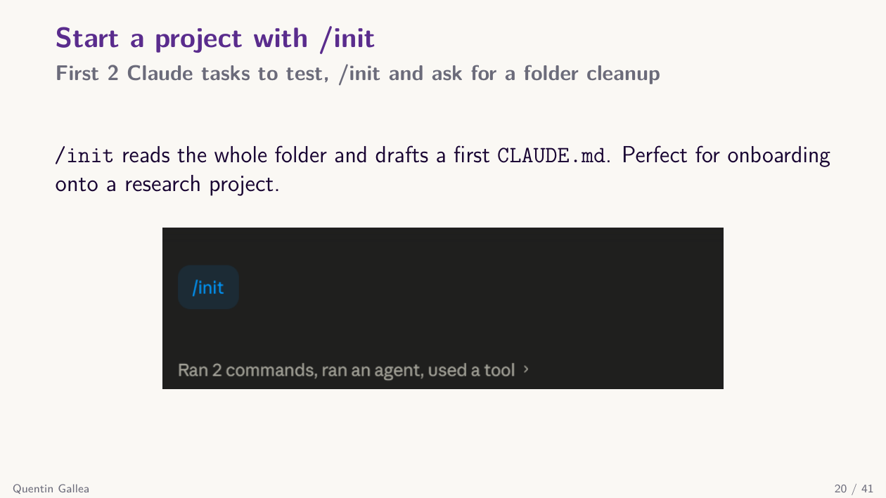{.slide-image fig-align="center" width="85%"}

So `/init` is your starting point. For next week, try this as light homework: run `/init` inside one of your folders, read the generated CLAUDE.md, and optionally ask for a cleanup plan in plan mode. Just the plan — no edits. See if it is interesting.

---

### "Basic" example: a paper from a single prompt

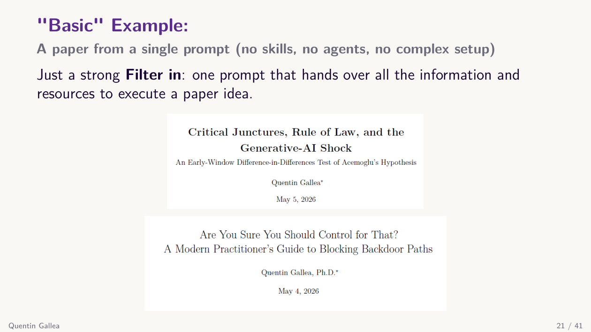{.slide-image fig-align="center" width="85%"}

Here is an example that shows what Claude Code can do that Claude.ai cannot — even without custom skills or agents. **Execution** is where these tools shine, provided you give precise instructions and enough references.

I have been experimenting with **one-shot papers**: a long prompt that asks Claude Code to draft an entire paper. The trick is the prompt. I enter plan mode and supply: the paper title, the contribution, audience and framing, style, the references it must cite, the Python code for the simulations I want to run, and the structure I want.

I read the plan Claude produces, refine it, then approve. Roughly ten minutes later, I have a paper with the full structure, citations, the math I wanted included, the simulation code running, generated LaTeX tables, and commentary. **All in one shot**, with no custom skills or agents.

This works because I had already done the filtering-in: I know the simulations, the references, the style, the structure. The output is not perfect — I am highlighting things I want to revise (one math passage I am still checking, for example) — but it is exactly like working with a research assistant. I have not yet finished the paper, but I have drastically lowered the **entry cost**. I had carried this idea for years and never started because of execution time. Now I have started.

The huge difference from Claude.ai: Claude Code can read, create, and modify many files; pull in my simulation code; generate figures; write to my local disk; and give me a full project I control. The model masters the filtering-in only because I master the topic and the structure.

A great question came up: can Claude Code read the highlights and strike-throughs I made on the generated PDF? Quick test — yes, it can extract the highlighted regions and the colors. I am definitely going to use that to feed my own annotations back into the workflow.

The instructive use case here for you: once you have your research thesis proposal, try a one-shot paper just to see how far the system can go. Treat the output as a probe — what worked, what failed, what you would change in the prompt — not as a finished product.

That one-shot example only used built-in capabilities. The real power of Claude Code comes from the four building blocks you can compose on top: skills, slash commands, hooks, and MCPs.

---

## Tools: skills, slash commands, hooks, MCPs

### Four important tools

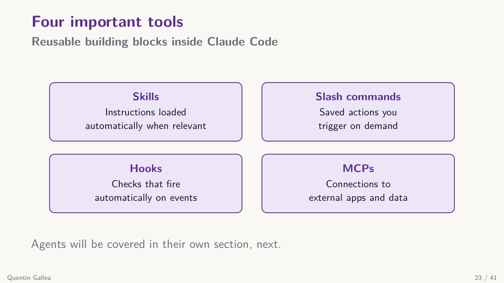{.slide-image fig-align="center" width="85%"}

**Skills** in Claude Code work like skills on Claude.ai, but installed locally. Each skill is a folder containing a `SKILL.md` plus reference files, placed inside `.claude/skills/`. The folder name becomes the skill name.

For example, I built a `midterm-grader` skill: I graded all your midterms, then used this skill as an independent second opinion against a precise rubric — to check whether I had been too harsh or missed anything. (You will get the grades and comments soon.)

Once a skill is in the right place — the canonical structure is `.claude/agents/`, `.claude/commands/`, `.claude/skills/` — you can invoke it with a slash command: `/midterm-grader`, `/build-course-page`, and so on.

---

### Slash commands: prompts you trigger

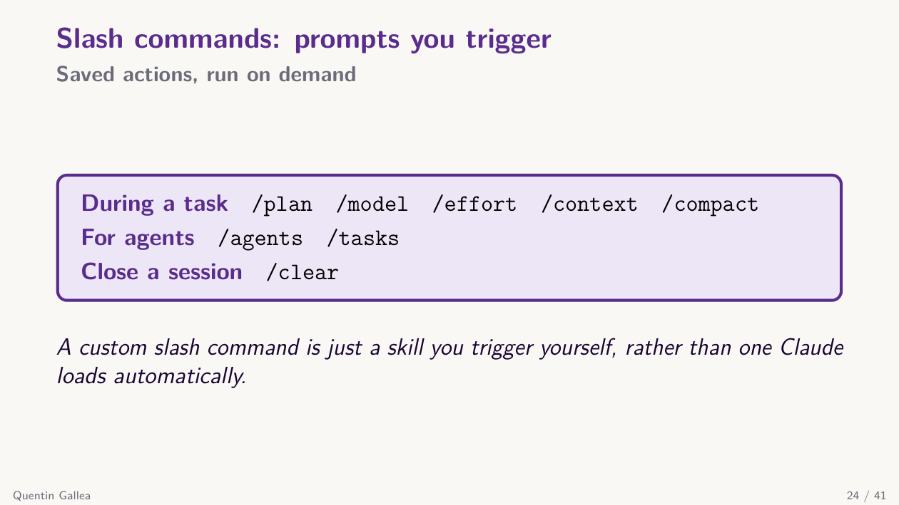{.slide-image fig-align="center" width="85%"}

**Slash commands** are the universal way to trigger things. Skills can be loaded autonomously by Claude or called explicitly via a slash command. On top of that, Claude Code ships with built-in slash commands: `/context`, `/clear`, `/compact`, model selection, effort level, and so on. **Custom slash commands** are essentially user-defined skills.

---

### Hooks fire automatically on events

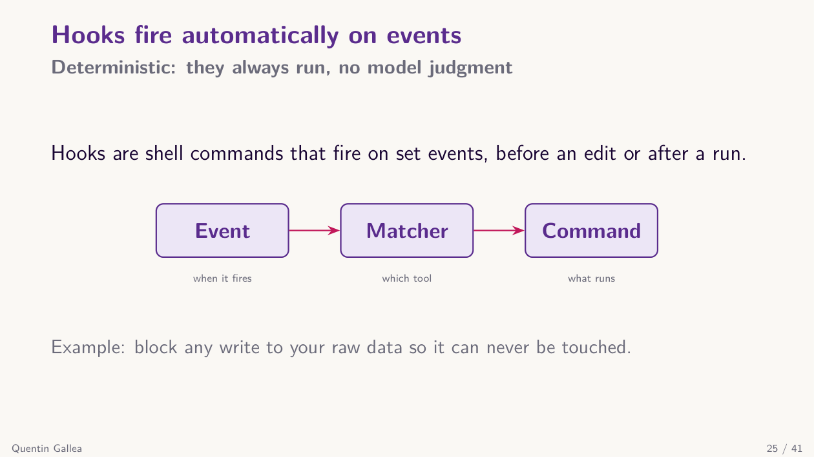{.slide-image fig-align="center" width="85%"}

**Hooks** are different — and something I do not use too much yet. They fire **automatically** on specific events and use no tokens to "think." They are pure mechanical rules in a JSON file.

For example, if I want my `raw_data/` folder to be **untouchable**, I can write it as a rule in CLAUDE.md — but a hook is stronger. The hook fires every time Claude tries to edit or write a file, checks whether the target is inside `raw_data/`, and blocks the action if so. You usually do not write hooks by hand — you ask Claude Code to create them for you.

---

### Saving a hook sets its scope

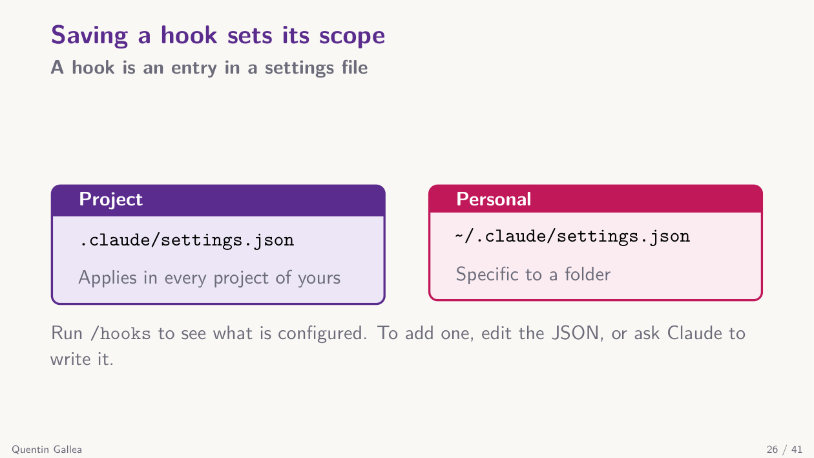{.slide-image fig-align="center" width="85%"}

Like CLAUDE.md, hooks live at a scope: a user-level hook in `~/.claude/settings.json` applies everywhere, while a project-level hook in `.claude/settings.json` applies only inside that folder.

---

### A hook: event, matcher, command

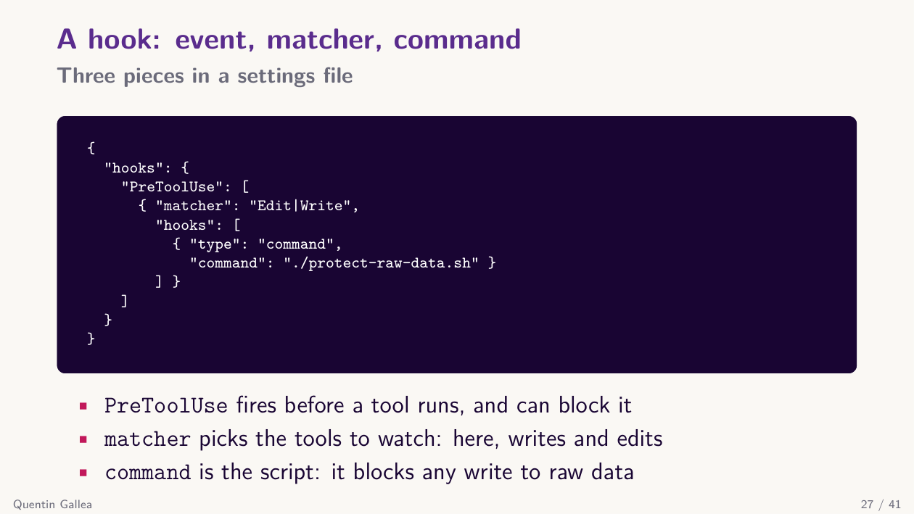{.slide-image fig-align="center" width="85%"}

Here is the anatomy of a hook: an **event** (e.g., *before using a tool*), a **matcher** (e.g., *Edit* or *Write*), and a **command** (e.g., "block this if the target is in `raw_data/`"). Pure automation, every time. You explain what you want, Claude Code writes the JSON. I rarely open these files by hand — though I should, to make sure the code is doing exactly what I think.

---

### Model Context Protocol (MCP)

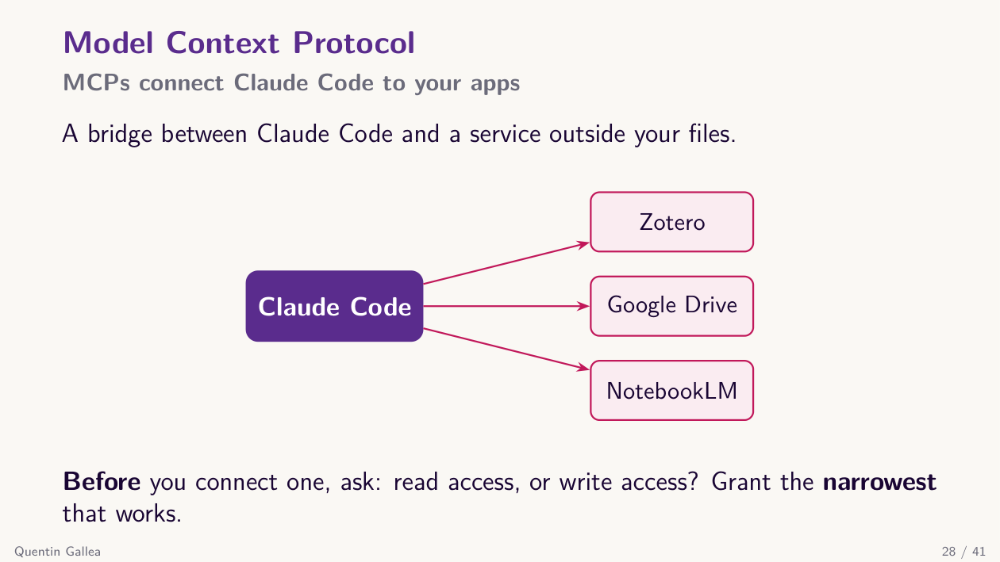{.slide-image fig-align="center" width="85%"}

**MCP (Model Context Protocol)** lets Claude Code reach beyond your computer to other apps: Zotero, Google Drive, Notion, Gmail, and many more. You can read papers from Zotero, create pages in Notion, pull files from Drive, and so on.

When you connect, you typically choose **read-only or read-write access**. If you do not need write access, only grant read — it is the safer default. The exact options depend on the app.

So far every building block has lived inside one conversation. The next step — and the reason the term *agentic* really earns its keep — is firing off independent helpers in parallel.

---

## Sub-agents

### One agent is not enough

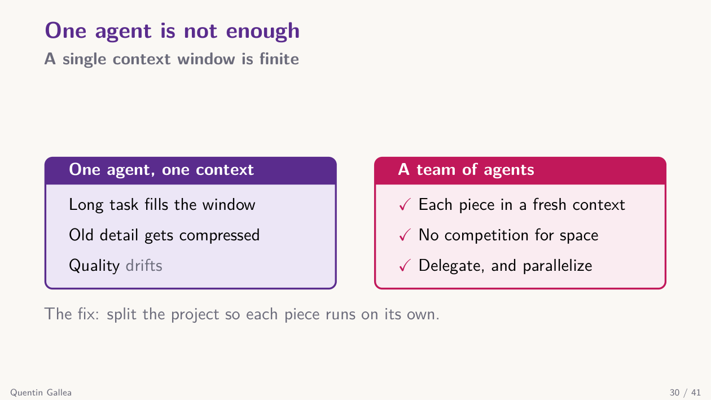{.slide-image fig-align="center" width="85%"}

This is where the term "agentic" really earns its keep. You have one **main agent** running your conversation, and from it you can fire **sub-agents** — other agents that work for you and report back. Why? Because the context window is a scarce resource, and because parallelism helps.

---

### Sub-agents run in their own context

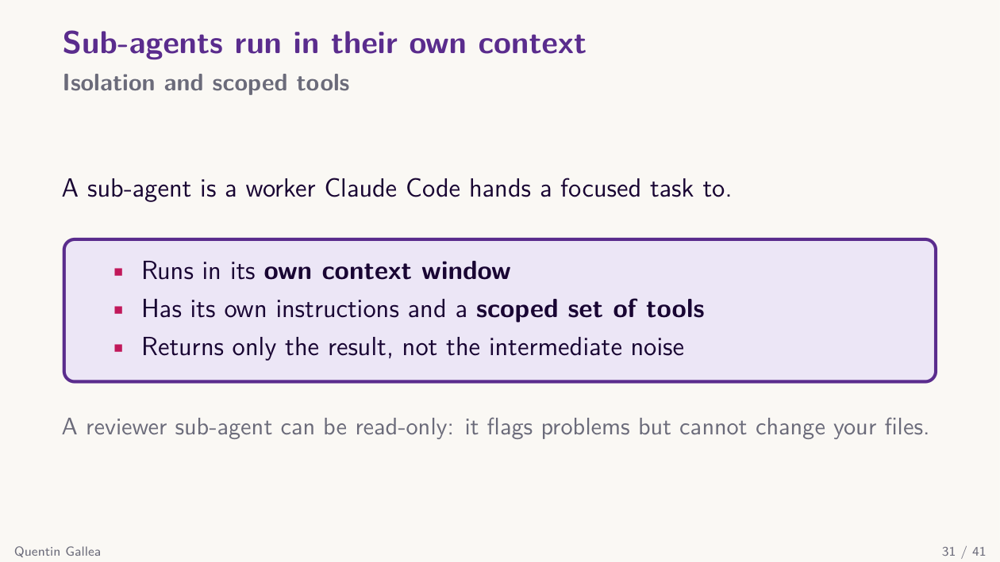{.slide-image fig-align="center" width="85%"}

A sub-agent runs in a **parallel session with its own context window**. It receives an input, does its work, and returns only the output — its intermediate thought process never pollutes the main context. That is the first benefit: you prevent context rot and quality drift in the main session.

The second benefit is **speed**. If a task has parallelizable parts, you fire three sub-agents at once instead of running them sequentially. Three results, one wall-clock unit.

You can also restrict a sub-agent's capabilities — for example, giving a reviewer agent **read-only access** so it can never change your files.

---

### Saving a sub-agent sets its reach

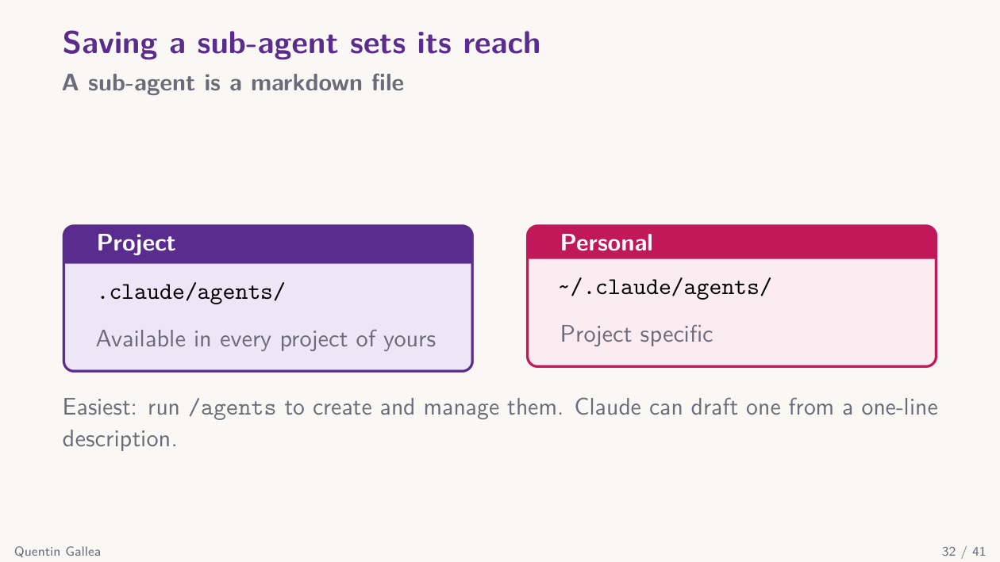{.slide-image fig-align="center" width="85%"}

Creating a sub-agent is just like creating a skill. You drop an MD file into `.claude/agents/`. You invoke agents with slash commands, or you can build a slash command that fires an entire list of agents in sequence or in parallel.

---

### A sub-agent: header plus body

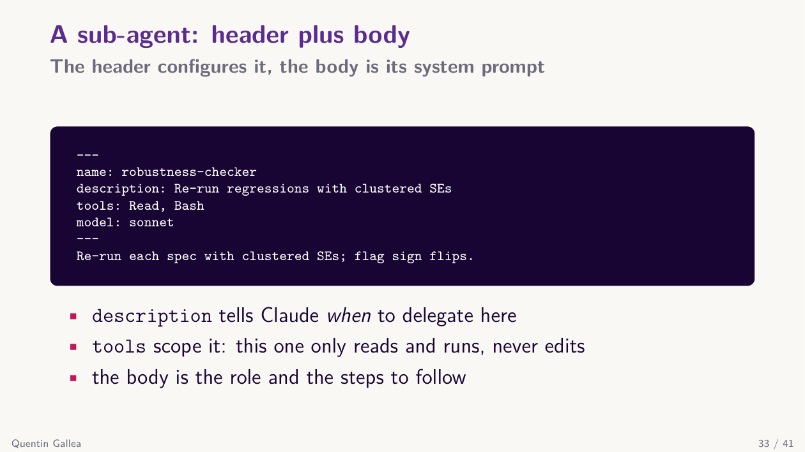{.slide-image fig-align="center" width="85%"}

An agent is an MD file with a YAML **front matter** (name, description, tools it is allowed to use, and optionally a `model` field like `sonnet`/`opus`/`haiku`) and a **body** describing its role and behavior.

The single most important field is **`description`**: this is what the main Claude agent actually reads to decide *when* to delegate to your sub-agent. Write it as an explicit trigger — "Use this agent when…" or "use proactively for…" — and Claude will pick it up at the right moment.

---

### Give each agent one clear role

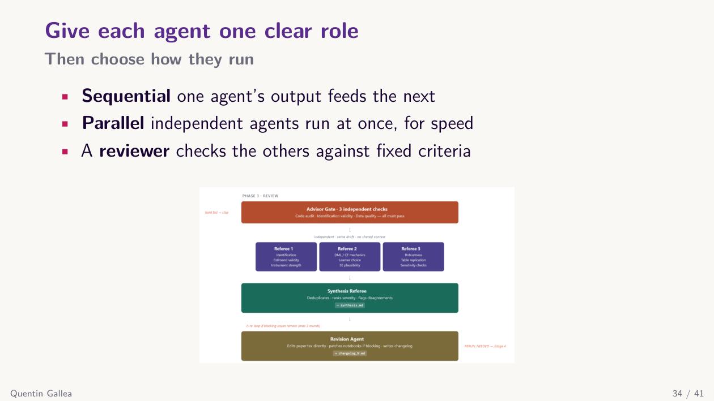{.slide-image fig-align="center" width="85%"}

Here is an example from my **Recast** pipeline. I fire three referee agents in **parallel** — they must work independently, from different angles, with no contamination from each other. Once they finish, a **synthesis** agent merges their reviews, and then a **revision** agent acts on the synthesis. So some steps are parallel, some are necessarily sequential. The architecture mirrors the workflow.

---

### Example: a course website from your material

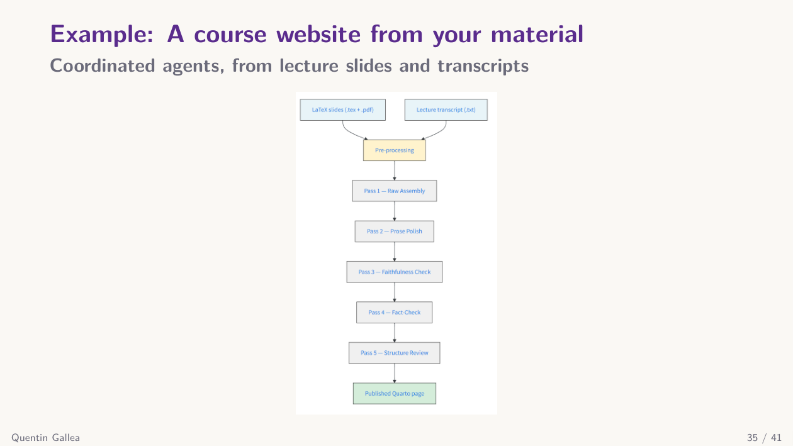{.slide-image fig-align="center" width="85%"}

The agentic pipeline behind this course's website works the same way. A list of agents runs **sequentially** because each step needs the previous one's output: pre-process and check the slides and transcript, do a row-by-row assembly matching transcript chunks to slides, polish the prose, and so on.

One more example I want to show. Same one-shot mode, no skills, no custom agents. I gave Claude Code one of my **published papers** — on conflict, strategic territory, and trade — and said: "Create a dynamic website to present these results." Done in about ten minutes.

The result was honestly impressive. Concise summary, key citations, the Lenin-vs-Montesquieu framing from the introduction, accurate maps generated from my dataset, the right thresholds visualized from the game-theoretic model, the regression tables. Everything correct.

Why does this work so well? Because I master the filtering-in: it is my paper, I gave the code, I gave the data, and I can verify every output. And I do not care about losing the "skill" of building a GitHub Pages site by hand — I just want it done. That is the kind of task agentic AI is great at.

---

### Two more levels lie ahead

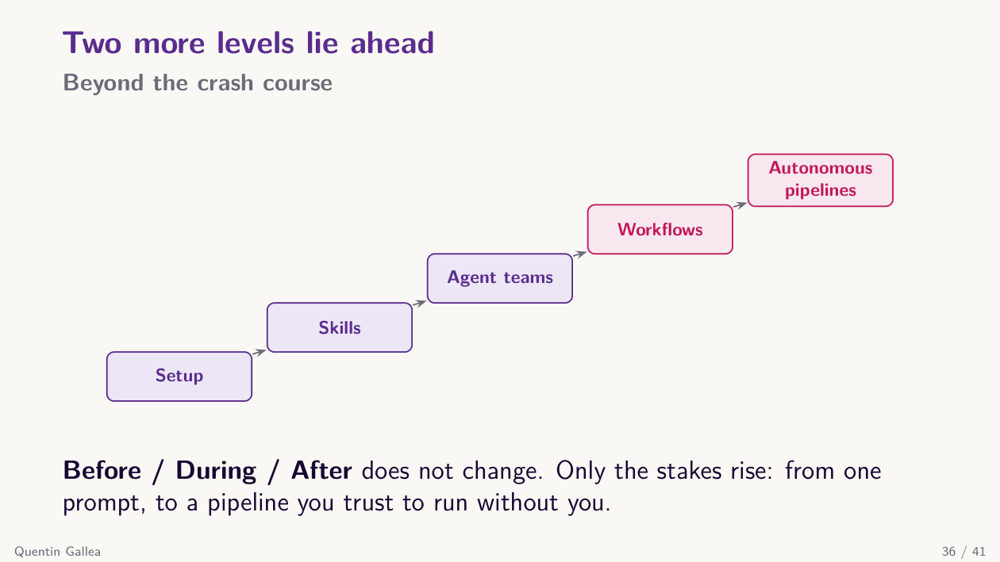{.slide-image fig-align="center" width="85%"}

There is much more you can do. You can build full **agentic workflows**, chain **dispatch** commands, fire jobs from your mobile phone to your computer, **schedule tasks** ("tomorrow at 9 AM, run this analysis"), and so on.

A quick aside: yesterday I built a Claude Code skill specifically to rework my slides for this very class. My initial slides had too much information per slide and felt unfocused. The skill encodes my rules: one punchline per slide, split if there are two ideas, one visual element per slide, titles connected to the highlighted content. Honestly, I enjoyed teaching with these slides today. That is itself a demonstration of what a small custom skill can do.

With the toolkit in place, the question becomes how to use it *responsibly* — and that brings us back to our usual framework.

---

## Wrap-up

### In-class activity and a word on data and security

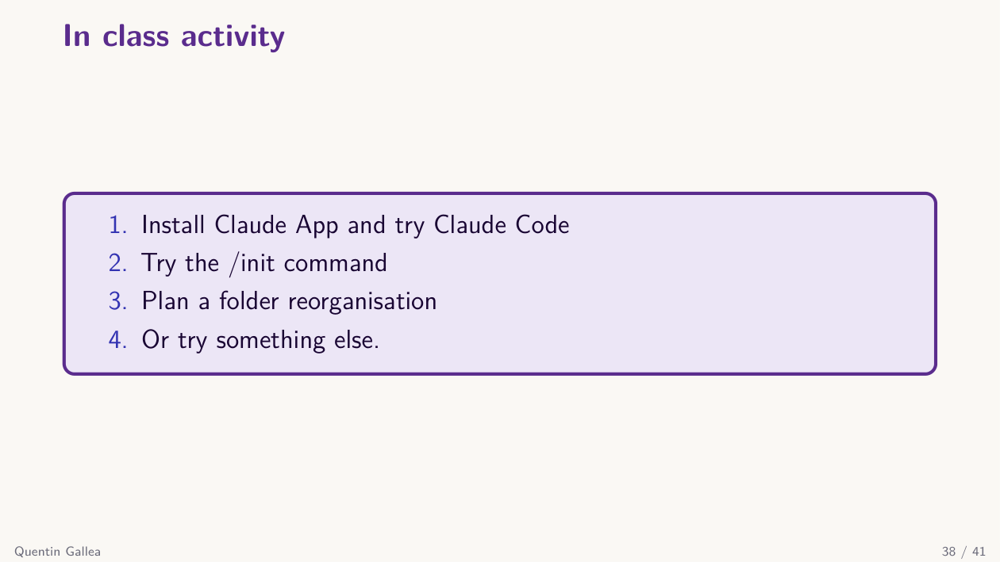{.slide-image fig-align="center" width="85%"}

::: {.callout-warning}
## Before you install Claude Code on a personal plan
Since **August 28, 2025**, Anthropic's **consumer plans** (Free, Pro, Max — the same plans you log in with on the Claude app) **train on your chats and Claude Code sessions by default**, with retention extended to **5 years** for users who do not opt out. **API and commercial plans** (Team, Enterprise, API keys) are unchanged — your data is not used for training and retention is short. Before installing Claude Code on a Pro/Max account, check your **Privacy Settings** and opt out if you do not want your sessions used for training, especially if you will work on sensitive material.
:::

We will not do the in-class activity today — install Claude Code at home if you have not yet. If you do not want to install it because you are uncomfortable giving an LLM access to your files, that is fine. These tools raise legitimate questions about data use and security, and this class does not require you to use them.

On the security question: Anthropic is a big tech company — even if it seems to have better intentions than some others, it is still a big tech with the usual incentives. I have nothing on my machine that I consider truly sensitive in this context. The **bigger and more concrete risk** I have seen is people writing code with Claude Code and then pushing everything to **GitHub**, including secret API keys embedded in their code. Anyone can then use those keys, run up your bill, and access connected services. That is more dangerous in practice than worrying about whether Anthropic uses your data.

One participant shared a great example: they accidentally exposed a Telegram API in a public repo. Claude Code actually flagged this in another case, asking them to store the key in an external file and not share it directly. Good behavior — but do not rely on it; double-check yourself.

Another participant connected Claude Code to **Moodle** (via user session, not API) and to **Google Calendar** to extract assignment deadlines and requirements, then check submissions against the guidelines. A wonderful use case — exactly the kind of legitimate, productive automation we should be discussing.

---

### Applying our guidelines — Before

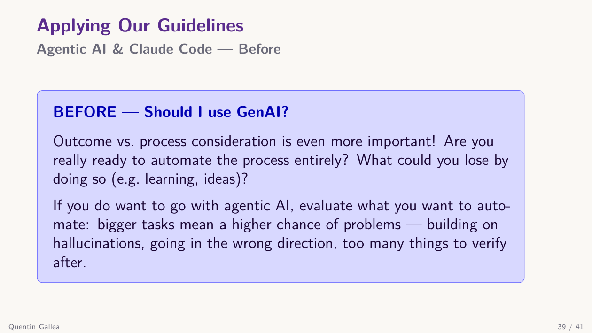{.slide-image fig-align="center" width="85%"}

Long story short, the **before / during / after** framework applies more, not less, with agentic AI. Echoing the Spider-Man line from the opening: with more capabilities comes more responsibility — and more work for you. More verification, better filtering-in, more deliberate decisions about when to use these systems.

We are no longer in the "augmentation, step by step" regime. Agentic AI can **automate large chunks** of a research process in one go. So at your stage — junior, still learning — the right question is: *Am I ready to lose the process for this task? For which tasks is automation worth it, and for which is it not?* Planning matters even more, because a bad instruction now wastes an hour of compute and tokens before you notice.

---

### Applying our guidelines — During & after

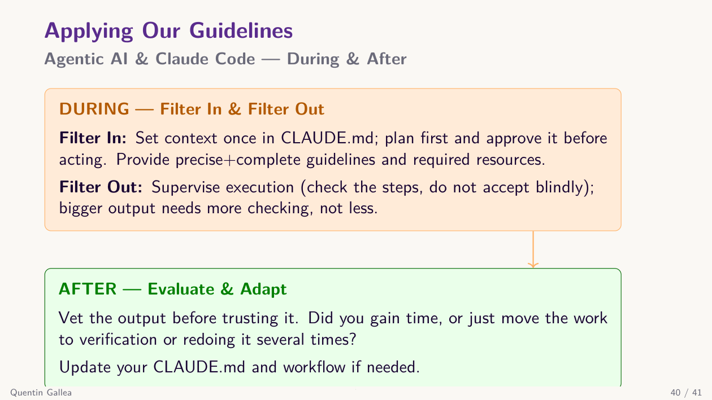{.slide-image fig-align="center" width="85%"}

The during/after side has its own pitfall: when an agent produces a huge volume of output, **verifying it is exhausting**, and humans skim. "It is probably good enough" creeps in. That is why, even when full automation is possible, you should consider the **review cost**. Sometimes it is better to break a task into smaller agentic steps that you can validate one at a time — not because of capability limits, but because of your own cognitive limits.

---

### Next week

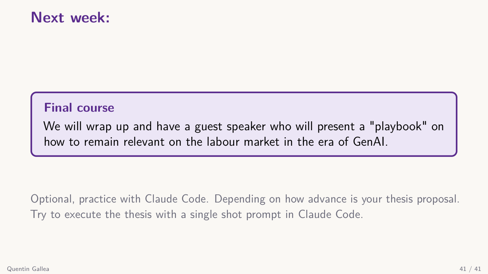{.slide-image fig-align="center" width="85%"}

Next week is the **final class**. We will close out the course, look at where to go from here, and welcome an external speaker — an EPFL graduate working at the intersection of economics and the job market — who will share a playbook for staying relevant in the labor market in the age of GenAI. Very relevant for you.

Between now and then, try Claude Code if you can, and otherwise focus on your final thesis proposal document. See you next week.

---

::: {.callout-tip}
## Key Takeaways
1. **Agentic AI is not just a fancier chatbot** — it is several agents collaborating, with access to your local files, designed by you. The dividing line is *multiple agents working together*, not tool use alone.
2. **More capability means more responsibility, not less.** A bad instruction to an agentic system can burn an hour of compute before you notice. The *before / during / after* framework demands *more* careful planning, verification, and filtering-in — not less.
3. **CLAUDE.md is the brain of the project.** Set the context once, keep it concise (~200 lines), and use `/init` to bootstrap it on any folder. Always **plan first** (plan mode), then execute.
4. **Compose the four building blocks** — skills, slash commands, hooks, and MCPs — and add **sub-agents** for parallelism, isolated context, and tighter permissions. The `description` field is what makes a sub-agent actually get invoked.
5. **Check your data and security defaults** before installing Claude Code on a personal plan: consumer plans train on chats by default since August 2025, and the most concrete risk in practice is leaking API keys to public repos.
:::
